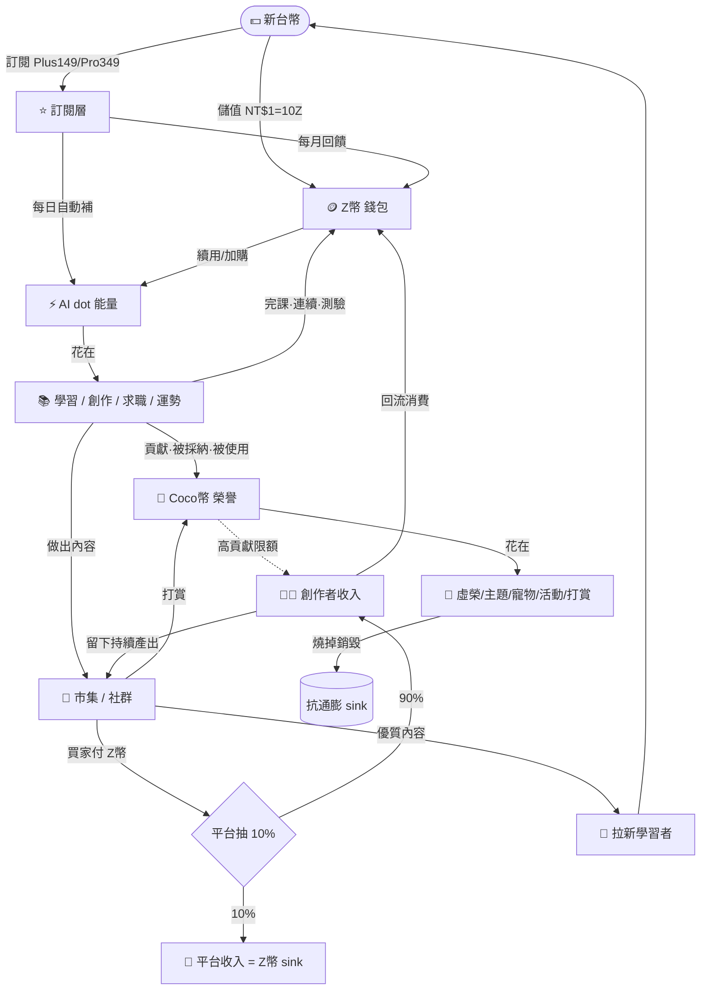

# AI 島 · 商業閉環總體規劃（三幣體系 Z幣 / AI dot / Coco幣）

> 2026-08-12 起草。整併現有變現機制（`docs/business/business_model_extract_0812.md` 為現況摘取），重新設計成一個「錢進得來、價值轉得動、留得住人、養得起創作者」的閉環。
> 姊妹檔：現況摘取 → [`business_model_extract_0812.md`](./business_model_extract_0812.md)。
> 相關現有實作：`src/lib/zcoin.ts`、`src/lib/payments/config.ts`、`src/lib/ai-quota-config.ts`、`src/lib/ai-gate.ts`、`src/lib/fortune-gate.ts`、`supabase/notes_market_commission_migration.sql`、`docs/ideas_os/10_MARKETPLACE.md`、`docs/ideas_os/12_GROWTH_ENGINE.md`。

---

## 0. TL;DR（30 秒版）

- **三幣分工，各司其職、不重疊**：
  - **Z幣（Z-coin）** = 通用「錢包幣」。**可用新台幣買**（NT$1 = 10 Z幣，現行）。是平台主要金流入口與通用消費幣。
  - **AI dot（AI 能量）** = **算力計量表**。訂閱／每日自動補、用一次扣一點；用完 → 用 Z幣續、或升訂閱。**不是儲值財、會歸零**。
  - **Coco幣** = **「賺得到、買不到」的社群榮譽幣**（新增）。只能靠學習／貢獻／被他人使用而賺，花在社群虛榮與打賞。保護付費經濟不被通膨、是留存與創作者飛輪的燃料。
- **閉環**：`錢 → Z幣/訂閱 → AI dot 學習/創作 → 賺 Coco+Z幣 → 內容上市集 → 他人用 Z幣買(平台抽10%)/用 Coco 打賞 → 創作者收入回流消費 → 內容供給↑ → 拉新學習者 → 回到錢`。
- **獲利要多少 KPI（淨利，台幣/月）**——base 假設 ARPPU NT$250、貢獻毛利 80%、轉付費率 4%：
  - **月淨利 10 萬** → 約 **625 位付費用戶 / 1.6 萬 MAU**。
  - **月淨利 50 萬** → 約 **2,800 位付費用戶 / 7 萬 MAU**。
  - **月淨利 100 萬** → 約 **5,600 位付費用戶 / 14 萬 MAU**。
  - 完整敏感度表見 §8。

---

## 1. 三幣體系角色定位

| 幣別 | 定位（一句話） | 主要取得 | 主要消耗 | 可用 NT$ 購買？ | 可提現？ | 會歸零？ | 通膨控制 |
|---|---|---|---|---|---|---|---|
| **Z幣** | 通用錢包幣（軟硬混合） | 儲值(NT$1=10Z)、訂閱回饋、完課/連續/成就、推薦、市集賣出 | AI 高階續用、市集買、寵物造型、打賞、解鎖、抽蛋、榜單置頂 | ✅ 是 | ❌ 平台內流通為主（創作者收入可走真實金流結算，見 §5） | ❌ 永久保存 | 每日「持續型」賺幣上限（島嶼 500/日，`island-economy.ts`）；產出來源固定、審計走 `coin_transactions` |
| **AI dot** | 算力計量表（能量條） | 每日自動補（免費/Plus/Pro 不同上限）、訂閱、Z幣兌換、任務小額回補 | 每次 AI 呼叫扣點（免費模型便宜、高階模型貴） | ⭕️ 間接（買 Z幣 → 換 dot／升訂閱） | ❌ | ✅ 每日/每月重置（不累積成財） | 天生防囤積（會歸零）；成本對齊真實 inference（見 §2 成本錨） |
| **Coco幣** | 賺得到、買不到的社群榮譽幣（**新**） | 完課/連續/測驗滿分/首次行動、優質貢獻（留言被採納、教學、幫解題）、**自己的內容被他人使用** | 頭像框/徽章/主題/寵物造型解鎖、活動報名、抽獎、**打賞創作者**、榜單露出 | ❌ **永不販售**（核心設計） | ⭕️ 高貢獻創作者可「Coco → Z幣」限額兌換（單向閥、見 §3） | ⭕️ 可設季度衰減（防死囤，選配） | 每日賺取上限 + 只出不進的社群 sink（花掉即銷毀）→ 天然抗通膨 |

**為什麼要三幣、而不是一幣打天下？**
- 一幣（只有 Z幣）→ 「付費玩家」與「肝帝」用同一個池，要嘛 pay-to-win、要嘛送太多幣稀釋儲值價值。
- 拆出 **AI dot**：讓「算力成本」有獨立計量、不污染錢包；成本一漲只要調 dot 消耗，不動 Z幣定價。
- 拆出 **Coco幣**：給「努力/貢獻」一個買不到的載體 → 榮譽感、留存、創作者激勵，且**完全不吃平台現金成本**（純虛擬），還能保護 Z幣 不被學習獎勵灌爆。

> **與現有「Dust 碎片塵」的關係（別搞混）**：Ideas OS 已鎖定 **Dust** 為「創作島專用的創作資源、永遠不是錢、不可換 Z幣」（`ADR-004`）。**Coco 與 Dust 不衝突、範疇不同**：Dust＝創作島內部「開碎片蛋/進化/融合」的手感資源（局部）；Coco＝**全站**通用的社群榮譽幣（跨學習/社群/創作者打賞）。落地時 Dust 維持原設計不動，Coco 是全站新層。

---

## 2. 閉環流向圖



**成本錨（很重要）**：AI dot 的「一點值多少錢」永遠對齊真實 inference 成本。現行錨點：
- 免費/中階模型一次 ≈ NT$0（幾乎零成本）→ 免費額度大方（每日 100 次，`AI_FREE_DAILY`）。
- 高階模型（Claude/GPT/Gemini）一次 ≈ **NT$2**（=20 Z幣 overflow，`AI_ZCOIN_HIGH_OVERFLOW`）→ 這是毛利模型裡 AI COGS 的計算基準。

---

## 3. 兌換與閥門（valves）— 單向規則

閉環要「轉得動又不漏氣」，靠這幾個**單向閥**：

| 方向 | 允許？ | 規則 / 匯率 | 目的 |
|---|---|---|---|
| NT$ → Z幣 | ✅ | 1:10，越多送越多（現行 5 檔儲值包） | 金流入口 |
| NT$ → 訂閱 → AI dot | ✅ | Plus/Pro 每日 dot 上限不同 | 訂閱主收入 |
| Z幣 → AI dot | ✅ | 依模型：中階 2Z/次、高階 20Z/次 | 用完不斷炊、順勢加購 |
| Z幣 → 市集/虛榮/解鎖 | ✅ | 買家付全額，平台抽 10% | Z幣 sink = 平台收入 |
| 完課/貢獻 → Coco | ✅ | 有每日上限 | 獎勵努力、不吃現金 |
| 完課/連續 → Z幣 | ✅ | 有每日上限（島嶼 500/日） | 免費玩家也有錢包幣 |
| Coco → 社群消費 | ✅（燒掉） | 花掉即銷毀 | 抗通膨 sink |
| **Coco → Z幣** | ⚠️ 限額 | 只開給「認證創作者」、每月上限、需達貢獻門檻 | 創作者提領閥；不讓肝直接變現破壞儲值 |
| **Z幣 → Coco** | ❌ 禁止 | — | 保護「Coco 買不到」的稀缺與榮譽感 |
| **AI dot → Z幣 / 提現** | ❌ 禁止 | dot 會歸零 | 能量不是財、不可回售 |
| Coco → NT$ 直接提現 | ❌ 禁止 | 只能先換 Z幣，Z幣走創作者結算 | 合規（避免直接博弈/兌現爭議） |

> **一句話記法**：錢往下流（NT$→Z幣→dot→燒掉），榮譽往上走但有閘（Coco→(限額)→Z幣→(認證)→結算）。Z幣→Coco 這條**永遠關死**。

---

## 4. 訂閱層 × 三幣：統一 gating 地圖

沿用現行兩層訂閱（`PRO_PLANS`）＋現行「免費每日 N 次、付費無限」的 gate 心法，統一成下表。**目標：每個功能都要能回答「免費怎麼用、付費解什麼、超額用什麼幣續」。**

| 功能 | 免費 | Plus（NT$149/月） | Pro（NT$349/月） | 超額續用 | 賺什麼 |
|---|---|---|---|---|---|
| AI 導師/助教（中階） | 100 次/日 | 更多 + 中階全開 | 最高 | Z幣 2/次 | — |
| AI 高階模型 | 3 次/日 | 20 次/日 | 100 次/日 | Z幣 20/次 | — |
| 章節學習 | 全開放 | 無廣告/離線 | 同左 | — | Z幣+Coco（完課） |
| 每日測驗 | 1 抽 | 加抽 | 加抽 | Z幣加抽 | Z幣+Coco（滿分） |
| 每日運勢/塔羅 | 1 次/日 | 無限 | 無限 | Z幣單次 | — |
| 訊息軍師 | 3 則/日 | 無限 | 無限 | Z幣單次 | — |
| AI 求職包（自傳/求職信） | 3 次/月 | 更多 | 無限 | Z幣單次 | — |
| 履歷/作品集/模擬面試 | 體驗 | 部分 | 全開 | — | — |
| 筆記進階（知識樹/SRS/協作） | 基本 | 全功能 | 全功能 | — | Coco（公開被收藏） |
| 市集買內容 | ✅ | ✅ | ✅ | 付 Z幣 | 賣家收 Z幣（抽10%） |
| 創作引擎/多工作室 | 體驗 | 部分 | 進階全開 | Z幣/dot | 綠寶/Coco |
| 寵物造型/主題/背景 | 基本款 | 部分 | 專屬款 | Z幣/Coco 解鎖 | — |
| 完課證書 | 一般發放 | — | 優先發放 | — | — |

> 落地建議：把散落各路由的 ad-hoc 429，收斂成一支 `requirePaidOrCharge(userId, feature)` → 統一回 `{ error, reason, upgradeUrl:'/pricing', cost_z }`（現況兩套金流/多處 429 待收斂，見摘取檔 §金流雷）。

---

## 5. 創作者飛輪（閉環的引擎）

閉環要「自己會轉」，關鍵是**創作者能賺到、賺到會留下、留下持續供給內容**：

1. **賺 Z幣**：市集賣筆記/範本/作品，買家付 Z幣，**創作者收 90%、平台抽 10%**（已上線 `buy_note_product`）。
2. **賺 Coco**：內容被他人「使用/收藏/採納」→ 系統發 Coco（純虛擬、零成本），累積成「創作者聲望」。
3. **提領閥**：認證創作者可「Coco → Z幣」限額兌換（§3），Z幣 累積到門檻走**真實金流結算**（走既有 payment provider 的 payout / 人工對帳，初期可先人工）。
4. **回流**：創作者用收入買 dot/工具/造型 → 錢留在站內 → 再產出。
5. **供給→拉新**：優質內容本身就是 SEO/社群素材 → 免費拉新 → 漏斗頂端變大。

> 這條飛輪讓「內容成本」從平台身上轉移到「使用者互相供給」，是規模化後毛利能撐住的核心。

---

## 6. 反通膨 / 反刷 規則（讓幣值不崩）

- **產出封頂**：每日「持續型」賺幣上限（島嶼 500 Z幣/日已有）；Coco 每日賺取上限。
- **來源審計**：所有 Z幣 進出走 `coin_transactions`（reason+meta+balance_after），可即時加總防灌水。
- **sink 要夠大**：Z幣 要有持續消耗（AI 續用、市集、造型、抽獎）；Coco 花掉即銷毀。**發幣速度 < 燒幣速度** 是幣值健康的鐵律。
- **高階 AI 對齊成本**：dot/Z幣 對 AI 的定價永遠 ≥ 真實 inference，避免「用越多虧越多」。
- **冪等發幣**：金流補款用 `grantZcoinOnce`（order_no 去重），webhook 重送不重複發。
- **收斂雙路徑**：目前 `zcoin.ts`（含 meta/冪等）與 `gamification/referral.ts` 兩條加幣路徑並存，需收斂成單一入口以利審計。

---

## 7. 收入結構（Revenue Streams）

| 來源 | 型態 | 現況 | 毛利特性 |
|---|---|---|---|
| **訂閱** Plus/Pro | 經常性（MRR） | 已定價 149/349、年繳折扣 | 高毛利、可預測——**營收骨幹** |
| **Z幣 儲值** | 交易型 | 已上線 5 檔儲值包 | 高毛利；含 AI 續用剛需 + 鯨魚消費 |
| **市集抽成** | 交易型 | 已上線抽 10% | 純 sink、零邊際成本；規模後放大 |
| **單次功能加購**（運勢/軍師/求職包超額） | 交易型 | gate 已有、Z幣單次待深化 | 高毛利小額、走量 |
| B2B / 團體授權 / 課程 | 專案 | 未做 | 上檔潛力（暫不列入 base 模型） |
| 廣告 / 聯盟 | 流量變現 | 未做 | 低優先（傷體驗，僅免費層考慮） |

**成本結構**：AI inference（COGS，隨用量變動）＋金流手續費（信用卡約 2.75%、海外 MoR 約 5%）＋固定 opex（Supabase/Zeabur/網域/監控/客服內容分攤）。

---

## 8. KPI 與獲利模型（月淨利 10 萬 / 50 萬 / 100 萬）

> 目標＝**淨利**（扣掉 COGS＋金流＋固定 opex 後的錢）。單位：新台幣/月。

### 8.1 假設（base case）

| 參數 | 值 | 說明 |
|---|---|---|
| 貢獻毛利率 `m` | **80%** | 營收扣掉 AI COGS(~12%) + 金流手續費(~3%) + 退款雜項 後 |
| ARPPU（每付費用戶月營收，含訂閱+儲值+加購混合） | **NT$250** | 介於 Plus(149) 與 Pro(349)＋部分儲值鯨魚之間 |
| 轉付費率 `conv`（付費用戶 / MAU） | **4%** | 免費增值消費型產品常見 2–6% |
| 固定 opex `F` | 10萬階段 2.5萬 / 50萬階段 6萬 / 100萬階段 12萬 | 隨客服/內容/基建規模成長 |

**核心公式**：
```
每付費用戶月貢獻 = ARPPU × m
需要付費用戶數  = (淨利目標 + 固定opex) / (ARPPU × m)
需要 MAU        = 需要付費用戶數 / 轉付費率
```

### 8.2 需要多少「付費用戶數」（隨 ARPPU 變動，m=80%）

| 月淨利目標 | 固定opex | ARPPU 150（貢獻120） | **ARPPU 250（貢獻200）** | ARPPU 400（貢獻320） |
|---|---|---|---|---|
| **10 萬** | 2.5萬 | 1,042 人 | **625 人** | 391 人 |
| **50 萬** | 6萬 | 4,667 人 | **2,800 人** | 1,750 人 |
| **100 萬** | 12萬 | 9,333 人 | **5,600 人** | 3,500 人 |

### 8.3 需要多少 MAU（base ARPPU 250、隨轉付費率變動）

| 月淨利目標 | 付費用戶 | 轉付費 2% | **轉付費 4%** | 轉付費 6% |
|---|---|---|---|---|
| **10 萬** | 625 | 31,250 | **15,625** | 10,417 |
| **50 萬** | 2,800 | 140,000 | **70,000** | 46,667 |
| **100 萬** | 5,600 | 280,000 | **140,000** | 93,333 |

### 8.4 白話版（base：ARPPU 250 / m 80% / conv 4%）

- **月淨利 10 萬**：約 **625 位付費用戶**、對應 **1.6 萬 MAU**。→ 一個健康的小眾產品就到得了。
- **月淨利 50 萬**：約 **2,800 位付費用戶**、對應 **7 萬 MAU**。→ 需要一條穩定拉新管道（運勢/LINE/SEO 內容）。
- **月淨利 100 萬**：約 **5,600 位付費用戶**、對應 **14 萬 MAU**。→ 需要病毒級成長 + 創作者飛輪供給內容降獲客成本。

### 8.5 營運節奏換算（維持 MAU 需要的「每天」動作）

假設月流失（payer churn）≈ 6%、註冊→啟用（activation）≈ 40%：

| 目標 | 需維持 MAU | 每月需淨補付費用戶(補流失) | 每天需新啟用用戶* | 每天需新註冊* |
|---|---|---|---|---|
| 10 萬 | 15,625 | ~38 | ~42 | ~105 |
| 50 萬 | 70,000 | ~168 | ~187 | ~467 |
| 100 萬 | 140,000 | ~336 | ~373 | ~933 |

*「每天新啟用」= 維持 MAU 所需的 monthly 新啟用 ÷ 30；「每天新註冊」= 新啟用 ÷ 40% activation。僅為穩態維持量，尚未含淨成長。

### 8.6 對照現有 KPI 模型 & 現實基線（很重要，別自我感覺良好）

- **現有 grant 模型（`docs/grant/ch9-kpi.md §9.8`）較保守**：付費 ARPU **NT$1,500/年 ≈ NT$125/月**、免費→付費 **3%**。這對應本文 §8.2 的 **ARPPU 150 欄**（更接近純訂閱路線）。本文 base 用 ARPPU 250/月＝假設「訂閱 + 儲值 + 加購」混合把 ARPPU 拉高後的**目標值**，非現況。
- **現實基線非常小（`ch0-baseline-honesty.md`）**：目前累積註冊 **17**、真人 MAU **≈4**、營收 **0**、付費 **0**。→ 上表「100 萬淨利需 14 萬 MAU」是**從 4 → 140,000（35,000 倍）的長期目標**，不是三個月的事。務實順序：
  1. **先把金流真正打開**（商業登記 → `PAYMENTS_LIVE=1`），否則營收數學都是紙上談兵。
  2. **10 萬/月**（≈1.6 萬 MAU / 625 付費）是第一個務實里程碑——靠運勢/LINE/SEO 內容漏斗 + 把 gating 體驗做順。
  3. 50 萬 / 100 萬 依賴**創作者飛輪**（§5）壓低獲客成本 + 拉高 ARPPU（年繳、鯨魚儲值包、加購）。
- **既有目標校準參考**：`PRICING_STRATEGY.md §5` 已訂 churn ≤8%/月、ARPU ≥NT$250、AI 成本比 ≤30%——本文 base 假設與其一致（ARPPU 250、m 80%）。

### 8.7 兩條路線 & 敏感度

- **訂閱主導路線**（ARPPU 偏低但穩、churn 低）：付費用戶數需求較高（見 8.2 ARPPU150 欄），但 MRR 可預測、估值高。
- **儲值/鯨魚路線**（ARPPU 高、波動大）：付費用戶數需求低（ARPPU400 欄），但依賴少數高消費者、風險集中。
- **最健康 = 兩者混合**（=base ARPPU 250）：訂閱打底 + 儲值/加購拉高 ARPPU + 市集抽成當純利。
- **槓桿排序**（對淨利影響力）：`轉付費率 > ARPPU > 毛利率 > 固定opex`。→ 資源優先投「把免費用戶轉成付費」（gating 體驗、pricing 頁、升級時機）與「拉高 ARPPU」（加購/年繳/鯨魚包）。

---

## 9. 落地 roadmap（現況 → 補 Coco幣）

| 項目 | 現況 | 要做 |
|---|---|---|
| Z幣 錢包/儲值/帳本 | ✅ 已上線 | 收斂雙加幣路徑成單一入口 |
| AI dot（能量/額度） | ✅ 已上線（quota + overflow） | 命名/UI 統一成「AI dot 能量條」、對外一致敘事 |
| 訂閱層 Plus/Pro | ✅ 已定價 | plus/pro 分層 gate 深化（現多數收斂成 paid 布林） |
| 市集抽成 10% | ✅ 已上線 | 擴到更多內容型態（範本/作品/課程） |
| **Coco幣** | ❌ 不存在（全站 grep 僅測資） | **需新建**：`profiles.coco`＋`coco_transactions`＋earn/spend/cap helper（比照 `zcoin.ts`）＋社群 sink（造型/打賞/活動）＋創作者 Coco→Z幣 限額閥 |
| 統一 402 gate helper | ❌ 各處 ad-hoc | `requirePaidOrCharge` 統一回傳 |
| 創作者結算/提領 | ❌ 未做 | 認證+門檻+人工對帳先行，之後接 payout |

---

## 10. 風險 / 合規（先標記、上線前確認）

- **虛擬貨幣/儲值**：Z幣 屬「平台內點數」、非通貨；避免「可雙向自由兌現」以免落入電子支付/儲值監管。Coco 刻意設計成**不可購買、不可直接提現**，降低風險。
- **創作者提領**：Coco→Z幣→真實結算 這條要有清楚條款、稅務（開發票/扣繳）、KYC 門檻。
- **退款/爭議**：訂閱與儲值需有退款政策；`grantZcoinOnce` 已保證不重複發。
- **未成年消費**：儲值需有家長/額度保護（大眾運勢/LINE 漏斗會帶進非工程師與年輕族群）。
- **抽獎/轉蛋**：若做轉蛋要注意「機率公示」等相關規範。

---

### 附：一頁速記

> **三幣**：Z幣（買得到的錢包）、AI dot（會歸零的能量）、Coco（買不到的榮譽）。
> **閉環**：付費→算力→學習創作→賺幣→市集(抽10%)→創作者收入→回流→拉新→再付費。
> **淨利 KPI（base）**：10萬≈625付費/1.6萬MAU、50萬≈2,800付費/7萬MAU、100萬≈5,600付費/14萬MAU。
> **最該投**：轉付費率 > ARPPU。
