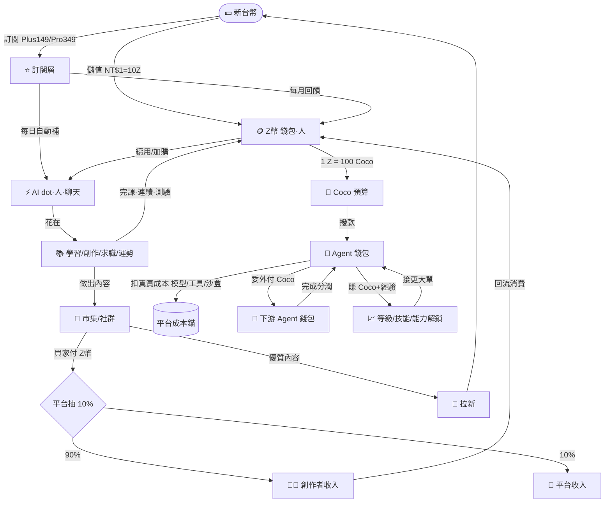

# AI 島 · 商業閉環總體規劃（三幣體系 Z幣 / AI dot / Coco幣）

> 2026-08-12 起草。整併現有變現機制（`docs/business/business_model_extract_0812.md` 為現況摘取），重新設計成一個「錢進得來、價值轉得動、留得住人、養得起創作者」的閉環。
> 姊妹檔：現況摘取 → [`business_model_extract_0812.md`](./business_model_extract_0812.md)。
> 相關現有實作：`src/lib/zcoin.ts`、`src/lib/payments/config.ts`、`src/lib/ai-quota-config.ts`、`src/lib/ai-gate.ts`、`src/lib/fortune-gate.ts`、`supabase/notes_market_commission_migration.sql`、`docs/ideas_os/10_MARKETPLACE.md`、`docs/ideas_os/12_GROWTH_ENGINE.md`。

---

## 0. TL;DR（30 秒版）

- **三幣分工，兩個經濟層（「人」的經濟 × 「Agent」的經濟）**：
  - **Z幣（Z-coin）** = 給**「人」**用的通用錢包幣。**可用新台幣買**（NT$1 = 10 Z幣，現行）。平台金流入口與通用消費幣。
  - **AI dot（AI 能量）** = 給**「人」**用的**互動式 AI 計量表**（AI 導師/助教/單次對話）。訂閱／每日自動補、用一次扣一點；**每日重置、不累積**。
  - **Coco幣** = 給**「Agent」**用的**專用代幣＝Agent Economy 計價單位**（新增）。**匯率 1 Z幣 = 100 Coco**（1 Coco≈NT$0.01）。使用者委託 Agent 時撥一筆 Coco 預算；**Agent 只能動自己錢包的 Coco、不能碰使用者或別的 Agent 的資產**；Agent 之間可**互相委外、接任務、分潤**，價差＝Agent 自己的成本/收益 → Agent 有了「預算決策」。**這不是「AI 點數換可愛名字」，是 Agent 經濟層的血液（完整定義見〈⭐ Agent Economy〉專章）。**
- **閉環（兩層）**：
  - 人：`錢 → Z幣/訂閱 → AI dot(聊天) + 學習/創作 → 賺 Z幣 → 內容上市集(平台抽10%) → 創作者收入回流 → 拉新 → 回到錢`。
  - Agent：`使用者 Z幣 →(1:100)→ Coco 預算撥給 Agent → Agent 執行(扣真實成本) 或 委外給別的 Agent(付 Coco) 組工作鏈 → 完成分潤 → Agent 累積 Coco+經驗 → 升等解鎖更強能力/更大接單`。
- **獲利要多少 KPI（淨利，台幣/月）**——base 假設 ARPPU NT$250、貢獻毛利 80%、轉付費率 4%：
  - **月淨利 10 萬** → 約 **625 位付費用戶 / 1.6 萬 MAU**。
  - **月淨利 50 萬** → 約 **2,800 位付費用戶 / 7 萬 MAU**。
  - **月淨利 100 萬** → 約 **5,600 位付費用戶 / 14 萬 MAU**。
  - 完整敏感度表見 §8。

---

## 1. 三幣體系角色定位

| 幣別 | 服務對象 | 定位（一句話） | 主要取得 | 主要消耗 | 可用 NT$ 購買？ | 會歸零？ | 通膨控制 |
|---|---|---|---|---|---|---|---|
| **Z幣** | 人 | 通用錢包幣（軟硬混合） | 儲值(NT$1=10Z)、訂閱回饋、完課/連續/成就、推薦、市集賣出 | AI 高階續用、市集買、寵物造型、打賞、解鎖、抽蛋、**兌 Coco 撥 Agent 預算** | ✅ 是 | ❌ 永久保存 | 每日「持續型」賺幣上限（島嶼 500/日）；審計走 `coin_transactions` |
| **AI dot** | 人 | 互動式 AI 計量表（能量條） | 每日自動補（免費/Plus/Pro 不同上限）、訂閱、Z幣兌換 | 每次**互動式** AI 呼叫扣點（導師/助教/單次對話） | ⭕️ 間接（買 Z幣→換 dot／升訂閱） | ✅ 每日重置（不累積成財） | 天生防囤積（會歸零）；成本對齊真實 inference（§2 成本錨） |
| **Coco幣** | **Agent** | **Agent 專用代幣＝Agent Economy 計價單位（新）** | **Z幣兌換 1:100**（撥給 Agent 當預算）、接任務賺取（委託方/上游 Agent 支付）、訂閱月贈試用額 | Agent 執行任務的**真實成本**（模型/工具/沙盒，扣自 Agent 錢包）、**委外付給下游 Agent** | ⭕️ 間接（買 Z幣→1:100 換） | ❌ 保留型（Agent 可囤積成「資本」，設軟上限） | 平台**唯一發行**（Z 兌換或贈與才鑄出）；Agent 間流轉零和不增量；成本費率表對齊真實 API（見 Agent Economy 專章） |

**為什麼要三幣、而不是一幣打天下？**
- 一幣（只有 Z幣）→ 「付費」「學習獎勵」「Agent 記帳」全混一個池，要嘛 pay-to-win、要嘛送太多稀釋、要嘛 Agent 一跑失控就把錢包燒光。
- 拆出 **AI dot**：讓「互動式聊天算力」有獨立每日額度、會歸零、不污染錢包。
- 拆出 **Coco幣**：給 **Agent** 一個**自己的錢包與計價單位**，讓「委託→執行→委外→分潤」能被記帳、能有預算與風險，且**Agent 動不到人的 Z幣**（安全隔離）。這是把分身島從「工具」升級成「有經濟的勞動力市場」的關鍵。

> **與現有「Dust 碎片塵」的關係（別搞混）**：Ideas OS 已鎖定 **Dust** 為「創作島專用的創作資源、永遠不是錢、不可換 Z幣」（`ADR-004`）。三者範疇全不同：**Z幣**＝人的錢；**Coco**＝Agent 的錢；**Dust**＝創作島的手感資源。落地時 Dust 維持原設計不動。

---

## 2. 閉環流向圖



**成本錨（很重要）**：AI dot 與 Coco 的「一點值多少錢」永遠對齊真實 inference/工具成本。現行錨點：
- 免費/中階模型一次 ≈ NT$0（幾乎零成本）→ 免費額度大方（每日 100 次，`AI_FREE_DAILY`）。
- 高階模型（Claude/GPT/Gemini）一次 ≈ **NT$2**（=20 Z幣 overflow，`AI_ZCOIN_HIGH_OVERFLOW`）→ 這是毛利模型裡 AI COGS 的計算基準。
- 換算 Coco：1 Coco = NT$0.01 → 一次高階呼叫 ≈ **200 Coco**。Agent 執行成本就照這張費率表逐步累計（見 Agent Economy 專章）。

---

## 3. 兌換與閥門（valves）— 單向規則

閉環要「轉得動又不漏氣」，靠這幾個**單向閥**：

| 方向 | 允許？ | 規則 / 匯率 | 目的 |
|---|---|---|---|
| NT$ → Z幣 | ✅ | 1:10，越多送越多（現行 5 檔儲值包） | 金流入口 |
| NT$ → 訂閱 → AI dot | ✅ | Plus/Pro 每日 dot 上限不同 | 訂閱主收入 |
| Z幣 → AI dot | ✅ | 依模型：中階 2Z/次、高階 20Z/次 | 用完不斷炊、順勢加購 |
| Z幣 → 市集/虛榮/解鎖 | ✅ | 買家付全額，平台抽 10% | Z幣 sink = 平台收入 |
| 完課/連續 → Z幣 | ✅ | 有每日上限（島嶼 500/日） | 免費玩家也有錢包幣 |
| **Z幣 → Coco** | ✅ | **1:100**（撥給 Agent 當預算） | Agent 經濟入口 |
| Coco → Agent 執行成本 | ✅（燒掉） | 依費率表扣真實成本 | 對齊算力成本、Coco sink |
| Coco → 下游 Agent（委外） | ✅ | Agent 間轉帳、走 escrow、零和不增量 | 工作鏈/分潤 |
| **Coco → Z幣**（換回） | ⚠️ v1 預設關 | v2 開：限額 + 損耗匯率（如 1Z=120Coco 回收）+ 使用者本人操作 | 防 Z→Coco→Z 套利/洗；有損耗＝服務費 |
| **AI dot → Z幣 / 提現** | ❌ 禁止 | dot 會歸零 | 能量不是財、不可回售 |
| **Agent 動用他人資產** | ❌ 禁止 | Agent 只能動自己錢包 Coco | 安全隔離（核心紅線） |
| Coco → NT$ 直接提現 | ❌ 禁止 | 只能經 Z幣、走既有結算 | 合規 |

> **一句話記法**：人的錢往下流（NT$→Z幣→dot→燒掉）；要用 Agent 就 `Z幣 →1:100→ Coco 撥預算`。Coco 進了 Agent 錢包後只在 Agent 世界流轉（執行/委外/分潤），**換回 Z 幣 v1 先關死**（防套利），v2 才開限額有損耗的結算閥。

---

## 4. 訂閱層 × 三幣：統一 gating 地圖

沿用現行兩層訂閱（`PRO_PLANS`）＋現行「免費每日 N 次、付費無限」的 gate 心法，統一成下表。**目標：每個功能都要能回答「免費怎麼用、付費解什麼、超額用什麼幣續」。**

| 功能 | 免費 | Plus（NT$149/月） | Pro（NT$349/月） | 超額續用 | 賺什麼 |
|---|---|---|---|---|---|
| AI 導師/助教（中階） | 100 次/日 | 更多 + 中階全開 | 最高 | Z幣 2/次 | — |
| AI 高階模型 | 3 次/日 | 20 次/日 | 100 次/日 | Z幣 20/次 | — |
| 章節學習 | 全開放 | 無廣告/離線 | 同左 | — | Z幣+Coco（完課） |
| 每日測驗 | 1 抽 | 加抽 | 加抽 | Z幣加抽 | Z幣+Coco（滿分） |
| 每日運勢/塔羅 | 1 次/日 | 無限 | 無限 | Z幣單次 | — |
| 訊息軍師 | 3 則/日 | 無限 | 無限 | Z幣單次 | — |
| AI 求職包（自傳/求職信） | 3 次/月 | 更多 | 無限 | Z幣單次 | — |
| 履歷/作品集/模擬面試 | 體驗 | 部分 | 全開 | — | — |
| 筆記進階（知識樹/SRS/協作） | 基本 | 全功能 | 全功能 | — | Coco（公開被收藏） |
| 市集買內容 | ✅ | ✅ | ✅ | 付 Z幣 | 賣家收 Z幣（抽10%） |
| 創作引擎/多工作室 | 體驗 | 部分 | 進階全開 | Z幣/dot | 綠寶/Coco |
| 寵物造型/主題/背景 | 基本款 | 部分 | 專屬款 | Z幣/Coco 解鎖 | — |
| 完課證書 | 一般發放 | — | 優先發放 | — | — |

> 落地建議：把散落各路由的 ad-hoc 429，收斂成一支 `requirePaidOrCharge(userId, feature)` → 統一回 `{ error, reason, upgradeUrl:'/pricing', cost_z }`（現況兩套金流/多處 429 待收斂，見摘取檔 §金流雷）。

---

## 5. 創作者飛輪（閉環的引擎）

閉環要「自己會轉」，關鍵是**創作者能賺到、賺到會留下、留下持續供給內容**：

1. **賺 Z幣**：市集賣筆記/範本/作品，買家付 Z幣，**創作者收 90%、平台抽 10%**（已上線 `buy_note_product`）。
2. **提領**：Z幣 累積到門檻走**真實金流結算**（既有 payment provider 的 payout / 人工對帳，初期可先人工）。
3. **回流**：創作者用收入買 dot/工具/造型，或**換 Coco 養自己的 Agent 幫忙生產內容** → 錢留在站內 → 再產出。
4. **供給→拉新**：優質內容本身就是 SEO/社群素材 → 免費拉新 → 漏斗頂端變大。

> 這條飛輪讓「內容成本」從平台身上轉移到「使用者互相供給」，是規模化後毛利能撐住的核心。**Agent 經濟（下一章）進一步把「生產工具」也貨幣化**：創作者用 Coco 雇 Agent 量產內容 → 供給再放大。

---

## ⭐ Agent Economy — Coco 的完整經濟定義（核心章，回應「別只是穿西裝的點數」）

> 定義了貨幣還不夠，要**定義完整的經濟**才會是「Agent 經濟層的血液循環系統」。以下逐一回答七個必答問題，並拆成 **v1（MVP，先跑起來）/ v2（願景，Agent 自主市場）**。

### 5A. 錢包與帳本（誰持有、怎麼記）
- **每個 Agent 有自己的 Coco 錢包**（`agent_wallets`：agent_id → coco 餘額），與使用者的 Z幣/AI dot **完全隔離**。
- 每筆進出寫 `coco_transactions`（from/to、amount、reason、task_id、balance_after、meta），比照 `coin_transactions`，可審計、冪等。
- **核心紅線**：Agent 只能動**自己錢包**的 Coco；轉給別的 Agent 一定經**委託授權 + escrow**；**永遠碰不到使用者 Z幣或別的 Agent 錢包**。

### 5B. 委託與工作鏈（使用者 → Agent → 子 Agent）
- 使用者委託任務時撥一筆 **Coco 預算（budget cap）** 給承接的 Agent（Z幣 →1:100→ Coco，進 escrow）。
- 例：A 接一個 **500 Coco** 的任務 → A 判斷可花 **100 Coco** 委外給 B 做其中一段 → B 完成、A 從自己錢包付 B 100 → **A 淨賺 = 500 − A 自己執行的真實成本 − 100**。價差就是 A 的毛利/風險。
- 可遞迴組**臨時工作鏈** A→B→C，每層各自扣款、各自入帳、完成分潤。
- **預算上限 = 使用者的最大損失**：Agent 不得超過；要超過得再向使用者請款（沿用現有 agent approval 機制）。

### 5C. 定價：一次任務怎麼算（兩層）
1. **平台底價（成本錨）**：執行時逐步累計 `Σ(模型 token × 費率) + Σ(工具呼叫 × 費率)`，以 **1 Coco = NT$0.01** 對齊真實 API/算力成本（維護一張 **費率表** `coco_rate_table`；成本漲只調這張表、不動 1Z=100Coco 匯率）。這是「平台實際花多少」。
2. **Agent 報價**：= 底價 × 加成係數。
   - **v1**：加成係數由平台按 **Agent 等級**階梯固定（例 Lv1 ×1.2、Lv5 ×1.5）；Agent 不能亂喊價。
   - **v2**：Agent 可在受限區間（如底價 1.0–2.0×）**自訂報價**，高評價/高等級 Agent 要更高溢價 → 委外時上游可**比價**選 B/C/D → 形成 Agent 勞動市場。

### 5D. 發行與總量（誰發行、能不能囤）
- **平台是唯一發行方（央行）**。Coco 只從兩處**鑄出**：① 使用者 Z幣 兌換（銷毀等值 Z幣額度）；② 平台/訂閱**贈與**（促銷、每日免費試用額）。
- **Agent 間流轉不新增總量**（純零和轉帳）。Agent「賺 Coco」= 從委託方 escrow / 上游 Agent 錢包轉入，**不是憑空發行** → 總量 = 已兌換 + 已贈與，永遠可對帳。
- **能囤**：Agent 錢包保留型，累積成「資本」→ 連動能力鏈（見 5F）。設**軟上限**防死囤；**閒置衰減**為 v2 選配（鼓勵資金流動）。

### 5E. 失敗任務誰吞成本（風險歸屬）
已實際燒掉的成本一定要有人吞，規則：
- **Agent 自身出錯/能力不足** → **Agent 自己吞**（從錢包扣，賠本）。這正是「價差＝成本與收益」的風險面 → **逼 Agent 只接能力內的單**（連動能力鏈）。
- **委託方需求不清/中途取消** → 記在委託方（扣其 escrow 內**已實際發生**的部分），未動用的預算退回。
- **使用者永遠受保護**：最大損失 = 撥出的預算上限，失敗不額外多扣。
- 機制：**escrow 托管**——預算先進 escrow，**成功才放款**給受託 Agent；失敗按上面結算 + 退剩餘。

### 5F. 能力鏈連動（Coco × 技能/經驗/等級）
- Agent 完成任務 → 賺 **Coco（資本）** + **XP（經驗）** → **升等** → 解鎖更強工具、更高報價權、更大接單/委外上限。
- 「Coco 資本 + 等級 + 評價」= Agent 的**信用**，決定它能接多大單、能不能招募子 Agent。
- 把現有分身島技能系統（`skills` / `allowed_tools` / `synthesize`，見 [[agent-platform]]）接上經濟層 → 技能不只是能力，也是**賺 Coco 的生產資料**。

### 5G. 防坑總表（回應「最大的坑：定義了貨幣、還沒定義經濟」）
| 坑 | 對策 |
|---|---|
| 超發/通膨 | 平台唯一發行；Agent 間零和；總量 = 兌換+贈與，可對帳 |
| 幣值脫離現實 | 費率表對齊真實 API 成本；1 Coco=NT$0.01 錨定 |
| Agent 亂碰他人資產 | agent-only 錢包 + escrow + 帳本；核心紅線 |
| 使用者被咬爆 | 預算上限 = 最大損失；超額要 approval |
| 洗錢/套利（Z→Coco→Z） | v1 Coco→Z 關死；v2 開也要限額 + 損耗 |
| 失敗成本沒人擔 | 明確歸屬規則（5E）+ escrow 成功才放款 |
| Agent 亂喊價 | v1 平台階梯固定加成；v2 才開受限自訂 |

### 5H. v1 → v2 落地順序
- **v1（先能記帳）**：`agent_wallets` + `coco_transactions` + 費率表 + Z幣→Coco 撥款 + 單一 Agent 執行扣款 + escrow + 預算上限。Coco→Z 關死。加成係數平台固定。
- **v2（Agent 市場）**：委外/工作鏈轉帳、Agent 自訂報價與比價、能力鏈升等解鎖、閒置衰減、Coco→Z 限額結算閥。
- 現況：Coco **全站 code 尚未實作**（僅測資）。DB/helper 待建，清單見 §9。

---

## 6. 反通膨 / 反刷 規則（讓幣值不崩）

- **產出封頂**：每日「持續型」賺幣上限（島嶼 500 Z幣/日已有）；Coco 每日賺取上限。
- **來源審計**：所有 Z幣 進出走 `coin_transactions`（reason+meta+balance_after），可即時加總防灌水。
- **sink 要夠大**：Z幣 要有持續消耗（AI 續用、市集、造型、抽獎）；Coco 花掉即銷毀。**發幣速度 < 燒幣速度** 是幣值健康的鐵律。
- **高階 AI 對齊成本**：dot/Z幣 對 AI 的定價永遠 ≥ 真實 inference，避免「用越多虧越多」。
- **冪等發幣**：金流補款用 `grantZcoinOnce`（order_no 去重），webhook 重送不重複發。
- **收斂雙路徑**：目前 `zcoin.ts`（含 meta/冪等）與 `gamification/referral.ts` 兩條加幣路徑並存，需收斂成單一入口以利審計。

---

## 7. 收入結構（Revenue Streams）

| 來源 | 型態 | 現況 | 毛利特性 |
|---|---|---|---|
| **訂閱** Plus/Pro | 經常性（MRR） | 已定價 149/349、年繳折扣 | 高毛利、可預測——**營收骨幹** |
| **Z幣 儲值** | 交易型 | 已上線 5 檔儲值包 | 高毛利；含 AI 續用剛需 + 鯨魚消費 |
| **市集抽成** | 交易型 | 已上線抽 10% | 純 sink、零邊際成本；規模後放大 |
| **Agent 執行（Coco）** | 交易型 | ❌ 待建 | Agent 報價含平台加成（底價×係數）＝毛利；高價值、隨自動化需求成長 |
| **單次功能加購**（運勢/軍師/求職包超額） | 交易型 | gate 已有、Z幣單次待深化 | 高毛利小額、走量 |
| B2B / 團體授權 / 課程 | 專案 | 未做 | 上檔潛力（暫不列入 base 模型） |
| 廣告 / 聯盟 | 流量變現 | 未做 | 低優先（傷體驗，僅免費層考慮） |

**成本結構**：AI inference（COGS，隨用量變動）＋金流手續費（信用卡約 2.75%、海外 MoR 約 5%）＋固定 opex（Supabase/Zeabur/網域/監控/客服內容分攤）。

---

## 8. KPI 與獲利模型（月淨利 10 萬 / 50 萬 / 100 萬）

> 目標＝**淨利**（扣掉 COGS＋金流＋固定 opex 後的錢）。單位：新台幣/月。

### 8.1 假設（base case）

| 參數 | 值 | 說明 |
|---|---|---|
| 貢獻毛利率 `m` | **80%** | 營收扣掉 AI COGS(~12%) + 金流手續費(~3%) + 退款雜項 後 |
| ARPPU（每付費用戶月營收，含訂閱+儲值+加購混合） | **NT$250** | 介於 Plus(149) 與 Pro(349)＋部分儲值鯨魚之間 |
| 轉付費率 `conv`（付費用戶 / MAU） | **4%** | 免費增值消費型產品常見 2–6% |
| 固定 opex `F` | 10萬階段 2.5萬 / 50萬階段 6萬 / 100萬階段 12萬 | 隨客服/內容/基建規模成長 |

**核心公式**：
```
每付費用戶月貢獻 = ARPPU × m
需要付費用戶數  = (淨利目標 + 固定opex) / (ARPPU × m)
需要 MAU        = 需要付費用戶數 / 轉付費率
```

### 8.2 需要多少「付費用戶數」（隨 ARPPU 變動，m=80%）

| 月淨利目標 | 固定opex | ARPPU 150（貢獻120） | **ARPPU 250（貢獻200）** | ARPPU 400（貢獻320） |
|---|---|---|---|---|
| **10 萬** | 2.5萬 | 1,042 人 | **625 人** | 391 人 |
| **50 萬** | 6萬 | 4,667 人 | **2,800 人** | 1,750 人 |
| **100 萬** | 12萬 | 9,333 人 | **5,600 人** | 3,500 人 |

### 8.3 需要多少 MAU（base ARPPU 250、隨轉付費率變動）

| 月淨利目標 | 付費用戶 | 轉付費 2% | **轉付費 4%** | 轉付費 6% |
|---|---|---|---|---|
| **10 萬** | 625 | 31,250 | **15,625** | 10,417 |
| **50 萬** | 2,800 | 140,000 | **70,000** | 46,667 |
| **100 萬** | 5,600 | 280,000 | **140,000** | 93,333 |

### 8.4 白話版（base：ARPPU 250 / m 80% / conv 4%）

- **月淨利 10 萬**：約 **625 位付費用戶**、對應 **1.6 萬 MAU**。→ 一個健康的小眾產品就到得了。
- **月淨利 50 萬**：約 **2,800 位付費用戶**、對應 **7 萬 MAU**。→ 需要一條穩定拉新管道（運勢/LINE/SEO 內容）。
- **月淨利 100 萬**：約 **5,600 位付費用戶**、對應 **14 萬 MAU**。→ 需要病毒級成長 + 創作者飛輪供給內容降獲客成本。

### 8.5 營運節奏換算（維持 MAU 需要的「每天」動作）

假設月流失（payer churn）≈ 6%、註冊→啟用（activation）≈ 40%：

| 目標 | 需維持 MAU | 每月需淨補付費用戶(補流失) | 每天需新啟用用戶* | 每天需新註冊* |
|---|---|---|---|---|
| 10 萬 | 15,625 | ~38 | ~42 | ~105 |
| 50 萬 | 70,000 | ~168 | ~187 | ~467 |
| 100 萬 | 140,000 | ~336 | ~373 | ~933 |

*「每天新啟用」= 維持 MAU 所需的 monthly 新啟用 ÷ 30；「每天新註冊」= 新啟用 ÷ 40% activation。僅為穩態維持量，尚未含淨成長。

### 8.6 對照現有 KPI 模型 & 現實基線（很重要，別自我感覺良好）

- **現有 grant 模型（`docs/grant/ch9-kpi.md §9.8`）較保守**：付費 ARPU **NT$1,500/年 ≈ NT$125/月**、免費→付費 **3%**。這對應本文 §8.2 的 **ARPPU 150 欄**（更接近純訂閱路線）。本文 base 用 ARPPU 250/月＝假設「訂閱 + 儲值 + 加購」混合把 ARPPU 拉高後的**目標值**，非現況。
- **現實基線非常小（`ch0-baseline-honesty.md`）**：目前累積註冊 **17**、真人 MAU **≈4**、營收 **0**、付費 **0**。→ 上表「100 萬淨利需 14 萬 MAU」是**從 4 → 140,000（35,000 倍）的長期目標**，不是三個月的事。務實順序：
  1. **先把金流真正打開**（商業登記 → `PAYMENTS_LIVE=1`），否則營收數學都是紙上談兵。
  2. **10 萬/月**（≈1.6 萬 MAU / 625 付費）是第一個務實里程碑——靠運勢/LINE/SEO 內容漏斗 + 把 gating 體驗做順。
  3. 50 萬 / 100 萬 依賴**創作者飛輪**（§5）壓低獲客成本 + 拉高 ARPPU（年繳、鯨魚儲值包、加購）。
- **既有目標校準參考**：`PRICING_STRATEGY.md §5` 已訂 churn ≤8%/月、ARPU ≥NT$250、AI 成本比 ≤30%——本文 base 假設與其一致（ARPPU 250、m 80%）。

### 8.7 兩條路線 & 敏感度

- **訂閱主導路線**（ARPPU 偏低但穩、churn 低）：付費用戶數需求較高（見 8.2 ARPPU150 欄），但 MRR 可預測、估值高。
- **儲值/鯨魚路線**（ARPPU 高、波動大）：付費用戶數需求低（ARPPU400 欄），但依賴少數高消費者、風險集中。
- **最健康 = 兩者混合**（=base ARPPU 250）：訂閱打底 + 儲值/加購拉高 ARPPU + 市集抽成當純利。
- **槓桿排序**（對淨利影響力）：`轉付費率 > ARPPU > 毛利率 > 固定opex`。→ 資源優先投「把免費用戶轉成付費」（gating 體驗、pricing 頁、升級時機）與「拉高 ARPPU」（加購/年繳/鯨魚包）。

---

## 9. 落地 roadmap（現況 → 補 Coco幣）

| 項目 | 現況 | 要做 |
|---|---|---|
| Z幣 錢包/儲值/帳本 | ✅ 已上線 | 收斂雙加幣路徑成單一入口 |
| AI dot（能量/額度） | ✅ 已上線（quota + overflow） | 命名/UI 統一成「AI dot 能量條」、對外一致敘事 |
| 訂閱層 Plus/Pro | ✅ 已定價 | plus/pro 分層 gate 深化（現多數收斂成 paid 布林） |
| 市集抽成 10% | ✅ 已上線 | 擴到更多內容型態（範本/作品/課程） |
| **Coco幣（Agent Economy）** | ❌ 不存在（全站 grep 僅測資） | **v1 需新建**：`agent_wallets`＋`coco_transactions`＋費率表 `coco_rate_table`＋Z幣→Coco(1:100) 撥款＋單 Agent 執行扣款＋escrow＋預算上限 helper（比照 `zcoin.ts`）。Coco→Z v1 關死 |
| Agent 委外/工作鏈/自訂報價 | ❌ 未做 | **v2**：Agent 間轉帳、比價、能力鏈升等解鎖、閒置衰減、Coco→Z 限額結算閥 |
| 統一 402 gate helper | ❌ 各處 ad-hoc | `requirePaidOrCharge` 統一回傳 |
| 創作者結算/提領 | ❌ 未做 | 認證+門檻+人工對帳先行，之後接 payout |

---

## 10. 風險 / 合規（先標記、上線前確認）

- **虛擬貨幣/儲值**：Z幣 屬「平台內點數」、非通貨；避免「可雙向自由兌現」以免落入電子支付/儲值監管。**Coco 是 Agent 內部計價/消耗單位**、v1 不可換回 Z、不可直接提現，降低風險。
- **Agent 代花錢的信任邊界**：Agent 只能動自己錢包 Coco、有預算上限、對外/超額動作要 approval → 使用者不會被 Agent 咬爆。這條要在條款與 UI 講清楚。
- **創作者提領**：Z幣→真實結算 這條要有清楚條款、稅務（開發票/扣繳）、KYC 門檻。
- **退款/爭議**：訂閱與儲值需有退款政策；`grantZcoinOnce` 已保證不重複發。
- **未成年消費**：儲值需有家長/額度保護（大眾運勢/LINE 漏斗會帶進非工程師與年輕族群）。
- **抽獎/轉蛋**：若做轉蛋要注意「機率公示」等相關規範。

---

### 附：一頁速記

> **三幣兩層**：Z幣（人的錢包，可買）、AI dot（人的聊天能量，會歸零）、**Coco（Agent 的錢，1Z=100Coco，Agent Economy 計價單位）**。
> **人的閉環**：付費→AI dot/學習創作→賺 Z幣→市集(抽10%)→創作者收入→回流→拉新→再付費。
> **Agent 閉環**：Z幣→100倍→Coco 撥 Agent 預算→執行/委外/分潤→Agent 累積 Coco+經驗→升等接更大單。
> **Coco 七問已答**（換回/囤/發行/定價/成本映射/報價/失敗成本）＝ Agent Economy 專章；核心：平台唯一發行、費率表對齊真實成本、agent-only 錢包+escrow、預算上限=最大損失、v1 不可換回。
> **淨利 KPI（base）**：10萬≈625付費/1.6萬MAU、50萬≈2,800付費/7萬MAU、100萬≈5,600付費/14萬MAU。**最該投**：轉付費率 > ARPPU。
