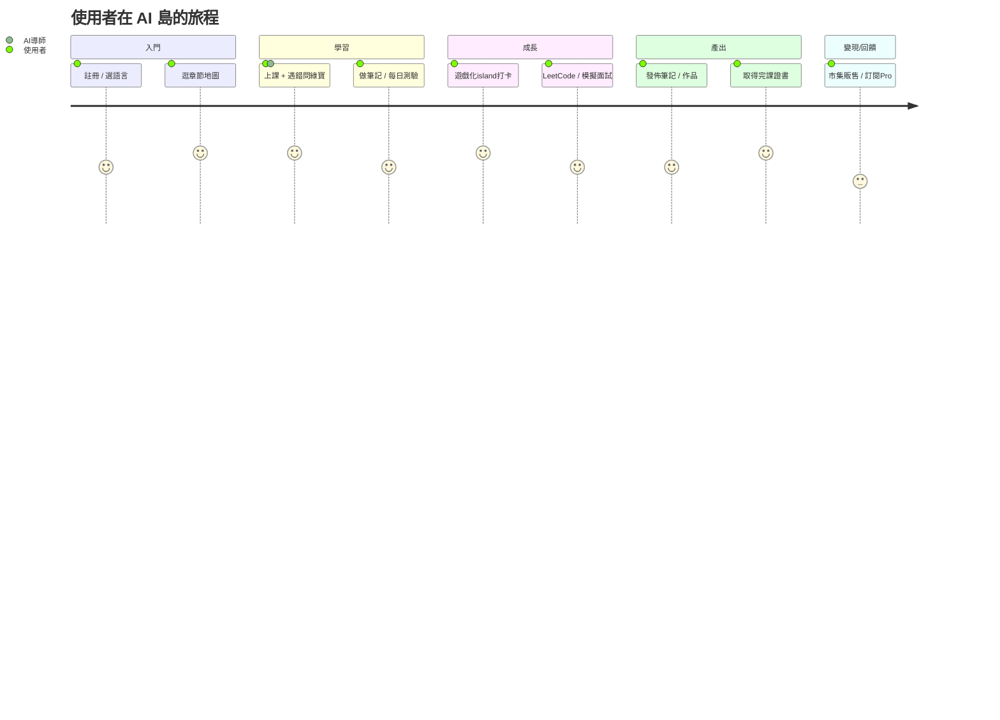

# 第三章　產品介紹

> 本章需配圖。文中以 `【截圖：說明｜擷取頁面】` 標示待插入之實際畫面，對應之拍攝清單見章末附錄。
>
> ⚠️ **成熟度分層界定**：本章功能分三層標示——`✅ 已上線`（生產環境可運行）、`🟡 半成品`（部分實作 / 進度存本機 / stub）、`⚠️ 紅線`（demo 時避免展示、詳 `tech-inventory.md`）。**避免「全站皆已上線」之概括**。現況用戶 / 營收口徑一律依 附錄 A（pre-launch / pre-revenue、註冊 17、營收 0）。

## 3.1 產品概觀

AI 島（ai-island-web.snowrealm.pet）是一個**繁體中文原生、以 AI 導師為核心、遊戲化驅動**的程式與 AI 學習平台。使用者在此不只是「看課」，而是進入一個「學習 → AI 陪練 → 產出筆記 / 作品 → 社群分享 → 求職 / 變現」的完整島嶼世界。

【截圖：平台首頁全景（英雄區 + 章節地圖 + 遊戲化入口）｜擷取 `/`】

平台目前規模（✅ 資料庫實查）：**80 章、1,258 節課程、374 題測驗題庫、196 張資料表、392 支 API**，四語（中 / 英 / 日 / 韓）介面與內容。

## 3.2 核心功能模組

### （一）結構化課程系統
80 章、1,258 節，涵蓋程式基礎到 AI 工程，零基礎友善（術語中英對照、生活化比喻）。內容以資料庫驅動、可即時更新，並提供離線儲存（PWA）。
> 誠實界定：教材**多為 AI 輔助生成、持續人工校訂中**，非「專家審訂」；內容品質校訂為補助委外項目之一（見 ch8）。

【截圖：章節列表頁 + 單一課程內容（含可執行程式碼區塊）｜擷取 `/chapters` 與 `/chapters/26`】

### （二）AI 導師「綠寶」（核心差異化）
24 小時即時解惑，可貼截圖問問題（多模態），回答貼合平台教材（RAG 檢索）、記得使用者學習狀態（跨對話記憶），11 種教學人格可切換。

【截圖：AI 導師對話介面（含貼圖提問與串流回答）｜擷取任一課程頁開啟綠寶】

### （三）筆記系統（差異化重點）
自製便利貼式筆記，支援 3 層知識樹、拖曳分類、間隔複習（SRS）、區塊引用、多人即時協作，並可發佈至公開牆或於市集販售。

【截圖：我的筆記牆（便利貼 + 知識樹側欄）｜擷取 `/me/notes`】
【截圖：筆記公開牆｜擷取 `/notes/public`】

### （四）每日測驗與 LeetCode 練習
每日 8 題自適應難度測驗（ELO 演算法，✅ 已上線），題源含課程測驗與繁中程式題庫；另整合 LeetCode **題目清單與自報解題追蹤**（🟡 為外連 leetcode.com + 使用者自報已解，**站內無自動判題**，非線上評測平台）。

【截圖：每日測驗作答介面｜擷取 `/me/quiz`】

### （五）遊戲化世界（島嶼 / 寵物 / 虛擬經濟）
3D 島嶼可自由走動、釣魚、蓋房、與村民互動（✅ 前端互動已上線）；AI 寵物可對話陪伴（✅ 真串 AI）；Z 幣虛擬經濟串連學習獎勵與消費（✅ 發幣為伺服器端原子操作）。以動機設計對抗「自學易放棄」。
> 🟡/⚠️ 誠實界定：島嶼進度 / 庫存為**本機（localStorage）儲存**（換裝置歸零、非雲端存檔）；釣魚 / 兌換發幣目前**信任前端申報、存已識別刷幣面**，伺服器權威事件驗證與去重**待強化**（demo 紅線，勿開 devtools 展示）。

【截圖：3D 島嶼場景｜擷取 `/island`】
【截圖：AI 寵物互動｜擷取寵物面板】

### （六）求職閉環
課程 → LeetCode → 模擬面試 → 作品集 → 完課證書 → 履歷，一站式職涯路徑，各環節以真實學習數據串接。
> 誠實界定：此為**功能路徑已建置**（✅ 各頁真實查詢學習數據）；惟**實際使用成效尚未驗證**——現況完課證書發出 0、LeetCode 為外連自報（非站內判題）。應區分「路徑已完成」與「成效待累積」。

【截圖：職涯路徑頁（五關進度）｜擷取 `/me/career-path`】
【截圖：完課證書｜擷取 `/certificates/[code]`】

### （七）社群與內容生態
論壇、部落格（tiptap 全功能編輯器、即時協作）、筆記公開牆等 UGC 機制**已建置**（✅），可帶動 SEO / GEO 流量。
> 誠實界定：目前站上之公開筆記（485 則）與論壇串多為**種子 / 示範 / AI 住民內容（來自少數帳號）**，**非自然用戶產出**；「UGC 內容飛輪」為**機制已備、待真實用戶啟動**，不作為現有 traction（口徑見 附錄 A）。

【截圖：論壇 / 部落格頁｜擷取 `/forum` 與 `/blogs`】

### （八）多語系（零成本四語）
一鍵切換中 / 英 / 日 / 韓，介面與內容自動翻譯，海外華人與非中文母語者亦可使用（✅ 已上線）。
> 誠實界定：內容翻譯採 **Google 非官方免費端點**、屬**機器翻譯未經人工校對**；具穩定性 / 商用適用性風險（已以重試 + 快取緩解）。

【截圖：語言切換前後對照｜擷取任一頁切換語言】

### （九）創作者島嶼 Creator Island（第二根支柱，非附屬功能）
**AI 島的第二座島 —— 讓一般人也能用 AI 把腦中的想法變成真的作品。** 若學習島降低的是對「寫程式」的恐懼，Creator Island 降低的是對「用 AI 創作」的恐懼；兩座島同一個靈魂：把「不敢碰」變成「敢動手」。這是 AI 島跟「AI 化程式補習班」最不一樣、也最有記憶點的地方 —— 不只教人學，也陪人做。

- **創作夥伴綠寶（Creator 版 AI）**（✅ 已上線）：陪發想、把零散碎片變成作品、給可立刻動手的創作方向（音樂 / 小說 / 故事 / 詩 / 文案），可看圖給靈感（多模態）。
- **創作者部落格 / 作品發佈**（✅ 已上線）：可開部落格、發佈作品；站上已有創作者住民（蘇晚 / 林之遠 / 何默 / 江見）示範內容。
- **市集交易**（✅ 交易已實作）：作品 / 筆記可上架、以 Z 幣購買。
- **與學習島共用同一套 AI 基建**（模型路由 / 語意快取 / 配額 / 記憶 / Z 幣）——一套 AI 撐兩條產品線，是**成本優勢**而非兩份負擔。

> 誠實界定：「創作 → 分享 → 變現」**路徑已串接、收款能力已建置**，但**變現閉環尚未經市場驗證** —— 市集無自然交易、**提領（果實→現金）為人工審核流程、尚未接金流、不會自動入帳**（🟡）、營收為 0。正確口徑為「路徑已串接、閉環假設待市場驗證」，不得寫成「創作變現閉環已完成」。詳 `creator-island.md`。

【截圖：Creator Island 工作室 / 市集 / 創作夥伴綠寶對話｜擷取 `/creator-island`】

## 3.3 使用者旅程

## 3.4 產品現況與技術成熟度

- **核心功能已上線**：課程、AI 導師、筆記、測驗、社群、多語、部署 / 維運等**核心路徑為生產環境實際運行**（非原型），可即時 demo。
- **半成品 / 紅線分層**：島嶼經濟（localStorage / 刷幣面）、Creator Island 提領（未接金流）、家譜（不存在）等屬半成品或 demo 紅線（詳 `tech-inventory.md`），**不宜概括為「全站皆已完成」**。
- **自動化維運**：CI/CD 全自動部署、主動營運告警、自有行為分析（詳第四章、第六章）。
- **現況界定（誠實）**：處於 **pre-launch / pre-revenue** 階段——**真實註冊用戶 17 人、營收 0**（口徑見 附錄 A）；產品完整度高但用戶規模尚未建立，本計畫旨在加速推廣與規模化。

---

## 附錄：截圖清單與狀態

> 已自動擷取之公開頁存於 `docs/grant/screenshots/`（桌機 `-desktop` + 手機 `-mobile` 各一，凸顯 RWD）。
> 需登入之頁面須由本人登入後自行擷取（建議用乾淨的示範帳號；擷取時避開 `tech-inventory.md` 之 Demo 紅線）。

| # | 畫面 | 頁面 URL | 狀態 | 重點 |
|---|---|---|---|---|
| 1 | 首頁全景 | `/` | ✅ 已擷取 | 英雄區、核心夥伴、冒險地圖 |
| 2 | 章節列表 | `/chapters` | ✅ 已擷取 | 80 章規模感 |
| 3 | 課程內容 | `/chapters/26` | ✅ 已擷取 | 可執行程式碼區塊、零基礎友善 |
| 6 | 筆記公開牆 | `/notes/public` | ✅ 已擷取 | UGC 機制（現況內容多為種子） |
| 11a | 論壇 | `/forum` | ✅ 已擷取 | 社群 |
| 11b | 部落格 | `/blogs` | ✅ 已擷取 | 內容社群 |
| 4 | AI 導師對話 | 課程頁開綠寶 | ⬜ 需登入自拍 | 貼圖提問 + 串流回答 |
| 5 | 我的筆記 | `/me/notes` | ⬜ 需登入自拍 | 便利貼 + 3 層知識樹 |
| 7 | 每日測驗 | `/me/quiz` | ⬜ 需登入自拍 | 自適應難度 |
| 8 | 3D 島嶼 | `/island` | ⬜ 需登入自拍 | 遊戲化沉浸感 |
| 9 | 職涯路徑 | `/me/career-path` | ⬜ 需登入自拍 | 求職閉環五關 |
| 10 | 完課證書 | `/certificates/[code]` | ⬜ 需登入自拍 | 自動發證 |
| 12 | 語言切換 | 任一頁 | ⬜ 需登入自拍 | 四語對照 |
| 13 | Creator Island | `/creator-island` | ⬜ 需登入自拍 | 第二產品線 |

> 重新擷取公開頁：`node scripts/grant-screenshots.mjs`。若要抓需登入頁，可連接 Claude Chrome 擴充或本人手動擷取。

> ⚠️ Demo / 截圖紅線（見 `tech-inventory.md`）：勿展示提領入帳、勿開 devtools 談防刷、勿承諾家譜功能、島嶼進度為本機儲存。
