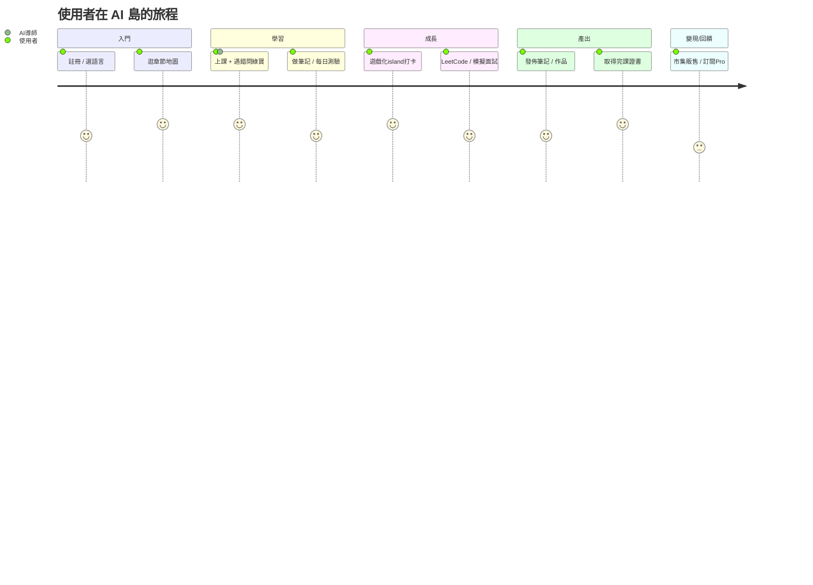

# 第三章　產品介紹

> 本章需配圖。文中以 `【截圖：說明｜擷取頁面】` 標示待插入之實際畫面，對應之拍攝清單見章末附錄。所有功能描述均為已上線之實作（佐證見第四章）。

## 3.1 產品概觀

AI 島（ai-island-web.snowrealm.pet）是一個**繁體中文原生、以 AI 導師為核心、遊戲化驅動**的程式與 AI 學習平台。使用者在此不只是「看課」，而是進入一個「學習 → AI 陪練 → 產出筆記 / 作品 → 社群分享 → 求職 / 變現」的完整島嶼世界。

【截圖：平台首頁全景（英雄區 + 章節地圖 + 遊戲化入口）｜擷取 `/`】

平台目前規模（✅ 資料庫實查）：**80 章、1,258 節課程、374 題測驗題庫、196 張資料表、392 支 API**，四語（中 / 英 / 日 / 韓）介面與內容。

## 3.2 核心功能模組

### （一）結構化課程系統
80 章、1,258 節，涵蓋程式基礎到 AI 工程，零基礎友善（術語中英對照、生活化比喻）。內容以資料庫驅動、可即時更新，並提供離線儲存（PWA）。

【截圖：章節列表頁 + 單一課程內容（含可執行程式碼區塊）｜擷取 `/chapters` 與 `/chapters/26`】

### （二）AI 導師「綠寶」（核心差異化）
24 小時即時解惑，可貼截圖問問題（多模態），回答貼合平台教材（RAG 檢索）、記得使用者學習狀態（跨對話記憶），11 種教學人格可切換。

【截圖：AI 導師對話介面（含貼圖提問與串流回答）｜擷取任一課程頁開啟綠寶】

### （三）筆記系統（差異化重點）
自製便利貼式筆記，支援 3 層知識樹、拖曳分類、間隔複習（SRS）、區塊引用、多人即時協作，並可發佈至公開牆或於市集販售。

【截圖：我的筆記牆（便利貼 + 知識樹側欄）｜擷取 `/me/notes`】
【截圖：筆記公開牆｜擷取 `/notes/public`】

### （四）每日測驗與 LeetCode 練習
每日 8 題自適應難度測驗（ELO 演算法），題源含課程測驗與繁中程式題庫；另整合 LeetCode 題目清單與解題追蹤。

【截圖：每日測驗作答介面｜擷取 `/me/quiz`】

### （五）遊戲化世界（島嶼 / 寵物 / 虛擬經濟）
3D 島嶼可自由走動、釣魚、蓋房、與村民互動；AI 寵物可對話陪伴；Z 幣虛擬經濟串連學習獎勵與消費。以動機設計對抗「自學易放棄」。

【截圖：3D 島嶼場景｜擷取 `/island`】
【截圖：AI 寵物互動｜擷取寵物面板】

### （六）求職閉環
課程 → LeetCode → 模擬面試 → 作品集 → 完課證書 → 履歷，一站式職涯路徑，各環節以真實學習數據串接。

【截圖：職涯路徑頁（五關進度）｜擷取 `/me/career-path`】
【截圖：完課證書｜擷取 `/certificates/[code]`】

### （七）社群與內容生態
論壇、部落格（tiptap 全功能編輯器、即時協作）、筆記公開牆，形成 UGC 內容飛輪並帶動 SEO / GEO 流量。

【截圖：論壇 / 部落格頁｜擷取 `/forum` 與 `/blogs`】

### （八）多語系（零成本四語）
一鍵切換中 / 英 / 日 / 韓，介面與內容自動翻譯，海外華人與非中文母語者亦可使用。

【截圖：語言切換前後對照｜擷取任一頁切換語言】

### （九）Creator Island（第二產品線）
創作者可於島上建立工作室、以 AI 協作產出作品、於市集交易，形成創作變現生態。

【截圖：Creator Island 工作室 / 市集｜擷取 `/creator-island`】

## 3.3 使用者旅程

## 3.4 產品現況與技術成熟度

- **已上線運行**：全站功能均為生產環境實際運行（非原型），可即時 demo。
- **自動化維運**：CI/CD 全自動部署、主動營運告警、自有行為分析（詳第四章、第六章）。
- **現況界定**：`[待補]` 目前為推廣前階段（註冊 17 人），產品完整度高但用戶規模尚小；本計畫旨在加速推廣與規模化。

---

## 附錄：截圖拍攝清單（供補圖）

> 建議以手機與桌機各拍一份（凸顯 RWD）。登入後帳號建議用乾淨的示範帳號。

| # | 畫面 | 頁面 URL | 重點 |
|---|---|---|---|
| 1 | 首頁全景 | `/` | 英雄區、章節地圖、遊戲化入口 |
| 2 | 章節列表 | `/chapters` | 80 章規模感 |
| 3 | 課程內容 | `/chapters/26` | 可執行程式碼區塊、零基礎友善 |
| 4 | AI 導師對話 | 課程頁開綠寶 | 貼圖提問 + 串流回答 |
| 5 | 我的筆記 | `/me/notes` | 便利貼 + 3 層知識樹 |
| 6 | 筆記公開牆 | `/notes/public` | UGC 生態 |
| 7 | 每日測驗 | `/me/quiz` | 自適應難度 |
| 8 | 3D 島嶼 | `/island` | 遊戲化沉浸感 |
| 9 | 職涯路徑 | `/me/career-path` | 求職閉環五關 |
| 10 | 完課證書 | `/certificates/[code]` | 自動發證 |
| 11 | 論壇 / 部落格 | `/forum`、`/blogs` | 社群 |
| 12 | 語言切換 | 任一頁 | 四語對照 |
| 13 | Creator Island | `/creator-island` | 第二產品線 |

> ⚠️ Demo / 截圖紅線（見 `tech-inventory.md`）：勿展示提領入帳、勿開 devtools 談防刷、勿承諾家譜功能、島嶼進度為本機儲存。
