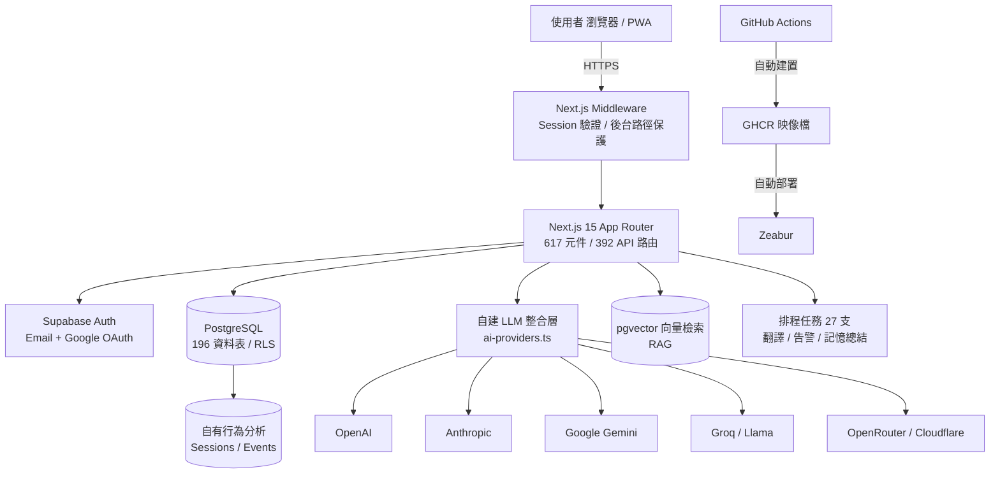
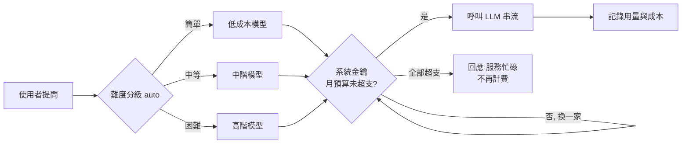
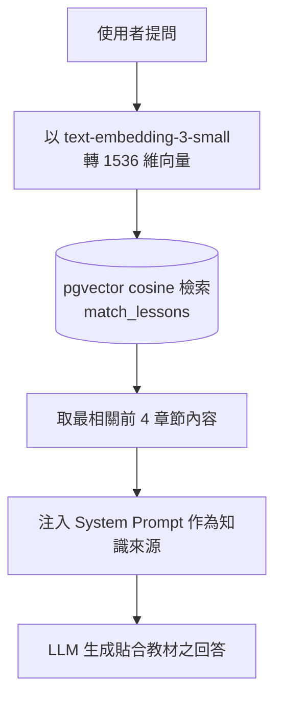
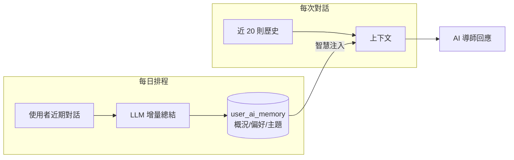

# 第四章　技術架構與核心技術

> 本章所有技術主張均以實際運行之原始碼為據，關鍵處標註 `檔案:行號` 供查證；標記慣例：`✅` 已驗證可運行、`🟡` 部分實作、`[待補]` 待補內部數據。撰寫原則：不誇大、不編造、每一主張可回溯至程式碼。

## 4.1 技術架構總覽

本平台採前後端整合之全端架構，以 Next.js 15（App Router）為應用框架、Supabase（PostgreSQL）為資料與驗證核心、Zeabur 為部署環境，並自建一套多供應商大型語言模型（LLM）整合層作為 AI 能力中樞。系統以「單一程式庫、伺服器端運算優先、資料庫層安全」為設計原則。

**技術堆疊摘要**

| 層級 | 技術 | 佐證 |
|---|---|---|
| 前端框架 | Next.js 15 + React 19（App Router、standalone 輸出） | `next.config.mjs:13` |
| 後端 / 資料 | Supabase（PostgreSQL 196 表、178 個 migration、RLS 191 表啟用） | `supabase/*.sql` |
| AI 整合 | 自建多供應商 LLM 閘道（6 家協定，原生實作） | `src/lib/ai-providers.ts` |
| 語意檢索 | pgvector（1536 維、ivfflat cosine 索引） | `supabase/ai_embeddings_migration.sql:6` |
| 部署 | Docker standalone → GHCR → Zeabur（CI/CD 全自動） | `.github/workflows/docker.yml` |
| 多語 | next-intl（介面）＋ 自建零成本內容翻譯管線（四語互譯） | `src/lib/gtranslate.ts` |

---

## 4.2 AI 核心：自建多供應商 LLM 整合層

本平台之 AI 能力並非單純呼叫單一廠商 API，而是自行實作一套**供應商中立（vendor-neutral）的統一整合層**，以原生 HTTP 對接六家 LLM 供應商協定：OpenAI、Anthropic、Google Gemini、Groq（Llama）、OpenRouter、Cloudflare Workers AI（`src/lib/ai-providers.ts`）。

此設計之技術價值：

1. **供應商可替換、無綁定風險**：任一供應商漲價、限流或停用，可即時切換，不影響服務。
2. **成本最佳化**：可依任務難度與價格，動態選擇最合適之模型（詳 4.3）。
3. **統一介面**：串流回應、圖片多模態、工具呼叫（function calling）等能力，於各供應商間以一致介面封裝。

**已實作之核心能力**

| 能力 | 說明 | 佐證 |
|---|---|---|
| 串流回應（SSE） | 逐字輸出，各供應商 SSE 格式各自解析 | `ai-providers.ts:403/464/533` ✅ |
| 圖片多模態 | 使用者可貼上截圖，AI 讀圖作答（最多 5 張） | `ai-providers.ts:73/144/254` ✅ |
| 自動容錯備援 | 主模型逾額 / 錯誤時，自動跨供應商重試（最多 6 次） | `ai-providers.ts:341` ✅ |
| 熔斷器 | 供應商連續失敗時暫時停用、冷卻後恢復 | `resolve-usage-ai.ts:75` ✅ |
| 工具呼叫 | 多輪 agentic loop，AI 可查詢真實營運數據 | `line-ai-tools.ts:429` ✅ |
| Prompt 快取 | 穩定前綴設快取斷點，降低重複 token 成本 | `ai-providers.ts:175` ✅ |

> **誠實界定**：本平台為 LLM 之**應用整合**，非自行訓練基礎模型。技術投入在於整合層、路由、檢索、記憶與成本控制之工程，而非模型研發。

---

## 4.3 智慧路由與 AI 成本控制機制

考量 LLM API 之邊際成本，本平台實作**多層成本控制**，確保營運成本可預測、不隨使用量失控——此為面向規模化營運之關鍵工程設計。

**（一）任務難度路由**：`auto` 模式以規則式難度分級器（關鍵字加權）將提問分為低 / 中 / 高三級，簡單問題導向低成本模型，困難問題方使用高階模型（`ai-difficulty.ts:8`，接於 `chat/route.ts:58`）。

> 誠實界定：此為**規則式**啟發路由，非機器學習模型，惟已實際接於生產路徑並有效分流成本。

**（二）多層用量上限**（皆已驗證運行）：

| 層級 | 限制 | 佐證 |
|---|---|---|
| 存取控制 | AI 功能需登入，杜絕匿名濫用 | `chat/route.ts:34` |
| 每分鐘頻率 | 60 次 / 分 / 人 | `chat/route.ts:37` |
| 每日免費額度 | 免費 10 次 / 日、Premium 100 次 / 日 | `ai_migration.sql:19-20` |
| 對話串月配額 | 免費 10 串 / 月 | `chat/route.ts:157` |
| 每人月 token 上限 | 免費 10 萬 / 月、Premium 50 萬 / 月 | `per_user_ai_cap_migration.sql:5` |
| **系統金鑰月預算** | **每供應商設硬上限，超支自動停用該金鑰** | `chat/route.ts:135-151` |
| 回應快取 | 相同提問直接回快取，不呼叫 API | `ai-cache` |
| BYOK | 使用者可自帶金鑰，成本轉移 | `chat/route.ts:75` |

**（三）成本監控與告警**：每次呼叫記錄 token 與成本至 `ai_model_usage`（`ai-usage-log.ts:26`）；營運告警系統每日檢查 AI 成本，超過門檻即時通知管理者（站內 / LINE / Telegram / Discord）（`ops-alerts.ts`）。

**成本上限之量化事實**（[待補] 以現行設定為例）：目前系統金鑰月預算合計約 US$90，任一金鑰達上限即自動停用並降級為「服務忙碌」，故**單月 AI 成本具硬性上限、不會因流量突增而失控**。此機制使本平台可安全對外推廣，並隨營收成長逐步調高預算。

---

## 4.4 檢索增強生成（RAG）：以自有教材強化回答準確度

為降低 LLM 幻覺、使 AI 導師之回答貼合本平台教材，導入**檢索增強生成（RAG）**，以 PostgreSQL 之 pgvector 擴充實作語意檢索。

| 環節 | 實作 | 佐證 |
|---|---|---|
| 向量化 | OpenAI `text-embedding-3-small`（1536 維） | `ai-embeddings.ts` ✅ |
| 向量儲存 | pgvector 擴充、ivfflat cosine 索引 | `ai_embeddings_migration.sql:6/16` ✅ |
| 檢索 | RPC `match_lessons` / `match_forum_threads` | 同上 `:29/:55` ✅ |
| 注入 | 每次提問檢索前 4 相關章節注入 prompt | `chat/route.ts:198` ✅ |
| 建索引工具 | 可批次向量化全站教材與論壇 | `admin/embeddings/backfill` ✅ |

---

## 4.5 AI 記憶：跨對話之長短期記憶

本平台之 AI 導師具備**跨對話記憶**，非僅單次問答：

- **短期記憶**：每次對話載入近 20 則歷史訊息，維持上下文連貫（`chat/route.ts:187`）✅。
- **長期記憶**：每日排程任務以 LLM 增量總結使用者之學習概況、偏好與主題，持久化儲存於 `user_ai_memory` 資料表（JSONB），並於必要時智慧注入 prompt（僅於對話起始或偵測到「記得 / 上次」等訊號時載入，以節省 token）（`user-ai-memory.ts:29`、`cron summarize-memories:125`、`ai-tutor-prompt.ts:190`）✅。

---

## 4.6 Prompt 工程與人格系統

- **動態教材脈絡注入**：AI 導師之 system prompt 於執行期即時讀取資料庫之章節結構（`ai-tutor-prompt.ts:52`，含 5 分鐘快取），使回答與最新課程一致，非寫死。
- **多人格（Persona）系統**：內建 11 種教學人格（各具語氣與專長），使用者可切換，人格提示詞於執行期組入 system prompt（`ai-personas.ts` → `ai-tutor-prompt.ts:284`）✅。
- **學習狀態感知**：可將使用者之學習進度格式化注入 prompt，使 AI 因材施教（`user-learning-state.ts`）✅。

---

## 4.7 多語系與零成本內容翻譯（差異化技術）

本平台實作一套**零邊際成本之內容翻譯管線**，支援中／英／日／韓四語任意方向互譯：

- **介面層**：next-intl，以 cookie 切換語言，四語字串檔完全對齊（各 2,478 行）✅。
- **內容層**：以免費翻譯端點（非計費 API、不消耗 AI token）翻譯資料庫內容，並以下列工程確保品質與效率（`src/lib/gtranslate.ts`、`content-i18n.ts`）：
  - **任意語言互譯**：自動偵測原文語言，翻譯至其餘語系；使用者以任何語言撰寫之內容皆可自動補齊他語 ✅。
  - **程式碼保護**：翻譯前以特殊符號遮蔽程式碼區塊、標籤、網址，翻譯後還原，避免破壞技術內容 ✅。
  - **雜湊快取、只翻異動**：以來源內容雜湊比對，僅重譯變動部分，其餘永久沿用快取 ✅。
  - **排程自動化**：每 3 小時自動翻譯新增 / 異動內容，並設 75 秒軟上限避免逾時 ✅。

> 誠實界定：內容翻譯為機器翻譯、未經人工校對；所用免費端點為非官方服務，已以重試與逾時機制緩解穩定性風險。

---

## 4.8 資訊安全與隱私

| 面向 | 實作 | 佐證 |
|---|---|---|
| 資料列級安全（RLS） | 196 表中 191 表啟用、281 條政策以 `auth.uid()` 綁定擁有者 | `supabase/*.sql` ✅ |
| 金鑰加密 | 使用者自帶 API 金鑰以 AES-256-GCM 加密儲存 | `ai-crypto.ts:32` ✅ |
| 後台授權 | 集中式守門，向 Supabase 驗證 token，三級權限（owner/admin/scoped） | `admin-guard.ts:66` ✅ |
| 金流原子性 | 儲值 / 訂閱走資料庫函式原子執行、金額防偽、冪等發貨 | `payments/orders.ts:86` ✅ |
| 個資合規（GDPR） | 提供帳號軟刪除、取消、硬刪除流程 | `supabase/*.sql` ✅ |
| 傳輸安全 | HSTS preload、X-Frame-Options、nosniff 等安全標頭 | `next.config.mjs:28` ✅ |

> 誠實界定：應用層多數查詢以服務角色（service role）執行，RLS 作為第二道防線；輸入驗證目前以各端點手寫檢查為主，尚未導入集中式 schema 驗證——此為規模化前之強化項（詳第八章風險）。

---

## 4.9 部署與維運自動化

- **CI/CD 全自動**：推送主分支即自動建置 Docker standalone 映像、推送至 GHCR，並透過 Zeabur API 自動重新部署，無需人工介入（`.github/workflows/docker.yml`）✅。
- **主動營運告警**：即時監測 AI 成本、異常用量、金流失敗、錯誤暴增、流失風險等五項指標，超標即時通知（`ops-alerts.ts:98`）✅。
- **自有數據可觀測性**：全站行為分析落入自有資料表（session / 事件 / 停留 / 捲動），可自主計算活躍與留存，不受第三方匯出限制（`api/analytics/track`）✅。

---

## 本章小結：評審為什麼可以相信

1. **已上線運行**：以上技術均為生產環境實際運行之程式碼，非規劃或簡報，可逐項以 `檔案:行號` 查證。
2. **工程深度**：自建多供應商 LLM 閘道、pgvector RAG、跨對話記憶、多層成本控制，屬中高技術含量之整合工程。
3. **可規模化且成本可控**：AI 成本具硬性上限、失敗模式為安全降級，具備對外推廣之條件。
4. **不誇大**：明確界定本平台為 LLM 應用整合（非模型研發）、路由為規則式（非 ML）、翻譯為機器翻譯（未校對），以誠信面對審查。

> 待補內部數據：`[待補]` 現行系統金鑰月預算合計與各模型單價（可由 `ai_models` 表與金鑰設定填入精確數字）。
