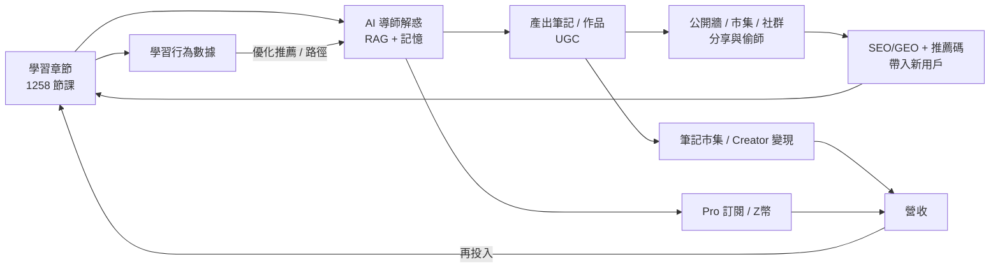

# 第五章　商業模式

> 標記慣例：`✅` 已於系統實作 / 資料庫可查；`[待補]` 待實際營運數據；`[待查證]` 外部數據待來源。定價數字取自系統設定（`src/lib/payments/config.ts`）。

## 5.1 價值主張與目標客群

**一句話定位**：AI 島是一個**以 AI 導師為核心、遊戲化驅動、繁體中文原生**的程式與 AI 學習平台，將「學習 → 練習 → 產出 → 社群 → 變現」串成一條完整閉環。

**核心價值主張**

| 對象 | 痛點 | AI 島的解法 |
|---|---|---|
| 程式初學者（主要） | 學習曲線陡、遇錯卡關無人問、易放棄 | AI 導師即時解惑（含看圖）、遊戲化維持動機、零基礎友善教材 |
| 自學進階者 | 缺乏系統路徑、練習與求職脫節 | 章節 → LeetCode → 模擬面試 → 作品 → 證書之求職閉環 |
| 非中文母語 / 海外華人 | 優質中文技術內容稀少 | 四語（中英日韓）內容、任意語言互譯 |
| 內容創作者 | 學習筆記無處變現 | 筆記公開牆 / 市集、Creator Island 創作變現 |

**目標市場（[待查證] 需補外部數據佐證）**：台灣及華語圈之線上程式教育與 AI 技能學習需求；隨生成式 AI 普及，「學會用 AI / 學會寫程式」成為跨產業剛性需求。

## 5.2 收入模式（多元、已具技術基礎）

本平台採**免費增值（Freemium）+ 多元變現**模式，各金流機制均已實作並可上線（詳第四章、第六章）：

| 收入來源 | 機制 | 狀態 |
|---|---|---|
| **Pro 訂閱** | 月 / 年方案，解鎖 AI 高階模型、更高用量、進階功能 | ✅ 已實作（`config.ts` Pro 月/年） |
| **Z 幣儲值** | 平台虛擬幣，5 種面額包，用於解鎖內容 / 功能 / 市集 | ✅ 已實作（Z幣包 5 檔） |
| **筆記市集抽成** | 使用者販售優質筆記 / 學習包，平台抽成 | ✅ 已實作（`ci_purchase_listing`） |
| **Creator Island 創作經濟** | 創作作品、市集交易、提領（果實→現金） | ✅ 交易已實作，提領人工審核 🟡 |
| **B2B / 機構授權**（未來） | 學校 / 企業內訓之團體授權 | [待補] 規劃中 |

> 誠實界定：金流技術已就緒（綠界 + 藍新已設定、`PAYMENTS_LIVE=1`），惟目前尚無真實成交訂單（`[待補]` 現況 pre-revenue）；本章描述之收入模式為**已具備收款能力、待推廣啟動**之狀態。

## 5.3 商業閉環

本平台之設計核心為一條**自我強化的閉環**：學習產生內容與數據，內容與社群吸引新用戶，AI 提升學習成效與黏著，變現回饋內容與營運。

**閉環之三個飛輪**：
1. **內容飛輪**：使用者筆記 / 作品成為平台內容（公開牆 485 則、UGC），豐富平台並經 SEO / GEO（對 AI 爬蟲開放）帶入自然流量。
2. **AI 飛輪**：學習行為數據 → 優化 AI 導師與學習路徑推薦 → 提升成效與黏著 → 更多使用與數據。
3. **變現飛輪**：訂閱 / 市集營收 → 再投入內容與功能 → 提升價值 → 更多付費。

## 5.4 定價策略

採「免費足以上手、付費提升體驗」之 Freemium：

| 方案 | 內容 | 說明 |
|---|---|---|
| 免費 | 全部教材 + AI 導師每日 10 次 + 基礎功能 | 以低成本模型 / 免費模型服務（邊際成本趨近零） |
| Pro（訂閱） | AI 高階模型、更高用量、進階功能 | 月 / 年方案（`config.ts`），年繳優惠 |
| Z 幣（儲值） | 解鎖額外測驗、市集購買、功能 | 5 種面額，彈性消費 |
| BYOK | 自帶 API 金鑰、無用量限制 | 成本轉移、服務進階用戶 |

> `[待補]` 實際各方案定價數字，由 `config.ts` 帶入正式版；定價需搭配市場測試調整。

## 5.5 成長與獲客模式（低成本、內建病毒因子）

- **推薦機制**：邀請碼註冊，雙方各得 50 Z 幣（✅ 已實作，冪等帳本）。
- **UGC + SEO/GEO**：公開筆記牆 / 部落格 / 論壇內容經動態 sitemap、9 種結構化資料、對 20+ AI 爬蟲開放，累積自然搜尋與 AI 引用流量（✅ 已實作）。
- **遊戲化留存**：島嶼 / 寵物 / Z 幣 / 每日任務 / 連續打卡提醒（web push）維持回訪。
- **零成本多語**：一份內容自動四語，擴大可觸及市場而無額外內容成本。

> 誠實界定：以上機制已實作但尚未經推廣驗證轉換率（`[待補]` 目前註冊 17 人、pre-launch）。獲客成本（CAC）待推廣後量測。

## 5.6 單位經濟框架

本平台單位經濟之結構性優勢：**變動成本（AI）具硬性上限、多語為零邊際成本、人力不隨規模成長**（詳第六章）。

- **LTV 驅動因子**：訂閱續訂率、Z 幣消費頻次、市集交易抽成、留存週期。
- **CAC 驅動因子**：推薦病毒係數、SEO/GEO 自然流量占比、遊戲化留存。
- `[待補]` LTV / CAC 之量化需實際營運數據（付費轉換率、留存曲線、ARPU），將於推廣後補齊——此為本平台目前最需補強之處，亦為補助經費用途（行銷獲客）之依據。

## 本章小結

AI 島之商業模式建立於一條**已具技術基礎的自強化閉環**：多元收入（訂閱 / Z幣 / 市集 / 創作）皆已可收款，成長仰賴內建之 UGC、推薦與零成本多語等低成本因子。當前階段之關鍵任務為**啟動推廣、驗證轉換與單位經濟**——此正是本計畫申請補助所欲加速之環節。
