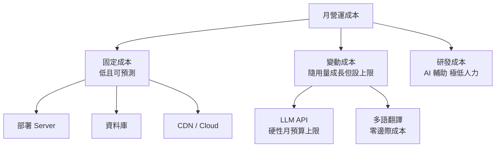

# 第六章　成本結構與財務可行性分析

> 本章成本數據分兩類：`✅` 已由系統設定 / 資料庫實查（可佐證）；`[待補]` 需補實際方案月費之項目。撰寫原則：不誇大、每筆支出說明「為什麼要花、如何隨規模變動」，而非僅列金額。

## 6.1 成本結構總覽

本平台之成本結構具備一項對新創極為關鍵之特性：**固定成本低、變動成本具硬性上限、且核心差異化功能（多語翻譯）為零邊際成本**。此結構使平台可安全對外推廣，不致因流量突增而成本失控。

| 成本類別 | 性質 | 隨規模變動 | 控制機制 |
|---|---|---|---|
| LLM API | 變動 | 隨 AI 使用量成長 | ✅ **每供應商月預算硬上限、超支自動停用** |
| 內容多語翻譯 | 近乎零 | 幾乎不變 | ✅ 使用免費翻譯端點、雜湊快取只翻異動 |
| 部署 Server | 固定 | 階梯式（擴容才增） | 單一 standalone 容器 |
| 資料庫 | 固定 / 低變動 | 隨資料量緩增 | Supabase 方案制 |
| CDN / Cloud | 固定 / 低變動 | 隨流量緩增 | 靜態資源快取 |
| 研發 / 營運人力 | 準固定 → 隨規模漸增 | 開發初期低；客服 / 校訂 / 維運隨規模上升 | AI 輔助開發 + 補助擴編 |

---

## 6.2 LLM API 成本（核心變動成本，已設硬性上限）

AI 功能為本平台之核心，其 API 呼叫為主要變動成本。本平台已實作**多層成本控制**（詳第四章 4.3），使此項成本**具月度硬性上限**（達上限之代價為服務降級，見下）。

**（一）現行系統金鑰月預算與實際支出**（✅ 「月預算上限」與「本月實際支出」為 2026-07 資料庫實查之真實數字；幣別為 USD、週期為月；`[需確認]` 預算數字為現行設定、可調整）：

| 供應商 | 月預算上限 | 本月實際支出 | 用途 |
|---|---|---|---|
| OpenRouter | US$50 | US$0 | 含多款免費模型（零成本） |
| Google Gemini | US$10 | US$0.09 | 中低階任務 |
| OpenAI | US$10 | US$0.46 | 中高階任務 |
| Groq (Llama) | US$10 | US$0.00 | 低階高速任務 |
| Anthropic | US$10 | US$2.18 | 高階推理任務 |
| **合計** | **≈ US$90（硬上限）** | **≈ US$2.7** | — |

> 關鍵事實與界線：任一金鑰達月預算即**自動停用該供應商並切換備援**，全部達上限時**服務降級為「暫時忙碌」**（`chat/route.ts:135-151`）。因此本平台單月 AI 成本**具明確上限（現行合計約 US$90）**。**須誠實說明：上限之代價是達上限時之「服務暫停」而非「服務不中斷」；且上限精確性取決於供應商計費延遲與預算維護。** 此為「成本可控、以可用性降級為代價」，而非「零風險無限服務」。

**（二）單位成本控制設計**：

- **任務分級路由**：簡單問題導向低成本模型（含 OpenRouter 免費模型），高階模型僅用於困難任務（`ai-difficulty.ts`）。
- **免費模型優先**：OpenRouter 提供多款零成本模型，可作為免費用戶之主力，使邊際成本趨近於零。
- **每人用量上限**：免費用戶每日 10 次、每月 10 萬 token（`per_user_ai_cap_migration.sql`），單一用戶無法燒穿整體預算。
- **回應快取**：相同提問直接回快取、不呼叫 API。
- **BYOK**：進階用戶可自帶金鑰，成本轉移至用戶端。
- **模型分級授權**：免費用戶不得選用高階昂貴模型（`chat/route.ts` 成本防護），高階模型保留予付費 / 自帶金鑰用戶。

**（三）規模化成本推估**（推論，`[待補]` 假設待實測校準）：試算假設——免費用戶每日上限 10 次、每月 10 萬 token 上限，且主要走低成本 / OpenRouter 免費模型（邊際成本趨近零）。在此假設下，數百名活躍免費用戶之月度 AI 成本約落於數十美元級距；且無論如何，**系統金鑰月預算硬上限（現行約 US$90）為總支出之天花板**。付費用戶則以訂閱 / 儲值覆蓋其用量。**惟以上為模型推估，實際單位成本待推廣後以真實 token / 使用頻率校準。**

---

## 6.3 部署 Server 成本（固定、低）

- **架構**：單一 Docker standalone 容器（`node server.js`），部署於 Zeabur；映像檔經 GitHub Actions 自動建置並推送至 GHCR（`.github/workflows/docker.yml`）。
- **成本性質**：固定月費，僅於水平擴容時階梯式增加。單一容器即可服務目前與初期推廣之流量。
- `[待補:需老闆填]` Zeabur 服務實際月費方案。

---

## 6.4 資料庫成本（Supabase）

- **架構**：Supabase（PostgreSQL），196 資料表、含 pgvector 向量檢索、Auth、Realtime。
- **成本性質**：方案制固定月費，隨資料量與流量緩增；目前資料規模（80 章 / 1,258 節課；**真實註冊用戶僅 17 人**，另有 seed / 匿名 session 資料，口徑見 附錄 A）尚屬輕量。
- `[待補:需老闆填]` Supabase 實際方案（Free / Pro）與月費、是否已近用量門檻。

---

## 6.5 Cloud / CDN 成本

- **架構**：靜態資源與頁面經 CDN 快取（Cloudflare），Service Worker 進一步降低重複請求。
- **成本性質**：固定 / 低變動，靜態資源快取大幅降低源站負載與流量成本。
- `[待補:需老闆填]` CDN / 網域 / 其他雲端服務月費。

---

## 6.6 多語翻譯與外部服務（零邊際成本，差異化）

- **內容翻譯**：採用 Google **非官方免費端點**（非計費 API），四語互譯目前**零邊際成本**；並以雜湊快取「只翻異動內容」降低呼叫量（`gtranslate.ts`、`content-i18n.ts`）。此為現階段之成本優勢——多語內容通常為高成本項目。
  > ⚠️ 風險與備援成本情境：該端點為**非官方服務**，存在限流 / 改版 / 商用適用性風險，且屬**機器翻譯未校**。若未來須改用**官方翻譯 API** 或**人工校訂**，多語將由「零邊際成本」轉為**具成本項目**；本計畫應保留此備援成本情境（例：官方 MT API 依字元計費、或編列校訂人力），不宜假設永久零成本。
- **交易型 Email**：Resend（✅ 已設定），依用量計費，初期量小成本極低。
- **其他**：Web Push（VAPID，✅ 已設定）自建、無第三方費用；行為分析為自建、落自有資料庫，無第三方分析訂閱費。

---

## 6.7 研發與人力成本（AI 輔助、極低人力）

本平台目前由**單一創辦人結合 AI 輔助開發**完成，此為重要之成本結構特徵，亦為技術能力之體現：

- 以 AI 編程工具大幅提升開發效率，得以單人完成一般需數人團隊之工作量（392 API 路由、196 資料表、80 章教材系統）。
- **開發人力於現階段屬準固定成本**（初期低人力）。
- `[待補:需老闆填]` AI 輔助開發工具（如 Claude Code 訂閱）月費，作為研發工具成本列示；此為「以工具成本換取人力成本」之策略，現階段總體研發成本遠低於傳統團隊。

> 誠實界定：
> - 「人力成本不隨用戶數成長」**僅對『開發』成立**；**客服、內容校訂、資安 / 法遵、營運維運等成本會隨用戶規模上升**，不宜宣稱人力完全不隨規模成長。
> - 規模化增員假設（客服 / 內容 / 維運）應於第八章人事費與里程碑中反映。
> - 單人團隊為現況、亦為風險（詳 6.8 與第八章）；補助用途之一即為擴充團隊、降低單點依賴。

---

## 6.8 成本風險與因應

| 風險 | 說明 | 因應 |
|---|---|---|
| LLM API 漲價 / 限流 | 供應商政策變動 | ✅ 多供應商架構可即時切換、無綁定 |
| AI 成本隨規模上升 | 用戶成長帶動 API 用量 | ✅ 月預算硬上限 + 免費模型優先 + 分級授權；隨營收調整 |
| 免費翻譯端點不穩 | 非官方服務、可能限流 / 改版 | 🟡 已有重試與逾時緩解；長期可評估備援方案 |
| 單人團隊 | 開發 / 維運單點依賴 | 補助用於擴編；已具備自動化部署 / 告警降低維運負擔 |
| 部署 / DB 用量門檻 | 流量成長觸及方案上限 | 階梯式擴容、成本可預期 |

---

## 6.9 小結：成本可控性與財務可行性

1. **成本可預測、有硬性上限**：最大變動成本（LLM API）已設月度硬上限（現行約 US$90）；以「達上限時服務降級」為代價換取成本可控（非零風險無限服務）。
2. **現階段零成本多語**：多語翻譯此一通常高成本之功能，目前以非官方免費端點降至零邊際成本；**惟須保留改用官方 API / 人工校訂之備援成本情境**（6.6）。
3. **初期低人力**：AI 輔助開發使**開發**成本於現階段偏低；**客服 / 內容 / 維運 / 法遵成本會隨規模上升**，已於增員假設反映。
4. **與營收正相關**：AI 成本隨付費用戶成長、且有硬上限，具健康之單位經濟基礎（實際 LTV / CAC 待營運數據驗證）。

> 待補彙整：`[待補]` Zeabur / Supabase / CDN / AI 開發工具之實際月費，將於補齊後計算「每月固定營運成本」與「每付費用戶單位成本（含服務履約之 AI 用量）」，以完成單位經濟（LTV / CAC）之量化——此部分需搭配第五章商業模式與實際營運數據。
