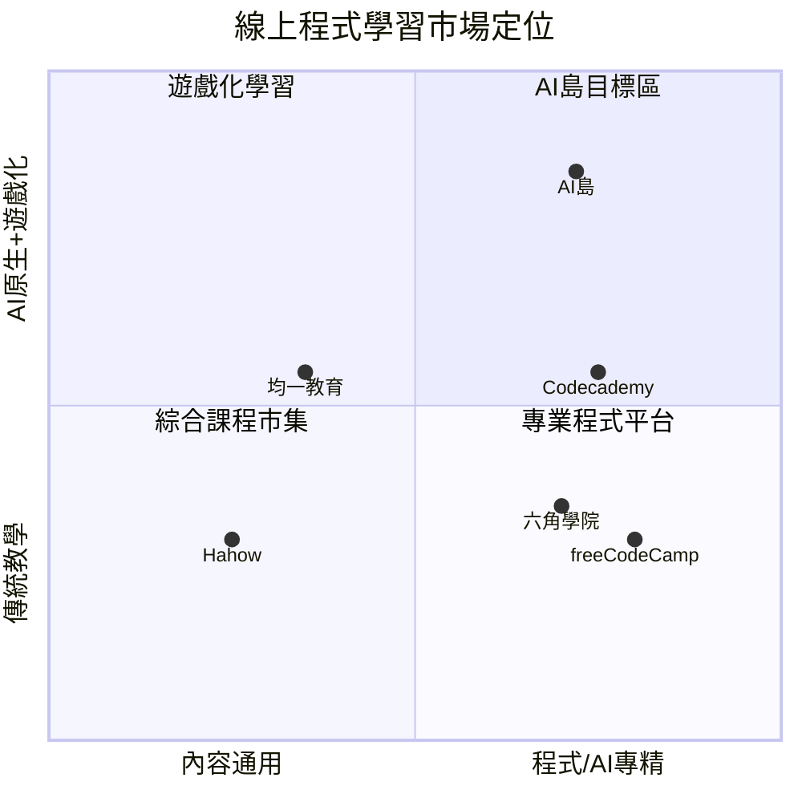

# 第七章　競品分析

> 標記慣例：`[待查證]` 表競品之具體數字（定價、用戶數、市占）需以官方或市場報告佐證，本章不臆造；競品之產品模式描述為公開可觀察之事實層級。AI 島之能力主張則以第四章程式碼佐證為據。

## 7.1 競爭格局概述

程式與 AI 技能學習市場可分為四類玩家，AI 島橫跨其優點而不落於單一象限。

> 說明：下圖為**概念示意圖**，座標係作者依產品定位之**主觀判斷**，非量化評分，用於呈現相對定位而非精確排名。

## 7.2 主要競品分析（逐一）

> ⚠️ **查證界定**：以下對各競品「缺 AI / 缺遊戲化 / 社群較弱」等之判斷，係基於 **2026-07 之公開產品觀察**，非逐項官方查證；競品功能持續更新，正式送審前須**逐項標註查證日期與來源**（部分競品可能已新增 AI 功能）。相關定性判斷一律視為 `[待查證]`。

### （一）Hahow 好學校（台灣，綜合課程市集）
- **模式**：募資開課制之綜合線上課程平台，講師錄製影音課程、學員買斷。涵蓋程式、設計、商業等多領域。
- **優勢**：品牌知名、講師陣容廣、課程品質有市場驗證、繁體中文。
- **缺點**：以「賣課」為主，缺 AI 即時導師、缺深度遊戲化、學完即止（無練習—求職閉環）、非程式專精。
- **對 AI 島**：AI 島非賣單堂課，而是「AI 陪學 + 遊戲化 + 求職閉環」的持續學習環境。

### （二）六角學院 Hexschool（台灣，程式專精）
- **模式**：以前端 / 全端程式為主，直播 + 作業 + 人工點評 + 社群。
- **優勢**：程式教學專精、作業回饋紮實、社群黏著、繁體中文在地。
- **缺點**：仰賴人工點評（規模化受限於師資）、缺 AI 即時 24 小時解惑、遊戲化與多語不足。
- **對 AI 島**：AI 導師以 24/7、零邊際成本提供即時解惑與因材施教，突破人工師資之規模瓶頸。

### （三）均一教育平台 Junyi（台灣，K12 公益適性學習）
- **模式**：非營利、免費，K12 適性化學習（數學為主），有能力點與進度追蹤。
- **優勢**：適性學習成熟、公益形象、政府與學校採用廣。
- **缺點**：聚焦 K12 學科、非程式 / AI 職涯導向、無變現與創作生態。
- **對 AI 島**：AI 島聚焦「程式 / AI 職涯技能 + 求職閉環 + 創作變現」，客群與目的不同，但其適性學習理念可借鏡。

### （四）Codecademy（國際，互動式程式平台）
- **模式**：瀏覽器內互動式寫程式練習 + 訂閱制，近年加入 AI 學習輔助。
- **優勢**：互動式練習體驗佳、路徑清晰、國際品牌、已導入 AI 功能。
- **缺點**：**以英文為主**、對華語初學者門檻高；遊戲化與社群 UGC 較弱；價格對台灣用戶偏高 `[待查證]`。
- **對 AI 島**：AI 島以**繁中原生 + 四語互譯**服務華語圈，且遊戲化與 UGC 生態更深。

### （五）freeCodeCamp（國際，免費開源）
- **模式**：完全免費、開源、專案導向認證，龐大英文社群。
- **優勢**：免費、內容扎實、專案 + 認證、社群規模大。
- **缺點**：英文、純自學（無 AI 即時導師、無遊戲化動機設計）、易半途放棄。
- **對 AI 島**：AI 島以 AI 陪伴 + 遊戲化解決「自學易放棄」痛點，並提供在地化中文體驗。

### （六）通用 AI 聊天機器人（ChatGPT / Claude 等，替代性威脅）
- **模式**：學習者直接用通用 AI 問程式問題。
- **優勢**：能力強、即時。
- **缺點**：無結構化課程路徑、無進度 / 成效追蹤、無遊戲化動機、無社群、無求職閉環；學習者需自行組織。
- **對 AI 島**：AI 島將通用 AI 之能力**產品化於結構化學習情境**（RAG 綁教材、記憶追蹤學習狀態、路徑推薦、遊戲化留存），提供通用聊天機器人無法提供的**系統化學習成效**。

## 7.3 綜合比較

| 維度 | Hahow | 六角學院 | 均一 | Codecademy | freeCodeCamp | **AI 島** |
|---|---|---|---|---|---|---|
| 程式 / AI 專精 | △ | ✔ | ✘ | ✔ | ✔ | ✔ |
| AI 原生導師（RAG+記憶） | ✘ | ✘ | △ | △ | ✘ | **✔ 核心** |
| 深度遊戲化 | ✘ | △ | △ | △ | ✘ | **✔ 島嶼/寵物/Z幣** |
| UGC / 筆記生態 | ✘ | △ | ✘ | ✘ | △ | **✔ 公開牆/市集** |
| 多語（零成本） | ✘ | ✘ | ✘ | ✘ | ✘ | **✔ 四語互譯** |
| 求職閉環 | ✘ | △ | ✘ | △ | △ | **✔ 課→練→面試→證書** |
| 繁中在地 | ✔ | ✔ | ✔ | ✘ | ✘ | **✔** |
| 收費模式 | 買斷課程 | 訂閱/課程 | 免費公益 | 訂閱 | 免費 | Freemium+多元 |

> 說明：✔ 具備、△ 部分 / 較弱、✘ 無。競品欄位為公開可觀察之產品層級判斷；量化比較（定價 / 用戶數）另需 `[待查證]` 市場資料。

## 7.4 AI 島之定位與差異化

**定位**：面向華語圈的**「AI 原生 × 遊戲化 × 求職導向」程式與 AI 學習平台**。

**差異化組合（單一競品皆未全包）**：
1. **AI 原生**：非「加掛 AI 功能」，而是 AI 導師 + RAG 教材檢索 + 跨對話記憶深度整合於學習流程（第四章佐證）。
2. **深度遊戲化**：3D 島嶼、寵物、虛擬經濟、每日任務——以動機設計對抗「自學易放棄」。
3. **UGC 內容飛輪**：學習筆記可成為平台內容與 SEO/GEO 流量來源（機制已建置、待真實用戶啟動）。
4. **零成本多語**：一份內容自動四語，現階段市場擴張無內容成本（機器翻譯 / 非官方端點，具備援成本情境，見 ch6）。
5. **求職閉環**：課程 → LeetCode → 模擬面試 → 作品 → 證書 → 履歷路徑已建置（成效待累積）。

## 7.5 潛在優勢與進入障礙（尚未形成市場護城河）

> 界定：目前用戶 17、營收 0，**市場護城河（網路效應 / 規模）尚未形成**；以下為**潛在優勢與結構性條件**，須靠用戶規模驗證後方能稱護城河。

- **技術潛在優勢**：自建多供應商 LLM 閘道、pgvector RAG、成本控制工程——具整合深度、短期不易複製。
- **內容 / 數據潛在優勢**：UGC 飛輪 + 學習行為數據**機制已建置**，可隨規模自我強化（尚待真實用戶啟動）。
- **成本潛在優勢**：現階段零成本多語 + AI 成本硬上限 + 初期低人力，使單位經濟具結構性優勢（實際數字待驗證）。
- **在地潛在優勢**：繁中原生 + 四語，切入國際平台服務不足之華語圈。

## 本章小結

程式學習市場既有玩家各有所長。依 2026-07 之公開觀察，**尚未見有單一競品同時具備「AI 原生導師 + 深度遊戲化 + UGC 生態 + 零成本多語 + 求職閉環 + 繁中在地」之完整組合**（此為排他性主張，須以完整競品盤點表逐項查證，現標 `[待查證]`）。AI 島之差異化不在單點功能，而在此一整合體驗與其背後之工程與成本結構條件。
