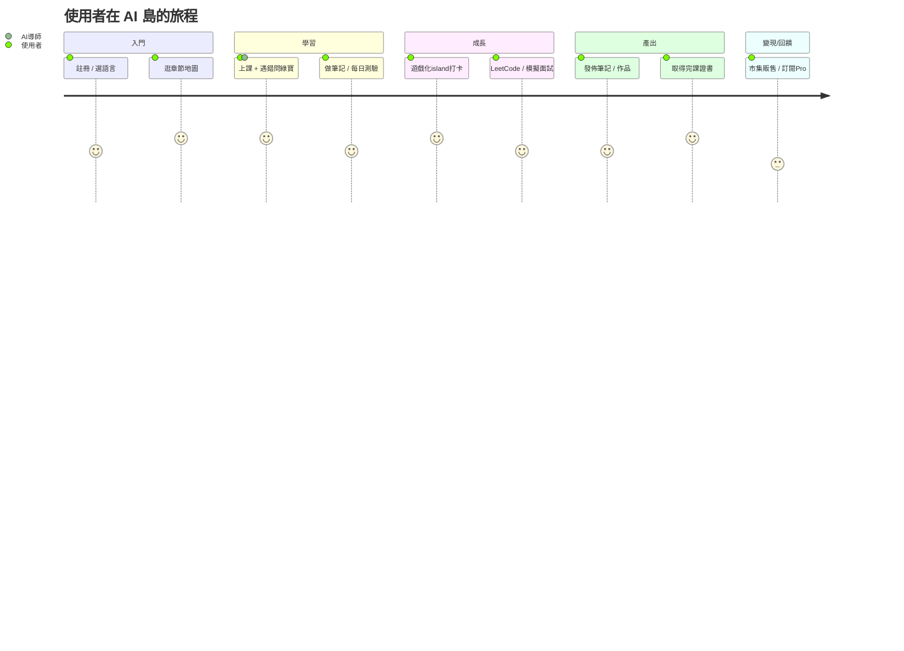
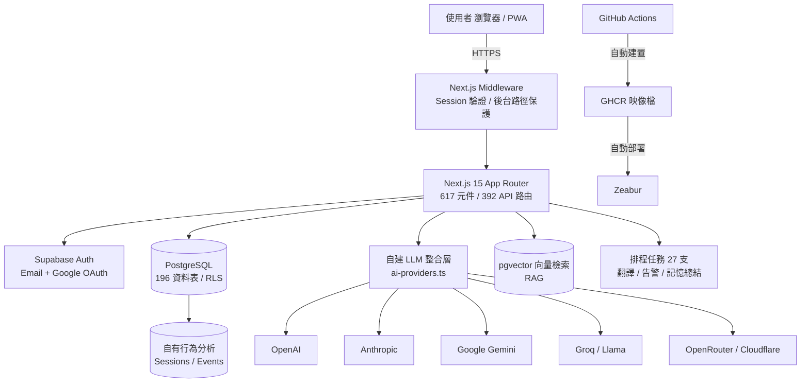
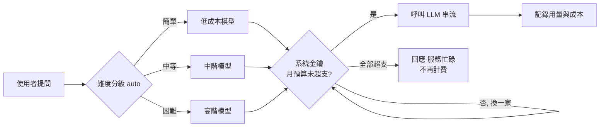
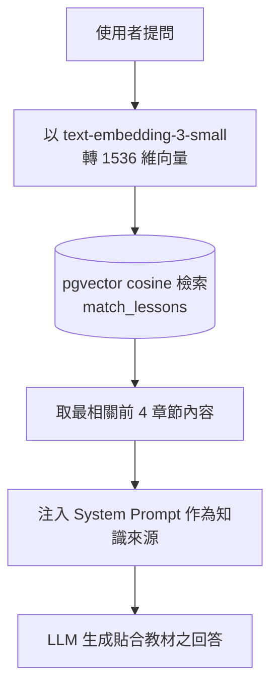
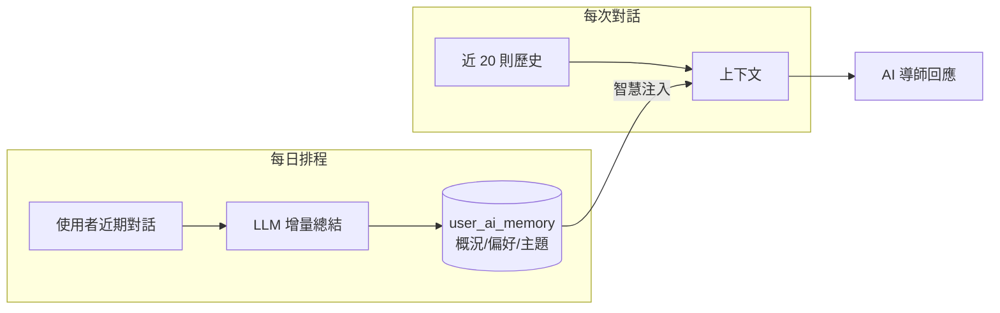
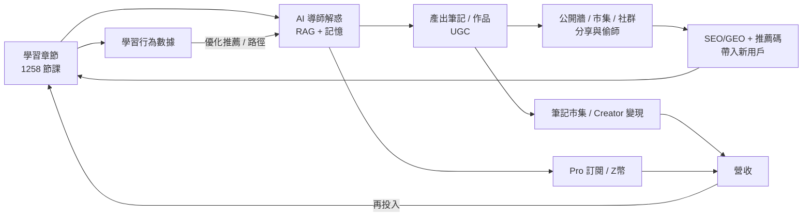
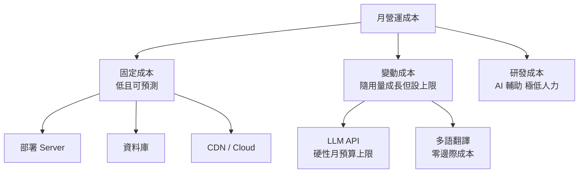
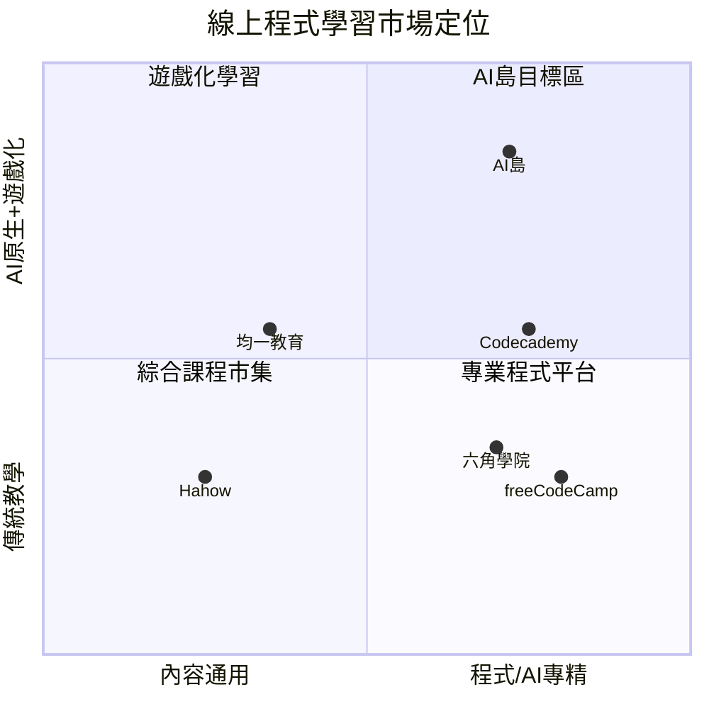
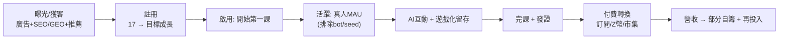

# AI 島（ai-island-web）數位服務創新補助計畫書

> **合併版初稿**（由 `scripts/build-full-plan.mjs` 自九章合併）。標記：`✅` 已驗證 / `🟡` 半成品 / `[待補]` 待補內部數據 / `[待查證]` 待補外部來源 / `[需確認]` 待申請人確認。
> 內部工作檔（不送審）：現況口徑見附錄 A、技術事實庫見 `docs/grant/tech-inventory.md`。

## 目錄
1. 執行摘要
2. 市場痛點與機會
3. 產品介紹
4. 技術架構與核心技術
5. 商業模式
6. 成本結構與財務可行性
7. 競品分析
8. 經費需求與運用
9. 關鍵績效指標（KPI）
- 附錄 A：統一現況口徑與誠實界定

---

# 第一章　執行摘要

> 一頁式摘要。標記慣例：`[待補]` 待補內部數據、`[需確認]` 待申請人確認之經費 / 目標。撰寫視角：面向數位產業署「數位服務創新補助計畫（AI 核心數位服務）」評審。

## 計畫一句話

**AI 島**是一個以 **AI 導師為核心、遊戲化驅動、繁體中文原生**的程式與 AI 學習服務平台，將「學習 → AI 陪練 → 產出 → 社群 → 求職 / 變現」串為完整閉環，解決線上學習「學不完、學不會」之核心痛點。

## 解決什麼問題

線上學習市場需求龐大（全球 EdTech 2025 年達 US$404B、台灣軟體人才長年供不應求；數據與原始來源詳第二章），但既有服務之最大痛點為**極低完課率**——《Science》(2019) 對 565 門 MIT/Harvard MOOC 之研究顯示完課率僅 **3.13%**、且 **52% 註冊者從未開始**——根因為缺乏即時協助、動機設計與社群陪伴。AI 島以「AI 24/7 即時解惑 + 遊戲化動機 + 社群陪伴 + 求職閉環」直接對應此四大缺口。

## 為什麼是現在

- **生成式 AI 普及臨界點**：台灣 46% 消費者、18–25 歲族群 69% 已使用生成式 AI（資策會 MIC 2025），學習型 AI 應用正逢需求爆發。
- **人才缺口擴大**：軟體職缺供需比僅 0.36（104，2025），培育就業力人才之需求持續且龐大。
- **技術成熟**：LLM 能力已足以支撐高品質 AI 導師，且本平台已完成整合並上線。

## 核心創新

1. **自建多供應商 LLM 整合層**：對接 6 家 LLM，含串流、多模態、自動容錯、pgvector RAG、跨對話記憶、成本硬上限控制（第四章佐證）。
2. **零成本多語內容管線**：中英日韓任意語言互譯、多語擴張零邊際成本（採 Google **非官方免費端點**、屬**機器翻譯未經人工校對**，具穩定性 / 商用適用性風險，已以重試 + 快取緩解）。
3. **深度遊戲化 + 求職閉環**：以動機設計對抗高流失，並將學習成效導向就業。
4. **AI 成本可控之可規模化架構**：AI 成本具月度硬上限，具備安全推廣與規模化條件。

- **已上線運行（技術面）**：80 章 / 1,258 節課、196 資料表、392 API、四語介面，金流已可收款（綠界 + 藍新）（✅ 資料庫實查）。
- **誠實揭露現況（pre-launch / pre-revenue）**：截至 2026-07，**真實註冊用戶 17 人、真人回訪活躍約 4 人、營收為 0**（付費訂單 0、訂閱 0；金流已可收款但尚無成交）；完課證書 0。**產品完整度高、但用戶與營收規模尚未建立**——此為本計畫申請補助所欲加速之核心缺口（統一口徑見 ch0）。
- **本計畫目標**：以補助加速「AI 核心數位服務之研發深化」與「市場推廣與用戶規模化」，於 2 年內建立可驗證之獲客→活躍→完課→付費漏斗（第九章 KPI）。

## 經費訴求（摘要）

申請「數位服務創新補助計畫」，計畫期程 `[待查證:依當年度公告，最長 2 年]`、申請補助金額 `[需確認]`。經費規模將與**單人團隊之執行量能、擬聘研發人力、以及自籌來源**連動編列（建議務實區間 300–800 萬元、聚焦特定研發項目），避免規模與量能失衡（第八章明細，含補助款 / 自籌款 / 各科目金額）。

## 為什麼評審應支持

本計畫非概念提案，而是**已上線、可即時 demo、具工程深度**之數位服務；符合補助「AI 核心數位服務」範疇，具明確市場痛點、差異化解法與可控之成本結構，且申請人以 AI 輔助開發展現高效率之研發能量。補助將實質加速其由「完整產品」邁向「規模化服務」之關鍵一哩路。

---

# 第二章　市場痛點與機會

> 本章依 spec 要求「使用市場數據並引用資料來源」。所有外部數據均標註來源與年份；`[待查證]` 表數字需以最新原始報告再確認。撰寫原則：不臆造市場數字。
>
> ✅ **來源已升級為原始 / 官方出處**：核心數字現引用 HolonIQ 官方、資策會 MIC 官方新聞稿（含調查方法）、國家發展委員會官方報告、104 人才報告書、以及《Science》(2019) MOOC 完課率學術原文（詳章末）。少數仍為二手者已標 `[待查證]` 待換。

## 2.1 市場機會：龐大且成長的數位學習需求

- **全球教育科技市場規模（原始來源）**：HolonIQ 預估**全球 EdTech 支出於 2025 年達 US$404B**（2019–2025 年 CAGR 16.3%、成長 2.5 倍），占 2025 年全球教育市場（US$7.3T）之 5.2%〔原始來源：HolonIQ 官方，Global EdTech Market to Reach $404B by 2025〕。
- **生成式 AI 加速普及，年輕族群為主力（原始來源，含調查方法）**：資策會產業情報研究所（MIC）調查——**46% 消費者曾使用生成式 AI 工具**（年成長約一成），**18–25 歲族群達 69%**；付費結構為企業付費 22% / 機構 13% / 自行付費 17%（未付費 68%）；**程式碼生成用途占 25%**。調查時間 2024 Q4、網路調查、有效樣本 1,068 份、95% 信心水準下抽樣誤差 ±3.0%〔原始來源：資策會 MIC 官方新聞稿 id=726〕。
- **台灣線上學習市場規模**：`[待查證]` 尚缺近年可引用之官方數字；資策會 MIC 早期《數位學習產值調查》曾估千億量級，惟年代久遠，正式版須以最新原始報告替換或改採全球 EdTech + 台灣人才 / AI 數據佐證。

> 洞察：生成式 AI 的普及使「學會用 AI、學會寫程式」由小眾技能轉為跨世代之剛性需求，而最積極的使用族群（18–25 歲）正是本平台之核心客群。

## 2.2 人才供需嚴重失衡：需求遠大於供給

- **長期結構性缺口（政府原始來源）**：國家發展委員會《重點產業人才供需調查及推估》指出，「軟體」為重點產業欠缺人才之主要職類（占約 10.2%）；面對各產業 AI 數位轉型，**至 2030 年資通訊相關人力需求預估年均成長約 4.4%（約每年增加 1.2 萬人）**〔原始來源：國家發展委員會 產業人力供需資訊網 / 重點產業人才供需調查及推估報告〕。
- **軟體職缺供不應求（產業原始報告）**：104《2025 科技業人才報告書》指出，科技業「軟體 / 工程類」職缺**平均一個工作機會僅約 0.36 個求職者**（需求遠大於供給）〔原始來源：104 人力銀行 2025 科技業人才報告書〕。
- **月缺口量級（二手，待換原始）**：科技業每月人才缺口達約 19.3 萬人、軟體及網路業約 6.3 萬人最多〔來源：104 / 今周刊 2026，`[待查證]` 待換 104 原始報告數字〕。

> 洞察：軟體人才長期供不應求，代表「培育具就業力之程式 / AI 人才」具持續且龐大的市場需求——此為本平台「學習—求職閉環」定位之市場基礎。

## 2.3 核心痛點：線上學習「學不完、學不會」

需求龐大，但既有線上學習之最大痛點在於**極低的完課率**與**缺乏有效陪伴**：

- **完課率危機（學術原始來源）**：Reich & Ruipérez-Valiente 於《**Science**》(2019) 分析 MIT 與 Harvard 經 edX 開設之 **565 門 MOOC、6.5 年、1,267 萬筆註冊**，發現整體完課率**僅 3.13%（2017–18）**，且自 2013–14 的近 6% **逐年下滑**；即使是「付費取得認證」之學習者，完課率同樣未見提升〔原始來源：Reich, J. & Ruipérez-Valiente, J.A. (2019), "The MOOC pivot", Science 363(6423)〕。
- **過半註冊者從未開始**：同研究指出，**52% 註冊者從未真正開始課程**〔原始來源：同上〕。
- **業界常引用區間**：一般常見引述之 MOOC 完課率約 5–15%〔來源：多份業界統整報告，`[待查證]` 待補原始出處〕。
- **社群 / 付費有助完成（待查證）**：業界統整指有活躍社群討論、或為認證付費之課程完課率較高〔來源：業界統整，`[待查證]` 待補學術 / 原始來源〕。

> 洞察：權威研究證實 MOOC 完課率極低且長年未改善，根因指向「缺乏即時協助、動機設計與陪伴」。凡能提供**即時解惑、遊戲化動機、社群互動、明確目標（證書 / 求職）** 者，理論上有助提升完成率——此為本平台之設計主軸，惟其實際成效待本產品試辦驗證（見 2.5）。

## 2.4 痛點—解法對應

| 市場痛點 | 數據佐證 | AI 島之對應解法 |
|---|---|---|
| 學習遇錯卡關、無人即時解答 | MOOC 完課率僅 3.13%（Science 2019） | AI 導師 24/7 即時解惑（含看圖）、RAG 綁教材 |
| 缺乏動機、易半途放棄 | 52% 註冊者從未開始（Science 2019） | 遊戲化（島嶼 / 寵物 / Z幣 / 每日任務）維持動機 |
| 缺乏社群陪伴 | 社群有助完成〔`[待查證]`〕 | 論壇 / 筆記公開牆 / 協作，建立學習社群 |
| 學習與求職脫節 | 軟體人才長年供不應求（供需比 0.36，104 2025） | 課程→練習→模擬面試→證書→履歷之求職閉環 |
| 中文優質技術內容稀缺 | `[待查證]` 待補來源 | 繁中原生 + 四語互譯，服務華語圈（翻譯為機器翻譯未校、採非官方端點） |
| 年輕族群偏好 AI 互動學習 | 18–25 歲 69% 用過生成式 AI | AI 原生學習體驗，貼合世代習慣 |

## 2.5 論述界線與本產品驗證缺口（誠實揭露）

- **因果強度界定**：上述外部研究**支持「即時協助 / 動機設計 / 社群陪伴 / 明確目標可提升完課率」此一方向**，惟此為業界研究之**間接推論**，**尚無 AI 島自身之實測數據**佐證其解法之成效。
- **試辦驗證計畫（pilot）**：本計畫將建立可驗證之成效證據——(1) 以現況完課率為基準；(2) 招募 N 名真實用戶進行試辦；(3) 設對照 / 追蹤（有無 AI 導師、有無遊戲化）；(4) 按季驗證完課率、留存、AI 互動與學習成效。此為第九章 KPI「完課率」旗艦指標之達成路徑。

## 本章小結

台灣及華語圈存在**龐大且成長的數位學習需求**與**嚴重的軟體人才缺口**，但既有線上學習受制於**極低完課率**此一核心痛點。外部數據**支持此一方向**：即時協助、動機設計、社群陪伴、明確目標有助提升學習成效——AI 島正是圍繞此四點提出解法；其實際成效將以本產品之試辦驗證（2.5）證明，而非僅憑外部推論。市場需求真實、痛點明確、解法對應，成效待驗證。

---

### 引用來源

**原始 / 官方來源（可直接引用）**
- HolonIQ（官方）— Global EdTech Market to Reach $404B by 2025：https://www.holoniq.com/notes/global-education-technology-market-to-reach-404b-by-2025
- 資策會產業情報研究所 MIC（官方新聞稿）— 生成式 AI 調查（2024 Q4，樣本 1,068，±3.0%）：https://mic.iii.org.tw/news.aspx?id=726
- 國家發展委員會（官方）— 產業人力供需資訊網 / 重點產業人才供需調查及推估：https://theme.ndc.gov.tw/manpower/ ；112–114 年報告：https://ws.ndc.gov.tw/001/administrator/18/relfile/6037/9724/67c3b6cd-60ce-476a-9fb1-2684089567c8.pdf
- 104 人力銀行 — 2025 科技業人才報告書（供需比 0.36）：https://blog.104.com.tw/2025-tech-talent-report-hr-2/
- Reich, J. & Ruipérez-Valiente, J.A. (2019), "The MOOC pivot", **Science** 363(6423):130-131（MOOC 完課率 3.13%、52% 未開始）：https://www.science.org/doi/10.1126/science.aav7958

**二手 / 待換原始來源（`[待查證]`）**
- 台灣科技業月缺口 19.3 萬 / 軟體 6.3 萬（今周刊 2026）：https://www.businesstoday.com.tw/article/category/183034/post/202604280023/
- MOOC 5–15% 區間、社群 / 付費有助完成（業界統整）：https://www.skillademia.com/statistics/online-course-completion-statistics/
- 台灣線上學習市場規模（資策會早期調查，年代久遠）：https://crossing.cw.com.tw/article/10485

---

# 第三章　產品介紹

> 本章需配圖。文中以 `【截圖：說明｜擷取頁面】` 標示待插入之實際畫面，對應之拍攝清單見章末附錄。
>
> ⚠️ **成熟度分層界定**：本章功能分三層標示——`✅ 已上線`（生產環境可運行）、`🟡 半成品`（部分實作 / 進度存本機 / stub）、`⚠️ 紅線`（demo 時避免展示、詳 `tech-inventory.md`）。**避免「全站皆已上線」之概括**。現況用戶 / 營收口徑一律依 ch0（pre-launch / pre-revenue、註冊 17、營收 0）。

## 3.1 產品概觀

AI 島（ai-island-web.snowrealm.pet）是一個**繁體中文原生、以 AI 導師為核心、遊戲化驅動**的程式與 AI 學習平台。使用者在此不只是「看課」，而是進入一個「學習 → AI 陪練 → 產出筆記 / 作品 → 社群分享 → 求職 / 變現」的完整島嶼世界。

【截圖：平台首頁全景（英雄區 + 章節地圖 + 遊戲化入口）｜擷取 `/`】

平台目前規模（✅ 資料庫實查）：**80 章、1,258 節課程、374 題測驗題庫、196 張資料表、392 支 API**，四語（中 / 英 / 日 / 韓）介面與內容。

## 3.2 核心功能模組

### （一）結構化課程系統
80 章、1,258 節，涵蓋程式基礎到 AI 工程，零基礎友善（術語中英對照、生活化比喻）。內容以資料庫驅動、可即時更新，並提供離線儲存（PWA）。
> 誠實界定：教材**多為 AI 輔助生成、持續人工校訂中**，非「專家審訂」；內容品質校訂為補助委外項目之一（見 ch8）。

【截圖：章節列表頁 + 單一課程內容（含可執行程式碼區塊）｜擷取 `/chapters` 與 `/chapters/26`】

### （二）AI 導師「綠寶」（核心差異化）
24 小時即時解惑，可貼截圖問問題（多模態），回答貼合平台教材（RAG 檢索）、記得使用者學習狀態（跨對話記憶），11 種教學人格可切換。

【截圖：AI 導師對話介面（含貼圖提問與串流回答）｜擷取任一課程頁開啟綠寶】

### （三）筆記系統（差異化重點）
自製便利貼式筆記，支援 3 層知識樹、拖曳分類、間隔複習（SRS）、區塊引用、多人即時協作，並可發佈至公開牆或於市集販售。

【截圖：我的筆記牆（便利貼 + 知識樹側欄）｜擷取 `/me/notes`】
【截圖：筆記公開牆｜擷取 `/notes/public`】

### （四）每日測驗與 LeetCode 練習
每日 8 題自適應難度測驗（ELO 演算法，✅ 已上線），題源含課程測驗與繁中程式題庫；另整合 LeetCode **題目清單與自報解題追蹤**（🟡 為外連 leetcode.com + 使用者自報已解，**站內無自動判題**，非線上評測平台）。

【截圖：每日測驗作答介面｜擷取 `/me/quiz`】

### （五）遊戲化世界（島嶼 / 寵物 / 虛擬經濟）
3D 島嶼可自由走動、釣魚、蓋房、與村民互動（✅ 前端互動已上線）；AI 寵物可對話陪伴（✅ 真串 AI）；Z 幣虛擬經濟串連學習獎勵與消費（✅ 發幣為伺服器端原子操作）。以動機設計對抗「自學易放棄」。
> 🟡/⚠️ 誠實界定：島嶼進度 / 庫存為**本機（localStorage）儲存**（換裝置歸零、非雲端存檔）；釣魚 / 兌換發幣目前**信任前端申報、存已識別刷幣面**，伺服器權威事件驗證與去重**待強化**（demo 紅線，勿開 devtools 展示）。

【截圖：3D 島嶼場景｜擷取 `/island`】
【截圖：AI 寵物互動｜擷取寵物面板】

### （六）求職閉環
課程 → LeetCode → 模擬面試 → 作品集 → 完課證書 → 履歷，一站式職涯路徑，各環節以真實學習數據串接。
> 誠實界定：此為**功能路徑已建置**（✅ 各頁真實查詢學習數據）；惟**實際使用成效尚未驗證**——現況完課證書發出 0、LeetCode 為外連自報（非站內判題）。應區分「路徑已完成」與「成效待累積」。

【截圖：職涯路徑頁（五關進度）｜擷取 `/me/career-path`】
【截圖：完課證書｜擷取 `/certificates/[code]`】

### （七）社群與內容生態
論壇、部落格（tiptap 全功能編輯器、即時協作）、筆記公開牆等 UGC 機制**已建置**（✅），可帶動 SEO / GEO 流量。
> 誠實界定：目前站上之公開筆記（485 則）與論壇串多為**種子 / 示範 / AI 住民內容（來自少數帳號）**，**非自然用戶產出**；「UGC 內容飛輪」為**機制已備、待真實用戶啟動**，不作為現有 traction（口徑見 ch0）。

【截圖：論壇 / 部落格頁｜擷取 `/forum` 與 `/blogs`】

### （八）多語系（零成本四語）
一鍵切換中 / 英 / 日 / 韓，介面與內容自動翻譯，海外華人與非中文母語者亦可使用（✅ 已上線）。
> 誠實界定：內容翻譯採 **Google 非官方免費端點**、屬**機器翻譯未經人工校對**；具穩定性 / 商用適用性風險（已以重試 + 快取緩解）。

【截圖：語言切換前後對照｜擷取任一頁切換語言】

### （九）Creator Island（第二產品線）
創作者可於島上建立工作室、以 AI 協作產出作品、於市集交易，形成創作變現生態。

【截圖：Creator Island 工作室 / 市集｜擷取 `/creator-island`】

## 3.3 使用者旅程

## 3.4 產品現況與技術成熟度

- **核心功能已上線**：課程、AI 導師、筆記、測驗、社群、多語、部署 / 維運等**核心路徑為生產環境實際運行**（非原型），可即時 demo。
- **半成品 / 紅線分層**：島嶼經濟（localStorage / 刷幣面）、Creator Island 提領（未接金流）、家譜（不存在）等屬半成品或 demo 紅線（詳 `tech-inventory.md`），**不宜概括為「全站皆已完成」**。
- **自動化維運**：CI/CD 全自動部署、主動營運告警、自有行為分析（詳第四章、第六章）。
- **現況界定（誠實）**：處於 **pre-launch / pre-revenue** 階段——**真實註冊用戶 17 人、營收 0**（口徑見 ch0）；產品完整度高但用戶規模尚未建立，本計畫旨在加速推廣與規模化。

---

## 附錄：截圖清單與狀態

> 已自動擷取之公開頁存於 `docs/grant/screenshots/`（桌機 `-desktop` + 手機 `-mobile` 各一，凸顯 RWD）。
> 需登入之頁面須由本人登入後自行擷取（建議用乾淨的示範帳號；擷取時避開 `tech-inventory.md` 之 Demo 紅線）。

| # | 畫面 | 頁面 URL | 狀態 | 重點 |
|---|---|---|---|---|
| 1 | 首頁全景 | `/` | ✅ 已擷取 | 英雄區、核心夥伴、冒險地圖 |
| 2 | 章節列表 | `/chapters` | ✅ 已擷取 | 80 章規模感 |
| 3 | 課程內容 | `/chapters/26` | ✅ 已擷取 | 可執行程式碼區塊、零基礎友善 |
| 6 | 筆記公開牆 | `/notes/public` | ✅ 已擷取 | UGC 生態 |
| 11a | 論壇 | `/forum` | ✅ 已擷取 | 社群 |
| 11b | 部落格 | `/blogs` | ✅ 已擷取 | 內容社群 |
| 4 | AI 導師對話 | 課程頁開綠寶 | ⬜ 需登入自拍 | 貼圖提問 + 串流回答 |
| 5 | 我的筆記 | `/me/notes` | ⬜ 需登入自拍 | 便利貼 + 3 層知識樹 |
| 7 | 每日測驗 | `/me/quiz` | ⬜ 需登入自拍 | 自適應難度 |
| 8 | 3D 島嶼 | `/island` | ⬜ 需登入自拍 | 遊戲化沉浸感 |
| 9 | 職涯路徑 | `/me/career-path` | ⬜ 需登入自拍 | 求職閉環五關 |
| 10 | 完課證書 | `/certificates/[code]` | ⬜ 需登入自拍 | 自動發證 |
| 12 | 語言切換 | 任一頁 | ⬜ 需登入自拍 | 四語對照 |
| 13 | Creator Island | `/creator-island` | ⬜ 需登入自拍 | 第二產品線 |

> 重新擷取公開頁：`node scripts/grant-screenshots.mjs`。若要抓需登入頁，可連接 Claude Chrome 擴充或本人手動擷取。

> ⚠️ Demo / 截圖紅線（見 `tech-inventory.md`）：勿展示提領入帳、勿開 devtools 談防刷、勿承諾家譜功能、島嶼進度為本機儲存。

---

# 第四章　技術架構與核心技術

> 本章所有技術主張均以實際運行之原始碼為據，關鍵處標註 `檔案:行號` 供查證；標記慣例：`✅` 已驗證可運行、`🟡` 部分實作、`[待補]` 待補內部數據。撰寫原則：不誇大、不編造、每一主張可回溯至程式碼。

## 4.1 技術架構總覽

本平台採前後端整合之全端架構，以 Next.js 15（App Router）為應用框架、Supabase（PostgreSQL）為資料與驗證核心、Zeabur 為部署環境，並自建一套多供應商大型語言模型（LLM）整合層作為 AI 能力中樞。系統以「單一程式庫、伺服器端運算優先、資料庫層安全」為設計原則。

**技術堆疊摘要**

| 層級 | 技術 | 佐證 |
|---|---|---|
| 前端框架 | Next.js 15 + React 19（App Router、standalone 輸出） | `next.config.mjs:13` |
| 後端 / 資料 | Supabase（PostgreSQL 196 表、178 個 migration、RLS 191 表啟用） | `supabase/*.sql` |
| AI 整合 | 自建多供應商 LLM 閘道（6 家協定，原生實作） | `src/lib/ai-providers.ts` |
| 語意檢索 | pgvector（1536 維、ivfflat cosine 索引） | `supabase/ai_embeddings_migration.sql:6` |
| 部署 | Docker standalone → GHCR → Zeabur（CI/CD 全自動） | `.github/workflows/docker.yml` |
| 多語 | next-intl（介面）＋ 自建零成本內容翻譯管線（四語互譯，機器翻譯 / 非官方端點） | `src/lib/gtranslate.ts` |

> 佐證說明：本表部分列為**檔案 / 目錄層級**佐證（如 `supabase/*.sql`、`ai-providers.ts`）；各能力之精確行號見後續各節與 `tech-inventory.md`。凡以 glob 佐證者，查證方法為於 repo 執行對應 grep（如 `grep "create table" supabase/*.sql`）。

---

## 4.2 AI 核心：自建多供應商 LLM 整合層

本平台之 AI 能力並非單純呼叫單一廠商 API，而是自行實作一套**供應商中立（vendor-neutral）的統一整合層**，以原生 HTTP 對接六家 LLM 供應商協定：OpenAI、Anthropic、Google Gemini、Groq（Llama）、OpenRouter、Cloudflare Workers AI（`src/lib/ai-providers.ts`）。

此設計之技術價值：

1. **供應商可替換、無綁定風險**：任一供應商漲價、限流或停用，可即時切換，不影響服務。
2. **成本最佳化**：可依任務難度與價格，動態選擇最合適之模型（詳 4.3）。
3. **統一介面**：串流回應、圖片多模態、工具呼叫（function calling）等能力，於各供應商間以一致介面封裝。

**已實作之核心能力**

| 能力 | 說明 | 佐證 |
|---|---|---|
| 串流回應（SSE） | 逐字輸出，各供應商 SSE 格式各自解析 | `ai-providers.ts:403/464/533` ✅ |
| 圖片多模態 | 使用者可貼上截圖，AI 讀圖作答（最多 5 張） | `ai-providers.ts:73/144/254` ✅ |
| 自動容錯備援 | 主模型逾額 / 錯誤時，自動跨供應商重試（最多 6 次） | `ai-providers.ts:341` ✅ |
| 熔斷器 | 供應商連續失敗時暫時停用、冷卻後恢復 | `resolve-usage-ai.ts:75` ✅ |
| 工具呼叫（限定範圍） | Anthropic 多輪 tool-use loop、11 個特定工具，用於**管理 bot 查詢營運數據**（非通用 agent） | `line-ai-tools.ts:429` ✅ |
| Prompt 快取 | 穩定前綴設快取斷點，降低重複 token 成本 | `ai-providers.ts:175` ✅ |

> **誠實界定**：本平台為 LLM 之**應用整合**，非自行訓練基礎模型。技術投入在於整合層、路由、檢索、記憶與成本控制之工程，而非模型研發。

---

## 4.3 智慧路由與 AI 成本控制機制

考量 LLM API 之邊際成本，本平台實作**多層成本控制**，確保營運成本可預測、不隨使用量失控——此為面向規模化營運之關鍵工程設計。

**（一）任務難度路由**：`auto` 模式以規則式難度分級器（關鍵字加權）將提問分為低 / 中 / 高三級，簡單問題導向低成本模型，困難問題方使用高階模型（`ai-difficulty.ts:8`，接於 `chat/route.ts:58`）。

> 誠實界定：此為**規則式**啟發路由，非機器學習模型，惟已實際接於生產路徑並有效分流成本。

**（二）多層用量上限**（皆已驗證運行）：

| 層級 | 限制 | 佐證 |
|---|---|---|
| 存取控制 | AI 功能需登入，杜絕匿名濫用 | `chat/route.ts:34` |
| 每分鐘頻率 | 60 次 / 分 / 人 | `chat/route.ts:37` |
| 每日免費額度 | 免費 10 次 / 日、Premium 100 次 / 日 | `ai_migration.sql:19-20` |
| 對話串月配額 | 免費 10 串 / 月 | `chat/route.ts:157` |
| 每人月 token 上限 | 免費 10 萬 / 月、Premium 50 萬 / 月 | `per_user_ai_cap_migration.sql:5` |
| **系統金鑰月預算** | **每供應商設硬上限，超支自動停用該金鑰** | `chat/route.ts:135-151` |
| 回應快取 | 相同提問直接回快取，不呼叫 API | `ai-cache` |
| BYOK | 使用者可自帶金鑰，成本轉移 | `chat/route.ts:75` |

**（三）成本監控與告警**：每次呼叫記錄 token 與成本至 `ai_model_usage`（`ai-usage-log.ts:26`）；營運告警系統每日檢查 AI 成本，超過門檻可通知管理者（站內 / LINE / Telegram / Discord）（`ops-alerts.ts`）。`[待補]` 各通知通道於正式環境是否皆已設妥（LINE / TG / Discord token）、以及實際告警觸發紀錄，待補環境設定佐證。

**成本上限之量化事實**（✅ 月預算上限與本月實支為 2026-07 資料庫實查；金額為現行設定、`[需確認]` 幣別 USD / 週期為月）：目前系統金鑰月預算合計約 US$90、本月實支約 US$2.7。任一金鑰達上限即自動停用並切換備援，全部達上限時**服務降級為「暫時忙碌」**。**須誠實說明：此為「成本具硬性上限」，其代價是達上限時之可用性降級（服務暫停），而非「服務不中斷且成本不漲」**；且上限之精確性仍取決於供應商計費延遲與預算設定之維護。此機制使本平台可安全對外推廣，並隨營收逐步調高預算。

---

## 4.4 檢索增強生成（RAG）：以自有教材強化回答準確度

為降低 LLM 幻覺、使 AI 導師之回答貼合本平台教材，導入**檢索增強生成（RAG）**，以 PostgreSQL 之 pgvector 擴充實作語意檢索。

| 環節 | 實作 | 佐證 |
|---|---|---|
| 向量化 | OpenAI `text-embedding-3-small`（1536 維） | `ai-embeddings.ts` ✅ |
| 向量儲存 | pgvector 擴充、ivfflat cosine 索引 | `ai_embeddings_migration.sql:6/16` ✅ |
| 檢索 | RPC `match_lessons` / `match_forum_threads` | 同上 `:29/:55` ✅ |
| 注入 | 每次提問檢索前 4 相關章節注入 prompt | `chat/route.ts:198` ✅ |
| 建索引工具 | 可批次向量化全站教材與論壇 | `admin/embeddings/backfill` ✅ |

---

## 4.5 AI 記憶：跨對話之長短期記憶

本平台之 AI 導師具備**跨對話記憶**，非僅單次問答：

- **短期記憶**：每次對話載入近 20 則歷史訊息，維持上下文連貫（`chat/route.ts:187`）✅。
- **長期記憶**：每日排程任務以 LLM 增量總結使用者之學習概況、偏好與主題，持久化儲存於 `user_ai_memory` 資料表（JSONB），並於必要時智慧注入 prompt（僅於對話起始或偵測到「記得 / 上次」等訊號時載入，以節省 token）（`user-ai-memory.ts:29`、`cron summarize-memories:125`、`ai-tutor-prompt.ts:190`）✅。

---

## 4.6 Prompt 工程與人格系統

- **動態教材脈絡注入**：AI 導師之 system prompt 於執行期即時讀取資料庫之章節結構（`ai-tutor-prompt.ts:52`，含 5 分鐘快取），使回答與最新課程一致，非寫死。
- **多人格（Persona）系統**：內建 11 種教學人格（各具語氣與專長），使用者可切換，人格提示詞於執行期組入 system prompt（`ai-personas.ts` → `ai-tutor-prompt.ts:284`）✅。
- **學習狀態感知**：可將使用者之學習進度格式化注入 prompt，使 AI 因材施教（`user-learning-state.ts`）✅。

---

## 4.7 多語系與零成本內容翻譯（差異化技術）

本平台實作一套**零邊際成本之內容翻譯管線**，支援中／英／日／韓四語任意方向互譯：

- **介面層**：next-intl，以 cookie 切換語言，四語字串檔完全對齊（各 2,478 行）✅。
- **內容層**：以免費翻譯端點（非計費 API、不消耗 AI token）翻譯資料庫內容，並以下列工程確保品質與效率（`src/lib/gtranslate.ts`、`content-i18n.ts`）：
  - **任意語言互譯**：自動偵測原文語言，翻譯至其餘語系；使用者以任何語言撰寫之內容皆可自動補齊他語 ✅。
  - **程式碼保護**：翻譯前以特殊符號遮蔽程式碼區塊、標籤、網址，翻譯後還原，避免破壞技術內容 ✅。
  - **雜湊快取、只翻異動**：以來源內容雜湊比對，僅重譯變動部分，其餘永久沿用快取 ✅。
  - **排程自動化**：每 3 小時自動翻譯新增 / 異動內容，並設 75 秒軟上限避免逾時 ✅。

> 誠實界定：內容翻譯為機器翻譯、未經人工校對；所用免費端點為非官方服務，已以重試與逾時機制緩解穩定性風險。

---

## 4.8 資訊安全與隱私

| 面向 | 實作 | 佐證 |
|---|---|---|
| 資料列級安全（RLS） | 196 表中 191 表啟用、281 條政策以 `auth.uid()` 綁定擁有者 | `supabase/*.sql` ✅ |
| 金鑰加密 | 使用者自帶 API 金鑰以 AES-256-GCM 加密儲存 | `ai-crypto.ts:32` ✅ |
| 後台授權 | 集中式守門，向 Supabase 驗證 token，三級權限（owner/admin/scoped） | `admin-guard.ts:66` ✅ |
| 金流原子性 | 儲值 / 訂閱走資料庫函式原子執行、金額防偽、冪等發貨 | `payments/orders.ts:86` ✅ |
| 個資刪除機制 | 已具備帳號軟刪除、取消、硬刪除流程（**非等同完整 GDPR 合規**） | `supabase/*.sql` ✅ |
| 傳輸安全 | HSTS preload、X-Frame-Options、nosniff 等安全標頭 | `next.config.mjs:28` ✅ |

> 誠實界定：
> - 應用層多數查詢以服務角色（service role）執行，RLS 作為第二道防線；輸入驗證目前以各端點手寫檢查為主，尚未導入集中式 schema 驗證——此為規模化前之強化項（詳第八章風險）。
> - **隱私合規**：目前僅具「資料刪除機制」，**尚不足以宣稱「完整 GDPR / 個資法合規」**；完整合規尚需資料盤點、同意管理、資料匯出、保存年限政策等，列為補助期間之強化項。

---

## 4.9 部署與維運自動化

- **CI/CD 全自動**：推送主分支即自動建置 Docker standalone 映像、推送至 GHCR，並透過 Zeabur API 自動重新部署，無需人工介入（`.github/workflows/docker.yml`）✅。
- **主動營運告警**：即時監測 AI 成本、異常用量、金流失敗、錯誤暴增、流失風險等五項指標，超標即時通知（`ops-alerts.ts:98`）✅。
- **自有數據可觀測性**：全站行為分析落入自有資料表（session / 事件 / 停留 / 捲動），可自主計算活躍與留存，不受第三方匯出限制（`api/analytics/track`）✅。

---

## 本章小結：評審為什麼可以相信

1. **已上線運行**：以上技術均為生產環境實際運行之程式碼，非規劃或簡報，可逐項以 `檔案:行號` 查證。
2. **工程深度**：自建多供應商 LLM 閘道、pgvector RAG、跨對話記憶、多層成本控制，屬中高技術含量之整合工程。
3. **可規模化且成本可控**：AI 成本具硬性上限、失敗模式為安全降級，具備對外推廣之條件。
4. **不誇大**：明確界定本平台為 LLM 應用整合（非模型研發）、路由為規則式（非 ML）、翻譯為機器翻譯（未校對），以誠信面對審查。

> 待補內部數據：`[待補]` 現行系統金鑰月預算合計與各模型單價（可由 `ai_models` 表與金鑰設定填入精確數字）。

---

# 第五章　商業模式

> 標記慣例：`✅` 已於系統實作 / 資料庫可查；`[待補]` 待實際營運數據；`[待查證]` 外部數據待來源。定價數字取自系統設定（`src/lib/payments/config.ts`）。

## 5.1 價值主張與目標客群

**一句話定位**：AI 島是一個**以 AI 導師為核心、遊戲化驅動、繁體中文原生**的程式與 AI 學習平台，將「學習 → 練習 → 產出 → 社群 → 變現」串成一條完整閉環。

**核心價值主張**

| 對象 | 痛點 | AI 島的解法 |
|---|---|---|
| 程式初學者（主要） | 學習曲線陡、遇錯卡關無人問、易放棄 | AI 導師即時解惑（含看圖）、遊戲化維持動機、零基礎友善教材 |
| 自學進階者 | 缺乏系統路徑、練習與求職脫節 | 章節 → LeetCode → 模擬面試 → 作品 → 證書之求職閉環 |
| 非中文母語 / 海外華人 | 優質中文技術內容稀少 | 四語（中英日韓）內容、任意語言互譯 |
| 內容創作者 | 學習筆記無處變現 | 筆記公開牆 / 市集、Creator Island 創作變現 |

**目標市場（[待查證] 需補外部數據佐證）**：台灣及華語圈之線上程式教育與 AI 技能學習需求；隨生成式 AI 普及，「學會用 AI / 學會寫程式」成為跨產業剛性需求。

## 5.2 收入模式（多元、已具技術基礎）

本平台採**免費增值（Freemium）+ 多元變現**模式，各金流機制均已實作並可上線（詳第四章、第六章）：

| 收入來源 | 機制 | 狀態 |
|---|---|---|
| **Pro 訂閱** | 月 / 年方案，解鎖 AI 高階模型、更高用量、進階功能 | ✅ 已實作（`config.ts` Pro 月/年） |
| **Z 幣儲值** | 平台虛擬幣，5 種面額包，用於解鎖內容 / 功能 / 市集 | ✅ 已實作（Z幣包 5 檔） |
| **筆記市集抽成** | 使用者販售優質筆記 / 學習包，平台抽成 | ✅ 已實作（`ci_purchase_listing`） |
| **Creator Island 創作經濟** | 創作作品、市集交易；提領為**人工審核流程、尚未接金流、不會自動入帳** | ✅ 交易已實作；🟡 提領 `method=manual`、未自動撥款 |
| **B2B / 機構授權**（未來） | 學校 / 企業內訓之團體授權 | [待補] 規劃中 |

> 誠實界定：金流技術已就緒（綠界 + 藍新已設定、`PAYMENTS_LIVE=1`），惟目前尚無真實成交訂單（`[待補]` 現況 pre-revenue）；本章描述之收入模式為**已具備收款能力、待推廣啟動**之狀態。

## 5.3 商業閉環

本平台之設計核心為一條**自我強化的閉環**：學習產生內容與數據，內容與社群吸引新用戶，AI 提升學習成效與黏著，變現回饋內容與營運。

**閉環之三個飛輪**：
1. **內容飛輪**：使用者筆記 / 作品成為平台內容（公開牆 485 則、UGC），豐富平台並經 SEO / GEO（對 AI 爬蟲開放）帶入自然流量。
2. **AI 飛輪**：學習行為數據 → 優化 AI 導師與學習路徑推薦 → 提升成效與黏著 → 更多使用與數據。
3. **變現飛輪**：訂閱 / 市集營收 → 再投入內容與功能 → 提升價值 → 更多付費。

## 5.4 定價策略

採「免費足以上手、付費提升體驗」之 Freemium：

| 方案 | 內容 | 說明 |
|---|---|---|
| 免費 | 全部教材 + AI 導師每日 10 次 + 基礎功能 | 以低成本模型 / 免費模型服務（邊際成本趨近零） |
| Pro（訂閱） | AI 高階模型、更高用量、進階功能 | 月 / 年方案（`config.ts`），年繳優惠 |
| Z 幣（儲值） | 解鎖額外測驗、市集購買、功能 | 5 種面額，彈性消費 |
| BYOK | 自帶 API 金鑰、無用量限制 | 成本轉移、服務進階用戶 |

> `[待補]` 實際各方案定價數字，由 `config.ts` 帶入正式版；定價需搭配市場測試調整。

## 5.5 成長與獲客模式（低成本、內建病毒因子）

- **推薦機制**：邀請碼註冊，雙方各得 50 Z 幣（✅ 機制已實作，冪等帳本）。
- **UGC + SEO/GEO**：公開筆記牆 / 部落格 / 論壇之內容經動態 sitemap、9 種結構化資料、對 20+ AI 爬蟲開放（✅ 機制已建置）。**惟現有公開內容多為 seed / 示範資料（非自然 UGC）**，此飛輪待真實用戶啟動。
- **遊戲化留存**：島嶼 / 寵物 / Z 幣 / 每日任務 / 連續打卡提醒（web push）維持回訪。
- **零成本多語**：一份內容自動四語，擴大可觸及市場而無額外內容成本（機器翻譯 / 非官方端點，見 ch0 但書）。

> 誠實界定：以上為**已實作之獲客機制**，**尚未經推廣驗證轉換率與自然流量**。現況 `analytics` 之 session / 訪客數含大量 bot（國別 US>TW），**不可作為自然流量佐證**；真人 session（停留 ≥10 秒）約 405。CAC / 自然流量占比待推廣後以真人口徑量測（口徑見 ch0）。

## 5.6 單位經濟框架

本平台單位經濟之結構性優勢：**變動成本（AI）具硬性上限、多語為零邊際成本、人力不隨規模成長**（詳第六章）。

- **LTV 驅動因子**：訂閱續訂率、Z 幣消費頻次、市集交易抽成、留存週期。
- **CAC 驅動因子**：推薦病毒係數、SEO/GEO 自然流量占比、遊戲化留存。
- `[待補]` LTV / CAC 之量化需實際營運數據（付費轉換率、留存曲線、ARPU），將於推廣後補齊——此為本平台目前最需補強之處，亦為補助經費用途（行銷獲客）之依據。

## 本章小結

AI 島之商業模式建立於一條**已具技術基礎的自強化閉環**：多元收入（訂閱 / Z幣 / 市集 / 創作）之**收款能力皆已建置**，成長仰賴內建之 UGC、推薦與零成本多語等低成本因子。**惟須明確界定：目前為「收款能力已建置、商業轉換尚未驗證」——營收為 0、付費轉換未經市場驗證**（口徑見 ch0）。當前階段之關鍵任務即為**啟動推廣、驗證轉換與單位經濟**，此正是本計畫申請補助所欲加速之環節。

---

# 第六章　成本結構與財務可行性分析

> 本章成本數據分兩類：`✅` 已由系統設定 / 資料庫實查（可佐證）；`[待補]` 需補實際方案月費之項目。撰寫原則：不誇大、每筆支出說明「為什麼要花、如何隨規模變動」，而非僅列金額。

## 6.1 成本結構總覽

本平台之成本結構具備一項對新創極為關鍵之特性：**固定成本低、變動成本具硬性上限、且核心差異化功能（多語翻譯）為零邊際成本**。此結構使平台可安全對外推廣，不致因流量突增而成本失控。

| 成本類別 | 性質 | 隨規模變動 | 控制機制 |
|---|---|---|---|
| LLM API | 變動 | 隨 AI 使用量成長 | ✅ **每供應商月預算硬上限、超支自動停用** |
| 內容多語翻譯 | 近乎零 | 幾乎不變 | ✅ 使用免費翻譯端點、雜湊快取只翻異動 |
| 部署 Server | 固定 | 階梯式（擴容才增） | 單一 standalone 容器 |
| 資料庫 | 固定 / 低變動 | 隨資料量緩增 | Supabase 方案制 |
| CDN / Cloud | 固定 / 低變動 | 隨流量緩增 | 靜態資源快取 |
| 研發人力 | 準固定 | 不隨用戶數成長 | AI 輔助開發、單人團隊 |

---

## 6.2 LLM API 成本（核心變動成本，已設硬性上限）

AI 功能為本平台之核心，其 API 呼叫為主要變動成本。本平台已實作**多層成本控制**（詳第四章 4.3），使此項成本**具月度硬性上限**（達上限之代價為服務降級，見下）。

**（一）現行系統金鑰月預算與實際支出**（✅ 「月預算上限」與「本月實際支出」為 2026-07 資料庫實查之真實數字；幣別為 USD、週期為月；`[需確認]` 預算數字為現行設定、可調整）：

| 供應商 | 月預算上限 | 本月實際支出 | 用途 |
|---|---|---|---|
| OpenRouter | US$50 | US$0 | 含多款免費模型（零成本） |
| Google Gemini | US$10 | US$0.09 | 中低階任務 |
| OpenAI | US$10 | US$0.46 | 中高階任務 |
| Groq (Llama) | US$10 | US$0.00 | 低階高速任務 |
| Anthropic | US$10 | US$2.18 | 高階推理任務 |
| **合計** | **≈ US$90（硬上限）** | **≈ US$2.7** | — |

> 關鍵事實與界線：任一金鑰達月預算即**自動停用該供應商並切換備援**，全部達上限時**服務降級為「暫時忙碌」**（`chat/route.ts:135-151`）。因此本平台單月 AI 成本**具明確上限（現行合計約 US$90）**。**須誠實說明：上限之代價是達上限時之「服務暫停」而非「服務不中斷」；且上限精確性取決於供應商計費延遲與預算維護。** 此為「成本可控、以可用性降級為代價」，而非「零風險無限服務」。

**（二）單位成本控制設計**：

- **任務分級路由**：簡單問題導向低成本模型（含 OpenRouter 免費模型），高階模型僅用於困難任務（`ai-difficulty.ts`）。
- **免費模型優先**：OpenRouter 提供多款零成本模型，可作為免費用戶之主力，使邊際成本趨近於零。
- **每人用量上限**：免費用戶每日 10 次、每月 10 萬 token（`per_user_ai_cap_migration.sql`），單一用戶無法燒穿整體預算。
- **回應快取**：相同提問直接回快取、不呼叫 API。
- **BYOK**：進階用戶可自帶金鑰，成本轉移至用戶端。
- **模型分級授權**：免費用戶不得選用高階昂貴模型（`chat/route.ts` 成本防護），高階模型保留予付費 / 自帶金鑰用戶。

**（三）規模化成本推估**（推論，`[待補]` 假設待實測校準）：試算假設——免費用戶每日上限 10 次、每月 10 萬 token 上限，且主要走低成本 / OpenRouter 免費模型（邊際成本趨近零）。在此假設下，數百名活躍免費用戶之月度 AI 成本約落於數十美元級距；且無論如何，**系統金鑰月預算硬上限（現行約 US$90）為總支出之天花板**。付費用戶則以訂閱 / 儲值覆蓋其用量。**惟以上為模型推估，實際單位成本待推廣後以真實 token / 使用頻率校準。**

---

## 6.3 部署 Server 成本（固定、低）

- **架構**：單一 Docker standalone 容器（`node server.js`），部署於 Zeabur；映像檔經 GitHub Actions 自動建置並推送至 GHCR（`.github/workflows/docker.yml`）。
- **成本性質**：固定月費，僅於水平擴容時階梯式增加。單一容器即可服務目前與初期推廣之流量。
- `[待補:需老闆填]` Zeabur 服務實際月費方案。

---

## 6.4 資料庫成本（Supabase）

- **架構**：Supabase（PostgreSQL），196 資料表、含 pgvector 向量檢索、Auth、Realtime。
- **成本性質**：方案制固定月費，隨資料量與流量緩增；目前資料規模（80 章 / 1,258 節課；**真實註冊用戶僅 17 人**，另有 seed / 匿名 session 資料，口徑見 ch0）尚屬輕量。
- `[待補:需老闆填]` Supabase 實際方案（Free / Pro）與月費、是否已近用量門檻。

---

## 6.5 Cloud / CDN 成本

- **架構**：靜態資源與頁面經 CDN 快取（Cloudflare），Service Worker 進一步降低重複請求。
- **成本性質**：固定 / 低變動，靜態資源快取大幅降低源站負載與流量成本。
- `[待補:需老闆填]` CDN / 網域 / 其他雲端服務月費。

---

## 6.6 多語翻譯與外部服務（零邊際成本，差異化）

- **內容翻譯**：採用 Google **非官方免費端點**（非計費 API），四語互譯目前**零邊際成本**；並以雜湊快取「只翻異動內容」降低呼叫量（`gtranslate.ts`、`content-i18n.ts`）。此為現階段之成本優勢——多語內容通常為高成本項目。
  > ⚠️ 風險與備援成本情境：該端點為**非官方服務**，存在限流 / 改版 / 商用適用性風險，且屬**機器翻譯未校**。若未來須改用**官方翻譯 API** 或**人工校訂**，多語將由「零邊際成本」轉為**具成本項目**；本計畫應保留此備援成本情境（例：官方 MT API 依字元計費、或編列校訂人力），不宜假設永久零成本。
- **交易型 Email**：Resend（✅ 已設定），依用量計費，初期量小成本極低。
- **其他**：Web Push（VAPID，✅ 已設定）自建、無第三方費用；行為分析為自建、落自有資料庫，無第三方分析訂閱費。

---

## 6.7 研發與人力成本（AI 輔助、極低人力）

本平台目前由**單一創辦人結合 AI 輔助開發**完成，此為重要之成本結構特徵，亦為技術能力之體現：

- 以 AI 編程工具大幅提升開發效率，得以單人完成一般需數人團隊之工作量（392 API 路由、196 資料表、80 章教材系統）。
- **開發人力於現階段屬準固定成本**（初期低人力）。
- `[待補:需老闆填]` AI 輔助開發工具（如 Claude Code 訂閱）月費，作為研發工具成本列示；此為「以工具成本換取人力成本」之策略，現階段總體研發成本遠低於傳統團隊。

> 誠實界定：
> - 「人力成本不隨用戶數成長」**僅對『開發』成立**；**客服、內容校訂、資安 / 法遵、營運維運等成本會隨用戶規模上升**，不宜宣稱人力完全不隨規模成長。
> - 規模化增員假設（客服 / 內容 / 維運）應於第八章人事費與里程碑中反映。
> - 單人團隊為現況、亦為風險（詳 6.8 與第八章）；補助用途之一即為擴充團隊、降低單點依賴。

---

## 6.8 成本風險與因應

| 風險 | 說明 | 因應 |
|---|---|---|
| LLM API 漲價 / 限流 | 供應商政策變動 | ✅ 多供應商架構可即時切換、無綁定 |
| AI 成本隨規模上升 | 用戶成長帶動 API 用量 | ✅ 月預算硬上限 + 免費模型優先 + 分級授權；隨營收調整 |
| 免費翻譯端點不穩 | 非官方服務、可能限流 / 改版 | 🟡 已有重試與逾時緩解；長期可評估備援方案 |
| 單人團隊 | 開發 / 維運單點依賴 | 補助用於擴編；已具備自動化部署 / 告警降低維運負擔 |
| 部署 / DB 用量門檻 | 流量成長觸及方案上限 | 階梯式擴容、成本可預期 |

---

## 6.9 小結：成本可控性與財務可行性

1. **成本可預測、有硬性上限**：最大變動成本（LLM API）已設月度硬上限（現行約 US$90）；以「達上限時服務降級」為代價換取成本可控（非零風險無限服務）。
2. **現階段零成本多語**：多語翻譯此一通常高成本之功能，目前以非官方免費端點降至零邊際成本；**惟須保留改用官方 API / 人工校訂之備援成本情境**（6.6）。
3. **初期低人力**：AI 輔助開發使**開發**成本於現階段偏低；**客服 / 內容 / 維運 / 法遵成本會隨規模上升**，已於增員假設反映。
4. **與營收正相關**：AI 成本隨付費用戶成長、且有硬上限，具健康之單位經濟基礎（實際 LTV / CAC 待營運數據驗證）。

> 待補彙整：`[待補]` Zeabur / Supabase / CDN / AI 開發工具之實際月費，將於補齊後計算「每月固定營運成本」與「每付費用戶單位成本（含服務履約之 AI 用量）」，以完成單位經濟（LTV / CAC）之量化——此部分需搭配第五章商業模式與實際營運數據。

---

# 第七章　競品分析

> 標記慣例：`[待查證]` 表競品之具體數字（定價、用戶數、市占）需以官方或市場報告佐證，本章不臆造；競品之產品模式描述為公開可觀察之事實層級。AI 島之能力主張則以第四章程式碼佐證為據。

## 7.1 競爭格局概述

程式與 AI 技能學習市場可分為四類玩家，AI 島橫跨其優點而不落於單一象限。

> 說明：下圖為**概念示意圖**，座標係作者依產品定位之**主觀判斷**，非量化評分，用於呈現相對定位而非精確排名。

## 7.2 主要競品分析（逐一）

> ⚠️ **查證界定**：以下對各競品「缺 AI / 缺遊戲化 / 社群較弱」等之判斷，係基於 **2026-07 之公開產品觀察**，非逐項官方查證；競品功能持續更新，正式送審前須**逐項標註查證日期與來源**（部分競品可能已新增 AI 功能）。相關定性判斷一律視為 `[待查證]`。

### （一）Hahow 好學校（台灣，綜合課程市集）
- **模式**：募資開課制之綜合線上課程平台，講師錄製影音課程、學員買斷。涵蓋程式、設計、商業等多領域。
- **優勢**：品牌知名、講師陣容廣、課程品質有市場驗證、繁體中文。
- **缺點**：以「賣課」為主，缺 AI 即時導師、缺深度遊戲化、學完即止（無練習—求職閉環）、非程式專精。
- **對 AI 島**：AI 島非賣單堂課，而是「AI 陪學 + 遊戲化 + 求職閉環」的持續學習環境。

### （二）六角學院 Hexschool（台灣，程式專精）
- **模式**：以前端 / 全端程式為主，直播 + 作業 + 人工點評 + 社群。
- **優勢**：程式教學專精、作業回饋紮實、社群黏著、繁體中文在地。
- **缺點**：仰賴人工點評（規模化受限於師資）、缺 AI 即時 24 小時解惑、遊戲化與多語不足。
- **對 AI 島**：AI 導師以 24/7、零邊際成本提供即時解惑與因材施教，突破人工師資之規模瓶頸。

### （三）均一教育平台 Junyi（台灣，K12 公益適性學習）
- **模式**：非營利、免費，K12 適性化學習（數學為主），有能力點與進度追蹤。
- **優勢**：適性學習成熟、公益形象、政府與學校採用廣。
- **缺點**：聚焦 K12 學科、非程式 / AI 職涯導向、無變現與創作生態。
- **對 AI 島**：AI 島聚焦「程式 / AI 職涯技能 + 求職閉環 + 創作變現」，客群與目的不同，但其適性學習理念可借鏡。

### （四）Codecademy（國際，互動式程式平台）
- **模式**：瀏覽器內互動式寫程式練習 + 訂閱制，近年加入 AI 學習輔助。
- **優勢**：互動式練習體驗佳、路徑清晰、國際品牌、已導入 AI 功能。
- **缺點**：**以英文為主**、對華語初學者門檻高；遊戲化與社群 UGC 較弱；價格對台灣用戶偏高 `[待查證]`。
- **對 AI 島**：AI 島以**繁中原生 + 四語互譯**服務華語圈，且遊戲化與 UGC 生態更深。

### （五）freeCodeCamp（國際，免費開源）
- **模式**：完全免費、開源、專案導向認證，龐大英文社群。
- **優勢**：免費、內容扎實、專案 + 認證、社群規模大。
- **缺點**：英文、純自學（無 AI 即時導師、無遊戲化動機設計）、易半途放棄。
- **對 AI 島**：AI 島以 AI 陪伴 + 遊戲化解決「自學易放棄」痛點，並提供在地化中文體驗。

### （六）通用 AI 聊天機器人（ChatGPT / Claude 等，替代性威脅）
- **模式**：學習者直接用通用 AI 問程式問題。
- **優勢**：能力強、即時。
- **缺點**：無結構化課程路徑、無進度 / 成效追蹤、無遊戲化動機、無社群、無求職閉環；學習者需自行組織。
- **對 AI 島**：AI 島將通用 AI 之能力**產品化於結構化學習情境**（RAG 綁教材、記憶追蹤學習狀態、路徑推薦、遊戲化留存），提供通用聊天機器人無法提供的**系統化學習成效**。

## 7.3 綜合比較

| 維度 | Hahow | 六角學院 | 均一 | Codecademy | freeCodeCamp | **AI 島** |
|---|---|---|---|---|---|---|
| 程式 / AI 專精 | △ | ✔ | ✘ | ✔ | ✔ | ✔ |
| AI 原生導師（RAG+記憶） | ✘ | ✘ | △ | △ | ✘ | **✔ 核心** |
| 深度遊戲化 | ✘ | △ | △ | △ | ✘ | **✔ 島嶼/寵物/Z幣** |
| UGC / 筆記生態 | ✘ | △ | ✘ | ✘ | △ | **✔ 公開牆/市集** |
| 多語（零成本） | ✘ | ✘ | ✘ | ✘ | ✘ | **✔ 四語互譯** |
| 求職閉環 | ✘ | △ | ✘ | △ | △ | **✔ 課→練→面試→證書** |
| 繁中在地 | ✔ | ✔ | ✔ | ✘ | ✘ | **✔** |
| 收費模式 | 買斷課程 | 訂閱/課程 | 免費公益 | 訂閱 | 免費 | Freemium+多元 |

> 說明：✔ 具備、△ 部分 / 較弱、✘ 無。競品欄位為公開可觀察之產品層級判斷；量化比較（定價 / 用戶數）另需 `[待查證]` 市場資料。

## 7.4 AI 島之定位與差異化

**定位**：面向華語圈的**「AI 原生 × 遊戲化 × 求職導向」程式與 AI 學習平台**。

**差異化組合（單一競品皆未全包）**：
1. **AI 原生**：非「加掛 AI 功能」，而是 AI 導師 + RAG 教材檢索 + 跨對話記憶深度整合於學習流程（第四章佐證）。
2. **深度遊戲化**：3D 島嶼、寵物、虛擬經濟、每日任務——以動機設計對抗「自學易放棄」。
3. **UGC 內容飛輪**：學習筆記可成為平台內容與 SEO/GEO 流量來源（機制已建置、待真實用戶啟動）。
4. **零成本多語**：一份內容自動四語，現階段市場擴張無內容成本（機器翻譯 / 非官方端點，具備援成本情境，見 ch6）。
5. **求職閉環**：課程 → LeetCode → 模擬面試 → 作品 → 證書 → 履歷路徑已建置（成效待累積）。

## 7.5 潛在優勢與進入障礙（尚未形成市場護城河）

> 界定：目前用戶 17、營收 0，**市場護城河（網路效應 / 規模）尚未形成**；以下為**潛在優勢與結構性條件**，須靠用戶規模驗證後方能稱護城河。

- **技術潛在優勢**：自建多供應商 LLM 閘道、pgvector RAG、成本控制工程——具整合深度、短期不易複製。
- **內容 / 數據潛在優勢**：UGC 飛輪 + 學習行為數據**機制已建置**，可隨規模自我強化（尚待真實用戶啟動）。
- **成本潛在優勢**：現階段零成本多語 + AI 成本硬上限 + 初期低人力，使單位經濟具結構性優勢（實際數字待驗證）。
- **在地潛在優勢**：繁中原生 + 四語，切入國際平台服務不足之華語圈。

## 本章小結

程式學習市場既有玩家各有所長。依 2026-07 之公開觀察，**尚未見有單一競品同時具備「AI 原生導師 + 深度遊戲化 + UGC 生態 + 零成本多語 + 求職閉環 + 繁中在地」之完整組合**（此為排他性主張，須以完整競品盤點表逐項查證，現標 `[待查證]`）。AI 島之差異化不在單點功能，而在此一整合體驗與其背後之工程與成本結構條件。

---

# 第八章　經費需求與運用

> 本章為**經費架構範本**：金額欄以 `[需確認]` 標示，待申請人依實際規模與補助比率填定；比例與科目係依政府研發補助常見架構擬定。撰寫原則：每一筆支出說明「為什麼要花、對應哪個里程碑」，非僅列金額。`[待查證]` 補助比率 / 自籌比例依該年度公告為準。

## 8.1 經費規模與原則

- **計畫期程**：`[待查證:依當年度公告，最長 2 年]`。
- **建議申請規模**：`[需確認]`。上限 `[待查證:每案上限 1,500 萬（依當年度公告）]`，惟首次申請、單人團隊建議務實抓 **300–800 萬元** 區間、聚焦特定研發項目，過件率與執行力較佳。
- **補助 / 自籌比率**：`[待查證:依該年度「數位服務創新補助計畫」公告]`；主題型計畫自籌約 50%、補助型通常較優惠，**須以公告確認後方能定案**，不得憑印象書寫。
- **編列原則**：以「AI 核心數位服務研發」為主軸，人事費（研發人力）為大宗，其餘為必要之技術、雲端與推廣支出。

## 8.2 經費項目與用途

### （A）比例架構

| 科目 | 用途說明（為什麼要花） | 對應里程碑 | 佔比（建議） |
|---|---|---|---|
| **人事費** | 研發人力薪資：AI 服務深化（路由優化、RAG 強化、記憶）、平台功能、內容工程。人力為軟體研發最主要成本，亦回應「擴充團隊、降低單人風險」 | 全期研發 | 55–65% |
| **委外 / 勞務費** | 專業設計（UI/UX、影片）、**內容專家審訂**（教材多為 AI 生成待校，見 ch3/ch4）、外部技術協力 | 產品化、內容校訂 | 10–15% |
| **雲端 / 服務費** | 部署 / DB / CDN / **LLM API（具月度硬上限）** / Email / 推播 | 服務營運與規模化 | 10–15% |
| **市場推廣費** | 數位廣告、內容行銷、獲客；將「完整產品」轉為「有規模用戶」 | 用戶成長里程碑 | 10–15% |
| **設備 / 軟體費** | 開發 / 測試設備、軟體授權、AI 輔助開發工具 | 研發環境 | 3–5% |
| **其他直接必要費用** | 差旅、法遵（個資 / 資安）、雜支 | 全期 | 3–5% |

### （B）金額試算（**範例、`[需確認]`**；以總額 600 萬 / 2 年、假設補助比率 50% 示範，實際依公告與量能調整）

| 科目 | 佔比 | 總額（元） | 補助款（50%） | 自籌款（50%） |
|---|---|---|---|---|
| 人事費 | 60% | 3,600,000 | 1,800,000 | 1,800,000 |
| 委外 / 勞務費 | 12% | 720,000 | 360,000 | 360,000 |
| 雲端 / 服務費 | 12% | 720,000 | 360,000 | 360,000 |
| 市場推廣費 | 10% | 600,000 | 300,000 | 300,000 |
| 設備 / 軟體費 | 3% | 180,000 | 90,000 | 90,000 |
| 其他 | 3% | 180,000 | 90,000 | 90,000 |
| **合計** | 100% | **6,000,000** | **3,000,000** | **3,000,000** |

> ⚠️ 此表為**填法示範、非定案數字**：(1) 補助比率須依公告替換（若補助型比率高於 50%，自籌隨之下降）；(2) 總額須依實際研發項目與單人團隊量能調整（過大易被質疑執行力）；(3) **自籌 300 萬對現況（營收 0、單人）為重大挑戰**，來源須誠實規劃（見 8.5）。

## 8.3 各筆支出之必要性論述（回答「為什麼要花」）

- **人事費（大宗）**：本平台之核心價值在 AI 服務與內容之持續深化，需穩定研發人力；同時補助之目的之一即**擴充團隊、降低單人團隊之單點依賴風險**（第六章、風險章）。
- **委外 / 勞務**：內容專家審訂直接回應「教材由 AI 生成、需人工校訂」之誠實界定（第四章），提升品質與可信度；專業設計提升產品化程度與募資 / 招生說服力。
- **雲端 / LLM API**：AI 為核心服務，API 為必要變動成本，惟已設**月度硬上限**（第六章），編列具上限、可預期，符合成本控管原則。
- **市場推廣**：本平台現況為「產品完整、用戶尚小」，補助最關鍵之加值即**將產品轉化為用戶規模與營收**，故推廣費為達成 KPI 之必要投入。

## 8.4 經費與里程碑之對應（分年）

| | 第 1 年 | 第 2 年 |
|---|---|---|
| 研發重點 | AI 服務深化、修補已識別技術債（經濟防刷、測試、輸入驗證） | 進階功能、規模化架構強化（rate-limit 持久化、擴容） |
| 推廣重點 | 啟動獲客、驗證轉換與單位經濟 | 擴大規模、B2B / 機構拓展 |
| 對應 KPI | 見第九章 Y1 目標 | 見第九章 Y2 目標 |

## 8.5 自籌與配合款（誠實評估）

- `[需確認]` 依補助比率填列自籌金額與來源。
- **現況風險**：本計畫營收為 0、單人團隊，**自籌款須以「現有自有資金」或「已承諾之外部資源」為主，不宜倚賴尚未發生之未來營收**。以未來訂閱 / 市集營收充當配合款之可信度不足，評審易質疑。
- **建議**：(1) 先確認自身可投入之自有資金上限，反推可申請之總額規模；(2) 若自籌能力有限，應**縮小計畫總額**（如降至 300–400 萬）以降低自籌壓力；(3) 未來營收僅作為「商業自立佐證」呈現、不列為配合款來源。
- **降低自籌之替代路徑**：優先評估自籌比率較低或補助比率較高之管道（補助型 vs 主題型 50% 自籌），詳投案策略。

## 本章小結

本計畫經費以**研發人力為核心**，輔以必要之技術、雲端與推廣支出，每一科目均對應明確之研發或成長里程碑。經費規模建議務實編列（300–800 萬區間），聚焦「AI 核心數位服務深化」與「用戶規模化」兩大主軸，確保補助資源用於最能產生成效之環節。

---

# 第九章　關鍵績效指標（KPI）

> 依 spec 要求「全部量化」。目標值以 `[目標:待確認]` 標示，供申請人依補助規模與企圖心定案；基準值取自 2026-07 資料庫實查（詳 `tech-inventory.md`）。撰寫原則：每項 KPI 皆可量測、有明確定義與資料來源。

## 9.1 KPI 設計原則

- **可量測**：每項指標皆有明確定義與系統資料來源（本平台已具自有行為分析與金流資料，第六章）。
- **對應補助範疇**：涵蓋「AI 核心數位服務」之技術指標、市場落地之用戶與營收指標、以及服務品質指標。
- **分年遞進**：設 Y1 / Y2 目標，並標示現況基準。

## 9.2 用戶成長與活躍（市場落地）

| 指標 | 定義 / 資料來源 | 現況基準 | Y1 目標 | Y2 目標 |
|---|---|---|---|---|
| 累積註冊用戶 | `profiles` 表（真實帳號） | 17 | `[目標:待確認]` 例 3,000 | `[目標:待確認]` 例 15,000 |
| 月活躍用戶（MAU） | **真人**：近 30 日曾登入且有實質 session；**排除 bot / seed / 心跳事件** | 真人回訪約 4（近 30 日曾登入 15，含非實質） | `[目標:待確認]` 例 1,000 | `[目標:待確認]` 例 5,000 |
| 次月留存率 | cohort 留存（真人 session、停留 ≥10 秒） | `[待補]` | `[目標:待確認]` 例 ≥25% | `[目標:待確認]` 例 ≥35% |
| 自然流量占比 | SEO/GEO 帶入之**真人** session 比例（排除 bot；現況 US 型 bot 佔比高） | `[待補]` | `[目標:待確認]` 例 ≥30% | `[目標:待確認]` 例 ≥45% |

> ⚠️ MAU 等指標**一律以「真人、排除 bot / seed / 心跳」定義**（口徑見 ch0）；`last_active_at` 之原始 15 含非實質活躍，不得直接當 MAU。

## 9.3 學習成效（服務核心價值）

| 指標 | 定義 / 資料來源 | 現況基準 | Y1 目標 | Y2 目標 |
|---|---|---|---|---|
| 課程完課率 | 完成整章用戶 / 開始用戶（`lesson_progress`、`certificates`） | `[待補]`（極低） | `[目標:待確認]` 例 ≥30%（對標 MOOC 3.13%，Science 2019） | `[目標:待確認]` 例 ≥40% |
| 週均 AI 導師互動數 | `ai_messages` / 活躍用戶 | `[待補]` | `[目標:待確認]` | `[目標:待確認]` |
| 發出完課證書數 | `certificates` 表 | 0 | `[目標:待確認]`（由漏斗反推） | `[目標:待確認]`（由漏斗反推） |
| UGC 產出（公開筆記 / 貼文） | **真實用戶（排除種子 / AI 住民）**產出數 | `[待補]`（現況公開內容多為種子 / AI，非自然 UGC） | `[目標:待確認]` | `[目標:待確認]` |

> 關鍵論述與達成路徑：以完課率作為旗艦 KPI，直接對標市場痛點（第二章：MOOC 完課率僅 3.13%，Science 2019）。
> - **基準**：現況完課證書 0、`lesson_progress` 11，須先於試辦（ch2.5）建立本產品之完課率基準。
> - **達成路徑（試辦 pilot）**：招募 N 名真實用戶 → 設有 / 無 AI 導師與遊戲化之對照 → 按季量測完課率、留存、AI 互動 → 驗證「AI + 遊戲化 + 社群提升完課率」之假設。
> - **證書數以漏斗反推**（非憑空設例）：`註冊 × 開始課程率 × 完課率 = 證書數`；例值須待各轉換率之試辦數據校準，目前僅為示意。

## 9.4 商業化（財務可行性）

| 指標 | 定義 / 資料來源 | 現況基準 | Y1 目標 | Y2 目標 |
|---|---|---|---|---|
| 付費轉換率 | 付費用戶 / 註冊用戶（`orders`/`subscriptions`） | 0% | `[目標:待確認]` 例 ≥3% | `[目標:待確認]` 例 ≥5% |
| 月經常性收入（MRR） | 訂閱 + 儲值月營收 | 0 | `[目標:待確認]` | `[目標:待確認]` |
| ARPU / LTV | 每用戶平均營收 / 生命週期價值 | `[待補]` | `[目標:待確認]` | `[目標:待確認]` |
| 病毒係數（K） | 推薦帶入新用戶 / 既有用戶（`referrals`） | `[待補]` | `[目標:待確認]` 例 ≥0.3 | `[目標:待確認]` 例 ≥0.5 |

## 9.5 AI 核心服務技術指標（對應補助範疇）

| 指標 | 定義 / 資料來源 | 目標 |
|---|---|---|
| AI 回應快取命中率 | 快取回應 / 總請求（`ai-cache`） | `[目標:待確認]` 例 ≥20%（降成本） |
| 每次 AI 互動平均成本 | `ai_model_usage` 成本 / 互動數 | `[目標:待確認]` 持續下降 |
| RAG 覆蓋率 | 已向量化教材比例 | `[目標:待確認]` 例 100% |
| AI 服務可用率 | 成功回應 / 總請求（含容錯後） | `[目標:待確認]` 例 ≥99% |
| 多語內容覆蓋率 | 四語翻譯完成比例（查 `content_translations` 表） | `[待補]` 現況覆蓋率待實查數字；目標 `[目標:待確認]` 例 ≥95% |

## 9.6 服務品質與維運（技術債拆為可驗收 KPI）

| 指標 | 定義 / 驗收標準 | 目標 |
|---|---|---|
| 平台可用率（uptime） | 服務正常時間比例 | `[目標:待確認]` 例 ≥99.5% |
| 核心 Web Vitals | LCP / INP / CLS（`web_vitals` 表）達 Google「良好」 | `[目標:待確認]` |
| **安全：經濟防刷** | 釣魚 / 兌換改為伺服器權威事件驗證 + 去重（可通過刷幣測試） | Y1 上半年完成 |
| **測試：E2E / 煙霧** | 關鍵流程自動化測試覆蓋（登入 / 章節 / 筆記 / 金流 / 語言 / 離線） | Y1 上半年建立 |
| **架構：輸入驗證** | 導入集中式 schema 驗證（如 zod）覆蓋主要 API | Y1 完成 |
| **架構：rate-limit 持久化** | 由記憶體改為跨實例（DB / Redis），支援水平擴容 | Y2 完成 |

## 9.7 營運漏斗（可審查的成長閉環）

回應「17 人現況 → 補助 → 規模化」之可驗證路徑，以單一漏斗貫穿獲客到營收（各轉換率待試辦校準）：

| 漏斗環節 | 現況 | 資料來源 | Y1 目標 |
|---|---|---|---|
| 註冊 | 17 | `profiles` | `[目標:待確認]` |
| 啟用（開始課程） | 極低 | `lesson_progress` | `[目標:待確認]` 轉換率 |
| 真人活躍 MAU | 約 4 | 真人 session | `[目標:待確認]` |
| 完課發證 | 0 | `certificates` | `[目標:待確認]` |
| 付費 | 0 | `orders`/`subscriptions` | `[目標:待確認]` |

> 此漏斗使經費用途（ch8：獲客、研發、內容校訂）與 KPI 一一對應，形成可審查之閉環。

## 本章小結

本計畫 KPI 以**「完課率」為旗艦指標**（直接對標市場痛點），輔以用戶成長、商業轉換、AI 技術與服務品質等面向，全部可由平台自有資料量測。所有目標值待申請人依補助規模定案，惟指標體系已完整、可稽核，並與補助之「AI 核心數位服務」範疇緊密對應。

> 備註：現況基準之偏低（用戶 17、營收 0）為 pre-launch 事實，本計畫之目的即在補助挹注下達成上述成長——KPI 之落差正說明補助之必要性與加值空間。

---

# 附錄 A　統一現況口徑與誠實界定

> 內部一致性基準，非送審章節；供全書口徑對齊。

> 本檔為九章共用之「單一事實來源」，供全書口徑一致。凡描述現況、用戶、內容、營收，一律引用本檔定義，不得各章自行放寬。數據為 2026-07 資料庫實查（`scripts/grant-facts.mjs`，詳 `tech-inventory.md`）。

## 1. 三種用戶 / 內容口徑（務必切乾淨）

| 口徑 | 定義 | 現況數字 | 可否作 traction |
|---|---|---|---|
| **真實註冊用戶** | `profiles` 表 | **17 人** | ✅ 可，但極小 |
| **真人活躍** | 近 30 日曾登入且有實質 session（排除 bot） | 近 30 日曾登入 15；session 有登入者僅 **約 4 人** | ✅ 但需明確定義 |
| **匿名到訪** | `analytics_sessions` | 1,539 session / 1,120 訪客，**含大量 bot**（國別 US>TW、未知 308），停留 ≥10 秒之真人 session 僅 **約 405** | ⚠️ 僅可用「真人 session≈405」，**不可用總 session / 訪客數** |
| **seed / demo / AI 內容** | 種子或 AI 住民產生，非自然用戶 | 筆記 748（公開 485）**全來自 3 個帳號**；論壇 59 串含 AI 住民貼文 | ❌ **不可作為 UGC / 用戶產出 traction** |

## 2. 營收與學習成效現況（一律誠實揭露）

- **營收 = 0**：orders 3 筆、**付款 0、履約 0**、subscriptions 0。金流已可收款（綠界 + 藍新、`PAYMENTS_LIVE=1`）**但尚無任何真實成交**。
- **完課成效極低**：`lesson_progress` 11、**完課證書 0**、每日測驗 8 次。
- **定性結論**：本計畫處於 **pre-launch / pre-revenue** 階段；產品完整度高、但用戶與營收規模尚未建立。**此事實須在摘要（ch1）、產品（ch3）、商業模式（ch5）、KPI（ch9）一致明講，不得只放在小註。**

## 3. 全書共用「誠實但書」（凡提及即附）

- **零成本多語翻譯**：使用 Google **非官方免費端點**、屬**機器翻譯未經人工校對**；具政策 / 限流 / 商用適用性風險，已以重試 + 快取緩解。凡在 ch1/ch3/ch5/ch6/ch7 提及「零成本 / 多語優勢」，一律附此但書。
- **AI 成本硬上限**：達上限之代價是**服務降級（暫時忙碌）**而非無限計費；且依賴供應商計費延遲與實際預算設定。凡提及「成本不失控」須同時說明「以可用性降級為代價」。
- **模型路由**：規則式關鍵字，**非 ML**。
- **內容審核**：關鍵字過濾 + 人工複審，**非 AI 語意審核**。
- **教材品質**：多為 **AI 生成、待人工校訂**；不得稱「專家審訂」。此缺口須在 ch3/ch4 提前揭露（非到 ch8 才出現）。
- **島嶼 / 經濟**：進度存 localStorage（換裝置歸零）；釣魚 / 兌換有**已識別刷幣面**（伺服器權威驗證待強化）。
- **提領 payout**：`method=manual`、**未接金流、不會自動入帳**，為人工審核流程。
- **求職閉環**：功能路徑已建置，但 **LeetCode 非站內判題**（外連 + 自報）、**證書實際發出 0**——須區分「路徑已建置」與「成效未驗證」。
- **GDPR**：具帳號軟刪 / 硬刪流程，**不足以宣稱「完整 GDPR 合規」**；避免用「合規」字眼，改述「已具備資料刪除機制，合規盤點持續中」。
- **RLS**：DB 層普遍開啟，但 app 層多數走 service_role，RLS 為第二道防線、非唯一防線。

## 4. 外部數據引用規範

- 市場數字（規模 / 完課率 / 人才缺口 / AI 普及）**現引用之來源多為二手媒體**；正式送審前**須換為原始報告**（資策會 MIC 報告、國發會產業人力供需、104 報告書、學術 / 政府統計），或標 `[待查證]`。
- 補助規則（期程、上限、補助比率、自籌）**以當年度公告為準**，一律標 `[待查證:依當年度公告]`，不得憑印象書寫。
- 競品之「缺 AI / 缺遊戲化」等功能缺口為**產品觀察判斷**，須附**查證日期**或標 `[待查證]`（競品可能已更新功能）。

## 5. 缺口與試辦驗證（回應「成效未驗證」）

- 目前「AI / 遊戲化 / 社群可提升完課率」為**外部研究之間接推論**，**尚無本產品實測**。
- **須提出試辦驗證計畫（pilot）**：定義基準（現況完課率）、招募 N 名真實用戶、對照 / 追蹤設計、季度驗證節點——作為 ch2 論述與 ch9 KPI 之達成路徑。因果措辭一律由「明確指出」降為「支持此方向、待本產品驗證」。
