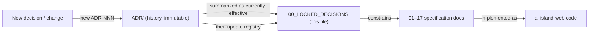
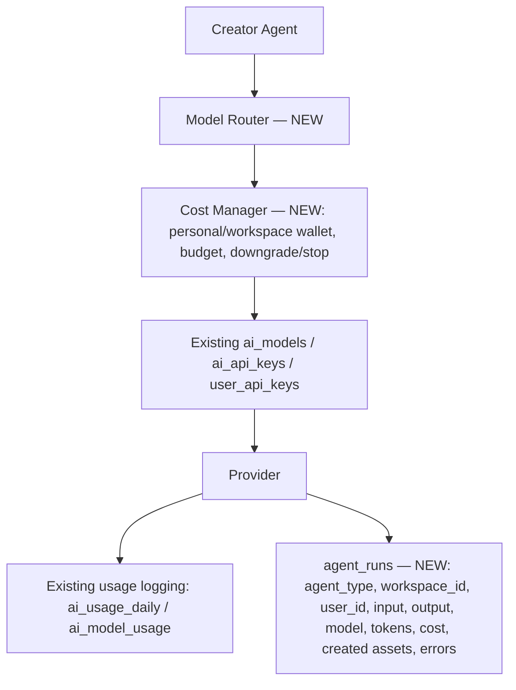
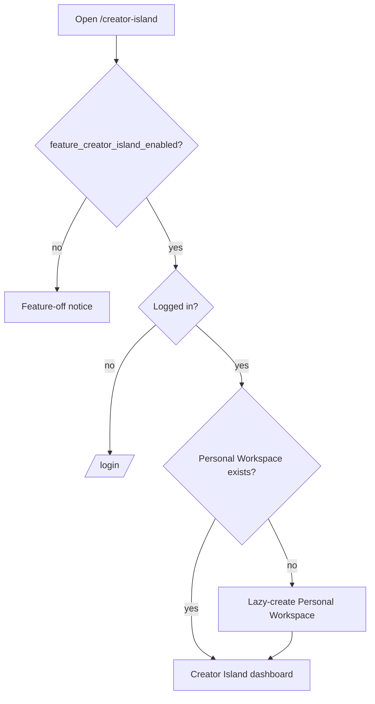

# 00 — Locked Decisions

> **Status:** Authoritative. Owner-approved (林董, Platform Owner). Last updated: 2026-06-28.
> **Role:** The immutable decision registry for Ideas OS / Creator Island. This file records the *currently-effective* version of every locked decision. Full history lives in `ADR/`.
> **Rule for implementers (human or AI):** read this file before writing code or any other Ideas OS doc. Do **not** invent architecture the decisions already settle. Changing a decision is **not** an inline edit — write a new ADR, then update this registry.

---

## Purpose

ai-island-web is a live platform. Ideas OS / Creator Island is being added on top of it without destabilizing existing systems. This document fixes the cross-cutting, platform-specific decisions so that 18 specification docs, multiple AI generators, and future contributors stay coherent instead of drifting into a pile of contradictory specs.

This is the *How* (project/implementation reality). The *Why* (product rationale) is expanded in `01_IDEAS_OS_SPEC.md` and recorded per-decision in `ADR/`.

## Overview

- Ideas OS = the core "operating system for ideas." Creator Island = the first product island built on it (homepage 3rd mode, after 經典 / 島嶼).
- Future islands (Learning, Business, Research) will reuse the same core. Decisions here must stay general enough to support them.
- Everything below is locked. Conflicts resolve in favor of this file for implementation; `01_IDEAS_OS_SPEC` explains intent.

## Terminology

| Term | Meaning |
|---|---|
| Platform | ai-island-web (Next.js 15 + Supabase + Zeabur + R2). |
| Ideas OS | The shared core system for idea→asset→work→growth. |
| Creator Island | First user-facing product on Ideas OS, at NEW route `/creator-island`. |
| Workspace | Ownership + collaboration boundary for durable assets (`workspace_id`). |
| Personal / Studio Workspace | Single-user default / multi-member team workspace. |
| Platform role vs Workspace role | Site-wide role (existing: `profiles.role` ∈ member/editor/admin, plus owner via `is_owner`) vs **NEW** in-workspace role (Owner/Manager/Contributor/Viewer). |
| Z Coin | Existing platform currency (Z 幣). |
| Dust | Separate creative resource, not money. |
| Work | Canonical creative output in Ideas OS (new `works` table). |
| Agent run | One Ideas OS AI task, traced in `agent_runs`. |

---

## Decision-doc relationship



| Layer | File | Question | Maintainer |
|---|---|---|---|
| History | `ADR/ADR-NNN-*.md` | What did we decide, when, with full context? | Claude Code |
| Registry (this) | `00_LOCKED_DECISIONS.md` | What is true right now? | Claude Code |
| Rationale | `01_IDEAS_OS_SPEC.md` | Why this design? | Ideas OS docs |

**Conflict rule:** this registry wins for implementation. To change a decision, add a new ADR (never rewrite an Accepted ADR), then update the matching row here.

---

## Design Goals

1. Add Ideas OS without breaking the live platform.
2. Be team-ready from day one (workspace-first) without forcing migrations later.
3. Reuse existing AI, economy, and auth infrastructure; add only thin new layers.
4. Keep every durable creative result traceable (source + lineage).
5. Keep one source of truth per concept (no duplicated economies, no duplicated key stores, no duplicated decision logs).

## Core Concepts

The locked decisions cluster into six areas: **Ownership, Roles, AI, Economy, Content model, Boundaries.** Each decision below maps to an ADR.

---

## Mermaid Diagram(s)

This document includes the following diagrams, rendered inline in their sections:

| Diagram | Section | Purpose |
|---|---|---|
| Decision-doc relationship (flowchart) | Decision-doc relationship | How ADR → registry → specs → code, and how changes flow back. |
| AI call chain (flowchart) | Models locked by these decisions | Agent → Model Router → Cost Manager → existing keys/providers → usage + `agent_runs`. |
| Decision application (flowchart) | User Flow | Flag → auth → lazy-create workspace → dashboard. |

## Business Rules — the locked decisions

| # | Decision | ADR |
|---|---|---|
| D1 | Creator Island route = **NEW** `/creator-island`; homepage 3rd mode; gated by **NEW** flag `feature_creator_island_enabled` reusing the *existing* `app_settings` `feature_*_enabled` pattern (`src/lib/app-settings.ts`). | ADR-009 |
| D2 | New Ideas OS durable entities are owned by `workspace_id`. | ADR-001 |
| D3 | Existing `user_id` systems (profiles, xp, lesson_progress, blog, course / AI-Island learning data) are **not** modified. | ADR-001 |
| D4 | Personal Workspace is **lazy-created** on first `/creator-island` access — never in the signup flow. | ADR-008 |
| D5 | Studio (team) workspace + team-management UI is in **v1** (invite code/link, roles, owner transfer, studio public page + studio marketplace page foundation). | — |
| D6 | Workspace roles = Owner / Manager / Contributor / Viewer, **separate** from platform roles. No workspace "admin". | ADR-007 |
| D7 | Z Coin = existing platform Z 幣 (existing `profiles.z_coin` balance + `coin_transactions` ledger). No separate Z balance. | ADR-003 |
| D8 | Dust is a separate creative resource, never money, never convertible to Z 幣. | ADR-004 |
| D9 | Reuse existing `ai_models` / `ai_api_keys` / `user_api_keys`; do not rebuild key storage. | ADR-006 |
| D10 | Add only new AI layers: Model Router, Cost Manager, `agent_runs` trace. Keep writing existing usage tables. | ADR-006 |
| D11 | AI agent **runtime** is a workspace **Resource** — not a member, not an Asset; returns validated structured output. (Future: **Agent Blueprint/Template** may be an Asset — version/fork/marketplace.) | ADR-005, ADR-015 |
| D12 | Work ≠ Blog. Works live in a new `works` table; blog is a publish target; `work_type=article` syncs to blog draft only on publish. | ADR-002 |
| D13 | `/admin/idea-fragments` is preserved (not migrated/deleted). Creator Island has a separate user-facing fragment system; shared logic via Creator Engine Shared Services. | ADR-010 |
| D14 | Marketplace phase 1 = internal Z Coin economy only (no real-money payout, KYC, bank, third-party split). | ADR-011 |
| D15 | n8n is an optional future automation layer; core flows must not depend on it. Initial automation = existing cron / server jobs. | ADR-012 |
| D16 | Workflows are assets (saveable, versionable, replayable, sellable, forkable). | ADR-014 |
| D17 | Growth Engine is a core direction (creator improvement), not vanity gamification. | — |
| D18 | Cultural Transcreation is first-class and **separate** from UI i18n. | — |
| D19 | Language: docs / code identifiers / DB tables / API routes in English; user-facing UI in Traditional Chinese. | ADR-013 |

> ADRs marked "—" are captured here and in `ADR/README.md`; promote to a full ADR when next revisited.

---

## Models locked by these decisions

### Economy

```txt
Z Coin           = existing platform Z 幣 (the only currency unit)
Personal Wallet  = user_id Z 幣 (existing: profiles.z_coin balance + coin_transactions ledger)
Workspace Wallet = workspace_id shared Z 幣 allowance/ledger (NEW; same Z 幣 unit)
Dust             = separate creative resource (NOT money, no payout/conversion)
```
- Personal spending debits the user's Z 幣; workspace spending debits the workspace allowance.
- Cost Manager picks the payment source (personal vs workspace) per spend.

### AI call chain (reuse existing, add thin layers)



### Source types (asset provenance — locked enum)

`human_original · ai_generated · ai_assisted · human_selected · work_recycled · egg_generated · market_imported · transcreated`

### AI agents (8 roles, with v1 subset)

| Agent | UI (繁中) | In v1? |
|---|---|---|
| Synthesizer | 凝聚 | ✅ |
| Evolutionist | 演化 | ✅ |
| Composer | 編織 | ✅ |
| Incubator | 孵化 | later |
| Archivist | 回收 | later |
| Transcreator | 文化轉譯 | later |
| Judge | 評審 | later |
| Coach | 教練 | later |

### Workspace role rules

- Exactly one Owner per workspace at all times.
- Owner can transfer ownership; old owner becomes Manager; Owner cannot leave before transferring; Manager cannot transfer ownership.
- Roles: Owner (full) > Manager (content + most collab settings, cannot delete workspace / transfer owner) > Contributor (create/edit assets, run workflows, allowed AI) > Viewer (view, optional comment).

### UI term glossary (English → 繁中, user-facing)

Workspace→工作空間 · Fragment→碎片 · Work→作品 · Workflow→工作流／創作流程 · Asset→創作資產 · Marketplace→市集 · Memory→記憶 · Transcreation→文化轉譯. Do not leak raw English system terms into UI.

---

## User Flow (decision application)



## Database Considerations

**Existing surfaces this doc reuses (verified in repo, do NOT alter):**
`profiles` (incl. `z_coin`, `role` ∈ member/editor/admin, `is_owner`) · `coin_transactions` (Z 幣 ledger: amount/balance_after/reason/meta) · `app_settings` · `audit_logs` · `idea_fragments` · `ai_models` · `ai_api_keys` · `user_api_keys` · `ai_usage_daily` · `ai_model_usage` · `src/lib/ai-crypto` · `src/lib/app-settings.ts` · `/admin/idea-fragments`.

**NEW surfaces introduced by Ideas OS (do NOT assume they exist yet):**
route `/creator-island` · flag `feature_creator_island_enabled` · tables `workspaces` / `workspace_members` / `works` / `agent_runs` (+ workspace AI/wallet tables) · module `src/lib/creator-engine/` · agents Model Router / Cost Manager.

- New tables carry `workspace_id` (FK → `workspaces`) + workspace-scoped RLS modeled on `idea_fragments_migration.sql`.
- Do not alter existing `user_id` tables. Whether Workspace Wallet is a dedicated ledger table vs. `workspace_id`-tagged rows is resolved in `13_DATABASE.md`.
- Any "fetch all" on large tables must paginate (`.range()`) — PostgREST truncates at 1000 rows (platform gotcha).
- Full schemas live in `13_DATABASE.md`; this doc only locks ownership/economy invariants.

## API Considerations

- Ideas OS routes are separate from admin routes (e.g. `/api/creator-island/...` or `/api/ideas-os/...`; final naming in `14_API.md`).
- AI never called from the client directly — always Agent → Model Router → Cost Manager → provider.
- Endpoint contracts (method/route/permission/request/response/errors) live in `14_API.md`.

## Permission Model

- Two independent layers: platform role (existing `is-owner` / `profiles.role`) and workspace role (new `workspace_members`).
- Server-side authorization + RLS required; never trust frontend checks. Permission matrices per feature live in their own docs.

## UI Considerations

- Traditional Chinese, beginner-friendly, glossary above. Skeleton modules (Marketplace/Community/Growth) are visible but clearly not production in v1.

## Edge Cases

- No active workspace / stale workspace context / user switches workspace mid-action.
- Insufficient Z 幣 or workspace allowance → Cost Manager downgrade/stop, never silent failure.
- AI failure / invalid structured output → preserve user input, offer retry; never lose creative input.
- Permission denied → human-readable 繁中 message, no raw RLS/role internals.

## Security

- RLS on all new workspace tables; AI keys stay encrypted server-side (existing `ai-crypto`).
- Every privileged action (grants, transfers, marketplace) writes `audit_logs`.
- Source/lineage recorded for trust in marketplace + collaboration.

## Performance

- 30s settings cache pattern (`app-settings.ts`) reused for the feature flag.
- Paginate large reads; embeddings via pgvector; heavy AI work is async/logged.

## Future Expansion

- Same core (Workspace/Asset/Memory/Workflow/AI/Marketplace/Growth) powers Learning / Business / Research islands.
- Marketplace phase 2 = real-money payout (KYC/payment) — future ADR.
- Workspace wallet v2, real-time collaboration, plugin/API surface — future ADRs.

## Implementation Notes

- Read this file + `ADR/` before any Ideas OS work.
- New durable entity → `workspace_id` + RLS. Personal-only data may stay `user_id`.
- Reuse `ai_models` / `ai_api_keys` / `user_api_keys` + existing usage tables; add Model Router + Cost Manager + `agent_runs`.
- Keep `/admin/idea-fragments` intact; extract shared logic to **NEW** `src/lib/creator-engine/` (internal module layout detailed in `03_SYSTEM_ARCHITECTURE.md`).
- English code/db/API; 繁中 UI.

## MVP vs Future

- **MVP (v1):** `/creator-island` + flag, Personal Workspace lazy-create, Studio + team mgmt, Fragment Library, Work Library, basic Work Editor, AI 凝聚/演化/編織, `agent_runs`, Creator Engine Shared Services, Marketplace/Community/Growth skeletons.
- **Future:** full Marketplace (real money), Community, Growth coach, remaining agents (孵化/回收/文化轉譯/評審/教練), workflow marketplace, other islands.

---

## Change log

- 2026-06-28 — Initial locked set (D1–D19) established; supersedes the former root `DECISIONS.md`. History in `ADR/` (ADR-001…005 written; 006–014 indexed).
