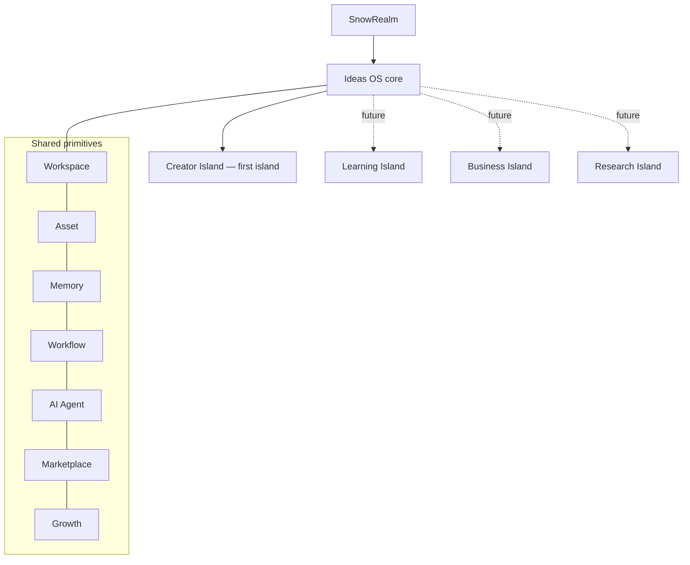
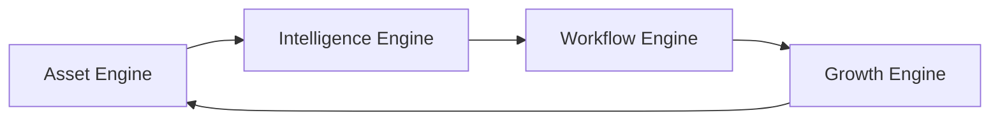
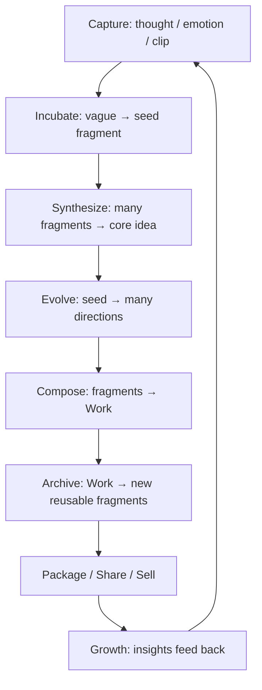
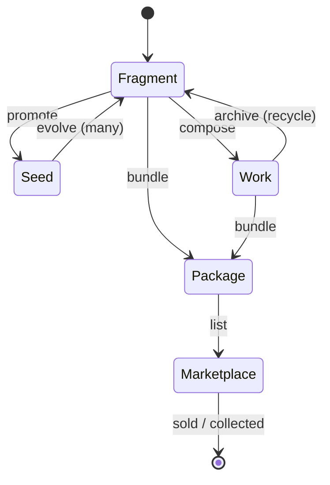

# 01 — Ideas OS Spec

> The full conceptual and product specification of Ideas OS: what it is, why it exists, its philosophy, the four engines, the six domains, the asset and business life cycles, how it compares to adjacent tools, and how it grows into multiple islands.
> This is the *Why*. Locked, platform-specific *How* lives in `00_LOCKED_DECISIONS.md`; subsystem detail lives in `03`–`17`.

---

## Purpose

This document gives every engineer, designer, and AI agent a single, coherent mental model of Ideas OS before they touch a subsystem. It exists to prevent the most likely failure mode: building "an AI writing tool with extra tables" instead of an operating system for ideas. If a later decision in a subsystem doc seems to contradict the spirit here, escalate — do not silently diverge.

It answers:

- What Ideas OS is (and is not).
- Why it must exist as a *core*, not a single product page.
- The conceptual primitives every subsystem shares.
- The life cycle that turns a stray thought into compounding value.
- Why Creator Island is the first island, and what islands come next.

## Overview

Ideas OS is the core system of SnowRealm. It manages the **complete life cycle of an idea**: capture a thought, turn it into a structured asset, evolve it through human + AI collaboration, compose it into works, publish or commercialize it, and feed the resulting data back into the creator's growth.

```txt
Thought → Fragment → Asset → Workflow → Work → Archive → Marketplace / Community / Growth → New Thought
```

Creator Island is the first **product island** built on Ideas OS. Future islands (Learning, Business, Research) reuse the same primitives — Workspace, Asset, Memory, Workflow, AI Agent, Search, Marketplace, Growth — instead of each reinventing an idea system.



## Terminology

These terms are used consistently across product, schema, API, UI copy, and AI prompts. Full glossary detail per entity lives in `05_ASSET_SYSTEM.md`, `08_MEMORY_SYSTEM.md`, etc.

| Term | One-line meaning |
|---|---|
| Ideas OS | Core system managing the idea life cycle (not limited to creation). |
| Creator Island | First user-facing product island; NEW route `/creator-island`. |
| Workspace | Ownership + collaboration boundary; durable assets belong to a `workspace_id`. |
| Asset | Any reusable, referenceable, versionable, permission-controlled resource. |
| Fragment | The smallest meaningful idea unit. |
| Seed Fragment | A fragment that can generate many related fragments/works. |
| Work | A completed/semi-completed output composed from assets (new `works` table). |
| Package | A collection of assets prepared to share/sell/transfer/reuse. |
| Collection | A many-to-many organizational grouping (an asset can be in several). |
| Asset Graph | The relationship network between assets. |
| Lineage | The traceable history of an asset (source, derivation, AI involvement). |
| Workflow | A reusable creative process; itself an asset. |
| AI Agent | A specialized AI role (Incubator, Synthesizer, …); a workspace resource, not a member. |
| Memory | Persistent, scoped contextual knowledge (personal/workspace/project/session). |
| Creator DNA | A creator's long-term style/behavior profile. |
| Z Coin | Existing platform currency (Z 幣). |
| Dust | Separate creative resource — never money. |
| Cultural Transcreation | Culture-aware creative adaptation (≠ UI i18n). |

## Design Goals

1. **Idea-centric, not output-centric.** Optimize for accumulation and reuse, not single generations.
2. **Durable over disposable.** Meaningful results become assets with metadata, lineage, and versions.
3. **Workspace-first.** Team collaboration is possible from day one without migration pain.
4. **Memory as infrastructure.** The creator's accumulated memory — not any single model — is the moat.
5. **Process is capital.** A repeatable success becomes a reusable, sellable workflow.
6. **AI amplifies, humans author.** AI involvement is always labeled and traceable; current user intent overrides stored memory.
7. **Extensible to many islands.** The core must not be hardcoded to songs or writing.

## Core Concepts

### The four engines



- **Asset Engine** — manages all reusable creative resources (fragment, work, package, workflow, character, world, knowledge, media, template, collection). Detail: `05_ASSET_SYSTEM.md`.
- **Intelligence Engine** — memory + embeddings + AI agents + recommendation + Creator DNA that connect and improve assets. Detail: `07_AI_SYSTEM.md`, `08_MEMORY_SYSTEM.md`.
- **Workflow Engine** — orchestrates agents, human decisions, automation, replay, repeatable processes. Detail: `09_WORKFLOW_ENGINE.md`.
- **Growth Engine** — turns creation history into coaching insight. Detail: `12_GROWTH_ENGINE.md`.

### The six domains

`Assets · Memory · Workflow · Studio · Business · Growth`. Every product feature must map to at least one. A feature that maps to none is out of scope.

### Asset-first and lineage

Nothing meaningful is "loose text." A generated lyric line is a Fragment; a finished song is a Work; a repeated process is a Workflow. Each carries a `source_type` (`human_original · ai_generated · ai_assisted · human_selected · work_recycled · egg_generated · market_imported · transcreated`) and lineage relations (evolved_from, condensed_from, recycled_from, transcreated_from, inspired_by, remixed_from, forked_from, used_in_work, packaged_in). Lineage is stored as DB relations, never as plain text. See `05_ASSET_SYSTEM.md`.

## Business Rules

These conceptual rules constrain every subsystem (the platform-specific, codebase-grounded versions are locked in `00_LOCKED_DECISIONS.md`):

- Durable Ideas OS assets are owned by `workspace_id` (NEW tables); existing `user_id` platform systems are untouched.
- AI is reached only through Agent → Model Router (NEW) → Cost Manager (NEW) → existing providers; every run is traced in `agent_runs` (NEW table).
- **AI agent outputs must be structured (defined output schema) and validated** before being saved as assets — never blind plain text (locked decision D11).
- Z Coin reuses the existing economy (`profiles.z_coin` + `coin_transactions`); Dust is separate and never money.
- A Work is canonical in Ideas OS; the blog is only a publish target.
- Public/sellable assets require a license and lineage before marketplace behavior.
- Memory is scoped, confirmed when inferred, and overridden by current user intent.
- AI-involved assets must record that involvement.

## User Flow

The product-level creation loop (subsystem flows expand this):



A first-session minimal success: enter `/creator-island` (NEW) → create one fragment → run one AI action (凝聚/演化/編織) → save one result.

## Mermaid Diagram(s)

This document includes the following diagrams; each is rendered inline in its section:

| Diagram | Section | Purpose |
|---|---|---|
| Islands + shared primitives (flowchart) | Overview | Shows Ideas OS core, Creator Island as first island, future islands, shared primitives. |
| Four engines (flowchart) | Core Concepts | The Asset → Intelligence → Workflow → Growth loop. |
| Creation loop (flowchart) | User Flow | Capture → Incubate → Synthesize → Evolve → Compose → Archive → Package → Growth → loop. |
| Asset life cycle (stateDiagram) | Asset life cycle | Fragment ↔ Seed → Work → Archive → Package → Marketplace states. |

(ER and sequence diagrams for concrete schemas/flows live in `13_DATABASE.md` and `14_API.md`.)

## Difference from existing tools

| Tool | What it does | What Ideas OS adds |
|---|---|---|
| ChatGPT | Prompt → output → end | Persistent assets, lineage, memory governance, workflows, growth |
| Notion | Stores information | Transforms info into versioned creative assets with AI + marketplace |
| Obsidian | Linked personal notes | Workspace collaboration, AI agents, asset economy, growth analytics |
| Cursor | Code-centric AI editing | Creative-asset-centric life cycle (fragment→work→package), non-code domains |
| GitHub | Version/fork/merge for code | Version/fork/merge/lineage for creative assets, plus marketplace + growth |

The unifying point: most tools center on **one generation or one artifact**; Ideas OS centers on **accumulation** — every idea can be preserved, evolved, reused, connected, shared, sold, translated, remixed, and learned from.

## Asset life cycle



## Business life cycle

```txt
Create asset → attach license → bundle into package → list on marketplace (Z Coin)
→ buyer collects/forks/remixes (lineage recorded) → seller receives Z 幣 → platform fee accounted
```

Phase 1 is internal Z Coin only (no real-money payout). Detail: `10_MARKETPLACE.md`.

## Database Considerations

This is a conceptual doc; **authoritative schemas live in `13_DATABASE.md`**. Invariants it imposes:

- The shared **asset abstraction** needs consistent common fields across asset types: `id, workspace_id, asset_type, title, description, tags, language, culture, visibility, license_id, source_type, metadata, created_by, created_at, updated_at`.
- **Lineage** = a relations table (NEW `asset_relations` / `fragment_relations`), not text.
- **Memory** lives in tables by scope, not in prompt strings.
- New tables reuse existing platform infra where possible (auth, `profiles`, `app_settings`, `coin_transactions`, `ai_*`) and follow the RLS pattern in `idea_fragments_migration.sql`.

Conceptual shape of the key **NEW** surfaces (illustrative only — PK/FK/index/RLS/migration are finalized in `13_DATABASE.md`):

| Table (NEW) | Purpose | PK | Key FK | Indexes | Constraints | RLS | Example row |
|---|---|---|---|---|---|---|---|
| `works` | Canonical creative output | `id uuid` | `workspace_id`→`workspaces`, `created_by`→`profiles` | `(workspace_id, updated_at)` | `work_type` in enum; `title` not null | workspace member can read; Contributor+ can write | `{id, workspace_id, work_type:'song', title:'夜車', status:'draft'}` |
| `asset_relations` | Lineage edges between assets | `id bigserial` | `from_asset_id`, `to_asset_id` | `(from_asset_id)`, `(to_asset_id)` | `relation_type` in enum (evolved_from…) | inherit from owning workspace | `{from:'frag_A', to:'work_C', relation_type:'used_in_work'}` |
| `agent_runs` | Trace of every AI task | `id bigserial` | `workspace_id`, `user_id` | `(workspace_id, created_at)` | `agent_type` not null | workspace member read; system write | `{workspace_id, agent_type:'evolve', model:'claude-…', tokens_in:1200, cost_usd:0.01}` |
| memory tables | Scoped memory (personal/workspace/project/session) | `id uuid` | scope FK (`user_id`/`workspace_id`/project) | `(scope_id, kind)` + embedding ivfflat | `scope` in enum; `status` in (candidate/active/rejected) | by scope owner | `{scope:'personal', user_id, text:'prefers physical-action metaphors', status:'active'}` |

Migration note: each NEW table ships as its own `supabase/<name>_migration.sql` with `ENABLE ROW LEVEL SECURITY` + workspace-scoped policies, mirroring `idea_fragments_migration.sql`.

## API Considerations

Conceptually, Ideas OS exposes **product-level operations**, not raw table CRUD, and stays separate from admin APIs. All routes below are **NEW** and **indicative only — authoritative contracts (full request/response shapes, pagination, rate limits, error codes) live in `14_API.md`**:

| Method | Route (NEW) | Permission | Request (sketch) | Response (sketch) | Errors |
|---|---|---|---|---|---|
| GET | `/api/creator-island/workspaces` | authed | — | `{workspaces[]}` | 401 |
| POST | `/api/creator-island/fragments` | Contributor+ | `{workspaceId, title, content, tags}` | `{fragment}` | 401/403/422 |
| GET | `/api/creator-island/fragments` | member | `?workspaceId&cursor` (paginated) | `{fragments[], nextCursor}` | 401/403 |
| POST | `/api/creator-island/works` | Contributor+ | `{workspaceId, workType, title}` | `{work}` | 401/403/422 |
| POST | `/api/creator-island/ai/{synthesize\|evolve\|compose}` | Contributor+ (cost-bearing) | `{workspaceId, fragmentIds, options}` | `{result, agentRunId}` | 401/403/402(budget)/502(ai) |
| POST | `/api/creator-island/workflows/run` | Contributor+ | `{workspaceId, workflowId, input}` | `{runId}` | 401/403/402 |
| POST | `/api/creator-island/marketplace/purchase` | member | `{packageId}` | `{transaction}` | 401/403/402/409 |

- AI is **never** called from the client directly — always Agent → Model Router → Cost Manager → provider.
- Cost-bearing endpoints return `402` when the chosen wallet (personal/workspace Z 幣) is insufficient; the Cost Manager may downgrade instead of failing (policy in `07_AI_SYSTEM.md`).
- List endpoints paginate (cursor/`.range()`) to respect the 1000-row PostgREST limit.

## Permission Model

Two independent layers: **platform role** (existing `profiles.role` ∈ member/editor/admin + `is_owner`) and **workspace role** (NEW Owner/Manager/Contributor/Viewer). Authorization is server-side + RLS — never frontend-only.

Conceptual workspace permission matrix (authoritative version in `04_WORKSPACE.md`):

| Action | Owner | Manager | Contributor | Viewer |
|---|:--:|:--:|:--:|:--:|
| View fragments / works | ✅ | ✅ | ✅ | ✅ |
| Create / edit assets, run AI actions | ✅ | ✅ | ✅ | ❌ |
| Run / save workflows | ✅ | ✅ | ✅ | ❌ |
| Manage members & roles | ✅ | ✅ | ❌ | ❌ |
| Manage wallet / AI budget / settings | ✅ | ✅ | ❌ | ❌ |
| Publish to marketplace | ✅ | ✅ | ❌ | ❌ |
| Transfer ownership / delete workspace | ✅ | ❌ | ❌ | ❌ |

Viewer comment rights depend on workspace settings. Cost-bearing actions also pass the Cost Manager regardless of role.

## UI Considerations

Creator Island should feel like a place a creator *lives*, not a tool panel. Simple actions on top, serious architecture underneath: a user sees `演化`; the system runs fragment + memory + prompt composer + model router + agent run + lineage + cost + validation. UI is Traditional Chinese and must not leak raw English system terms (glossary in `00_LOCKED_DECISIONS.md`). Full page specs in `16_UI_UX.md`.

## Edge Cases

- A thought too vague to classify → Incubator turns it into a seed candidate rather than rejecting it.
- An asset with no clear type → defaults to Fragment; type can be refined later.
- A Work whose source fragments were deleted → lineage keeps the reference with a "deleted source" marker.
- Conflicting memory vs current request → **current user intent always overrides stored/inferred memory** (a core Ideas OS rule; see `08_MEMORY_SYSTEM.md`).
- Cross-workspace move of an asset → treated as a derivation with recorded lineage, not a silent reparent.

## Security

- All durable creative data is workspace-scoped with RLS.
- AI involvement and provenance recorded for trust (marketplace + collaboration).
- AI keys stay encrypted server-side (existing `ai-crypto`); no provider secrets reach the client.
- Privileged actions (grants, transfers, listings, takedowns) are audited.

## Performance

- Embeddings/semantic search via pgvector (the platform already uses this for `idea_fragments`).
- Large reads paginate (PostgREST 1000-row truncation is a known platform gotcha).
- Heavy AI work is asynchronous and logged via `agent_runs`; settings use the 30s cache pattern.

## Future Expansion

- **Learning Island** — lesson fragments, knowledge assets, learning memory, practice workflows, teaching-assistant agents.
- **Business Island** — idea fragments, market research assets, product specs, personas, pitch decks, business workflows.
- **Research Island** — notes, hypotheses, literature maps, citation assets, summary workflows, knowledge graph.
- **Workflow Marketplace** — selling *process*, not just output (a likely strong moat).
- **Creator DNA / cross-cultural transcreation / API + plugins** — long-term surfaces.

The existing AI-Island learning system is **not** migrated now; future Learning Island integration is its own project.

## Testing

This is a conceptual spec, so "testing" here means consistency tests that protect the model (concrete code tests live in `17_IMPLEMENTATION_GUIDE.md`):

- **Decision conformance:** any new subsystem doc/feature is checked against `00_LOCKED_DECISIONS.md` (workspace ownership, economy names, Work≠Blog, AI reuse, admin boundary).
- **Lineage integrity:** for any asset created by an AI action, assert a `source_type` and at least one `asset_relations` edge exist.
- **Ownership scope:** every NEW durable table row has a non-null `workspace_id`; RLS denies cross-workspace reads (mirror the `idea_fragments` RLS tests).
- **Economy isolation:** Dust operations never touch `coin_transactions`; Z 幣 spends always go through the Cost Manager.
- **Pagination:** list queries on large tables are asserted to paginate (no unbounded `select('*')`).

## Implementation Notes

- Read `00_LOCKED_DECISIONS.md` + `ADR/` before building; this doc gives intent, that file gives the locked How.
- When unsure whether something is an Asset: if it can be reused/referenced/sold/remixed/analyzed, it is.
- Prefer shared Creator Engine services over duplicating `/admin/idea-fragments` logic.
- Keep the core general — do not hardcode song/writing assumptions that would block other islands.

## MVP vs Future

- **MVP (v1):** the Capture→Compose→Archive loop with fragments + works + 3 agents (凝聚/演化/編織), workspace-first ownership, Studio basics. Marketplace/Community/Growth are skeletons.
- **Future:** full marketplace economy, community asset graph, Growth coach + Creator DNA, remaining agents (孵化/回收/文化轉譯/評審/教練), workflow marketplace, additional islands.

---

## Change log

- 2026-06-28 — Initial spec; absorbs the archived `01_vision/` drafts into a single implementation-oriented document.
