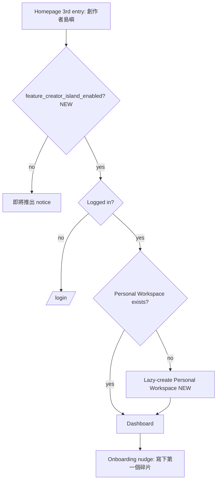
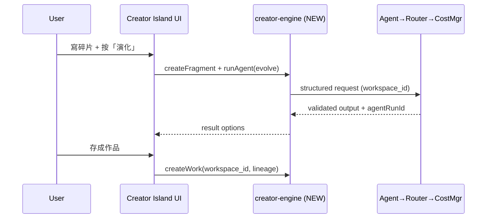
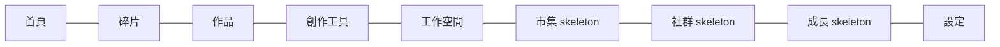

# 02 — Creator Island PRD

> The product requirements for Creator Island: the first user-facing island on Ideas OS, at NEW route `/creator-island` (homepage 3rd mode, after 經典 / 島嶼). This doc defines personas, information architecture, navigation, every module's UX, MVP scope, metrics, and error handling.
> Locked decisions: `00_LOCKED_DECISIONS.md`. Conceptual model: `01_IDEAS_OS_SPEC.md`. Subsystem detail: `04`–`16`.

---

## Purpose

Give design + frontend + backend + AI a single, buildable product definition for Creator Island v1 so it ships as one coherent island — not a prompt page with extra tabs. Every requirement here must trace to the Ideas OS creation loop (Capture → Incubate → Synthesize → Evolve → Compose → Archive → Package → Growth) and must not contradict `00_LOCKED_DECISIONS.md`.

## Overview

Creator Island is a creative workspace where scattered ideas become durable creative assets. A user can arrive with one incomplete thing (a sentence, an emotion, a memory, a clip) and the island gives it a path: capture it as a fragment, let AI help (凝聚/演化/編織), compose a work, save it, and — later — package, share, sell, and grow.

It reuses the platform shell (auth, header, `app_settings` feature flags, R2 upload, Z 幣) and adds NEW Creator Island surfaces. `/admin/idea-fragments` stays separate as an internal tool; Creator Island is the user-facing product, sharing logic through NEW `src/lib/creator-engine/`.

## Terminology

| Term | UI (繁中) | Meaning here |
|---|---|---|
| Creator Island | 創作者島嶼 | This product; route `/creator-island`. |
| Workspace | 工作空間 | Active ownership boundary; everything saved goes into it. |
| Fragment | 碎片 | Smallest idea unit a user captures. |
| Work | 作品 | Composed output (song/article/story/…). |
| Creation Tools | 創作工具 | The AI actions (凝聚/演化/編織 in v1). |
| Studio | — | A multi-member workspace. |
| Fragment Egg | 碎片蛋 | Daily inspiration reward (Dust-based). |

(Full glossary in `00_LOCKED_DECISIONS.md`; do not leak raw English system terms into UI.)

## Design Goals

1. **One action to value:** a first-time user reaches "saved my first fragment" fast.
2. **Always know where you are:** the active workspace is visible everywhere.
3. **AI as roles, not a model box:** users press 凝聚/演化/編織, not "call provider."
4. **Never lose creative input:** AI/network/budget/permission failures preserve the user's text.
5. **Beginner-simple surface, serious backend:** hide architecture without removing it.
6. **Skeletons honest:** Marketplace/Community/Growth are visibly "coming," not fake-complete.

## Core Concepts

Creator Island is composed of 11 product modules, each mapping to the creation loop and an Ideas OS engine:

| Module | UI | Loop stage | Engine |
|---|---|---|---|
| Dashboard | 首頁 | (entry) | — |
| Fragment Library | 碎片 | Capture/Incubate | Asset |
| Work Library | 作品 | Compose/Archive | Asset |
| Creation Tools | 創作工具 | Synthesize/Evolve/Compose | Intelligence |
| Workspace switcher | 工作空間 | (context) | Studio |
| Studio Management | 工作空間 | (collaboration) | Studio |
| AI Agent actions | (in tools) | all | Intelligence |
| Marketplace (skeleton) | 市集 | Package/Sell | Business |
| Community (skeleton) | 社群 | Share/Fork | Community |
| Growth (skeleton) | 成長 | Growth | Growth |
| Settings | 設定 | — | — |

## Business Rules

- Everything a user saves is written to the **active workspace** (`workspace_id`); switching workspace changes fragments/works/members/AI budget shown.
- Cost-bearing AI actions go through the Cost Manager (personal vs workspace Z 幣); insufficient funds → downgrade or clear stop, never silent failure.
- AI agent outputs are structured + validated before being offered as "save as fragment/work" (D11).
- A Work is canonical; "發布成文章" only syncs an `article` work to a blog draft on explicit user action.
- Skeleton modules render an honest "即將推出" state and never claim production behavior.
- `/admin/idea-fragments` is untouched; Creator Island uses shared services, not the admin UI.

## User Flow

### First-time entry

**E1 first-run guided mini-loop (MVP-onboarding, `ENHANCEMENTS.md`):** the first session walks the user through a complete mini-loop — 一句話 → 種子 → 演化 → 編織 into a tiny Work → save — so the magic lands **before any accumulation exists**. Uses only existing MVP AI actions (sequencing, not new scope). **E2 pre-seed:** a fresh Personal Workspace is seeded with sample fragments/templates (from existing `idea_fragments`/chapter/leetcode) so the island isn't empty on arrival.

### First creation

## Mermaid Diagram(s)

| Diagram | Section | Purpose |
|---|---|---|
| First-time entry (flowchart) | User Flow | Flag → auth → lazy-create workspace → dashboard. |
| First creation (sequence) | User Flow | Fragment → AI action → save as work, via creator-engine. |
| Navigation map (flowchart) | Navigation IA | Top-level routes and skeleton modules. |

## Personas

| Persona | Need | What v1 gives them |
|---|---|---|
| Beginner ("我只是有些零碎想法") | Low barrier, no jargon | Quick capture, empty-state prompts, one-tap AI actions |
| Fragment collector | Many scattered notes | Fragment Library, search, tags, multi-select → compose |
| Emotional creator | Starts with feelings | Incubate (later) + 演化; "把感覺變成一句話" |
| Studio owner | Team creation | Studio workspace, roles, invites, owner transfer |
| Advanced creator | Reusable value | Works with lineage, archive→fragments, workflows (later) |

## Dashboard IA

Sections: Active Workspace · 快速捕捉 (quick fragment) · 今日碎片蛋 · 繼續創作 (continue) · 最近碎片 · 最近作品 · AI 創作工具 · Studio 成員 · 市集預覽 · 成長預覽. The dashboard answers: where am I working / what can I continue / what can I make now / what changed / what's the suggested next action.

## Navigation IA

Primary nav (繁中): 首頁 · 碎片 · 作品 · 創作工具 · 工作空間 · 市集 · 社群 · 成長 · 設定. Skeleton modules (市集/社群/成長) are present but badged "即將推出".

## Module UX

### Fragment Library
Quick create; edit; delete/archive; multi-select (≥2 → compose); tag + source_type display; workspace scope; AI action menu; search; empty state ("先寫下一句話、一個想法，或一段心情。"). Users never need to understand `fragment_type`/`source_type` to start.

### Work Library
List works; create; open editor; show work_type/status/linked fragments/last updated; archive (later); "發布成文章" only on request (syncs to blog draft).

### Work Editor (basic v1)
Title + body + linked fragments panel + AI output panel; autosave; preserves input on any failure.

### Creation Tools (AI actions)
v1: 凝聚 (Synthesizer) · 演化 (Evolutionist) · 編織 (Composer). Future: 孵化/回收/文化轉譯/評審/教練. Each action shows: required input · what AI will do · estimated cost (if any) · save options (存成碎片/存成作品/重試/調整方向/捨棄). Loading copy: 正在凝聚碎片… / 正在演化想法… / 正在編織作品….

### Workspace & Studio
Active workspace always visible. Switcher affects fragments/works/members/AI budget. Studio v1: create studio · member list · invite link/code · role assignment · owner transfer · basic settings + studio public page foundation. Rules: exactly one Owner; Owner can't leave before transfer; old owner → Manager; Manager can't transfer ownership.

### Skeleton modules
Marketplace/Community/Growth: render a preview + "即將推出"; no transactions/social/coach logic in v1.

## Database Considerations

Authoritative schemas in `13_DATABASE.md`. Surfaces this PRD relies on:

**Existing (reuse, don't alter):** `profiles` (z_coin, role, is_owner), `coin_transactions`, `app_settings` (feature flag), `idea_fragments` (shared-service source), `ai_models`/`ai_api_keys`/`user_api_keys`, R2 upload lib.

**NEW (illustrative; final in `13_DATABASE.md`):**

| Table (NEW) | Purpose | PK | Key FK | Indexes | RLS |
|---|---|---|---|---|---|
| `workspaces` | Ownership boundary | `id uuid` | `owner_id`→profiles | `(owner_id)` | members read; Owner/Manager write |
| `workspace_members` | Human membership + role | `id uuid` | `workspace_id`, `user_id` | `(workspace_id,user_id)` unique | members read; Owner/Manager manage |
| `fragments` | User-facing carbon of an idea | `id uuid` | `workspace_id`, `created_by` | `(workspace_id,created_at)`, tags GIN, embedding ivfflat | workspace-scoped |
| `works` | Composed output | `id uuid` | `workspace_id` | `(workspace_id,updated_at)` | workspace-scoped |
| `work_fragments` | Work↔fragment links | `id bigserial` | `work_id`,`fragment_id` | `(work_id)` | inherit |
| `agent_runs` | AI task trace | `id bigserial` | `workspace_id`,`user_id` | `(workspace_id,created_at)` | member read; system write |

Example `fragments` row: `{id, workspace_id, created_by, title:'我墊著腳尖走在妳的世界', source_type:'human_original', tags:['歌詞']}`. Migrations ship per-table with RLS mirroring `idea_fragments_migration.sql`. Paginate all list reads (1000-row limit).

## API Considerations

NEW, indicative — authoritative in `14_API.md`:

| Method | Route (NEW) | Permission | Request | Response | Errors |
|---|---|---|---|---|---|
| POST | `/api/creator-island/workspaces` | authed | `{name,type}` | `{workspace}` | 401/422 |
| GET | `/api/creator-island/workspaces/active` | authed | — (lazy-creates personal) | `{workspace}` | 401 |
| POST | `/api/creator-island/fragments` | Contributor+ | `{workspaceId,title,content,tags}` | `{fragment}` | 401/403/422 |
| GET | `/api/creator-island/fragments` | member | `?workspaceId&cursor` | `{fragments[],nextCursor}` | 401/403 |
| POST | `/api/creator-island/ai/{synthesize\|evolve\|compose}` | Contributor+ | `{workspaceId,fragmentIds,options}` | `{result,agentRunId}` | 401/403/402/502 |
| POST | `/api/creator-island/works` | Contributor+ | `{workspaceId,workType,title}` | `{work}` | 401/403/422 |
| POST | `/api/creator-island/works/{id}/publish` | Contributor+ | `{target:'blog'}` | `{blogDraftId}` | 401/403/409 |
| POST | `/api/creator-island/studio/{id}/invite` | Owner/Manager | `{role}` | `{inviteCode}` | 401/403 |
| POST | `/api/creator-island/studio/{id}/transfer` | Owner | `{toUserId}` | `{ok}` | 401/403/409 |

AI never called from client directly. Cost-bearing routes return `402` on insufficient wallet (Cost Manager may downgrade).

## Permission Model

Platform role (existing `profiles.role`/`is_owner`) is independent from workspace role (NEW). Workspace matrix (authoritative in `04_WORKSPACE.md`):

| Action | Owner | Manager | Contributor | Viewer |
|---|:--:|:--:|:--:|:--:|
| View fragments/works | ✅ | ✅ | ✅ | ✅ |
| Create/edit assets, run AI | ✅ | ✅ | ✅ | ❌ |
| Publish work to blog | ✅ | ✅ | ✅ | ❌ |
| Invite / manage members | ✅ | ✅ | ❌ | ❌ |
| Manage wallet / settings | ✅ | ✅ | ❌ | ❌ |
| Transfer owner / delete workspace | ✅ | ❌ | ❌ | ❌ |

Permission errors are human-readable 繁中 (e.g. 「你目前是 Viewer，不能編輯這個工作空間的作品。」) — never raw RLS/role internals.

## UI Considerations

Traditional Chinese, beginner-friendly, glossary-compliant. Mobile priority: quick capture, recent fragments, today's egg, simple AI actions, continue work. Desktop priority: multi-select, side-by-side editor + AI panel, workspace/studio management. Skeleton modules clearly badged 即將推出.

## Edge Cases

- No active workspace / stale workspace context / user switches workspace mid-action → reload context, confirm target before save.
- Insufficient Z 幣 or workspace allowance → Cost Manager downgrade/stop with clear copy.
- AI failure or invalid structured output → keep input, offer 重試/調整方向.
- Publish failure → work stays canonical; surface retry, never lose the work.
- Viewer attempts edit → blocked with readable message.
- Empty input on AI action → inline guidance, no request sent.

## Security

- All Creator Island data workspace-scoped with RLS; server-side authorization on every route.
- Uploads via existing R2 path; AI keys stay server-side (existing `ai-crypto`).
- Privileged actions (invite, role change, owner transfer, publish) write `audit_logs`.

## Performance

- Feature flag read via existing 30s `app-settings` cache.
- Paginate fragment/work lists; embeddings via pgvector.
- AI actions async; UI shows role-based loading; results streamed where supported.

## Testing

- First-time flow: flag off → notice; flag on + new user → lazy-create personal workspace → dashboard.
- Workspace isolation: assets created in Studio A never appear in Personal/Studio B (RLS).
- Role gates: Viewer cannot create/edit; Contributor cannot manage members; only Owner transfers.
- Cost path: AI action with insufficient Z 幣 → 402/downgrade, input preserved.
- Publish: `article` work → blog draft created and linked; work remains canonical.
- No data loss: simulate AI/network failure mid-action → user input intact.

## Future Expansion

Full Marketplace (Z 幣 then real money), Community (follow/fork/remix), Growth (XP/Creator DNA/coach), remaining agents (孵化/回收/文化轉譯/評審/教練), workflow builder + marketplace, lineage graph view, real-time collaboration, mobile advanced editor.

## Implementation Notes

- Add the 3rd homepage entry in `src/components/home/Hero.tsx` (grid 2→3 cols) behind `feature_creator_island_enabled`; pass the flag from `src/app/page.tsx` (already `revalidate=30`).
- Add `isFeatureEnabled('creator_island')`-style read via `src/lib/app-settings.ts`; register the toggle in `/admin/settings`.
- Build user-facing UI under `src/app/creator-island/`; shared logic under NEW `src/lib/creator-engine/` (reused by `/admin/idea-fragments`).
- Reuse existing R2 upload + Z 幣 (`coin_transactions`) + AI key stack; add Model Router/Cost Manager/`agent_runs`.

## MVP vs Future

- **MVP (v1):** `/creator-island` + flag + 3rd homepage entry; Personal Workspace lazy-create; Studio + team mgmt (invite/roles/transfer); Fragment Library; Work Library; basic Work Editor; AI 凝聚/演化/編織; `agent_runs`; creator-engine shared services; Marketplace/Community/Growth skeletons.
- **Future:** everything in Future Expansion.

---

## Change log

- 2026-06-28 — Initial PRD; absorbs the archived `02_product/00_overview` + `01_creator_island` content into one gated, implementation-ready doc.
