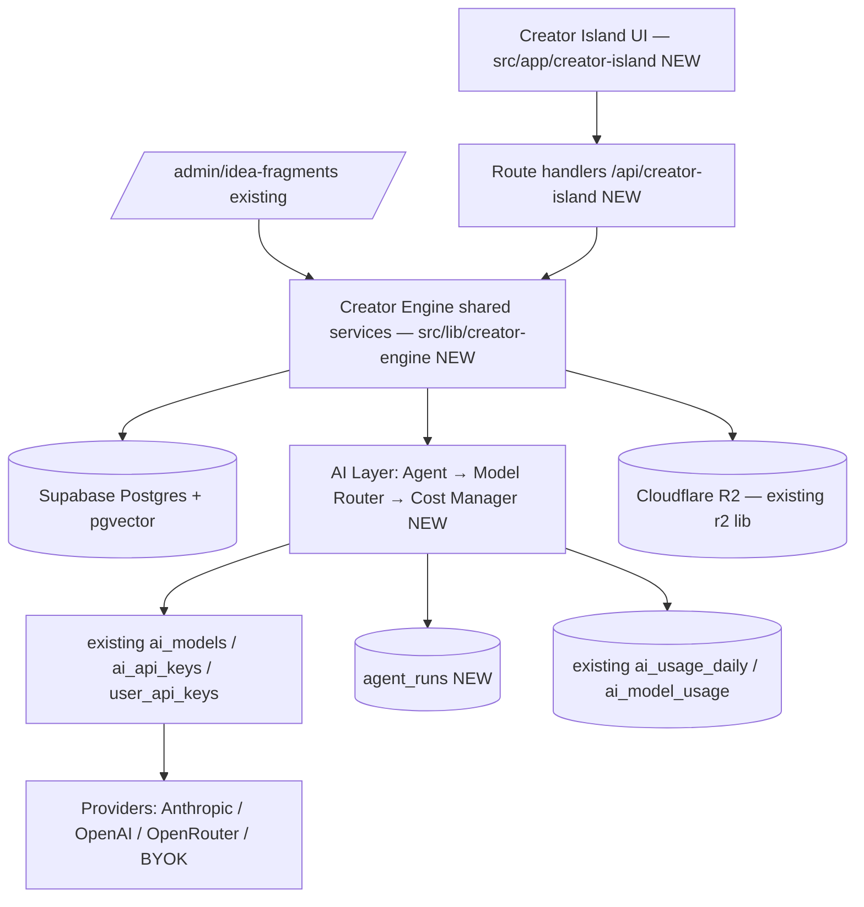
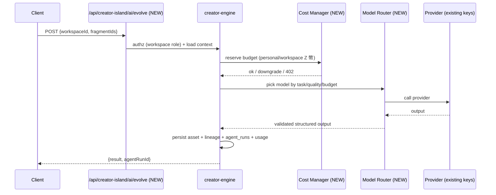

# 03 — System Architecture

> How Ideas OS / Creator Island is built on top of the existing ai-island-web stack: layers, service boundaries, the Creator Engine shared-service module, the AI layer, storage, search, caching, logging, and deployment.
> Locked decisions: `00_LOCKED_DECISIONS.md`. Conceptual model: `01_IDEAS_OS_SPEC.md`. Schemas/APIs: `13_DATABASE.md` / `14_API.md`.

---

## Purpose

Define the technical architecture so every subsystem plugs into the same layers instead of inventing parallel stacks. It fixes where code lives, how requests flow, how AI is isolated, and how Ideas OS reuses existing platform infrastructure (auth, Supabase, R2, Z 幣, AI keys) while adding only thin NEW layers.

## Overview

ai-island-web is a Next.js 15 App Router app on Supabase + Zeabur (GHCR prebuilt image) + Cloudflare R2. Ideas OS adds a workspace-scoped product layer and a shared service module; it does not replace the platform.



## Terminology

| Term | Meaning |
|---|---|
| Creator Engine | NEW shared service module (`src/lib/creator-engine/`) reused by Creator Island UI + `/admin/idea-fragments`. |
| AI Layer | NEW Agent + Model Router + Cost Manager wrapping existing key/provider stack. |
| Platform shell | Existing auth, header, layout, `app_settings`, R2, Z 幣 systems. |
| Route handler | Next.js App Router `route.ts` server endpoint. |

## Design Goals

1. **Reuse over rebuild** — lean on existing auth/Supabase/R2/AI-key/Z 幣 systems.
2. **One shared engine** — fragment/AI logic lives once, consumed by both admin and product.
3. **AI isolation** — providers reachable only through the AI Layer; swappable, budgeted, logged.
4. **Workspace-scoped by construction** — RLS + server authorization on every durable path.
5. **Deploy-compatible** — fits the Zeabur GHCR prebuilt-image pipeline unchanged.

## Core Concepts

### Layered architecture

```txt
User
↓ (Supabase auth — existing)
Creator Island UI (src/app/creator-island/ — NEW)
↓
Route handlers (/api/creator-island/* — NEW)  |  Admin (/admin/idea-fragments — existing)
↓                                              ↓
Creator Engine shared services (src/lib/creator-engine/ — NEW)
↓
[ Asset svc | AI Layer | Memory svc | Workflow svc | Cost Manager ]
↓
Supabase (Postgres + pgvector + RLS)  +  R2 storage  +  existing AI key stack
```

### Service boundaries

- **Asset service** — fragments/works/packages/relations CRUD + lineage. (`05_ASSET_SYSTEM.md`)
- **AI Layer** — agent registry, prompt builder, model router, cost manager, `agent_runs`. (`07_AI_SYSTEM.md`)
- **Memory service** — scoped memory store + retrieval + injection. (`08_MEMORY_SYSTEM.md`)
- **Workflow service** — definitions, runs, replay. (`09_WORKFLOW_ENGINE.md`)
- **Marketplace/Community/Growth** — skeleton boundaries reserved in v1.

### Creator Engine (shared services)

```txt
src/lib/creator-engine/
  fragments.ts     # CRUD + embedding + surprising-pairs (extracted/shared with admin)
  ai/agents.ts     # agent registry (synthesize/evolve/compose + future)
  ai/router.ts     # Model Router
  ai/cost.ts       # Cost Manager (personal vs workspace wallet)
  workspace.ts     # active-workspace resolution, membership, roles
  lineage.ts       # asset_relations helpers
```

Both Creator Island and `/admin/idea-fragments` import from here. UI and permissions stay separate per `00_LOCKED_DECISIONS.md` (D13).

## Business Rules

- All durable writes carry `workspace_id` and pass server-side authorization + RLS.
- AI requests flow Agent → Model Router → Cost Manager → existing providers; each run writes `agent_runs` and existing usage tables.
- Cost-bearing requests resolve a wallet (personal/workspace Z 幣) before calling a provider.
- Heavy/slow AI work is asynchronous; the UI never blocks on a provider call without a loading state.
- The architecture must not break the Zeabur GHCR image build (`Dockerfile` standalone, `CMD node server.js`).

## User Flow

Request lifecycle for a cost-bearing AI action:



## Mermaid Diagram(s)

| Diagram | Section | Purpose |
|---|---|---|
| System overview (flowchart) | Overview | UI/API/engine/DB/AI/storage wiring, NEW vs existing. |
| Request lifecycle (sequence) | User Flow | Cost-bearing AI action end to end. |
| Deployment (flowchart) | Deployment | GitHub → GHCR → Zeabur prebuilt image. |

## Database Considerations

No new architecture-specific tables; this doc wires together tables defined elsewhere (`13_DATABASE.md`). It mandates:

| Concern | Rule |
|---|---|
| Ownership | every NEW durable table has `workspace_id` (FK → `workspaces`) |
| RLS | every NEW table `ENABLE ROW LEVEL SECURITY`; policies mirror `idea_fragments_migration.sql` |
| Indexes | `(workspace_id, created_at)` baseline; GIN for tags; ivfflat for embeddings |
| Migration | one `supabase/<name>_migration.sql` per table; idempotent (`IF NOT EXISTS`) |
| Pagination | repository helpers must paginate (`.range()`) — never unbounded `select('*')` (1000-row limit) |

Example RLS policy shape (mirrors existing): `USING (EXISTS (SELECT 1 FROM workspace_members m WHERE m.workspace_id = table.workspace_id AND m.user_id = auth.uid()))`.

## API Considerations

- Namespace: NEW `/api/creator-island/*`, separate from `/api/admin/*`. Final contracts in `14_API.md`.
- Every handler: auth → workspace authz → validate (zod) → service call → typed response. Errors: `401/403/402/404/409/422/502`.
- AI endpoints never expose provider/key details to the client.

| Layer | Responsibility |
|---|---|
| Route handler (NEW) | auth, workspace authz, input validation, response shaping |
| Creator Engine (NEW) | business logic, persistence, lineage, AI orchestration |
| AI Layer (NEW) | model routing, cost, provider call, validation, `agent_runs` |

## Permission Model

Authorization is layered and server-side:

| Check | Where | Source |
|---|---|---|
| Authenticated | route handler | existing Supabase auth |
| Platform role (admin/owner) | admin routes only | existing `is-owner` / `profiles.role` |
| Workspace role | every Creator Island write | NEW `workspace_members` (Owner/Manager/Contributor/Viewer) |
| Row visibility | DB | RLS on every NEW table |
| AI budget | Cost Manager | NEW, per workspace/personal wallet |

Frontend checks are UX-only; the server + RLS are authoritative.

## UI Considerations

- UI under `src/app/creator-island/` reuses the platform header/theme; Traditional Chinese.
- Loading/skeleton states for every async AI call; error states preserve input.
- Admin UI (`/admin/idea-fragments`) unchanged.

## Edge Cases

- Provider outage → Model Router fallback (existing备援 pattern) then clear error; input preserved.
- Workspace deleted mid-request → 409, no orphan writes.
- Build regression: if Zeabur misbuilds (Caddy-only, no node server) → use GHCR prebuilt image (documented platform fallback).
- Embedding service (OpenAI) absent → semantic features degrade gracefully (as `idea_fragments` already does).

## Security

- RLS on all NEW tables; server authorization on all routes.
- AI keys encrypted at rest (existing `ai-crypto`); never sent to client.
- R2 uploads via existing signed path; validate type/size.
- Audit privileged actions; rate-limit cost-bearing endpoints.

## Performance

- Reuse the 30s `app-settings` cache for flags; cache workspace membership per request.
- pgvector for semantic search; paginate large reads.
- Async AI jobs + `agent_runs` for traceability; stream where supported.
- Standalone Next build keeps cold-start low on Zeabur.

## Testing

- Layer isolation: a route handler cannot bypass Creator Engine to call a provider directly.
- RLS: cross-workspace read/write denied (integration test per NEW table).
- Cost Manager: budget reserve/downgrade/402 paths covered.
- Fallback: simulated provider failure → router fallback or clean error, no data loss.
- Build: image builds and `node server.js` boots (smoke test, as platform already runs).

## Future Expansion

- Queue/worker for long workflows; cache layer (Redis) if needed.
- Realtime (Supabase Realtime) for studio collaboration.
- Self-hosted Piston/n8n automation tier (optional, non-core).
- Plugin/API surface for external tools (future islands).

## Implementation Notes

- Create `src/lib/creator-engine/`; move shared fragment/AI logic there, have `/admin/idea-fragments` import it (no behavior change to admin).
- Add `src/app/creator-island/` + `/api/creator-island/*`; gate entry with `feature_creator_island_enabled`.
- Keep within the existing Dockerfile/GHCR/Zeabur pipeline; no new runtime services required for v1.

## MVP vs Future

- **MVP:** layered UI/API/Creator Engine + AI Layer (router/cost/agent_runs) + workspace authz + RLS, all within current deploy pipeline.
- **Future:** queue/worker, Redis cache, realtime, automation tier, plugin API.

---

## Change log

- 2026-06-28 — Initial architecture; grounded in existing Next.js 15 + Supabase + Zeabur(GHCR) + R2 stack.
