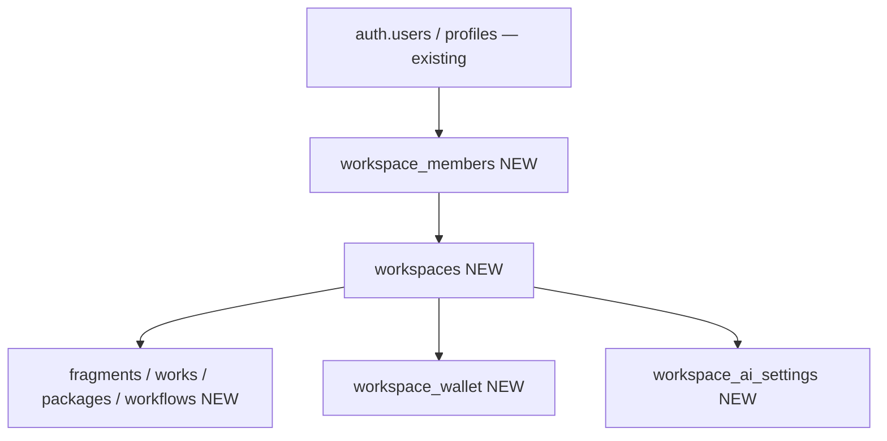
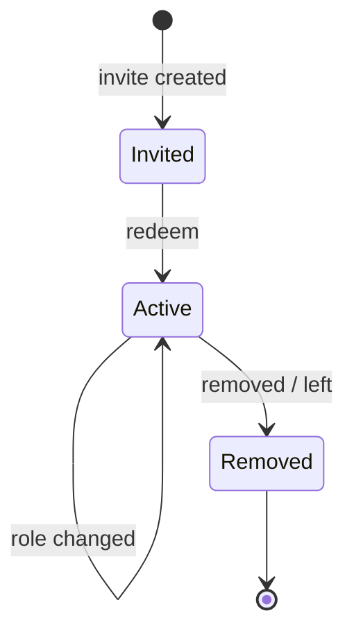
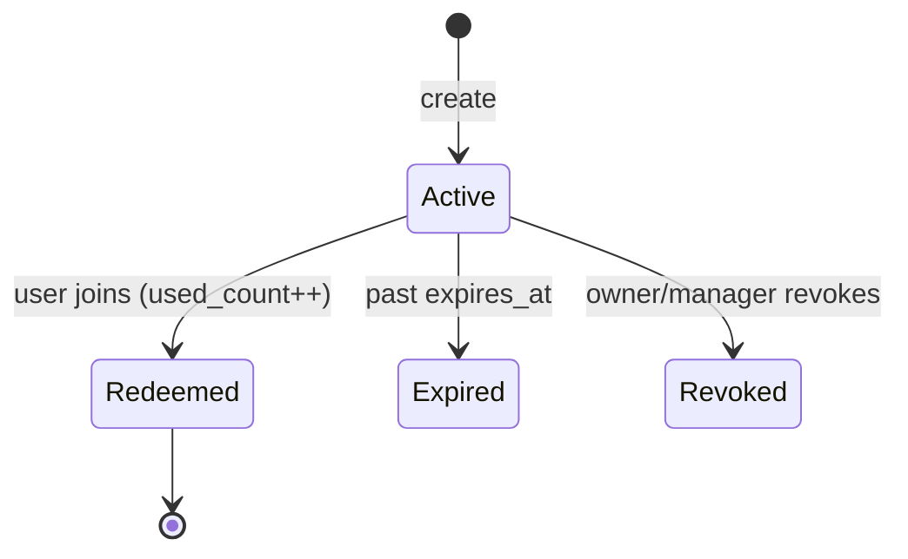
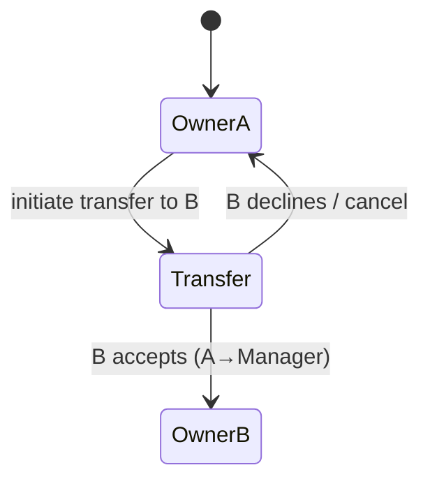
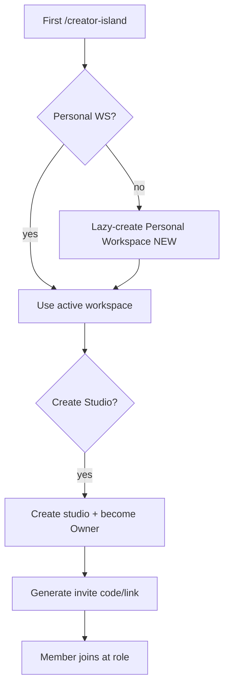

# 04 — Workspace

> The workspace system: types, roles, membership, invitations, owner transfer, wallet, and AI policy. Workspaces are the ownership + collaboration boundary for all durable Ideas OS assets (`workspace_id`).
> Locked decisions: `00_LOCKED_DECISIONS.md` (D2–D6). Schemas: `13_DATABASE.md`. APIs: `14_API.md`.

---

## Purpose

Define how ownership and collaboration work so every other subsystem can rely on a stable `workspace_id` boundary. This is the foundation that makes Ideas OS team-ready from day one without future migrations.

## Overview

A **Workspace** owns durable assets and groups members with roles. A user can belong to many workspaces; a workspace can have many members. Every user gets a **Personal Workspace** (lazy-created on first `/creator-island` access). **Studio Workspaces** add team collaboration. Workspace roles are separate from platform roles.

## Terminology

| Term | UI (繁中) | Meaning |
|---|---|---|
| Workspace | 工作空間 | Ownership/collaboration boundary. |
| Personal Workspace | 個人工作空間 | Default single-user workspace, lazy-created. |
| Studio Workspace | 工作室 | Multi-member team workspace. |
| Member | 成員 | A human in a workspace (AI agents are NOT members). |
| Role | 角色 | Owner / Manager / Contributor / Viewer. |
| Invitation | 邀請 | Code/link to join a workspace at a role. |
| Workspace Wallet | 共享額度 | Shared Z 幣 allowance for the workspace. |

## Design Goals

1. **Workspace-first ownership** — never bind new durable assets to `user_id`.
2. **Lazy, non-intrusive** — Personal Workspace created on first island access, not at signup.
3. **Team from day one** — Studio, roles, invites, transfer in v1.
4. **Clear authority** — exactly one Owner; transfer is explicit and safe.
5. **Separation** — workspace roles ≠ platform roles; AI = resource, not member.

## Core Concepts (entities)

### Entity: Workspace
- **Definition:** the boundary that owns assets and holds members + wallet + AI policy.
- **Ownership:** `owner_id` → `profiles`; durable assets reference `workspace_id`.
- **Metadata:** `name, type(personal|studio), visibility, settings jsonb, created_by, timestamps`.
- **Lifecycle/State machine:**

```mermaid
stateDiagram-v2
  [*] --> Active: create / lazy-create
  Active --> Active: add/remove members, transfer owner
  Active --> Archived: owner archives (studio)
  Archived --> Active: owner restores
  Active --> Deleted: owner deletes (studio; personal not deletable)
  Deleted --> [*]
```

- **Permission:** see matrix below. **Version:** settings changes audited. **Lineage:** N/A (container). **Example:** `{id, name:'SnowRealm Studio', type:'studio', owner_id}`.

### Entity: Workspace Member
- **Definition:** a human's membership + role in a workspace. (AI agents are never members — see `07_AI_SYSTEM.md`.)
- **Ownership:** belongs to a `workspace_id`; the row's subject is a `user_id` (`profiles`).
- **Metadata:** `id, workspace_id, user_id, role, invited_by, joined_at`.
- **Lifecycle/State machine:**

- **Permission:** Owner/Manager manage members; Contributor/Viewer cannot.
- **Version:** role changes are audited in `audit_logs` (no row snapshots needed).
- **Lineage:** N/A (membership is not a creative asset).
- **Example:** `{workspace_id, user_id, role:'contributor', invited_by, joined_at}`.

### Entity: Invitation
- **Definition:** a code/link granting join at a target role.
- **Ownership:** belongs to a `workspace_id`; created by an Owner/Manager.
- **Metadata:** `id, workspace_id, code(hashed), role, created_by, expires_at, max_uses, used_count`.
- **Lifecycle/State machine:**

- **Permission:** Owner/Manager create/revoke; any authed user may redeem a valid code.
- **Version:** create/revoke audited. **Lineage:** N/A.
- **Example:** `{workspace_id, code:'ABC123', role:'contributor', max_uses:10, used_count:0}`.

### Entity: Workspace Wallet
- **Definition:** the workspace's shared **Z 幣 allowance** (same currency unit as `coin_transactions`; a separate shared ledger, not a new currency — ADR-003).
- **Ownership:** one per `workspace_id`; managed by Owner/Manager.
- **Metadata:** `id, workspace_id, balance, low_balance_threshold, updated_at`.
- **Lifecycle:** created with workspace → topped up → debited by spends → (can hit 0 → spends fall back/stop).
- **Permission:** Owner/Manager read/manage; spends executed server-side via Cost Manager.
- **Version:** balance changes recorded in `workspace_wallet_tx`. **Lineage:** N/A.
- **Example:** `{workspace_id, balance:5000, low_balance_threshold:500}`.

### Entity: Workspace Wallet Tx
- **Definition:** the workspace wallet ledger (one row per credit/debit).
- **Ownership:** belongs to a `workspace_id`; subject `user_id` is the actor.
- **Metadata:** `id, workspace_id, user_id, amount(+credit/−debit), balance_after, reason, meta jsonb, created_at`.
- **Lifecycle:** append-only (immutable rows).
- **Permission:** members read; system writes only.
- **Version:** immutable ledger (no edits). **Lineage:** may reference the `agent_runs` row that caused an AI spend.
- **Example:** `{workspace_id, user_id, amount:-12, balance_after:4988, reason:'ai:evolve', meta:{agentRunId}}`.

### Entity: Workspace AI Settings
- **Definition:** per-workspace AI policy + resource configuration (budgets, allowed agents, model preferences). AI agents are resources here, not members.
- **Ownership:** one per `workspace_id`; managed by Owner/Manager.
- **Metadata:** `id, workspace_id, monthly_budget, allowed_agents[], model_preference, byok_allowed, limits jsonb`.
- **Lifecycle:** created with workspace → edited by Owner/Manager.
- **Permission:** Owner/Manager manage; read by Cost Manager/Model Router at runtime.
- **Version:** changes audited. **Lineage:** N/A. Detail: `07_AI_SYSTEM.md`.
- **Example:** `{workspace_id, monthly_budget:10000, allowed_agents:['synthesize','evolve','compose'], byok_allowed:true}`.

### Owner transfer rules
Exactly one Owner at all times. Owner can transfer; old owner becomes Manager; Owner cannot leave before transferring; Manager cannot transfer.

## Business Rules

- Personal Workspace: one per user, created lazily, **not deletable**, owner is the user.
- Studio Workspace: many per user; deletable by Owner; must always have exactly one Owner.
- Switching active workspace changes the data shown (fragments/works/members/wallet/AI budget).
- AI agents are workspace **resources** (`workspace_ai_settings` / resources), never `workspace_members`.
- Workspace Wallet is a shared Z 幣 allowance; spends route through the Cost Manager.

## User Flow

## Mermaid Diagram(s)

| Diagram | Section | Purpose |
|---|---|---|
| Entity wiring (flowchart) | Overview | users→members→workspaces→assets/wallet/AI. |
| Workspace lifecycle (state) | Entity: Workspace | Active/Archived/Deleted. |
| Member lifecycle (state) | Entity: Workspace Member | Invited/Active/Removed. |
| Invitation lifecycle (state) | Entity: Invitation | Active/Redeemed/Expired/Revoked. |
| Owner transfer (state) | Owner transfer rules | Safe single-owner transfer. |
| First-time + studio (flowchart) | User Flow | Lazy-create + studio + invite. |

## Database Considerations

Authoritative in `13_DATABASE.md`. NEW tables:

| Table (NEW) | Purpose | PK | Key FK | Indexes | Constraints | RLS |
|---|---|---|---|---|---|---|
| `workspaces` | Ownership boundary | `id uuid` | `owner_id`→profiles, `created_by`→profiles | `(owner_id)` | `type` in (personal,studio); one personal per user (partial unique) | member read; Owner/Manager update; Owner delete (studio only) |
| `workspace_members` | Membership + role | `id uuid` | `workspace_id`, `user_id` | unique `(workspace_id,user_id)`, `(user_id)`, partial unique `(workspace_id) WHERE role='owner'` | `role` in (owner,manager,contributor,viewer); **exactly one** owner per workspace (enforced by partial unique + transfer flow) | member read; Owner/Manager manage |
| `workspace_invitations` | Join codes/links | `id uuid` | `workspace_id`, `created_by` | unique `(code)`, `(workspace_id)` | `role` in enum; `expires_at`, `max_uses` | Owner/Manager manage; public read by code at redeem |
| `workspace_wallet` | Shared Z 幣 allowance | `id uuid` | `workspace_id` | unique `(workspace_id)` | `balance >= 0` | Owner/Manager read/manage |
| `workspace_wallet_tx` | Wallet ledger | `id bigserial` | `workspace_id`, `user_id` | `(workspace_id,created_at)` | `amount`, `balance_after`, `reason` | member read; system write |
| `workspace_ai_settings` | Per-workspace AI policy/resources | `id uuid` | `workspace_id` | unique `(workspace_id)` | budget/limits jsonb | Owner/Manager manage |

Example `workspaces` row: `{id, name:'夜貓工作室', type:'studio', owner_id, created_at}`. Migrations per table with RLS mirroring `idea_fragments_migration.sql`. The Workspace Wallet uses the **same Z 幣 unit** as `coin_transactions` (it is a separate shared ledger, not a new currency — see ADR-003).

## API Considerations

NEW, indicative — authoritative in `14_API.md`:

| Method | Route (NEW) | Permission | Request | Response | Errors |
|---|---|---|---|---|---|
| GET | `/api/creator-island/workspaces` | authed | — | `{workspaces[]}` | 401 |
| GET | `/api/creator-island/workspaces/active` | authed | — (lazy-creates personal) | `{workspace}` | 401 |
| POST | `/api/creator-island/workspaces` | authed | `{name,type:'studio'}` | `{workspace}` | 401/422 |
| POST | `/api/creator-island/workspaces/{id}/members` | Owner/Manager | `{userId,role}` | `{member}` | 401/403/409 |
| PATCH | `/api/creator-island/workspaces/{id}/members/{uid}` | Owner/Manager | `{role}` | `{member}` | 401/403/409 |
| POST | `/api/creator-island/workspaces/{id}/invitations` | Owner/Manager | `{role,expiresAt,maxUses}` | `{code}` | 401/403 |
| POST | `/api/creator-island/invitations/{code}/redeem` | authed | — | `{workspace}` | 401/404/409(expired) |
| POST | `/api/creator-island/workspaces/{id}/transfer` | Owner | `{toUserId}` | `{ok}` | 401/403/409 |
| DELETE | `/api/creator-island/workspaces/{id}` | Owner (studio) | — | `{ok}` | 401/403/409 |

## Permission Model

| Action | Owner | Manager | Contributor | Viewer |
|---|:--:|:--:|:--:|:--:|
| View workspace + assets | ✅ | ✅ | ✅ | ✅ |
| Create/edit assets, run AI | ✅ | ✅ | ✅ | ❌ |
| Invite / remove members, set roles | ✅ | ✅ | ❌ | ❌ |
| Manage wallet / AI budget / settings | ✅ | ✅ | ❌ | ❌ |
| Publish to marketplace | ✅ | ✅ | ❌ | ❌ |
| Transfer ownership | ✅ | ❌ | ❌ | ❌ |
| Delete / archive workspace (studio) | ✅ | ❌ | ❌ | ❌ |

Manager is a **limited workspace management role** — it is **not** an "admin" role (the term "admin" is reserved for platform roles per D6) and **cannot** delete the workspace or transfer ownership. Platform admin is unrelated to workspace roles.

## UI Considerations

- Persistent workspace switcher in the header; active workspace always visible.
- Studio management page: members table, role dropdowns, invite link/code with copy, transfer + delete (Owner only).
- Clear 繁中 confirmation on destructive/owner actions (transfer, delete). Save-target safety: warn before saving into an unexpected workspace.

## Edge Cases

- Last Owner tries to leave/be demoted → blocked ("必須先轉移擁有權").
- Expired/maxed invitation redeem → 409 with clear message.
- User already a member redeems again → no duplicate, surface existing membership.
- Personal Workspace delete attempt → blocked.
- Workspace deleted while a member is active in it → graceful redirect to another workspace.

## Security

- RLS scopes every workspace table to its members; role checks server-side.
- Invitation codes are unguessable, expirable, revocable, usage-capped, and **stored hashed** (store a hash, compare on redeem) so redeemable secrets are never persisted in plaintext (detail in `13_DATABASE.md`).
- Transfer/delete/role-change write `audit_logs`.
- Wallet operations are server-only and audited.

## Performance

- Cache active-workspace membership per request.
- Index `(workspace_id, …)` on all child tables.
- Invitation redeem path indexed by `code`.

## Testing

- Lazy-create: first island access with no personal workspace creates exactly one.
- Single-owner invariant: cannot demote/remove the only Owner; transfer keeps exactly one Owner.
- Role gates: Contributor cannot invite; Viewer cannot edit; only Owner transfers/deletes.
- Invitation: expiry, max_uses, revoke, duplicate redeem all handled.
- RLS: non-member cannot read/write workspace assets.
- Personal workspace non-deletable.

## Future Expansion

- Organization workspaces (workspaces of workspaces).
- Granular custom roles / per-asset sharing.
- Studio public profile pages + studio marketplace storefront.
- Seat-based billing; shared subscription.

## Implementation Notes

- Active workspace resolution lives in `src/lib/creator-engine/workspace.ts`; lazy-create on first `/creator-island` load.
- Reuse existing auth (`profiles`) and Z 幣 unit; wallet is a new shared ledger, not a new currency.
- AI policy/resources tables back the AI Layer (`07_AI_SYSTEM.md`); agents are resources, not members.

## MVP vs Future

- **MVP:** workspaces, members, roles, invitations, owner transfer, personal lazy-create, studio create, basic wallet + AI settings.
- **Future:** organizations, custom roles, public studio pages, seat billing.

---

## Change log

- 2026-06-28 — Initial workspace spec (D2–D6 grounded).
