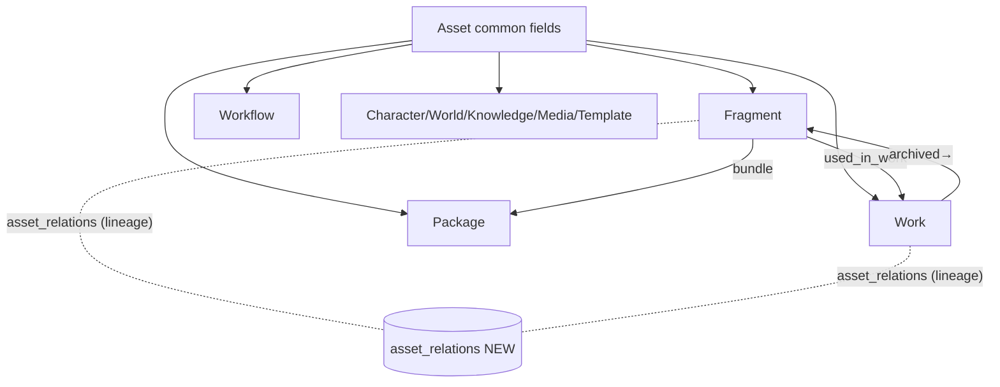
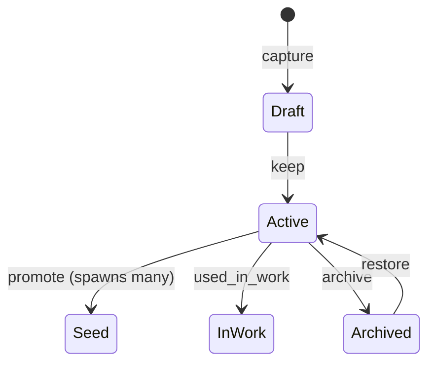
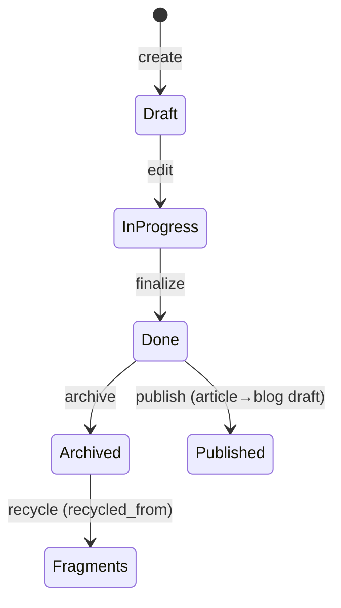
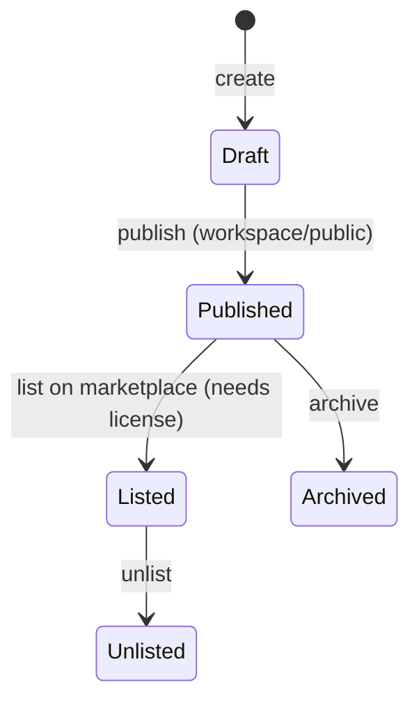
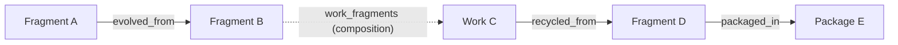
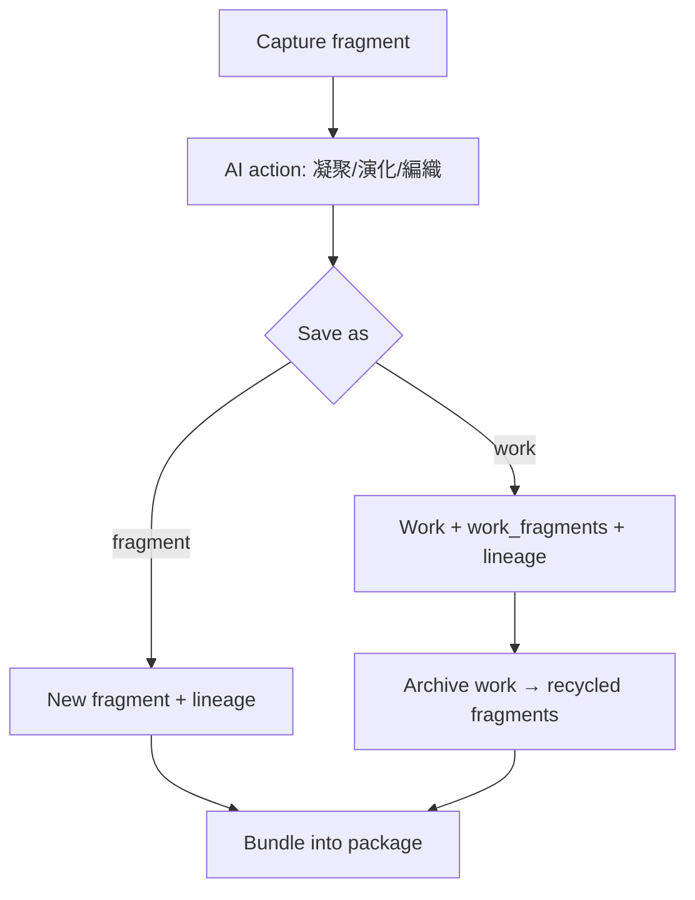

# 05 — Asset System

> The asset abstraction and its types (Fragment, Work, Package, Collection, plus Character/World/Knowledge/Media/Template/Workflow), with ownership, metadata, versioning, lineage, fingerprinting, search, and analytics.
> Locked decisions: `00_LOCKED_DECISIONS.md`. Conceptual model: `01_IDEAS_OS_SPEC.md`. Schemas: `13_DATABASE.md`. Creation actions: `06_CREATION_ENGINE.md`.

---

## Purpose

Define the common asset model so every reusable creative resource shares consistent ownership, metadata, permission, versioning, lineage, and search behavior — instead of each feature inventing its own storage. This is the backbone of "assets over outputs."

## Overview

An **Asset** is any reusable, referenceable, versionable, permission-controlled resource owned by a workspace. Fragments and Works are the v1 core; the model is general enough for Packages, Collections, Characters, Worlds, Knowledge, Media, Templates, and Workflows.

## Terminology

| Term | UI (繁中) | Meaning |
|---|---|---|
| Asset | 創作資產 | Reusable, versionable, permissioned resource. |
| Fragment | 碎片 | Smallest idea unit. |
| Seed Fragment | 種子碎片 | A fragment that spawns many. |
| Work | 作品 | Composed output. |
| Package | 套組 | Bundle of assets for share/sell/reuse. |
| Collection | 收藏集 | Many-to-many grouping (an asset can be in several). |
| Lineage | 來源脈絡 | Traceable relation history. |
| Fingerprint | 指紋 | Content hash + embedding identity signal. |
| source_type | 來源類型 | How the asset was produced. |

## Design Goals

1. **One abstraction, many types** — consistent metadata/permission/version/lineage/search.
2. **Lineage as relations** — never plain text; every derivation is an edge.
3. **Provenance always** — `source_type` records human/AI involvement.
4. **Reuse-first** — archiving a Work yields new fragments; nothing is a dead end.
5. **Findable** — keyword + semantic + relationship search.

## Core Concepts (entities)

### Asset common fields
`id, workspace_id, asset_type, title, description, tags[], language, culture, visibility, license_id, source_type, fingerprint, metadata jsonb, created_by, created_at, updated_at`. Implemented either as a shared `assets` table or as common columns on each type table (decided in `13_DATABASE.md`); behavior is identical.

`source_type` enum (locked): `human_original · ai_generated · ai_assisted · human_selected · work_recycled · egg_generated · market_imported · transcreated`.

### Entity: Fragment
- **Definition:** the smallest meaningful idea unit (a line, memory, scene, product thought, web clip, prompt seed).
- **Ownership:** `workspace_id`. **Metadata:** tags, mood, type, language, culture, embedding, fingerprint.
- **Lifecycle/State machine:**

- **Permission:** workspace role matrix. **Version:** edits snapshot. **Lineage:** evolved_from/condensed_from/recycled_from/transcreated_from. **Example:** `{asset_type:'fragment', title:'我墊著腳尖走在妳的世界', source_type:'human_original', tags:['歌詞']}`.

### Entity: Work
- **Definition:** a completed/semi-completed output composed from assets (song, article, story, script, product plan, course, …).
- **Ownership:** `workspace_id`; `created_by`.
- **Metadata table:**

| Field | Type | Notes |
|---|---|---|
| work_type | enum | song/article/story/script/product_plan/course/worldbuilding/… |
| status | enum | draft / in_progress / done / archived |
| body | text/jsonb | content (large media in R2) |
| source_type | enum | provenance |
| language, culture | text | for transcreation |

- **Lifecycle/State machine:**

- **Permission:** workspace role matrix. **Version:** each save can snapshot to `asset_versions` (rollback supported).
- **Lineage:** **composition** (which fragments make up the work) is canonical in `work_fragments`; **derivation** lineage (e.g. this work remixed from another work) is in `asset_relations`. Source fragments are never lost.
- **Publish:** `article` → blog draft on explicit request (Work stays canonical).
- **Example:** `{asset_type:'work', work_type:'song', title:'夜車', status:'draft', source_type:'ai_assisted'}`.

### Entity: Package
- **Definition:** a curated bundle of assets for share/sell/transfer/reuse (Fragment Pack, Prompt Pack, Workflow Pack, Character Pack…).
- **Ownership:** `workspace_id`; created by Owner/Manager.
- **Metadata:** `id, workspace_id, title, description, items, visibility(private/workspace/public/marketplace), license_id, price, created_by`.
- **Lifecycle/State machine:**

- **Permission:** Owner/Manager create/publish/list; members view per visibility.
- **Version:** package contents snapshot on publish. **Lineage:** items recorded via `packaged_in` edges in `asset_relations`.
- **Example:** `{asset_type:'package', title:'失戀歌詞碎片包', items:['frag_A','frag_B'], visibility:'marketplace', license_id, price:200}`. Detail: `10_MARKETPLACE.md`.

### Entity: Collection
- **Definition:** a many-to-many grouping for *meaning*, not ownership. An asset can belong to several collections; removing it from a collection never deletes the asset.
- **Ownership:** `workspace_id`; created by any Contributor+.
- **Metadata:** `collections{id, workspace_id, name, created_by}` + `collection_items{collection_id, asset_id}`.
- **Lifecycle:** created → items added/removed → archived/deleted (items survive).
- **Permission:** Contributor+ manage own; members view. **Version:** N/A (membership only). **Lineage:** N/A (organizational, not derivational).
- **Example:** a fragment in 初戀 / 青春 / 歌詞素材 / Nami project simultaneously.

### Future entity: Agent Blueprint-as-asset
- **Definition:** an agent **Blueprint/Template** (prompt, tools, memory policy, allowed models, cost policy, output schema, retry, temperature, variables) — versionable, forkable, sellable. The **running** agent instance is NOT an asset (it is a runtime Resource — `07`, ADR-015).
- **Ownership/Metadata/Permission/Version/Lineage:** shares the asset common fields; `asset_type='agent_blueprint'`; lineage via `forked_from`/`remixed_from`. Not built in v1; enables a future Agent Marketplace (`10`).

### Future entity: Workflow-as-asset
- **Definition:** a reusable creative process; it is an asset type (versionable, forkable, sellable). Full spec in `09_WORKFLOW_ENGINE.md`.
- **Ownership/Metadata/Permission/Version/Lineage:** same asset common fields; `asset_type='workflow'`; lineage via `forked_from`/`remixed_from`. Listed here only to confirm it shares the asset abstraction; not built in v1.

### Asset Graph & Lineage

**Two distinct mechanisms — single source of truth each (no overlap):**

| Mechanism | Canonical for | Table |
|---|---|---|
| **Composition** | which fragments make up a Work (membership) | `work_fragments` (NEW) |
| **Derivation lineage** | how assets descend from one another | `asset_relations` (NEW) |

`asset_relations` `relation_type` enum (derivation only): `evolved_from, condensed_from, recycled_from, transcreated_from, inspired_by, remixed_from, forked_from, quoted_by, packaged_in`. **`used_in_work` is deliberately NOT an `asset_relations` type** — composition is owned solely by `work_fragments` to avoid forking the source of truth. (If a read needs "where is this fragment used", it queries `work_fragments`, not `asset_relations`.)

### Fingerprint
`content hash + semantic embedding (+ optional semantic hash)` for duplicate detection, similarity, plagiarism-dispute support, search, and recommendation. Embeddings via pgvector (as `idea_fragments` already does).

## Business Rules

- Every asset has `workspace_id` + `source_type`; AI-produced assets must set an AI source_type and at least one lineage edge.
- Deleting a source asset never silently breaks lineage — edges keep a "deleted source" marker.
- Visibility ladder: private → workspace → public → marketplace; public/marketplace require a license (`10_MARKETPLACE.md`).
- Archiving a Work should generate reusable fragments (recycle), not destroy value.
- Versioning: edits create snapshots; restore/rollback supported (depth per `13_DATABASE.md`).

## User Flow

## Mermaid Diagram(s)

| Diagram | Section | Purpose |
|---|---|---|
| Asset type tree (flowchart) | Overview | Common fields → types; composition vs lineage. |
| Fragment lifecycle (state) | Entity: Fragment | Draft→Active→Seed/InWork→Archived. |
| Work lifecycle (state) | Entity: Work | Draft→InProgress→Done→Archived/Published/recycle. |
| Package lifecycle (state) | Entity: Package | Draft→Published→Listed→Unlisted/Archived. |
| Lineage graph (flowchart) | Asset Graph & Lineage | Derivation vs composition example. |
| Save/recycle flow (flowchart) | User Flow | Capture→AI→save→archive→bundle. |

## Search, Recommendation & Analytics

Per-entity behavior (recommendation/search engine detail lives in `07_AI_SYSTEM.md` and `12_GROWTH_ENGINE.md`; UI behavior in `16_UI_UX.md`; vectors reuse pgvector as `idea_fragments` already does):

| Entity | Search | Recommendation | Analytics |
|---|---|---|---|
| Fragment | keyword (title/content/ai_summary) + tag + semantic (embedding) + surprising-pairs (mid-similarity band, reusing `idea_surprising_pairs`) | "fragments to combine", "related to this", seed candidates | times reused, evolved-from count, used-in-works count |
| Work | keyword + by work_type/status + semantic over body | "fragments to add", "archive into N fragments", transcreation targets | completion rate, fragments consumed, publish/derivation counts |
| Package | keyword + tag + marketplace facets | "bundle these fragments", "similar packs" | views, collects, sales (Z 幣), revenue (→ `10`) |
| Collection | name/tag | "add this asset to collection X" | size, growth over time |

- **Duplicate/similarity:** fingerprint (content hash + embedding) powers duplicate detection and plagiarism-dispute evidence.
- **Recommendation inputs:** asset graph + tags + embeddings + workspace/personal memory + usage history (see `08_MEMORY_SYSTEM.md`, `12_GROWTH_ENGINE.md`).
- All search/list paths paginate (1000-row limit).

## Database Considerations

Authoritative in `13_DATABASE.md`. NEW tables:

| Table (NEW) | Purpose | PK | Key FK | Indexes | Constraints | RLS |
|---|---|---|---|---|---|---|
| `fragments` | Fragment assets | `id uuid` | `workspace_id`, `created_by` | `(workspace_id,created_at)`, tags GIN, embedding ivfflat | `source_type` in enum; title 1..200 | workspace-scoped |
| `works` | Work assets | `id uuid` | `workspace_id`, `created_by` | `(workspace_id,updated_at)` | `work_type`,`status` in enum | workspace-scoped |
| `work_fragments` | Work↔fragment | `id bigserial` | `work_id`,`fragment_id` | unique `(work_id,fragment_id)` | — | inherit from work's workspace |
| `asset_relations` | Lineage edges | `id bigserial` | `from_asset_id`,`to_asset_id` | `(from_asset_id)`,`(to_asset_id)` | `relation_type` in enum | inherit owning workspace |
| `asset_versions` | Snapshots | `id bigserial` | `asset_id` | `(asset_id,created_at)` | `version_no` increasing | workspace-scoped |
| `packages` | Bundles | `id uuid` | `workspace_id` | `(workspace_id)` | `visibility` in enum | workspace; public read if public |
| `collections` + `collection_items` | Groupings | `id uuid`/`bigserial` | `workspace_id`/`collection_id`,`asset_id` | `(collection_id)`, unique item | — | workspace-scoped |

Example `asset_relations` row (derivation only): `{from_asset_id:'frag_A', to_asset_id:'frag_B', relation_type:'evolved_from'}`. Example `work_fragments` row (composition): `{work_id:'work_C', fragment_id:'frag_B'}`. Reuse the pgvector + GIN + RLS patterns from `idea_fragments_migration.sql`. Embedding backfill mirrors the existing admin approach (`/api/admin/idea-fragments/embed-backfill` + `idea_surprising_pairs` RPC in `src/lib/idea-ai.ts`).

## API Considerations

NEW, indicative — authoritative in `14_API.md`:

| Method | Route (NEW) | Permission | Request | Response | Errors |
|---|---|---|---|---|---|
| POST | `/api/creator-island/fragments` | Contributor+ | `{workspaceId,title,content,tags}` | `{fragment}` | 401/403/422 |
| GET | `/api/creator-island/fragments` | member | `?workspaceId&cursor&q&tag` | `{fragments[],nextCursor}` | 401/403 |
| PATCH | `/api/creator-island/fragments/{id}` | Contributor+ | `{...}` | `{fragment}` | 401/403/404 |
| POST | `/api/creator-island/works` | Contributor+ | `{workspaceId,workType,title,fragmentIds}` | `{work}` | 401/403/422 |
| POST | `/api/creator-island/works/{id}/archive` | Contributor+ | — | `{recycledFragments[]}` | 401/403/404 |
| GET | `/api/creator-island/assets/{id}/lineage` | member | — | `{edges[]}` | 401/403/404 |
| POST | `/api/creator-island/packages` | Owner/Manager | `{workspaceId,items[],visibility}` | `{package}` | 401/403/422 |

List endpoints paginate (1000-row limit).

## Permission Model

| Action | Owner | Manager | Contributor | Viewer |
|---|:--:|:--:|:--:|:--:|
| View assets / lineage | ✅ | ✅ | ✅ | ✅ |
| Create/edit/version assets | ✅ | ✅ | ✅ | ❌ |
| Archive / restore | ✅ | ✅ | ✅ | ❌ |
| Create package / set public | ✅ | ✅ | ❌ | ❌ |
| Delete asset | ✅ | ✅ | ❌(own only, setting) | ❌ |

Public/marketplace visibility additionally requires a license (license rules in `10_MARKETPLACE.md`; workflow-as-asset details in `09_WORKFLOW_ENGINE.md`).

## UI Considerations

- Fragment Library + Work Library reuse the source_type/tag chips style from `/admin/idea-fragments` (shared service), but as user-facing 繁中 UI.
- Lineage view (later) renders `asset_relations` as a graph; v1 shows "用到碎片" links.
- Empty states invite capture; never show raw enum values.

## Edge Cases

- Duplicate fragment (same fingerprint) → flag as duplicate; may yield Dust (not money).
- Deleted source in lineage → edge kept with "deleted source" marker.
- Cross-workspace reuse → recorded as a derivation, not a silent reparent.
- Embedding unavailable → asset still saves; semantic search degrades gracefully.
- Large body work → store body in row/JSON; large media in R2.

## Security

- RLS scopes assets to workspace members; public assets readable per visibility.
- AI-source assets always labeled; lineage immutable except additive edges.
- Media uploads validated (type/size) via existing R2 path.

## Performance

- pgvector ivfflat for semantic; GIN for tags; `(workspace_id,created_at)` for lists.
- Paginate everything; backfill embeddings asynchronously.
- Snapshot versions stored compactly (diff or full per `13_DATABASE.md`).

## Testing

- Provenance: AI action output always sets AI `source_type` + ≥1 lineage edge.
- Lineage integrity: deleting a source keeps edges with marker; no orphan crash.
- Recycle: archiving a Work yields fragments linked via `recycled_from`.
- Visibility: public/marketplace blocked without a license.
- RLS: non-member cannot read workspace assets; pagination enforced.

## Future Expansion

- Full lineage graph UI + diff/branch/merge for assets.
- Character/World/Knowledge/Media/Template as first-class typed editors.
- Similarity/duplicate-cluster discovery; plagiarism-dispute tooling.
- Cross-asset recommendation (engine in `07_AI_SYSTEM.md` / `12_GROWTH_ENGINE.md`).

## Implementation Notes

- Asset CRUD + lineage helpers live in `src/lib/creator-engine/` (fragments.ts, lineage.ts), shared with `/admin/idea-fragments`.
- Reuse existing embedding + surprising-pairs logic from the admin tool: `src/lib/idea-ai.ts` (`fetchSurprisingPairs`, `embedFragmentRow`), the `idea_surprising_pairs` RPC, and `/api/admin/idea-fragments/embed-backfill`. Extract the shared parts into `src/lib/creator-engine/` without changing admin behavior.
- Decide shared `assets` table vs per-type common columns in `13_DATABASE.md` before coding.

## MVP vs Future

- **MVP:** fragments, works, work_fragments, asset_relations (basic), source_type, tags, embeddings, archive→recycle, basic versions.
- **Future:** packages/collections UI, full lineage graph, other asset types, advanced versioning (branch/merge), dispute tooling.

---

## Change log

- 2026-06-28 — Initial asset system (locked source_type enum + lineage-as-relations).
