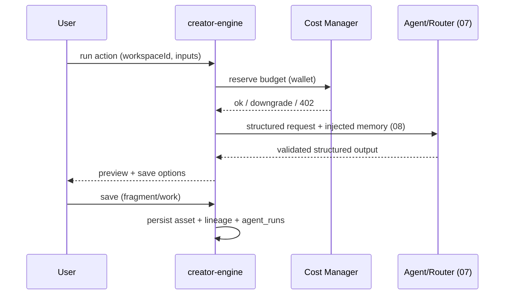

# 06 — Creation Engine

> The creative loop that turns a vague feeling or scattered fragments into a finished work and back into reusable assets: Incubate → Synthesize → Evolve → Transcreate → Compose → Archive, plus Fragment Eggs (Dust). Defines each creation action's input/output, save behavior, cost, and provenance.
> Locked decisions: `00_LOCKED_DECISIONS.md`. Agents/models: `07_AI_SYSTEM.md`. Assets: `05_ASSET_SYSTEM.md`.

---

## Purpose

Define the user-facing creation actions and the engine that runs them, so the product delivers the Ideas OS loop (not isolated "generate" buttons). Each action is a thin product surface over an AI agent (`07`) that produces validated, structured output saved as assets with lineage (`05`).

## Overview

The Creation Engine orchestrates creation **actions**. v1 ships three (凝聚/演化/編織); the rest are future. Every action: takes assets/input from the active workspace → runs an agent via the AI Layer (Model Router → Cost Manager) → returns structured output → offers save-as-asset with `source_type` + lineage → traces in `agent_runs`.

```mermaid
flowchart TD
  F[Feeling / fragments] --> Inc[孵化 Incubate (future)]
  Inc --> Syn[凝聚 Synthesize v1]
  Syn --> Evo[演化 Evolve v1]
  Evo --> Tr[文化轉譯 Transcreate (future)]
  Tr --> Com[編織 Compose v1]
  Com --> Arc[回收 Archive (future)]
  Arc --> F
  Egg[今日碎片蛋 (Dust)] --> F
```

## Terminology

| Action | UI (繁中) | Agent | v1? | What it does |
|---|---|---|---|---|
| Incubate | 孵化 | Incubator | later | vague feeling → seed fragment via questions |
| Synthesize | 凝聚 | Synthesizer | ✅ | many fragments → one core idea |
| Evolve | 演化 | Evolutionist | ✅ | seed → many directions/variants |
| Transcreate | 文化轉譯 | Transcreator | later | adapt across language/culture (≠ i18n) |
| Compose | 編織 | Composer | ✅ | fragments → a Work |
| Archive | 回收 | Archivist | later | finished Work → recycled fragments |
| (Judge / Coach) | 評審 / 教練 | Judge/Coach | later | quality scoring / growth coaching |
| Fragment Egg | 碎片蛋 | — | v1-lite | daily Dust-based inspiration drop |

## Design Goals

1. **Actions, not a model box** — users press a creative verb; the system handles the stack.
2. **Always produces assets** — every accepted output is saved with provenance + lineage.
3. **Never lose input** — failures preserve the user's text and offer retry/adjust.
4. **Cost-aware** — cost-bearing actions pass the Cost Manager before any provider call.
5. **Composable** — actions chain into the loop and later into workflows (`09`).

## Core Concepts (actions)

Each action below specifies Input, AI behavior, Output (structured), Save options, Cost, Provenance.

### Synthesize (凝聚) — v1
- **Input:** ≥2 fragments (or a folder/collection) from the active workspace.
- **AI:** find the non-obvious connection and condense into one core idea (reuses the existing synthesis prompt pattern from `idea-ai.ts`).
- **Output (structured):** `{title, summary, coreIdea, connections[], sourceFragmentIds[]}` (validated).
- **Save:** as a new fragment (`source_type='ai_assisted'`) or note; lineage `condensed_from` each source.
- **Cost:** model via Model Router; debit per Cost Manager. **Provenance:** `agent_runs` row.

### Evolve (演化) — v1
- **Input:** 1 seed fragment + count/direction options.
- **AI:** generate N variant fragments exploring different angles.
- **Output:** `{variants:[{title, content}]}` (validated, capped).
- **Save:** selected variants → fragments; lineage `evolved_from` the seed.

### Compose (編織) — v1
- **Input:** fragments + `work_type` (song/article/…).
- **AI:** weave fragments into a Work draft.
- **Output:** `{title, body, usedFragmentIds[]}`.
- **Save:** new Work; composition recorded in `work_fragments`; `source_type='ai_assisted'`.
- **Song output mode (E11, MVP):** when `work_type=song`, Compose additionally returns a complete music package — `{title, lyricsSectioned (Verse/Pre-Chorus/Chorus/Bridge/Outro), sunoPrompt, mvPrompt, usedFragmentIds[]}`. Stored in the Work (`works.body`/metadata); **no new subsystem** — it's a Composer output mode. (Validated: seed → evolve 20 → lyrics → structure → Suno prompt.) Phase-2: cover-art prompt, style library, Suno/Prompt Pack for marketplace.

### Future actions (non-v1 contracts — full prompt/schema specced in `07_AI_SYSTEM.md` per agent when built)
Same contract shape as v1 actions (input → validated structured output → save with provenance + lineage). Listed here so the loop is complete; **not built in v1**:

| Action | Agent | Input | Output (structured) | Lineage on save |
|---|---|---|---|---|
| Incubate (孵化) | Incubator | a vague feeling/phrase + optional Q&A | `{seed:{title,content}, questionsAsked[]}` | new fragment `source_type='ai_assisted'` (root) |
| Transcreate (文化轉譯) | Transcreator | source asset + `targetLanguage` + `targetCulture` | `{output, transcreationNote, sourceAssetId}` | `transcreated_from` (records source + target lang/culture; ≠ UI i18n) |
| Archive (回收) | Archivist | a finished Work | `{recycledFragments:[{title,content}]}` | `recycled_from` the Work |
| Judge (評審) | Judge | N candidate assets + criteria | `{ranked:[{assetId,score,reason}]}` | none (advisory; feeds workflows) |
| Coach (教練) | Coach | creator history scope | `{insights[],suggestions[]}` | none (writes `growth_reports`, `12`) |

Boundary: these actions' **prompts and JSON schemas are owned by `07_AI_SYSTEM.md`** (per-agent contracts); this doc owns their product behavior (input/save/cost).

### Validation & schemas
Each action defines a Zod output schema (validated server-side before save). On schema-mismatch: attempt repair via `extractJson`, then one retry, then fail `502` with input preserved — never save raw. Example (evolve): `z.object({ variants: z.array(z.object({ title: z.string(), content: z.string() })).max(MAX) })`.

### Batch behavior (evolve)
Evolve may request up to a capped `count` (e.g. ≤20) variants per run; runs server-side with progress. Cost is per-variant via Cost Manager; if budget runs out mid-batch, completed variants are saved and the run stops with a clear message. The `/ai/evolve` route is rate-limited (see `14_API.md`: AI group 30/min, 600/day).

### Dust ledger behavior
Fragment Egg spends Dust through the NEW `dust_ledger` (owner `user_id`/`workspace_id`; append-only; `amount`/`balance_after`/`reason`), fully separate from `coin_transactions` (ADR-004). Earning Dust: duplicate fragments, activity, events. Schema in `13_DATABASE.md`.

### Fragment Egg (碎片蛋)
A daily Dust-funded inspiration drop that yields fragment prompts/seeds (habit loop). Dust only — never Z 幣 (ADR-004). Duplicate fragments may yield Dust.

## Business Rules

- An action runs only inside the active workspace; outputs are owned by `workspace_id`.
- Cost-bearing actions go Agent → Model Router → Cost Manager → provider; insufficient wallet → downgrade or `402`, input preserved.
- AI output must be **structured + validated** before being offered for save (D11); invalid → retry/repair, never save raw.
- Accepted AI output sets an AI `source_type` and ≥1 lineage edge (composition via `work_fragments`, derivation via `asset_relations`).
- Fragment Eggs spend Dust, never Z 幣.
- **No token-trap (E10):** the core loop (capture + basic 凝聚/演化/編織) must have a free path + daily free Dust; Z 幣 is charged only for premium models / bulk / commercial output. The Cost Manager defaults to the free/cheap path before charging.

## User Flow



## Mermaid Diagram(s)

| Diagram | Section | Purpose |
|---|---|---|
| Creation loop (flowchart) | Overview | Incubate→…→Archive + Egg. |
| Action run (sequence) | User Flow | Cost → agent → validated output → save. |

## Database Considerations

No new tables of its own; it writes assets (`05`) and `agent_runs` (`07`), and reads/writes Dust balance.

| Concern | Rule |
|---|---|
| Outputs | written to `fragments`/`works` with `workspace_id` + `source_type` |
| Lineage | composition → `work_fragments`; derivation → `asset_relations` |
| Trace | every action writes `agent_runs` (NEW) |
| Dust | egg spends recorded in a Dust ledger (NEW, separate from `coin_transactions`) — see `12`/`13` |
| Pagination | input fragment lists paginate (1000-row limit) |

## API Considerations

NEW, indicative — authoritative in `14_API.md`:

| Method | Route (NEW) | Permission | Request | Response | Errors |
|---|---|---|---|---|---|
| POST | `/api/creator-island/ai/synthesize` | Contributor+ | `{workspaceId, fragmentIds[], options}` | `{result, agentRunId}` | 401/403/402/422/502 |
| POST | `/api/creator-island/ai/evolve` | Contributor+ | `{workspaceId, fragmentId, count, direction}` | `{variants[], agentRunId}` | 401/403/402/422/502 |
| POST | `/api/creator-island/ai/compose` | Contributor+ | `{workspaceId, fragmentIds[], workType}` | `{work, agentRunId}` | 401/403/402/422/502 |
| POST | `/api/creator-island/eggs/open` | Contributor+ | `{workspaceId}` | `{fragments[]}` | 401/403/402(dust) |

`502` = AI/validation failure (input preserved). AI never called from client directly.

## Permission Model

| Action | Owner | Manager | Contributor | Viewer |
|---|:--:|:--:|:--:|:--:|
| Run synthesize/evolve/compose | ✅ | ✅ | ✅ | ❌ |
| Open Fragment Egg | ✅ | ✅ | ✅ | ❌(view only) |
| Save outputs as assets | ✅ | ✅ | ✅ | ❌ |

All cost-bearing actions additionally pass the Cost Manager regardless of role.

## UI Considerations

- Each action shows: required input · what AI will do · estimated cost · save options (存成碎片/存成作品/重試/調整方向/捨棄).
- Loading copy: 正在凝聚碎片… / 正在演化想法… / 正在編織作品…. Traditional Chinese; no raw provider/model names surfaced as the primary UI.
- Output preview is editable before save.

## Edge Cases

- <2 fragments for synthesize → inline guidance, no request.
- AI returns invalid JSON → repair attempt (reuse `extractJson` tolerance), else retry; never save raw.
- Budget hits 0 mid-batch evolve → stop with partial results saved, clear message.
- Dust insufficient for egg → `402`, suggest how to earn Dust.
- Workspace switched mid-action → bind to the workspace the action started in; confirm on save.

## Security

- Server-side workspace authz on every action; RLS on written assets.
- AI keys server-only (existing `ai-crypto`); outputs sanitized before render (reuse `rich-html-server.ts` sanitize for any HTML).
- Cost/Dust spends are server-authoritative and audited.

## Performance

- Inject only relevant memory (`08`), not full history, into prompts.
- Batch evolve runs server-side with progress; stream where supported.
- Reuse rate cache from `ai-usage-log.ts` for cost estimates.

## Testing

- Each action returns validated structured output or a clean error (no raw save).
- Provenance: saved outputs always carry AI `source_type` + correct lineage table.
- Cost path: insufficient wallet → downgrade/402, input preserved.
- Egg: spends Dust only; never touches `coin_transactions`.
- Loop: compose → archive yields fragments linked `recycled_from` (when Archive ships).

## Future Expansion

- Incubate/Transcreate/Archive/Judge/Coach actions.
- Multi-step chains saved as Workflows (`09`).
- Action presets per Creator DNA (`12`).
- Media-generating actions (image/audio) via provider plugins.

## Implementation Notes

- Actions live in `src/lib/creator-engine/ai/agents.ts`; reuse the **exported** `callAI` / `streamAI` (`src/lib/ai-providers.ts`), the model+key resolution pattern from `src/lib/idea-ai.ts` (`resolveIdeaModel`), and usage logging (`src/lib/ai-usage-log.ts`). (Note: `dispatchCallAI` is internal/not exported — wrap `callAI`/`streamAI` in the NEW Model Router instead.)
- Wrap with NEW Model Router + Cost Manager (`07`); write `agent_runs`.
- v1 = synthesize/evolve/compose only; gate the rest behind feature config.

## MVP vs Future

- **MVP:** 凝聚/演化/編織 + basic Fragment Egg; structured output + save + lineage + `agent_runs`.
- **Future:** remaining actions, workflow chaining, DNA presets, media generation.

---

## Change log

- 2026-06-28 — Initial Creation Engine; grounded in existing `ai-providers`/`idea-ai`/`ai-usage-log`.
