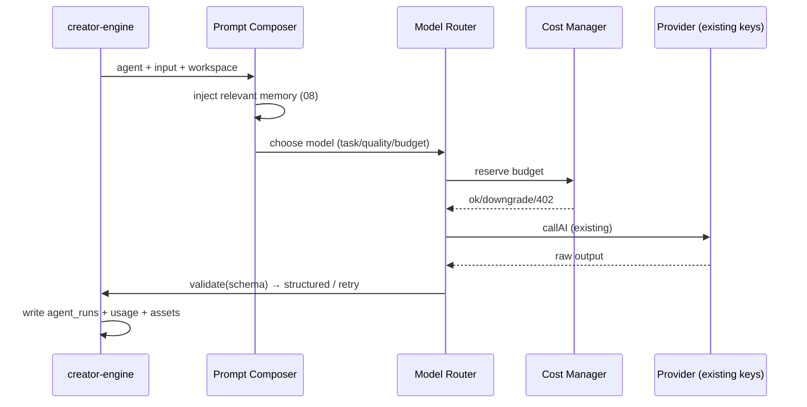

# 07 — AI System

> The AI layer of Ideas OS: agent registry, prompt builder/composer, Model Router, Cost Manager, memory injection, tool calling, retry/evaluation, and `agent_runs`. It wraps the **existing** ai-island-web AI stack — it does not rebuild key storage.
> Locked decisions: `00_LOCKED_DECISIONS.md` (D9–D11). Actions: `06_CREATION_ENGINE.md`. Memory: `08_MEMORY_SYSTEM.md`.

---

## Purpose

Define how AI is structured into specialized, budgeted, logged agents on top of the existing provider/key infrastructure, so AI is swappable, traceable, and cost-controlled — never a single hardcoded chat endpoint.

## Overview

AI is reached only through the AI Layer:

```mermaid
flowchart TD
  A[Agent (role)] --> PB[Prompt Builder/Composer]
  PB --> MI[Memory Injection (08)]
  MI --> MR[Model Router NEW]
  MR --> CM[Cost Manager NEW]
  CM --> K[existing ai_models / ai_api_keys / user_api_keys]
  K --> P[Provider: Anthropic/OpenAI/OpenRouter/BYOK]
  P --> V[Output validation]
  V --> AR[agent_runs NEW]
  V --> U[existing ai_usage_daily / ai_model_usage via logAiUsage]
```

Existing building blocks reused (verified exported): `callAI` / `streamAI` / `estimateCost` (`src/lib/ai-providers.ts`), model+key resolution pattern (`resolveIdeaModel` in `src/lib/idea-ai.ts`), usage logging (`logAiUsage`/`inc_model_usage` in `src/lib/ai-usage-log.ts`), JSON tolerance (`extractJson`), embeddings (`embedText` in `src/lib/ai-embeddings.ts`). (`dispatchCallAI` is internal/not exported; the NEW Model Router wraps `callAI`/`streamAI`.)

## Terminology

| Term | Meaning |
|---|---|
| Agent | A specialized AI role with prompt + schema + model strategy. |
| AI Resource | A model/provider available to a workspace (NOT a member). |
| Model Router (NEW) | Picks the model for a task by quality/budget/policy/fallback. |
| Cost Manager (NEW) | Reserves/debits the right wallet; enforces budget; downgrades/stops. |
| agent_runs (NEW) | Per-task trace of every AI run. |
| Prompt Composer | Assembles prompt = system + injected memory + input. |

## Design Goals

1. **Reuse, don't rebuild** — existing keys/usage tables stay; add only router/cost/trace.
2. **Roles over raw calls** — 8 named agents, each with input/output schema.
3. **Validated output** — structured + schema-validated; retry/repair on failure (D11).
4. **Cost-controlled** — every spend resolves a wallet and respects workspace budget.
5. **Provider-agnostic** — no lock-in; fallback across providers.

## Core Concepts (entities)

### Entity: Agent
- **Definition:** a specialized AI role. **Ownership:** global registry; invoked within a workspace.
- **Metadata:** `key, name(繁中), purpose, input_schema, output_schema(zod/json), model_strategy, cost_policy`.
- **Registry (8):** Incubator(孵化), Synthesizer(凝聚), Evolutionist(演化), Transcreator(文化轉譯), Composer(編織), Archivist(回收), Judge(評審), Coach(教練). v1 active: Synthesizer/Evolutionist/Composer.
- **Each agent specifies:** Purpose · Input · Output schema · Prompt strategy · Failure handling.
- **Lifecycle:** request → compose prompt → route model → call → validate → log → return.
- **Permission:** Contributor+ to invoke; allowed set per `workspace_ai_settings`. **Version:** prompt versions tracked. **Lineage:** N/A (produces assets that carry lineage).
- **Example:** `{key:'evolve', name:'演化', output_schema:'{variants:[{title,content}]}'}`.

### Blueprint vs Runtime (ADR-015)

An agent has two layers — design (Asset, future) and execution (Resource, now):

```txt
Agent Blueprint / Template (ASSET, FUTURE)   ← prompt, tools, memory policy, allowed models,
        │ instantiate                            cost policy, output schema, retry, temperature, variables
        ▼                                        → version / fork / remix / import / export / marketplace
Running Agent Instance (RUNTIME RESOURCE, NOW) ← workspace, model, memory injected, cost, status
        │ executes                               → never an Asset, never a member
        ▼
agent_runs (execution log)
```

- **v1:** agents are a fixed registry of runtime **Resources** (the 8 below); no Blueprint-as-Asset yet.
- **Future:** `agent_blueprints` (asset) + `agent_prompts` back the Blueprint store; an Agent Marketplace sells Blueprints, not running AI (`05`/`10`).

### Entity: AI Resource
- **Definition:** a model/provider configured for a workspace (resource, not member — D11/ADR-005).
- **Metadata:** `workspace_id, provider, model, api_key_ref(existing ai_api_keys/user_api_keys), role, priority, budget, allowed_agents[], limits`.
- **Permission:** Owner/Manager manage. **Version:** changes audited. **Lineage:** N/A.
- **Example:** `{workspace_id, provider:'anthropic', model:'claude-…', priority:1, budget:5000}`.

### Entity: Agent Run
- **Definition:** one execution of an agent.
- **Metadata:** `id, workspace_id, user_id, agent_type, input, output, model, provider, tokens_in, tokens_out, cost_usd, status, error, created_assets[], created_at`.
- **Lifecycle:** running → succeeded/failed (replayable where possible).
- **Permission:** workspace member read; system write. **Version:** immutable. **Lineage:** links to created assets.
- **Example:** `{workspace_id, agent_type:'compose', model:'claude-…', tokens_in:1500, cost_usd:0.02, status:'succeeded'}`.

### Per-agent contracts

Every agent defines Purpose / Input / Output schema / Prompt strategy / Failure handling. v1 (Synthesizer/Evolutionist/Composer) fully specified; others are non-v1 contracts.

| Agent (UI) | Purpose | Input | Output schema (Zod sketch) | Prompt strategy | Failure handling |
|---|---|---|---|---|---|
| Synthesizer (凝聚) **v1** | many fragments → 1 core idea | `{fragmentIds[≥2]}` | `{title,summary,coreIdea,connections[],sourceFragmentIds[]}` | system: "find the non-obvious connection, condense" (reuse `idea-ai.ts` synthesis prompt) | repair→retry→502, input kept |
| Evolutionist (演化) **v1** | seed → N variants | `{fragmentId,count≤20,direction?}` | `{variants:[{title,content}]}` (max N) | system: "explore distinct angles; no near-duplicates" | partial-save on budget stop |
| Composer (編織) **v1** | fragments → a Work | `{fragmentIds[],workType}` | `{title,body,usedFragmentIds[]}`; **song mode (`workType=song`, E11):** `{title,lyricsSectioned,sunoPrompt,mvPrompt,usedFragmentIds[]}` | system: "weave into <work_type>, keep voice; for song, output sectioned lyrics + a Suno style prompt + an MV prompt" | repair→retry→502 |
| Incubator (孵化) | feeling → seed | `{text, answers?}` | `{seed:{title,content},questionsAsked[]}` | Socratic questioning | ask-clarify loop |
| Transcreator (文化轉譯) | culture-adapt | `{assetId,targetLanguage,targetCulture}` | `{output,transcreationNote,sourceAssetId}` | preserve emotional core, not literal | flag low-confidence |
| Archivist (回收) | Work → fragments | `{workId}` | `{recycledFragments:[{title,content}]}` | extract reusable units | skip if none |
| Judge (評審) | rank candidates | `{assetIds[],criteria}` | `{ranked:[{assetId,score,reason}]}` | rubric scoring | abstain on tie |
| Coach (教練) | growth insights | `{scope}` | `{insights[],suggestions[]}` | constructive, non-shaming (Article 12) | hedge on sparse data |

All outputs validated against the schema; invalid → `extractJson` repair → one retry → `502` (input preserved). Prompts are versioned (`agent_prompts`, optional table).

### Model Router (concrete)
**Inputs:** agent type, required quality (low/standard/premium), workspace `model_preference`, remaining budget, user tier, latency target, provider availability.
**Selection:** map quality → model class, then pick highest-priority available `AI Resource` for the workspace; honor BYOK if `byok_allowed`.
**Fallback order:** preferred provider → next priority resource → platform default (OpenRouter备援, reusing the platform's existing fallback) → if all fail, `502`.
**Examples:** tagging/bulk-evolve → cheap model; deep synthesis/compose/transcreate/judge → premium; mass evolve → cheap generate + premium Judge.
Calls the **exported** `callAI`/`streamAI`; never the internal `dispatchCallAI`.

### Cost Manager (concrete)
**Reservation→debit semantics:** (1) estimate cost (`estimateCost` + rate cache from `ai-usage-log.ts`); (2) choose wallet (personal `profiles.z_coin`/`coin_transactions` vs workspace `workspace_wallet`) per request/policy; (3) check budget+limits in `workspace_ai_settings`; (4) reserve; (5) on success, debit via `debit_wallet` RPC and link the `agent_runs` row; (6) on failure, release reservation.
**Over-budget policy (in order):** downgrade model → ask confirmation → use personal wallet (if allowed) → owner-approved overage → stop (`402`).
**USD vs Z 幣:** `agent_runs.cost_usd` is an **internal** provider-cost estimate for analytics; the **user-facing charge is Z 幣**, recorded in `coin_transactions`/`workspace_wallet_tx`. The two are linked but distinct (no "USD as user currency").
**Example reservation:** `{workspace_id, agent:'compose', est_usd:0.02, z_charge:12, wallet:'workspace', status:'reserved'→'debited'}`.

## Business Rules

- AI is never called from the client; only via the AI Layer.
- Every run writes `agent_runs` **and** existing usage tables (`ai_usage_daily`/`ai_model_usage` via `logAiUsage`).
- Output must match the agent's schema; invalid → repair (`extractJson`) → retry → fail cleanly (no raw save).
- Cost-bearing runs reserve budget before the provider call.
- Keys come only from existing `ai_models`/`ai_api_keys`/`user_api_keys`; BYOK honored per workspace policy.

## User Flow



## Mermaid Diagram(s)

| Diagram | Section | Purpose |
|---|---|---|
| AI layer (flowchart) | Overview | Agent→composer→router→cost→keys→provider→validate→logs. |
| Run sequence (sequence) | User Flow | One agent run end to end. |

## Database Considerations

Authoritative in `13_DATABASE.md`. NEW tables (existing AI tables reused, not modified):

| Table (NEW) | Purpose | PK | Key FK | Indexes | Constraints | RLS |
|---|---|---|---|---|---|---|
| `agent_runs` | Per-task AI trace | `id bigserial` | `workspace_id`, `user_id` | `(workspace_id,created_at)`, `(agent_type)` | `status` in (running,succeeded,failed) | member read; system write |
| `workspace_ai_settings` | Per-workspace AI policy/resources | `id uuid` | `workspace_id` | unique `(workspace_id)` | budget/limits jsonb | Owner/Manager manage |
| `agent_prompts` (opt.) | Versioned prompts | `id bigserial` | `agent_key` | `(agent_key,version)` | version increasing | admin manage |

Reused (existing): `ai_models`, `ai_api_keys`, `user_api_keys`, `ai_usage_daily`, `ai_model_usage`. Example `agent_runs` row: `{workspace_id, agent_type:'synthesize', provider:'anthropic', tokens_in:1200, cost_usd:0.01, status:'succeeded', created_assets:['frag_X']}`.

## API Considerations

NEW, indicative — authoritative in `14_API.md`. AI endpoints are the action routes in `06`; this layer is internal. Admin-facing:

| Method | Route | Permission | Request | Response | Errors |
|---|---|---|---|---|---|
| GET | `/api/creator-island/ai/resources` | Owner/Manager | `?workspaceId` | `{resources[]}` | 401/403 |
| PATCH | `/api/creator-island/ai/settings` | Owner/Manager | `{workspaceId, budget, allowedAgents[], modelPreference}` | `{settings}` | 401/403/422 |
| GET | `/api/creator-island/ai/runs` | member | `?workspaceId&cursor` | `{runs[], nextCursor}` | 401/403 |

Per-route rate limits for AI/marketplace are defined concretely in `14_API.md` (Codex note on 01).

## Permission Model

| Action | Owner | Manager | Contributor | Viewer |
|---|:--:|:--:|:--:|:--:|
| Invoke allowed agents | ✅ | ✅ | ✅ | ❌ |
| View agent runs | ✅ | ✅ | ✅ | ✅(own ws) |
| Manage AI resources/budget/policy | ✅ | ✅ | ❌ | ❌ |
| Allow/disallow BYOK | ✅ | ✅ | ❌ | ❌ |

## UI Considerations

- Users see creative actions (`06`), not providers. Owner/Manager get an AI settings panel (budget, allowed agents, BYOK toggle) reusing patterns from the existing `/settings/ai-keys` and `/admin/ai/*` UIs.
- Run history surfaced in 繁中; cost shown in Z 幣 terms.

## Edge Cases

- Provider full/down → Model Router fallback (existing OpenRouter备援) → else clean error.
- No active model/key → actionable error ("到 /admin/ai/models 啟用"), matching `resolveIdeaModel` behavior.
- Invalid output after retries → fail, preserve input, log failed `agent_runs`.
- Budget exhausted → downgrade or `402` per policy.
- BYOK disabled by workspace but user has key → respect workspace policy.

## Security

- Keys encrypted at rest (existing `ai-crypto`); never returned to client.
- Prompt injection mitigations: system prompt fixed server-side; user content sandboxed in the user role.
- All AI spends + policy changes audited.

## Performance

- Memory injection is relevance-filtered (`08`), not full-history.
- Rate cache for cost estimates (reuse `ai-usage-log.ts`).
- Async + streamed where supported; `agent_runs` written without blocking response.

## Testing

- Router: correct model tier per task; fallback on simulated provider failure.
- Cost Manager: reserve/downgrade/402; spend recorded + linked to `agent_runs`.
- Validation: malformed output repaired or failed; never saved raw.
- Usage parity: every run writes both `agent_runs` and existing usage tables.
- Policy: disallowed agent or BYOK respected.

## Future Expansion

- Tool calling / function calling per agent.
- Multi-agent orchestration (judge panels) feeding Workflows (`09`).
- Per-tier model strategies; eval harness scoring agent output quality.
- Provider plugins for media generation.

## Implementation Notes

- Build `src/lib/creator-engine/ai/{agents,router,cost}.ts` on top of existing `ai-providers.ts`/`idea-ai.ts`/`ai-usage-log.ts`.
- Do NOT add a new key store; resolve from `ai_models`/`ai_api_keys`/`user_api_keys`.
- Write `agent_runs` for every run; keep existing usage logging intact.

## MVP vs Future

- **MVP:** 3 agents (synthesize/evolve/compose), Model Router (basic + fallback), Cost Manager (personal/workspace wallet), `agent_runs`, `workspace_ai_settings`.
- **Future:** all 8 agents, tool calling, multi-agent orchestration, eval harness, prompt versioning UI.

---

## Change log

- 2026-06-28 — Initial AI System; wraps existing provider/key/usage stack (D9–D11, ADR-005/006).
