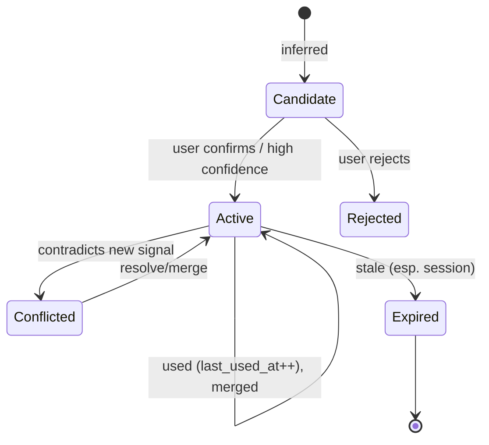
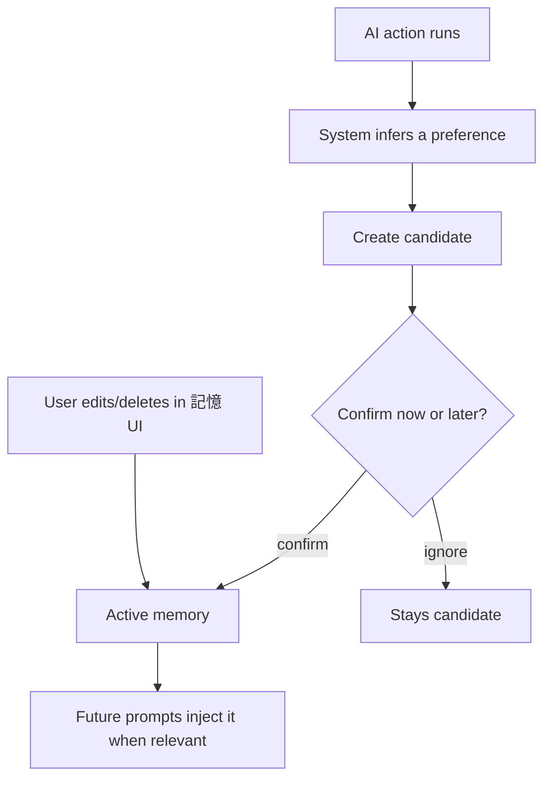

# 08 — Memory System

> Persistent, scoped creator memory: Personal / Workspace / Project / Session. Covers candidate→confirm→reject→merge→conflict, embedding/retrieval/injection, confidence, timeline, versioning, and cleanup. Memory lives in the database and is injected into prompts only when relevant — never stuffed wholesale.
> Locked decisions: `00_LOCKED_DECISIONS.md`. AI layer: `07_AI_SYSTEM.md`. Growth/DNA: `12_GROWTH_ENGINE.md`.

---

## Purpose

Make Ideas OS personalized and cumulative without manipulation: the system remembers a creator's style, workspace tone, project rules, and session context, retrieves only what's relevant, and lets users review/correct/delete memory. This is the defensible moat (model-independent).

## Overview

Memory is stored in DB tables by **scope**, retrieved by relevance (keyword + embedding), and injected by the Prompt Composer at runtime. Current user intent always overrides stored memory.

```mermaid
flowchart TD
  Sig[Signals: user input, accepted outputs, feedback] --> Cand[Memory Candidate NEW]
  Cand -->|confirm| Active[Active Memory]
  Cand -->|reject| Rej[Rejected]
  Active --> Ret[Retrieval (keyword + embedding)]
  Ret --> Inj[Injection into prompt (07)]
  Active --> Conf[Conflict/Merge]
  Active --> Clean[Expiry/Cleanup]
```

## Terminology

| Term | UI (繁中) | Meaning |
|---|---|---|
| Personal Memory | 個人記憶 | About a user's creative preferences/history. |
| Workspace Memory | 工作空間記憶 | Shared tone/rules for a workspace. |
| Project Memory | 專案記憶 | Specific to a project/album/series. |
| Session Memory | 工作階段記憶 | Temporary, current task only. |
| Candidate | 記憶候選 | Inferred memory awaiting confirmation. |
| Creator DNA | 創作 DNA | Long-term style profile (built on memory; detail in `12`). |
| Confidence | 信心值 | How sure the system is about a memory. |

## Design Goals

1. **Scoped, not one bucket** — four scopes with different trust/usage.
2. **Stored, not prompt-only** — DB tables; prompts assembled at runtime.
3. **Confirmed, correctable** — inferred memory becomes a candidate first; users edit/delete.
4. **Relevant injection** — retrieve top-k by relevance, never the whole history.
5. **User intent wins** — current request overrides memory on conflict.

## Core Concepts (entities)

### Entity: Memory (base)
- **Definition:** a persistent contextual fact at a scope.
- **Ownership:** by scope — Personal=`user_id`; Workspace/Project=`workspace_id`(+project); Session=ephemeral.
- **Metadata:** `id, scope, scope_ref, kind, text, embedding, confidence, status(candidate/active/rejected/expired), source(agent_run/user), created_at, last_used_at`.
- **Lifecycle/State machine:**


- **Permission:** scope owner manages; injection is server-side. **Version:** edits snapshot (auditable). **Lineage:** may reference the `agent_run` that produced it.
- **Example:** `{scope:'personal', user_id, kind:'style', text:'prefers physical-action metaphors for emotion', confidence:0.8, status:'active'}`.

### Scope: Personal Memory
- **Definition:** a user's creative preferences/history. **Ownership:** `user_id` (private; documented `user_id` exception).
- **Metadata:** base fields, `scope='personal'`, `scope_ref=user_id`. **Lifecycle:** candidate→active→expired; long-lived.
- **Permission:** owner only — invisible to any workspace. **Version:** edits snapshot. **Lineage:** may cite the `agent_run`/asset that suggested it.
- **Expiration:** none by default (decay optional, future). **Search/Storage:** embedding + keyword; `memories` table.
- **Example:** `{scope:'personal',user_id,kind:'style',text:'uses moonlight + city streets imagery',confidence:0.85}`.

### Scope: Workspace Memory
- **Definition:** shared tone/rules for a workspace. **Ownership:** `workspace_id`.
- **Metadata:** `scope='workspace'`, `scope_ref=workspace_id`. **Permission:** members read; Owner/Manager + (contributor for own candidates) write; Owner/Manager delete.
- **Version:** edits snapshot + audit. **Lineage:** N/A. **Expiration:** none. **Search/Storage:** embedding + keyword.
- **Example:** `{scope:'workspace',workspace_id,kind:'tone',text:'playful, professional, not preachy',confidence:1.0}`.

### Scope: Project Memory
- **Definition:** memory for a project/album/series within a workspace. **Ownership:** `workspace_id` + `project_ref`.
- **Metadata:** `scope='project'`, `scope_ref=project_id`. **Permission:** as workspace memory, scoped to project. **Version:** snapshot. **Lineage:** references project assets. **Expiration:** ends with project (archivable).
- **Example:** `{scope:'project',workspace_id,scope_ref:proj,kind:'motif',text:'restrained longing; moonlight + night drives'}`.

### Scope: Session Memory
- **Definition:** ephemeral context for the current task/conversation. **Ownership:** session (user+session id).
- **Metadata:** `scope='session'`, TTL. **Permission:** owner. **Version:** none. **Lineage:** N/A.
- **Expiration:** auto-expires at session end; **never auto-promotes** to long-term (must be explicitly saved as personal/workspace). **Storage:** short-lived rows or cache.
- **Example:** `{scope:'session',user_id,text:'this task: cheerful tone override',ttl:'2h'}`.

### Candidate → Confirm / Reject / Merge / Conflict (rules)
- **Confidence thresholds:** candidates with `confidence ≥ 0.9` may auto-activate (configurable); `< 0.9` stay candidates until confirmed. Only **active** memory is injected.
- **Confirm/Reject:** user confirms (→active) or rejects (→rejected, excluded permanently).
- **Merge:** two active memories with cosine similarity ≥ MERGE_THRESHOLD (e.g. 0.92) and same scope+kind merge into one; combined `confidence = max + small boost`, capped at 1.0; merged sources recorded.
- **Conflict:** a new signal contradicting an active memory creates a **conflict**; resolution = keep current user intent now (Article 4), and raise a candidate to update the stored memory; user (or rule) picks which survives.
- **Cleanup/Expiration:** session memory expires by TTL; stale low-confidence candidates auto-purged after N days; deleted memory stops being injected immediately.
- **Injection limits:** retrieval returns top-k (e.g. k≤8) by relevance within a bounded token budget; never inject the whole store; record injected items in `memory_usage`.

## Business Rules

- Memory is stored in tables, retrieved by relevance, injected only when useful (D: memory ≠ prompt text).
- Inferred memory becomes a **candidate**; it does not silently become permanent truth.
- **Current user intent overrides** stored/inferred memory on conflict.
- Personal memory is `user_id`-scoped (one of the few non-workspace durable stores); workspace/project memory is `workspace_id`-scoped.
- Memory usage is logged (which memories were injected into which `agent_run`) for transparency.
- Users can review, edit, delete any of their memory; deletion is honored (GDPR-aligned).

## User Flow



## Mermaid Diagram(s)

| Diagram | Section | Purpose |
|---|---|---|
| Memory pipeline (flowchart) | Overview | signals→candidate→active→retrieval→injection. |
| Memory lifecycle (state) | Entity: Memory | candidate/active/conflicted/expired. |
| Confirm flow (flowchart) | User Flow | inference → candidate → confirm/edit. |

## Database Considerations

Authoritative in `13_DATABASE.md`. NEW tables:

| Table (NEW) | Purpose | PK | Key FK | Indexes | Constraints | RLS |
|---|---|---|---|---|---|---|
| `memories` | Scoped memory store | `id uuid` | `user_id` / `workspace_id` (by scope) | `(scope, scope_ref, kind)`, embedding ivfflat | `scope` in enum; `status` in enum; `confidence` 0..1 | scope owner only |
| `memory_usage` | Which memory injected into which run | `id bigserial` | `memory_id`, `agent_run_id` | `(agent_run_id)` | — | scope owner read |
| `memory_versions` (opt.) | Edit history | `id bigserial` | `memory_id` | `(memory_id,created_at)` | version increasing | scope owner |

Embeddings reuse pgvector (`embedText`/`ai-embeddings.ts`). Example `memories` row: `{scope:'workspace', workspace_id, kind:'tone', text:'playful, not preachy', confidence:1.0, status:'active'}`. Personal-scope rows use `user_id` (not `workspace_id`) — one of the deliberate `user_id` exceptions per `00_LOCKED_DECISIONS.md`.

## API Considerations

NEW, indicative — authoritative in `14_API.md`:

| Method | Route (NEW) | Permission | Request | Response | Errors |
|---|---|---|---|---|---|
| GET | `/api/creator-island/memory` | scope owner | `?scope&scopeRef&cursor` | `{memories[], nextCursor}` | 401/403 |
| POST | `/api/creator-island/memory` | scope owner | `{scope, scopeRef, kind, text}` | `{memory}` | 401/403/422 |
| PATCH | `/api/creator-island/memory/{id}` | scope owner | `{text?, status?}` (confirm/reject/edit) | `{memory}` | 401/403/404 |
| DELETE | `/api/creator-island/memory/{id}` | scope owner | — | `{ok}` | 401/403/404 |

Lists paginate (1000-row limit).

## Permission Model

| Action | Owner | Manager | Contributor | Viewer | Self (personal) |
|---|:--:|:--:|:--:|:--:|:--:|
| View/edit Personal memory | — | — | — | — | ✅ |
| View Workspace/Project memory | ✅ | ✅ | ✅ | ✅ | — |
| Edit Workspace/Project memory | ✅ | ✅ | ✅(contribute) | ❌ | — |
| Delete Workspace/Project memory | ✅ | ✅ | ❌ | ❌ | — |

Personal memory is private to the user, regardless of workspace role.

**Contributor edit scope:** a Contributor may add new workspace/project memory and edit/delete **only the candidates they created**; promoting a candidate to active workspace memory, and editing/deleting **already-active** workspace memory, requires Owner/Manager.

## UI Considerations

- A 記憶 panel lists active memories per scope with confidence + last used; candidates shown with confirm/reject.
- Edits/deletes are immediate and clearly 繁中. Transparency: "本次用到的記憶" surfaced after AI actions (precedent: `ai-tutor-prompt.ts` already injects mastery context).
- Never present memory as unchangeable.

## Edge Cases

- Conflicting memory vs current request → current request wins; optionally raise a candidate to update memory.
- Two near-duplicate memories → merge with combined confidence.
- Low-confidence candidate never auto-injected until confirmed/threshold met.
- Session memory must not auto-persist.
- Deleted memory must stop being injected immediately.

## Security

- RLS scopes memory to owner (user or workspace members); personal memory invisible to workspace.
- Memory never leaks across workspaces; injection server-side only.
- Deletion honored (GDPR); memory_usage retained only as needed for transparency.

## Performance

- Retrieval = embedding top-k + keyword filter, capped; cache hot workspace/project memory per session.
- ivfflat index on embeddings; `(scope, scope_ref, kind)` for filtered reads.
- Inject a bounded token budget of memory, never the whole store.

## Testing

- Override: current request beats contradicting memory.
- Candidate gating: low-confidence/unconfirmed not injected.
- Scope isolation: personal memory never visible to workspace; cross-workspace leak denied (RLS).
- Deletion: deleted memory immediately excluded from injection.
- Usage log: injected memories recorded against the `agent_run`.

## Future Expansion

- **Proactive recall (E4, `ENHANCEMENTS.md`):** while creating, surface relevant older fragments via embeddings ("你半年前寫過…").
- Creator DNA aggregation (`12`); memory timeline visualization.
- Confidence decay + auto-cleanup policies.
- Conflict-resolution assistant; cross-project memory suggestions.
- Memory import/export (portability).

## Implementation Notes

- Store + retrieval + injection in `src/lib/creator-engine/` (memory service); embeddings via existing `embedText`.
- Prompt Composer (07) calls the memory service; record `memory_usage` per `agent_run`.
- Personal memory uses `user_id` (documented exception); all other scopes `workspace_id`.

## MVP vs Future

- **MVP:** personal + workspace memory, candidate/confirm/edit/delete, relevance retrieval + injection, usage logging.
- **Future:** project/session scopes full, merge/conflict UI, confidence decay, DNA, timeline, import/export.

---

## Change log

- 2026-06-28 — Initial Memory System; pgvector-based, current-intent-overrides rule, personal `user_id` exception noted.
