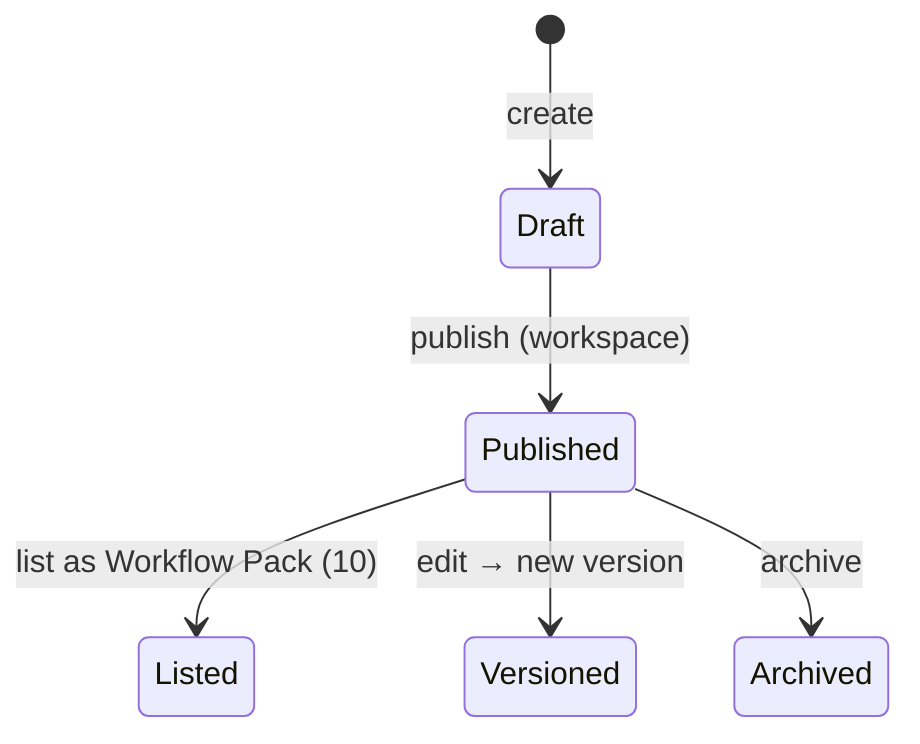
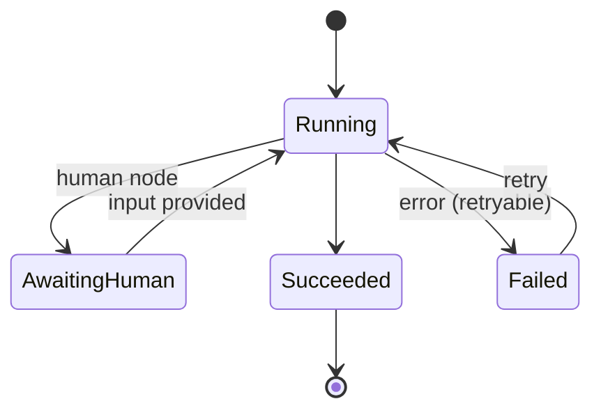
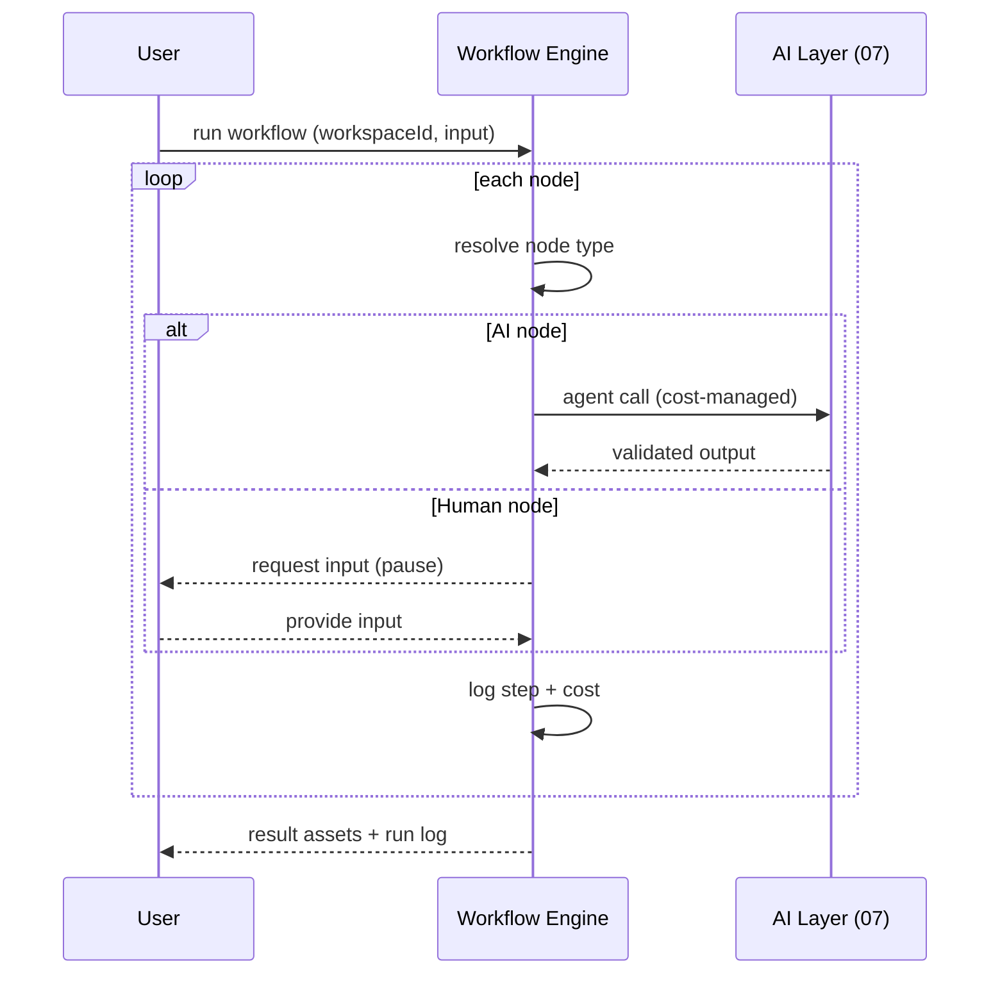

# 09 — Workflow Engine

> Workflows are reusable creative processes — and they are assets (versionable, forkable, sellable). Covers workflow definition, nodes, variables, conditions, loops, retry, replay, scheduling, templates, runs, and analytics. n8n is an optional automation tier, not a core dependency.
> Locked decisions: `00_LOCKED_DECISIONS.md` (D15, D16). Assets: `05_ASSET_SYSTEM.md`. AI: `07_AI_SYSTEM.md`.

---

## Purpose

Let a creator capture a repeatable process (e.g. a songwriting pipeline) once and reuse/replay/share/sell it, turning "process" into creative capital. Define the engine so workflows compose existing agents and human steps deterministically.

## Overview

A Workflow is a graph of nodes (AI / human / router / memory / knowledge / decision / loop / webhook / n8n / publish). A Workflow Run executes it, logging each step. Workflows are `asset_type='workflow'` and share the asset abstraction (ownership/version/lineage/marketplace).

```mermaid
flowchart TD
  WF[Workflow (asset)] --> N[Nodes + edges]
  N --> RUN[Workflow Run NEW]
  RUN --> STEP[Step logs]
  RUN --> ASSETS[Result assets]
  WF -. fork/remix .-> WF2[Forked workflow]
  WF -. list .-> MKT[Workflow pack (10)]
```

## Terminology

| Term | UI (繁中) | Meaning |
|---|---|---|
| Workflow | 工作流／創作流程 | Reusable process graph; an asset. |
| Node | 節點 | A step (AI/human/router/…). |
| Workflow Run | 執行紀錄 | One execution instance. |
| Template | 範本 | A starting workflow others can fork. |
| Replay | 重播 | Re-run with same/edited inputs. |

## Design Goals

1. **Process as asset** — save/version/fork/remix/sell a workflow.
2. **Deterministic orchestration** — explicit nodes/edges, not ad-hoc chat.
3. **Composes existing agents** — nodes call the AI Layer (`07`), not providers.
4. **Replayable + observable** — every run logs steps, cost, outputs.
5. **n8n optional** — external automation is a node type, never required for core.

## Core Concepts (entities)

### Entity: Workflow
- **Definition:** a reusable process graph; an asset (`asset_type='workflow'`).
- **Ownership:** `workspace_id`; shares asset common fields (`05`).
- **Metadata:** `id, workspace_id, title, description, nodes jsonb, edges jsonb, variables jsonb, version, visibility, license_id, source_type`.
- **Lifecycle/State machine:**


- **Permission:** Contributor+ create/edit; Owner/Manager publish/list. **Version:** snapshots in `asset_versions`; edits bump `version`. **Lineage:** `forked_from`/`remixed_from` in `asset_relations`.
- **Example:** songwriting workflow: Seed → Evolve 50 → Judge top 12 → Compose → Suno prompt → MV prompt → Archive.

### Entity: Node
- **Definition:** one step in a workflow graph.
- **Metadata:** `id, type, config jsonb, inputs[], outputs[], retry jsonb, on_error`.
- **Node types + config schema:**

| Type | config (sketch) | inputs → outputs | Validation |
|---|---|---|---|
| AI | `{agent, options}` | upstream assets → `{result}` | agent must be in `workspace_ai_settings.allowed_agents`; output validated by agent schema (`07`) |
| Human | `{prompt, fields}` | — → user-provided values | pauses run (AwaitingHuman); resumable |
| Router | `{branches:[{when, to}]}` | value → chosen edge | each `when` is a condition expr |
| Memory | `{scope, op:'read'\|'write'}` | → memory items | scope owner permission (`08`) |
| Knowledge | `{query}` | → retrieved context | read-only |
| Decision | `{expr}` | value → bool | expr must be pure |
| Loop | `{over, body, maxIterations}` | list → aggregated | `maxIterations` cap (e.g. ≤100) to prevent runaway |
| Webhook | `{url, method, secretRef}` | payload → response | URL allowlist; secret from store, not plaintext |
| n8n | `{workflowRef}` | payload → response | optional tier; failure is non-fatal to core |
| Publish | `{target:'blog', workId}` | work → publish result | requires Contributor+; reuses `works/{id}/publish` |

- **Lifecycle:** validated at save → executed in run → logged in `workflow_run_steps`.
- **Permission/Version/Lineage:** inherit from the workflow.
- **Example:** `{id:'n2', type:'ai', config:{agent:'evolve', options:{count:50}}, retry:{max:2,backoff:'exp'}, on_error:'continue'}`.

### Variables, Conditions, Loops, Retry, Scheduling
- **Variables:** workflow-level `variables jsonb` + per-node outputs referenced as `{{node.output.field}}`; resolved at run time into node inputs (template substitution; missing var → validation error).
- **Conditions:** Router/Decision use a small, **pure** expression language over variables/outputs (comparisons, boolean ops, has/empty); no side effects, no arbitrary code.
- **Loops:** Loop node iterates `over` a list running `body`; bounded by `maxIterations`; results aggregated; partial results retained on failure.
- **Retry:** per-node `retry:{max, backoff}` (exp/linear); `on_error ∈ stop|continue|fallback`; AI nodes also respect Cost Manager (stop on budget).
- **Scheduling:** v1 uses existing cron/server jobs to trigger runs; event/n8n triggers are future (D15). A schedule is `{cron, enabled, workflowId, input}`.

### Entity: Workflow Run
- **Definition:** one execution of a workflow.
- **Ownership:** `workspace_id`; started by a member.
- **Metadata:** `id, workflow_id, workspace_id, started_by, input jsonb, status, step_logs jsonb, cost_total, result_asset_ids[], created_at`.
- **Lifecycle/State machine:**


- **Permission:** member runs allowed workflows. **Version:** immutable log; records the workflow version used. **Lineage:** result assets link back to the run.
- **Example:** `{workflow_id, status:'succeeded', cost_total:0.12, result_asset_ids:['work_Y']}`.

### Entity: Template
- **Definition:** a publishable starting workflow others fork/instantiate.
- **Ownership:** `workspace_id` (or platform-curated presets). **Metadata:** same as workflow + `is_template`, `category`.
- **Lifecycle:** draft → published template → forked by others. **Permission:** Owner/Manager publish; any Contributor+ fork. **Version:** templates are versioned; a fork pins the version. **Lineage:** forks record `forked_from` in `asset_relations`.
- **Example:** `{title:'YouTube 腳本流程', is_template:true, category:'video', version:2}`.

### Replay
- **Definition:** re-running a workflow from a prior run, with same or **overridden** inputs.
- **Version pinning:** a replay runs the **exact workflow version** the original run used (stored on `workflow_runs`), so edits don't corrupt comparisons.
- **Input overrides:** `{baseRunId, overrides:{var/node inputs}}`; unspecified inputs reuse the original.
- **Lineage:** each replay is a new `workflow_run` linked to `base_run_id`; result assets link to the replay run.
- **Example run record:** `{id:run_88, workflow_id, workflow_version:2, base_run_id:run_42, status:'succeeded', cost_total:0.10, result_asset_ids:['work_Z']}`.

## Business Rules

- A workflow is an asset: workspace-owned, versioned, forkable, listable (`10`).
- AI nodes call the AI Layer (`07`) → every node AI call writes `agent_runs`; the run aggregates cost.
- Human nodes pause the run (AwaitingHuman) until input; runs are resumable.
- Core execution does **not** depend on n8n; n8n is one optional node type / external tier.
- Cost-bearing runs pass the Cost Manager; over-budget stops with partial results saved.

## User Flow



## Mermaid Diagram(s)

| Diagram | Section | Purpose |
|---|---|---|
| Workflow overview (flowchart) | Overview | Workflow→nodes→run→assets; fork/list. |
| Workflow lifecycle (state) | Entity: Workflow | Draft→Published→Listed/Versioned/Archived. |
| Run lifecycle (state) | Entity: Workflow Run | Running/AwaitingHuman/Succeeded/Failed. |
| Run sequence (sequence) | User Flow | Node-by-node execution with human pause. |

## Database Considerations

Authoritative in `13_DATABASE.md`. NEW tables:

| Table (NEW) | Purpose | PK | Key FK | Indexes | Constraints | RLS |
|---|---|---|---|---|---|---|
| `workflows` | Workflow assets | `id uuid` | `workspace_id`, `created_by` | `(workspace_id,updated_at)` | `visibility` enum; `version`≥1 | workspace-scoped |
| `workflow_runs` | Executions | `id bigserial` | `workflow_id`, `workspace_id`, `started_by` | `(workflow_id,created_at)`, `(workspace_id)` | `status` enum | workspace member read; system write |
| `workflow_run_steps` | Per-step log (required for replay/debug) | `id bigserial` | `run_id`, `agent_run_id?` | `(run_id, step_index)` | step_index ordered | inherit |

Workflows store node/edge graphs in `jsonb`. AI steps link to `agent_runs`. Example `workflows` row: `{workspace_id, title:'歌曲量產流程', version:1, visibility:'workspace'}`. Reuse RLS pattern from `idea_fragments_migration.sql`.

## API Considerations

NEW, indicative — authoritative in `14_API.md`:

| Method | Route (NEW) | Permission | Request | Response | Errors |
|---|---|---|---|---|---|
| POST | `/api/creator-island/workflows` | Contributor+ | `{workspaceId, title, nodes, edges}` | `{workflow}` | 401/403/422 |
| GET | `/api/creator-island/workflows` | member | `?workspaceId&cursor` | `{workflows[], nextCursor}` | 401/403 |
| POST | `/api/creator-island/workflows/{id}/run` | Contributor+ | `{workspaceId, input}` | `{runId}` | 401/403/402/422 |
| POST | `/api/creator-island/workflows/runs/{id}/resume` | Contributor+ | `{nodeId, input}` | `{runId}` | 401/403/409 |
| POST | `/api/creator-island/workflows/{id}/fork` | Contributor+ | `{workspaceId}` | `{workflow}` | 401/403 |

Runs are async; clients poll/subscribe for status. Lists paginate.

## Permission Model

| Action | Owner | Manager | Contributor | Viewer |
|---|:--:|:--:|:--:|:--:|
| View workflows/runs | ✅ | ✅ | ✅ | ✅ |
| Create/edit/fork workflows | ✅ | ✅ | ✅ | ❌ |
| Run / resume workflows | ✅ | ✅ | ✅ | ❌ |
| Publish / list as pack | ✅ | ✅ | ❌ | ❌ |

Cost-bearing runs additionally pass the Cost Manager.

## UI Considerations

- v1 (if shipped): run existing/template workflows + view run logs; a visual node editor is future.
- Human-node prompts surface clearly in 繁中; partial results are visible on failure.
- Workflow appears in the Work/asset libraries as `asset_type='workflow'`.

## Edge Cases

- Human node never answered → run stays AwaitingHuman (resumable/expirable).
- Node failure → retry policy; on give-up, save partial results + mark Failed.
- Budget exhausted mid-run → stop, persist completed steps' assets.
- Webhook/n8n node unavailable → that node fails gracefully; core nodes unaffected.
- Editing a workflow mid-run → run pins the version it started with.

## Security

- RLS scopes workflows/runs to the workspace; server-side authz on run/resume.
- Webhook/n8n nodes validate targets; secrets stored encrypted, never in node config plaintext.
- Cost + external calls audited.

## Performance

- Async execution (queue/worker future); step logs written incrementally.
- AI nodes reuse the AI Layer's cost cache; bounded concurrency per workspace.
- Large run logs stored compactly (jsonb / external if huge).

## Testing

- Determinism: same workflow + same input + (mock AI) → same step sequence.
- Pause/resume: human node pauses and resumes correctly.
- Cost: over-budget stops with partial results saved.
- Versioning: a run pins the workflow version; editing doesn't corrupt in-flight runs.
- n8n optionality: disabling n8n leaves core workflows runnable.

## Future Expansion

- **Workflow by "record" (E7, `ENHANCEMENTS.md`):** let users create normally, then offer "把剛剛這串動作存成工作流？" — passively capture process (precedes/complements the visual editor).
- Visual node editor; richer node library.
- Workflow marketplace (`10`) with replay analytics.
- Scheduled/triggered runs (cron/event) — initial automation via existing cron, later n8n.
- Multi-agent/judge-panel nodes; conditional/loop UX.

## Implementation Notes

- Engine in `src/lib/creator-engine/` (workflow service); AI nodes call the AI Layer (`07`), never providers.
- v1 may ship run-only (templates) before a visual editor; keep schema ready for nodes/edges.
- Keep n8n as an optional node type; initial scheduling via existing cron/server jobs (D15).

## MVP vs Future

- **MVP (optional in v1):** workflow asset schema + run/resume + step logs; run templates; no visual editor required.
- **Future:** visual editor, scheduling, n8n nodes, workflow marketplace, analytics.

---

## Change log

- 2026-06-28 — Initial Workflow Engine (D15 n8n-optional, D16 workflows-are-assets).
