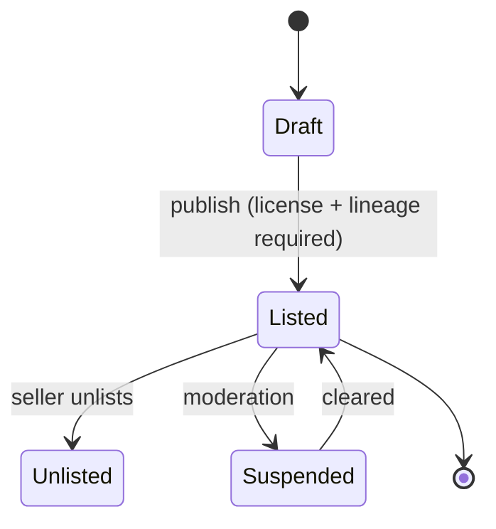
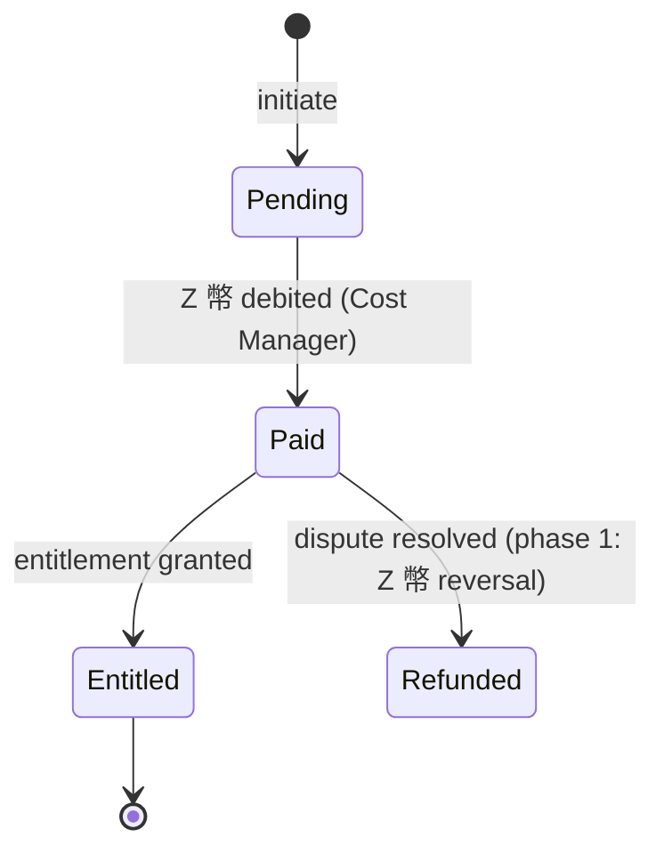
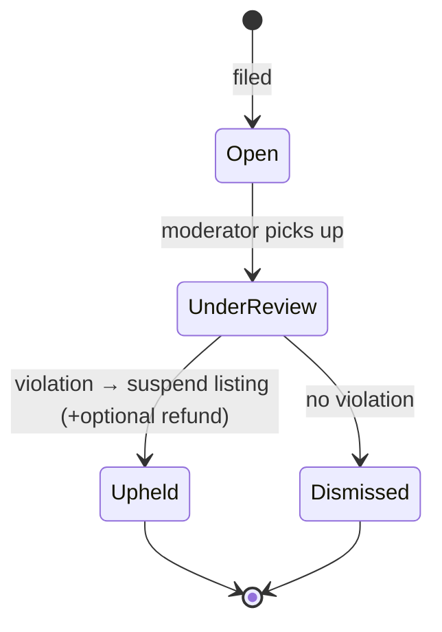
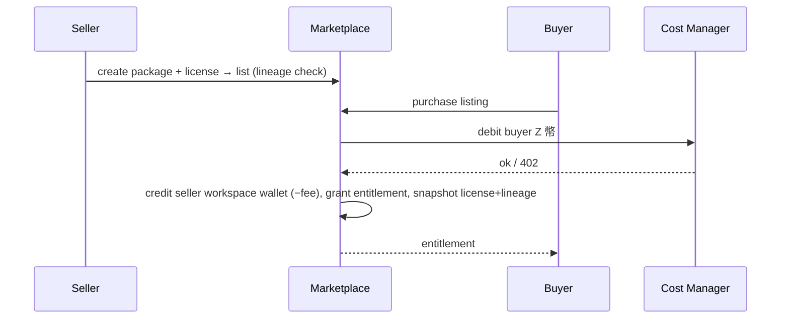

# 10 — Marketplace

> Trading reusable creative assets (not only finished works): packages, bundles, licenses, pricing, revenue, creator/workspace income, platform fee, transactions, reviews, ranking, reports/DMCA, moderation. **Phase 1 is internal Z Coin only** — no real-money payout.
> Locked decisions: `00_LOCKED_DECISIONS.md` (D14). Economy: ADR-003/004. Assets: `05_ASSET_SYSTEM.md`.

---

## Purpose

Let creators sell reusable assets and workflows — capturing process and materials, not just outputs — within a safe, provenance-aware economy. Phase 1 keeps everything in the existing Z 幣 economy to defer KYC/payment/legal risk.

## Overview

A creator bundles assets into a **Package**, attaches a **License**, and lists it. A buyer purchases with **Z 幣**; the seller's workspace wallet is credited (minus platform fee); lineage + license snapshot + transaction are recorded for trust and disputes.

```mermaid
flowchart TD
  P[Package (05) + License] --> L[Listing]
  L --> B[Buyer purchases (Z 幣)]
  B --> TX[Transaction NEW]
  TX --> SW[Seller workspace wallet +Z]
  TX --> FEE[Platform fee accounted]
  TX --> ENT[Buyer entitlement + license snapshot]
  L --> R[Reviews / ranking / reports]
```

## Terminology

| Term | UI (繁中) | Meaning |
|---|---|---|
| Listing | 上架 | A package offered on the marketplace. |
| License | 授權 | What a buyer may do with an asset. |
| Entitlement | 已購授權 | A buyer's granted access + license snapshot. |
| Platform Fee | 平台費 | Cut retained by the platform. |
| Workspace Income | 工作空間收益 | Z 幣 credited to the seller workspace wallet. |

## Design Goals

1. **Sell assets, not only works** — fragment/prompt/workflow packs.
2. **Provenance-safe** — lineage + license + AI-label required before listing.
3. **Z 幣 first** — phase 1 internal economy; real money is a future phase.
4. **Dispute-ready** — record everything needed for evidence.
5. **No spam** — moderation + ranking reward real value.

## Core Concepts (entities)

### Entity: Listing
- **Definition:** a package made available on the marketplace.
- **Ownership:** `workspace_id` (seller); references a `package_id`.
- **Metadata:** `id, workspace_id, package_id, price_z, visibility, status, ai_generated_label, license_id, created_by`.
- **Lifecycle/State machine:**


- **Permission:** Owner/Manager list/unlist. **Version:** snapshot at publish. **Lineage:** package items carry `packaged_in` edges.
- **Example:** `{workspace_id, package_id, price_z:200, license_id, ai_generated_label:'ai_assisted'}`.

### Entity: License
- **Definition:** the permission set a buyer receives.
- **Metadata:** `id, name, view, collect, fork, remix, evolve, commercial_use, attribution_required, exclusive, ai_use_allowed, training_allowed`.
- **Lifecycle:** chosen per listing; snapshotted into each transaction (immutable evidence).
- **Permission:** seller selects; platform offers presets. **Version:** snapshot per transaction. **Lineage:** N/A.
- **Example:** `{name:'Personal use', commercial_use:false, attribution_required:true, training_allowed:false}`.

### Entity: Transaction
- **Definition:** one purchase.
- **Ownership:** links buyer (`user_id`/buyer workspace) and seller `workspace_id`.
- **Metadata:** `id, listing_id, package_id, buyer_id, seller_workspace_id, price_z, platform_fee_z, seller_net_z, license_snapshot jsonb, source_lineage jsonb, ai_generated_label, created_at`.
- **Lifecycle/State machine:**


- **Permission:** buyer initiates; system executes. **Version:** immutable. **Lineage:** records source lineage + license snapshot.
- **Example:** `{listing_id, buyer_id, price_z:200, platform_fee_z:30, seller_net_z:170}`.

### Entity: Entitlement
- **Definition:** a buyer's granted access to a purchased package + its license snapshot. **Metadata:** `id, transaction_id, buyer_id, package_id, license_snapshot`. **Permission:** buyer. **Lineage:** N/A.

### Entity: Review
- **Definition:** a buyer's rating + text on a purchased listing.
- **Ownership:** `user_id` (buyer). **Metadata:** `id, listing_id, user_id, rating(1..5), text, created_at`.
- **Lifecycle:** create (after purchase) → edit (own) → hidden (moderation). **Permission:** only buyers with an entitlement; one review per buyer per listing. **Version:** edit tracked. **Lineage:** N/A.
- **Example:** `{listing_id, user_id, rating:5, text:'超實用的碎片包'}`.

### Ranking
- **Definition:** ordering of listings by value, not volume.
- **Signals:** sales count, average rating, reuse (forks/collects of the package's assets), recency; spam/penalty signals from moderation.
- **Computation:** incremental score recomputed on events (sale/review/report), not per read; cached.
- **Anti-gaming:** self-purchase/self-review excluded; sudden spikes flagged for moderation.

### Entity: Report / DMCA
- **Definition:** a user report (abuse, IP/DMCA, policy) against a listing/asset.
- **Ownership:** `reporter_id`. **Metadata:** `id, listing_id, reporter_id, reason(enum: ip/dmca/abuse/quality/other), detail, status, created_at`.
- **Lifecycle/State machine:**


- **Permission:** any member files; **platform moderators** (not workspace roles) action. **Evidence:** license snapshot + lineage + transaction history attached. **Audit:** every decision writes `audit_logs`.

### Disputes & Refunds (phase 1 = Z 幣)
- A buyer dispute or upheld report can trigger a **Z 幣 refund**: reverse the transaction (credit buyer `coin_transactions`, debit seller `workspace_wallet`), revoke entitlement — atomic via `purchase_listing`'s inverse (`refund_transaction` RPC).
- If the seller already spent the Z 幣 (insufficient wallet) → record a negative/owed balance per policy (clawback on next earnings). No real money involved (D14).

### Moderation
- Platform-role action (`15_ADMIN.md`): suspend/reinstate listings, hide reviews, resolve reports, issue refunds. Reversible where possible; all audited. Distinct from workspace roles.

### Bundles
- A listing may be a single package or a **bundle** of packages (`bundle_items[]`), priced as a unit; entitlement grants all included packages. Same license/lineage rules apply to each item.

### License presets & versioning
- The platform offers **license presets** (e.g. Personal, Commercial, Remix-allowed); sellers may customize.
- A license is **snapshotted into each transaction** (immutable); editing a license later does **not** change past sales (version pinning per transaction).

### Pricing constraints
- `price_z ≥ 0` (0 = free/collectible); platform fee is a configured percentage (e.g. 15%) computed server-side: `seller_net_z = price_z − platform_fee_z`. Clients never send fee/net amounts.

### Revenue accounting
- On `Paid`: buyer debited `price_z` (`coin_transactions`); platform fee retained (ledgered); seller credited `seller_net_z` (`workspace_wallet_tx`). All in one atomic `purchase_listing` RPC (`13`).
- Workspace income is the sum of `seller_net_z` credits; reportable in admin cost/finance views (`15`).

## Business Rules

- **Phase 1 = Z 幣 only.** No real-money payout, KYC, bank, or third-party split (D14). Seller income is on-platform Z 幣 in the **workspace wallet**.
- Purchases debit Z 幣 via the **Cost Manager** (buyer personal/workspace wallet); seller workspace wallet credited `price − platform_fee`.
- A listing requires a **license** and **lineage**; AI-involved assets must carry an AI label.
- Every transaction stores a **license snapshot** + **source lineage** (dispute evidence).
- Dust is never used in the marketplace (ADR-004).
- **No token-trap (economy guardrail, E10):** the core creation loop stays free + daily free Dust; Z 幣 is charged only for premium models / bulk generation / commercial-grade output. Pricing/free-tier design must not make every action cost Z 幣 (honors the platform non-goal). Enforced by the Cost Manager (`07`) + creation actions (`06`).
- Refund/dispute in phase 1 = Z 幣 reversal per moderation decision.

## User Flow



## Mermaid Diagram(s)

| Diagram | Section | Purpose |
|---|---|---|
| Marketplace flow (flowchart) | Overview | package→listing→purchase→wallet/fee/entitlement. |
| Listing lifecycle (state) | Entity: Listing | Draft/Listed/Unlisted/Suspended. |
| Transaction lifecycle (state) | Entity: Transaction | Pending/Paid/Entitled/Refunded. |
| Purchase sequence (sequence) | User Flow | Buy with Z 幣 via Cost Manager. |

## Database Considerations

Authoritative in `13_DATABASE.md`. Z 幣 unit reuses the **existing** `coin_transactions` (buyer side) plus the **NEW** `workspace_wallet` / `workspace_wallet_tx` (seller side, defined in `04_WORKSPACE.md`). Marketplace-specific NEW tables:

| Table (NEW) | Purpose | PK | Key FK | Indexes | Constraints | RLS |
|---|---|---|---|---|---|---|
| `listings` | Marketplace offers | `id uuid` | `workspace_id`, `package_id` | `(status,created_at)`, `(workspace_id)` | `status` enum; `price_z`≥0 | public read if Listed; Owner/Manager write |
| `licenses` | License definitions | `id uuid` | `workspace_id?` (or global presets) | `(workspace_id)` | boolean perms | read public; seller manage |
| `marketplace_transactions` | Purchases | `id bigserial` | `listing_id`, `buyer_id`, `seller_workspace_id` | `(buyer_id)`, `(seller_workspace_id,created_at)` | `price_z=platform_fee_z+seller_net_z` | buyer + seller read |
| `entitlements` | Buyer access | `id uuid` | `transaction_id`, `buyer_id`, `package_id` | `(buyer_id)` | unique `(buyer_id,package_id)` | buyer read |
| `marketplace_reviews` | Ratings/reviews | `id bigserial` | `listing_id`, `user_id` | `(listing_id)` | rating 1..5; one per buyer | public read; buyer write |
| `marketplace_reports` | Reports/DMCA | `id bigserial` | `listing_id`, `reporter_id` | `(listing_id)` | reason enum | reporter + moderators |

Z 幣 movement is recorded in the existing `coin_transactions` (buyer) and the NEW `workspace_wallet_tx` (seller; `04_WORKSPACE.md`). Example `marketplace_transactions` row: `{listing_id, buyer_id, price_z:200, platform_fee_z:30, seller_net_z:170, license_snapshot:{...}}`.

## API Considerations

NEW, indicative — authoritative in `14_API.md`:

| Method | Route (NEW) | Permission | Request | Response | Errors |
|---|---|---|---|---|---|
| GET | `/api/creator-island/marketplace/listings` | public/member | `?cursor&q&type` | `{listings[], nextCursor}` | — |
| POST | `/api/creator-island/marketplace/listings` | Owner/Manager | `{workspaceId, packageId, priceZ, licenseId}` | `{listing}` | 401/403/422(license/lineage) |
| POST | `/api/creator-island/marketplace/listings/{id}/purchase` | member | `{wallet:'personal'\|'workspace'}` | `{transaction, entitlement}` | 401/403/402/409 |
| POST | `/api/creator-island/marketplace/listings/{id}/reviews` | buyer | `{rating, text}` | `{review}` | 401/403/409 |
| POST | `/api/creator-island/marketplace/listings/{id}/report` | member | `{reason, detail}` | `{report}` | 401/403 |

Purchase is server-authoritative (Cost Manager). Per-route rate limits in `14_API.md`. Lists paginate.

## Permission Model

| Action | Owner | Manager | Contributor | Viewer | Buyer (any member) |
|---|:--:|:--:|:--:|:--:|:--:|
| Browse listings | ✅ | ✅ | ✅ | ✅ | ✅ |
| Create/list package | ✅ | ✅ | ❌ | ❌ | — |
| Set price/license | ✅ | ✅ | ❌ | ❌ | — |
| Purchase | — | — | — | — | ✅ |
| Review (after purchase) | — | — | — | — | ✅ |
| Moderate/suspend | platform moderator/admin only | | | | |

Moderation is a **platform** role action, separate from workspace roles. Detail in `15_ADMIN.md`.

## UI Considerations

- Listing pages show price (Z 幣), license summary, AI label, ratings, and provenance.
- Purchase confirms wallet + cost in 繁中; entitlement appears in the buyer's library.
- Skeleton in v1: marketplace shows preview + 即將推出 until phase-1 economy ships.

## Edge Cases

- Insufficient Z 幣 → `402`, suggest top-up; no entitlement created.
- List without license/lineage → blocked (422) with reason.
- Duplicate purchase → return existing entitlement (idempotent).
- Seller unlists after purchase → existing entitlements remain valid.
- Report upheld → suspend listing, optional Z 幣 refund per moderation.
- AI-generated asset unlabeled → cannot list.

## Security

- Server-authoritative pricing/fees/wallet moves; never trust client amounts.
- License snapshot + lineage immutable per transaction (evidence).
- Reports/DMCA workflow with audit; moderators are platform roles.
- RLS: buyers see own entitlements; sellers see own listings/transactions.

## Performance

- Listing browse paginated + indexed by status/type; cache hot listings.
- Wallet operations transactional (debit buyer + credit seller atomic).
- Ranking computed incrementally (sales/ratings/reuse), not on every read.

## Testing

- Atomic purchase: buyer debit + seller credit + entitlement + fee accounting all-or-nothing.
- Phase-1 invariant: no real-money path; Dust never used.
- Gating: list requires license + lineage + AI label.
- Idempotent purchase: duplicate buy returns existing entitlement.
- Refund: moderation refund reverses Z 幣 and revokes entitlement.
- RLS: cross-user entitlement/transaction access denied.

## Future Expansion

- **Phase 2:** real-money payout (KYC, payment provider, tax) — future ADR.
- Bundles/subscriptions; promotions; affiliate; workflow marketplace analytics.
- Cross-cultural (transcreated) variants as derivative listings.

## Implementation Notes

- Reuse existing Z 幣 (`coin_transactions`); seller credit via the NEW `workspace_wallet`/`workspace_wallet_tx` (`04`); purchases via Cost Manager (`07`).
- Reuse existing orders/admin moderation patterns where helpful, but marketplace tables are NEW and asset-centric.
- v1 ships as skeleton (preview + 即將推出); enable phase-1 Z 幣 economy when ready.

## MVP vs Future

- **MVP:** skeleton entry + data model reserved (listings/licenses/transactions/entitlements) — not production economy.
- **Phase 1 (post-MVP):** Z 幣 purchase, workspace income, platform fee, reviews, reports/moderation.
- **Phase 2:** real-money payout.

---

## Change log

- 2026-06-28 — Initial Marketplace (D14 Z 幣-only phase 1; Dust excluded per ADR-004).
