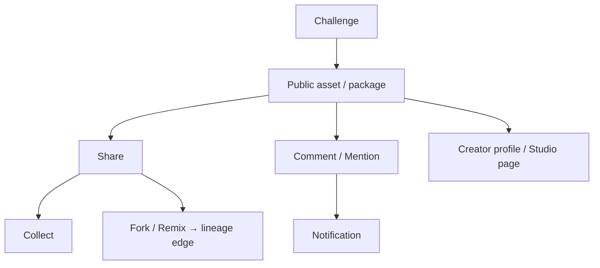
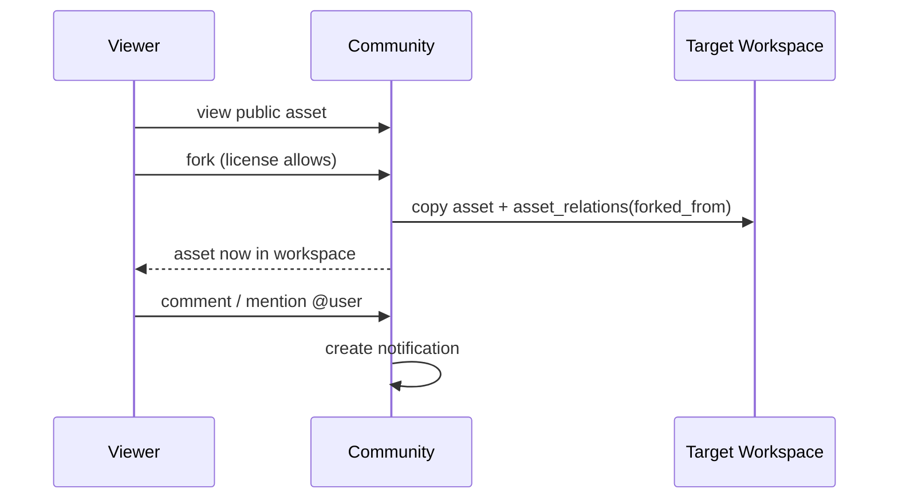

# 11 — Community

> An asset-centric creative community: follow, collect, fork, remix, comment, mention, notify, challenge, exchange, plus creator profiles and studio pages. It revolves around assets (closer to GitHub/Pinterest for creative work) — not a generic social feed.
> Locked decisions: `00_LOCKED_DECISIONS.md`. Assets/lineage: `05_ASSET_SYSTEM.md`. Marketplace: `10_MARKETPLACE.md`.

---

## Purpose

Build a community whose social graph grows from creative activity (sharing, forking, remixing assets) rather than random posts, so distribution and collaboration reinforce the asset/lineage model. v1 is a skeleton; the data model is reserved.

## Overview

Public assets/packages can be shared; others collect, fork, remix (recording lineage), comment, and join challenges. Creator profiles and studio pages aggregate public work.

## Terminology

| Term | UI (繁中) | Meaning |
|---|---|---|
| Follow | 追蹤 | Subscribe to a creator/studio. |
| Collect | 收藏 | Save a public asset to your library reference. |
| Fork | 分支 | Copy a public asset into your workspace (lineage `forked_from`). |
| Remix | 改作 | Derive a new asset from another (lineage `remixed_from`). |
| Challenge | 挑戰 | A themed creative event. |
| Creator Profile | 創作者頁 | Public page of a creator's public work. |

## Design Goals

1. **Asset-centric, not feed-centric** — interactions attach to assets.
2. **Lineage on fork/remix** — derivations always recorded (`05`).
3. **Provenance-safe sharing** — only assets with proper visibility/license are public.
4. **Anti-noise** — challenges/ranking reward creation, not spam.
5. **Reuse platform social plumbing** — notifications via existing patterns.

## Core Concepts (entities)

### Entity: Follow
- **Definition:** a directed subscription (user→creator/studio).
- **Ownership:** `follower_id` (user); target creator/workspace.
- **Metadata:** `id, follower_id, target_type, target_id, created_at`.
- **Lifecycle:** follow → unfollow. **Permission:** any member. **Version:** N/A. **Lineage:** N/A.
- **Example:** `{follower_id, target_type:'creator', target_id}`.

### Entity: Collection (Collect/Bookmark)
- **Definition:** a user's saved reference to a public asset (distinct from workspace `collections` in `05`).
- **Metadata:** `id, user_id, asset_id, created_at`. **Lifecycle:** collect → remove. **Permission:** owner. **Lineage:** N/A.

### Entity: Fork / Remix (Derivation)
- **Definition:** copying/deriving a public asset into a workspace; records lineage.
- **Metadata:** new asset in target workspace + `asset_relations` edge `forked_from`/`remixed_from`.
- **Lifecycle:** source public → fork → independent asset with lineage. **Permission:** Contributor+ in target workspace; source must allow fork/remix per license. **Lineage:** canonical via `asset_relations`.
- **Example:** `{from_asset_id:'pub_frag', to_asset_id:'my_frag', relation_type:'forked_from'}`.

### Entity: Comment / Mention
- **Definition:** comment attached to an asset/package; mentions notify users.
- **Metadata:** `id, asset_id, user_id, body, parent_id?, mentions[], created_at`.
- **Lifecycle:** create → edit → delete (moderation-aware). **Permission:** members per asset visibility; author edits own. **Version:** edit tracked. **Lineage:** N/A.

### Notifications (REUSE existing — not NEW)
Community events (follow, comment, mention, fork, sale, challenge) emit into the **existing** `notifications` table via the existing `src/lib/notify-helpers.ts`, surfaced by the existing `/api/me/notifications`. Its real columns are `id, user_id, kind, title, body, link, read_at, created_at` (no `type`/`payload`). Ideas OS adds **new `kind` values** (e.g. `creator_follow`, `asset_comment`, `asset_fork`, `marketplace_sale`, `challenge`) and encodes the target/deep-link via the existing **`title` / `body` / `link`** shape; it does **not** create a new notifications table or new columns. If richer structured metadata is ever required, add a separate NEW table rather than altering the existing one. Digest/aggregation (avoid bombardment) is layered on top. LINE/Email delivery later (optionally via n8n — non-core).

### Entity: Like
- **Definition:** a lightweight positive signal on a public asset/package (feeds ranking).
- **Ownership:** `user_id`. **Metadata:** `id, user_id, asset_id, created_at`. **Lifecycle:** like → unlike. **Permission:** any member; one per user per asset. **Version/Lineage:** N/A. **Example:** `{user_id, asset_id}`. (MVP: optional; can ship with comments.)

### Entity: Exchange
- **Definition:** a non-monetary asset trade/gift between workspaces (distinct from marketplace sale).
- **Ownership:** initiating + receiving `workspace_id`. **Metadata:** `id, from_workspace_id, to_workspace_id, asset_ids[], status, created_at`. **Lifecycle:** proposed → accepted/declined → completed (recipient gets a copy + lineage `forked_from`). **Permission:** Owner/Manager of both sides. **Lineage:** records derivation. **Example:** `{from_workspace_id, to_workspace_id, asset_ids:['frag_A'], status:'proposed'}`. (Future — not v1.)

### Entity: Creator Profile
- **Definition:** the public page aggregating a user's public assets/packages + follow.
- **Ownership:** `user_id`. **Metadata:** `handle, display_name, bio, avatar, public_asset_refs, follower_count`. **Lifecycle:** created with account → curated. **Permission:** public read; owner edits. **Version:** N/A. **Lineage:** N/A. **Example:** `/creator-island/community/profiles/{handle}`.

### Entity: Studio Page
- **Definition:** the public face of a Studio workspace (`04`).
- **Ownership:** `workspace_id` (studio). **Metadata:** `slug, name, description, public_packages[], members_public`. **Lifecycle:** off by default → published by Owner/Manager. **Permission:** public read when published; Owner/Manager edit. **Lineage:** N/A. **Example:** studio storefront linking to its marketplace listings (`10`).

### Reputation (future)
- **Definition:** a creator/studio reputation score from sales, ratings, reuse, community signals (anti-gamed). **Lane:** future; reserve as a derived value (no v1 table). Feeds ranking/trust.

### Entity: Challenge
- **Definition:** a themed event collecting entries (assets).
- **Metadata:** `id, title, theme, starts_at, ends_at, entry_asset_ids[], rules`. **Lifecycle:** upcoming → active → judged → closed. **Permission:** platform/curator create; members enter. **Lineage:** entries reference assets.

### Creator Profile / Studio Page
Public aggregation of a creator's or studio's public assets, packages, stats, and follow button. Studio page is the public face of a Studio workspace (`04`).

## Business Rules

- Only assets with `public`/`marketplace` visibility appear in community; private/workspace stay hidden (RLS).
- Fork/remix requires the source license to permit it; the derivation always writes a lineage edge.
- Comments/reports feed moderation (platform roles, `15`).
- Notifications never leak private asset content.
- Community actions are asset-anchored; there is no free-form global feed of unrelated posts.

## User Flow

## Mermaid Diagram(s)

| Diagram | Section | Purpose |
|---|---|---|
| Community graph (flowchart) | Overview | share/collect/fork/comment/challenge around assets. |
| Fork sequence (sequence) | User Flow | Fork with lineage + notify. |

## Database Considerations

Authoritative in `13_DATABASE.md`. NEW tables:

| Table (NEW) | Purpose | PK | Key FK | Indexes | Constraints | RLS |
|---|---|---|---|---|---|---|
| `follows` (NEW) | Subscriptions | `id uuid` | `follower_id`→profiles; `target_id` **polymorphic** | unique `(follower_id,target_type,target_id)` | target_type enum | follower manage; public counts |
| `collects` (NEW) | Saved public assets | `id uuid` | `user_id`, `asset_id` | unique `(user_id,asset_id)` | — | owner |
| `likes` (NEW) | Asset likes | `id bigserial` | `user_id`, `asset_id` | unique `(user_id,asset_id)` | — | owner; public counts |
| `comments` (NEW) | Asset comments | `id bigserial` | `asset_id`, `user_id`, `parent_id?` | `(asset_id,created_at)` | body not empty | read per asset visibility; author write |
| `challenges`+`challenge_entries` (NEW) | Events | `id uuid`/`bigserial` | `challenge_id`,`asset_id` | `(challenge_id)` | dates valid | public read; curator manage |
| `notifications` | **EXISTING — reuse** | — | `user_id` | existing | new `kind` values only | existing (owner) |

`follows.target_id` is **polymorphic** (creator `user_id` vs studio `workspace_id`), so it carries no direct cross-table FK — integrity via `target_type` discriminator + app/trigger validation (same pattern as `asset_relations` in `13`). Fork/remix uses `asset_relations` (`05`); Exchange (future) records `forked_from`. Example `follows` row: `{follower_id, target_type:'studio', target_id}`. RLS mirrors `idea_fragments_migration.sql`; public reads gated by asset visibility. **Notifications reuse the existing `notifications` table** (`supabase/notifications_migration.sql`) — no new notifications table.

## API Considerations

NEW, indicative — authoritative in `14_API.md`:

| Method | Route (NEW) | Permission | Request | Response | Errors |
|---|---|---|---|---|---|
| POST | `/api/creator-island/community/follow` | member | `{targetType,targetId}` | `{ok}` | 401/409 |
| POST | `/api/creator-island/community/collect` | member | `{assetId}` | `{ok}` | 401/403 |
| POST | `/api/creator-island/community/assets/{id}/fork` | Contributor+ | `{workspaceId}` | `{asset}` | 401/403/422(license) |
| POST | `/api/creator-island/community/assets/{id}/comments` | member | `{body,parentId?,mentions[]}` | `{comment}` | 401/403 |
| GET | `/api/creator-island/community/notifications` | member | `?cursor` | `{notifications[],nextCursor}` | 401 |
| GET | `/api/creator-island/community/profiles/{handle}` | public | — | `{profile, publicAssets[]}` | 404 |

Lists paginate (1000-row limit). Rate limits: follow/comment/collect are in the **Community group (60/min)** per `14_API.md`; fork is in the write group.

**Notification integration notes:** (1) extend the existing typed `NotifKind` union in `src/lib/notify-helpers.ts` to add `creator_follow`, `asset_comment`, `asset_fork`, `marketplace_sale`, `challenge` — do not invent a parallel type system. (2) `/api/creator-island/community/notifications` is a **thin Creator-Island-scoped read wrapper** over the existing `/api/me/notifications` (filters to Creator Island `kind` values for the island UI); it does **not** replace or duplicate the existing endpoint's write/mark-read behavior.

## Permission Model

| Action | Any member | Contributor+ (target ws) | Platform moderator |
|---|:--:|:--:|:--:|
| Follow / collect / comment | ✅ | ✅ | ✅ |
| Fork / remix (license permitting) | ❌ | ✅ | — |
| Create challenge | ❌ | ❌ | ✅(curator) |
| Moderate comments / hide content | ❌ | ❌ | ✅ |

Workspace roles govern fork target; platform roles govern moderation (`15`).

## UI Considerations

- Interactions render on asset/package pages; creator/studio pages aggregate public work.
- Notifications digest to avoid bombardment (aggregate follow/comment/reaction).
- v1: skeleton with 即將推出; profiles/follow may ship first.

## Edge Cases

- Fork of a license-restricted asset → blocked (422) with reason.
- Comment on now-private asset → hidden; existing comments retained but gated.
- Self-follow → no-op. Duplicate collect → idempotent.
- Mention of non-member → no notification leak of private content.
- Challenge entry after deadline → rejected.

## Security

- RLS gates public visibility; private content never enters community surfaces.
- Comment/UGC sanitized server-side (reuse `rich-html-server.ts` whitelist).
- Reports/moderation audited; rate-limit comments/follows to prevent abuse.

## Performance

- Denormalized counters (followers, collects) updated incrementally.
- Notification fan-out batched; digests for high-volume events.
- Paginated feeds; cache public profile pages.

## Testing

- Visibility: private/workspace assets never appear publicly (RLS).
- Fork: license-gated; creates lineage edge; idempotent collects.
- Notifications: no private content leak; mentions notify correctly.
- Moderation: hidden content removed from public reads.
- Anti-abuse: rate limits enforced.

## Future Expansion

- Reputation system; exchange/barter of assets; collaborative public projects.
- Rich challenges with judging (Judge agent); leaderboards.
- LINE/Email/Discord notification delivery (optionally via n8n, non-core).

## Implementation Notes

- Build on existing notification/UGC patterns; sanitize via `rich-html-server.ts`.
- Fork/remix writes `asset_relations`; respect license from `10`.
- v1 = skeleton; reserve tables; enable profiles/follow first if prioritized.

## MVP vs Future

- **MVP:** skeleton entry + reserved schema (follows/collects/comments/notifications).
- **Future:** full fork/remix/challenges/exchange/reputation + external notifications.

---

## Change log

- 2026-06-28 — Initial Community (asset-centric; lineage on fork/remix).
