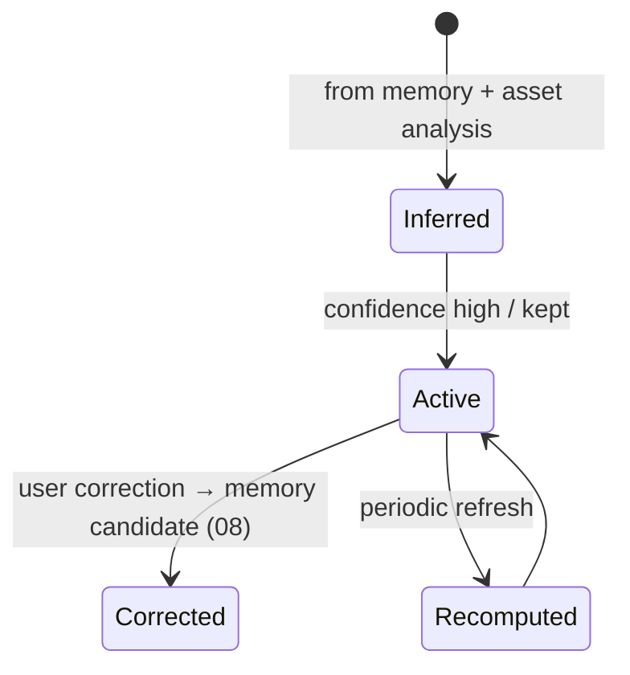
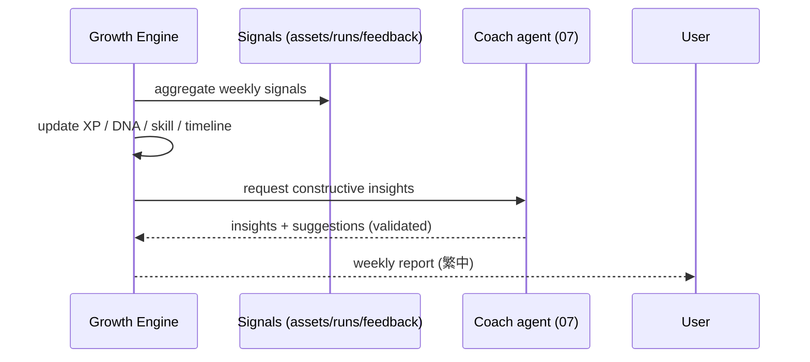

# 12 — Growth Engine

> Helps a creator improve over time: Creator XP, Creator DNA, skill map, timeline, weekly reports, coach suggestions, achievements, insights. Growth measures creative *development*, not vanity metrics.
> Locked decisions: `00_LOCKED_DECISIONS.md` (D17). Memory/DNA: `08_MEMORY_SYSTEM.md`. AI agents: `07_AI_SYSTEM.md`.

---

## Purpose

Turn a creator's accumulated history (assets, works, runs, feedback, marketplace/community signals) into constructive coaching — so every creation makes the creator stronger. Avoid shallow gamification (post counts) and never shame the creator (Constitution Article 12).

## Overview

The Growth Engine aggregates creative signals into a profile (Creator DNA), a skill map, a timeline, and periodic insights/coach suggestions. It is analytical + advisory; it does not gate creation.

```mermaid
flowchart TD
  SIG[Signals: assets, works, agent_runs, feedback, marketplace, community, memory] --> AGG[Aggregator]
  AGG --> XP[Creator XP]
  AGG --> DNA[Creator DNA]
  AGG --> SK[Skill Map]
  AGG --> TL[Timeline]
  AGG --> CO[Coach (agent)]
  CO --> REP[Weekly Report / Insights]
```

## Terminology

| Term | UI (繁中) | Meaning |
|---|---|---|
| Creator XP | 創作經驗 | Experience from meaningful creative activity. |
| Creator DNA | 創作 DNA | Long-term style/behavior profile (built on memory). |
| Skill Map | 技能圖 | Strengths/weaknesses across creative dimensions. |
| Timeline | 創作時間軸 | Milestones over time. |
| Coach | 教練 | The Coach agent giving constructive suggestions. |
| Insight | 洞察 | A specific, actionable growth observation. |

## Design Goals

1. **Development over output** — measure improvement, not volume.
2. **Constructive, never shaming** — coach tone (Article 12).
3. **Evidence-based** — built on real signals (assets/runs/feedback).
4. **Personal + private** — growth data is the creator's; respect scope/RLS.
5. **Reuse platform XP where sensible** — distinguish platform XP (`profiles`) from Creator XP (creative-specific) to avoid conflation.

## Core Concepts (entities)

### Entity: Creator XP / Stats
- **Definition:** creative-activity experience + counters (distinct from existing platform `profiles.xp`).
- **Ownership:** `user_id` (personal) and/or `workspace_id` (studio-level aggregates).
- **Metadata:** `user_id, workspace_id?, creator_xp, fragments_count, works_count, archives_count, workflows_count, updated_at`.
- **Lifecycle:** incremented by meaningful events (compose a work, archive→recycle, publish, sale). **Permission:** owner read. **Version:** snapshots for timeline. **Lineage:** N/A.
- **Example:** `{user_id, creator_xp:1240, works_count:8}`.

### Entity: Creator DNA
- **Definition:** inferred long-term style/behavior profile.
- **Built from:** memory (`08`) + asset analysis (recurring imagery, tone, rhythm, formats, avoided styles).
- **Metadata:** `user_id, traits jsonb (imagery, tone, strengths, weaknesses, formats), confidence, updated_at`.
- **Lifecycle:** recomputed periodically; user can correct (ties to memory candidates). **Permission:** owner; private. **Version:** snapshots. **Lineage:** references contributing assets/memories.
- **Example:** `{traits:{imagery:['moonlight','city streets'], tone:'restrained longing', strength:'emotional imagery', weakness:'structure'}}`.

- **Lifecycle/State machine (DNA):**



### Entity: Skill Map
- **Definition:** scored creative dimensions (visual, story, emotion, rhythm, character, worldbuilding, brand clarity, business thinking, learning consistency).
- **Ownership:** `user_id`. **Metadata:** `user_id, dimension, score(0..100), trend, evidence_refs[](asset/run ids), updated_at`. **Lifecycle:** updated from signals each aggregation. **Permission:** owner read. **Version:** snapshots feed trend. **Lineage:** `evidence_refs` cite the assets/runs that justify a score.
- **Example:** `{user_id, dimension:'emotion', score:82, trend:'+6', evidence_refs:['work_Y','run_88']}`.

### Entity: Growth Timeline / Milestones
- **Definition:** dated milestones (first work, first archive, first workflow, first sale, level-ups).
- **Ownership:** `user_id`/`workspace_id`. **Metadata:** `id, scope, scope_ref, kind(enum), ref_id, occurred_at`. **Lifecycle:** append-only (immutable). **Permission:** owner read. **Version:** N/A. **Lineage:** `ref_id` points to the asset/run that triggered the milestone.
- **Example:** `{user_id, kind:'first_work', ref_id:'work_1', occurred_at}`.

### Entity: Weekly Report / Insight (Coach output)
- **Definition:** periodic constructive summary produced by the Coach agent.
- **Ownership:** `user_id`/`workspace_id`. **Metadata:** `id, scope, scope_ref, period, summary, insights[], suggestions[], generated_run_id`. **Lifecycle:** scheduled-generate → read → archived. **Permission:** owner read. **Version:** one per period. **Lineage:** links to the `agent_run` that produced it (`07`).
- **Example:** `{scope:'personal', period:'2026-W26', insights:['情感意象強'], suggestions:['試試三段式結構'], generated_run_id:'run_91'}`.

### Achievements (reuse + extend)
The platform already has achievements/gamification (existing `achievements`, `/admin/achievements`). Growth **reuses** these for creative milestones where sensible; it does **not** create a parallel achievement system. Creative-specific badges map to `growth_milestones`. (MVP: counters + milestones; rich badges future.)

### Skill Tree (future)
A future progression view layering `skill_scores` into unlockable branches; reserve as derived (no v1 table).

## Business Rules

- Creator XP/DNA/skill are **analytical**; they never block creation or spend currency.
- Growth signals come from real activity (`agent_runs`, assets, feedback, marketplace, community), not arbitrary points.
- Coach output is constructive; weaknesses are framed as next steps (Article 12).
- DNA/skill inferences are correctable by the user (tie to memory candidates `08`).
- Creator XP is **separate** from existing platform `profiles.xp` (gamification) to avoid conflation; the two are not summed.
- **Coach output validation (no ranking/shaming):** Coach responses are schema-validated and must frame weaknesses as next-step suggestions; outputs that rank/compare creators or use shaming language are rejected/regenerated (enforced in the agent prompt + output validator, `07`).

## User Flow



## Mermaid Diagram(s)

| Diagram | Section | Purpose |
|---|---|---|
| Growth aggregation (flowchart) | Overview | signals→XP/DNA/skill/timeline/coach. |
| DNA lifecycle (state) | Entity: Creator DNA | inferred→active→corrected/recomputed. |
| Weekly report (sequence) | User Flow | aggregate→coach→report. |

## Database Considerations

Authoritative in `13_DATABASE.md`. NEW tables:

| Table (NEW) | Purpose | PK | Key FK | Indexes | Constraints | RLS |
|---|---|---|---|---|---|---|
| `creator_stats` | XP + counters | `id uuid` | `user_id`, `workspace_id?` | unique `(user_id,workspace_id)` **+ partial unique `(user_id) WHERE workspace_id IS NULL`** (Postgres treats NULLs as distinct, so personal rows need this) | xp≥0 | owner read |
| `creator_dna` | Style profile | `id uuid` | `user_id` | `(user_id)` | confidence 0..1 | owner only (private) |
| `skill_scores` | Skill map | `id bigserial` | `user_id` | `(user_id,dimension)` | score 0..100 | owner read |
| `growth_milestones` | Timeline | `id bigserial` | `user_id`/`workspace_id` | `(user_id,occurred_at)` | kind enum | owner read |
| `growth_reports` | Weekly reports/insights | `id bigserial` | `user_id`/`workspace_id`, `generated_run_id` | `(user_id,period)` | — | owner read |

Example rows:
- `creator_stats`: `{user_id, workspace_id:null, creator_xp:1240, works_count:8, archives_count:3}`
- `creator_dna`: `{user_id, traits:{imagery:['moonlight'],tone:'restrained longing',strength:'emotion',weakness:'structure'}, confidence:0.8}`
- `skill_scores`: `{user_id, dimension:'structure', score:61, trend:'+4', evidence_refs:['work_3']}`
- `growth_milestones`: `{user_id, kind:'first_sale', ref_id:'tx_12', occurred_at}`
- `growth_reports`: `{user_id, period:'2026-W26', insights:[...], suggestions:[...], generated_run_id:'run_91'}`

**Scoping/RLS:** personal rows (`user_id`) are private to the user — invisible even to workspace Owner/Manager. **Studio-level aggregates** are stored as separate `workspace_id`-scoped rows (with `user_id` null) that contain only **non-private aggregate counters** (e.g. total works), never members' personal DNA/skill; Owner/Manager read those. Creator XP/DNA are `user_id`-scoped (documented personal-data exception, like personal memory). RLS mirrors `idea_fragments_migration.sql`.

## API Considerations

NEW, indicative — authoritative in `14_API.md`:

| Method | Route (NEW) | Permission | Request | Response | Errors |
|---|---|---|---|---|---|
| GET | `/api/creator-island/growth/overview` | owner | `?scope&scopeRef` | `{xp, skillMap, dnaSummary, milestones[]}` | 401/403 |
| GET | `/api/creator-island/growth/reports` | owner | `?cursor` | `{reports[], nextCursor}` | 401/403 |
| POST | `/api/creator-island/growth/dna/correct` | owner | `{trait, correction}` | `{ok}` (creates memory candidate) | 401/403/422 |

Reports generated by a scheduled job (existing cron in v1; n8n later). Lists paginate.

## Permission Model

| Action | Self (owner of data) | Workspace Owner/Manager | Others |
|---|:--:|:--:|:--:|
| View personal XP/DNA/skill | ✅ | ❌ | ❌ |
| View studio-level aggregates | ✅(own) | ✅ | ❌ |
| Correct DNA/skill inference | ✅ | — | ❌ |
| Trigger report generation | ✅ | ✅(studio) | ❌ |

Personal growth data is private to the creator regardless of workspace role.

## UI Considerations

- A 成長 dashboard: XP, skill radar, DNA summary, timeline, latest weekly report.
- Coach copy is encouraging 繁中; weaknesses shown as "下一步可以試…".
- v1: preview/skeleton; basic XP + counts may ship first.

## Edge Cases

- New creator with little history → show "尚在建立 DNA"; no false confident claims.
- Low-confidence DNA trait → not asserted as fact; correctable.
- Conflicting signals → coach hedges; never shames.
- Studio aggregates exclude members' private personal data.
- Report generation failure → retry; never block the dashboard.

## Security

- RLS scopes growth data to the owner; personal DNA invisible to workspace.
- Coach prompts use scoped data only; no cross-user leakage.
- Corrections create memory candidates (auditable).

## Performance

- Aggregation runs in scheduled batches (incremental), not per-request.
- Cache overview; recompute DNA periodically, not on every event.
- Reports stored; dashboard reads cached aggregates.

## Testing

- Separation: Creator XP never merged into platform `profiles.xp`.
- Privacy: personal DNA/skill invisible to other members (RLS).
- Constructiveness: coach output framed as next steps (prompt + validation).
- Correctness: DNA correction creates a memory candidate.
- Resilience: report job failure doesn't break the dashboard.

## Future Expansion

- **Monthly Report** (in addition to v1 Weekly) + richer cadence options.
- Skill tree progression (the "Skill Graph" view layering `skill_scores`); achievements tied to real milestones.
- First-class **Knowledge** area (圖書館) as a typed asset surface (reserved in `05` as a future asset type).
- **Creator DNA shareable card (E9, `ENHANCEMENTS.md`):** a "creative fingerprint" card (imagery/tone/strengths) for growth feedback + organic share/acquisition loop.
- Cross-island growth (Learning/Business) on the same engine.
- Comparative/cohort insights (privacy-preserving); goal setting.
- DNA-driven creation presets feeding `06`.

## Implementation Notes

- Aggregator + Coach in `src/lib/creator-engine/`; Coach is an agent via `07`.
- Reuse existing scheduled-job/cron infrastructure for weekly reports (n8n optional later).
- Keep Creator XP distinct from existing gamification `profiles.xp`.

## MVP vs Future

- **MVP:** skeleton + basic Creator XP/counters; reserve DNA/skill/report schema.
- **Future:** DNA, skill map, coach reports, achievements, cross-island growth.

---

## Change log

- 2026-06-28 — Initial Growth Engine (D17; Creator XP separate from platform XP; constructive coaching).
