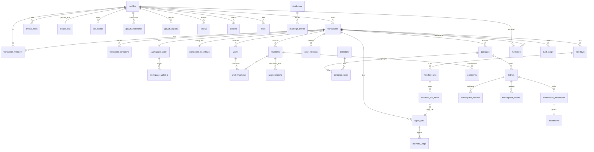

# 13 — Database

> The authoritative database spec for Ideas OS / Creator Island: every NEW table (purpose, columns, PK, FK, indexes, constraints, RLS, migration note, future fields, example row), the RLS pattern, key RPCs, and the ER diagram. Existing platform tables are reused and **not modified**.
> Locked decisions: `00_LOCKED_DECISIONS.md`. This file is the single source of truth for schema; other docs link here.

---

## Purpose

Give engineers copy-ready schema guidance so every subsystem persists consistently: workspace-scoped ownership, RLS on every NEW table, pagination-friendly indexes, and provenance/lineage. Resolves open schema choices (workspace wallet ledger, asset table shape, lineage canonical split, last-owner safety).

## Overview

Ideas OS adds NEW tables on the existing Supabase Postgres (+ pgvector). All durable creative tables carry `workspace_id` and workspace-scoped RLS. Existing `user_id` tables stay untouched; a few NEW personal-scoped tables (personal memory, creator stats/DNA) deliberately use `user_id`.

```mermaid
flowchart LR
  subgraph Existing (reuse, unaltered)
    PR[profiles] --- CT[coin_transactions] --- AS[app_settings] --- AL[audit_logs] --- AIT[ai_models/ai_api_keys/user_api_keys/ai_usage_*] --- IF[idea_fragments]
  end
  subgraph NEW
    WS[workspaces] --- WM[workspace_members] --- WI[workspace_invitations] --- WW[workspace_wallet/_tx] --- WAI[workspace_ai_settings]
    FR[fragments] --- WK[works] --- WF[work_fragments] --- AR[asset_relations] --- AV[asset_versions] --- PK[packages] --- COL[collections]
    AGR[agent_runs] --- MEM[memories] --- WFL[workflows/_runs] --- MKT[listings/transactions/...] --- DUST[dust_ledger] --- GROW[creator_stats/dna/...]
  end
  PR --> WM
  WS --> FR
```

## Terminology

| Term | Meaning |
|---|---|
| workspace-scoped | row has `workspace_id`; RLS limits to workspace members. |
| personal-scoped | row has `user_id`; RLS limits to that user (documented exceptions). |
| RLS pattern | the EXISTS-membership policy reused from `idea_fragments_migration.sql`. |

## Design Goals

1. **One source of truth per concept** (composition vs lineage; one economy unit).
2. **RLS everywhere** on NEW tables.
3. **Pagination-friendly** indexes (`(workspace_id, created_at)`), GIN tags, ivfflat embeddings.
4. **Provenance** (`source_type`) + lineage relations on creative assets.
5. **Reuse, don't alter** existing tables.

## Core Concepts

### Ownership rule
- Workspace-scoped (most durable assets): `workspace_id` FK → `workspaces`.
- Personal-scoped exceptions (NEW): `memories` (personal scope), `creator_stats`, `creator_dna`, `skill_scores`, community `follows`/`collects`/`notifications` — these belong to a `user_id`.
- Existing `user_id` systems unchanged.

### RLS pattern (reused)
Workspace tables use:
```sql
USING (EXISTS (SELECT 1 FROM public.workspace_members m
               WHERE m.workspace_id = <table>.workspace_id AND m.user_id = auth.uid()))
```
Write policies add a role check (e.g. role IN ('owner','manager') for management). Personal tables use `user_id = auth.uid()`. Public reads (community/marketplace) add `visibility/status` predicates. (Mirrors the existing `idea_fragments_admin_all` policy shape.)

### Economy unit
Z 幣 is one unit: buyer side uses existing `coin_transactions`; workspace side uses NEW `workspace_wallet` + `workspace_wallet_tx`. **Dust** is a separate NEW `dust_ledger` (never money — ADR-004).

### Canonical splits (no forked truth)
- **Composition** (fragments in a work): `work_fragments` only.
- **Derivation lineage**: `asset_relations` only (no `used_in_work` type).

## Business Rules

- Every NEW table: `ENABLE ROW LEVEL SECURITY` + explicit policies; no table ships RLS-off.
- Every "fetch all" repository helper paginates (`.range()`) — PostgREST truncates at 1000 rows.
- Migrations are idempotent (`CREATE TABLE IF NOT EXISTS`, `CREATE INDEX IF NOT EXISTS`), one file per area: `supabase/<area>_migration.sql`.
- Existing tables are never altered by Ideas OS migrations (additive only, in NEW tables).

## NEW tables (authoritative)

> **NAMING RULE (authoritative): every NEW Creator Island table is physically named with the `ci_` prefix** (`ci_workspaces`, `ci_fragments`, `ci_works`, `ci_comments`, `ci_memories`, …). Matches the platform's domain-prefix convention (`blog_`/`forum_`/`ai_`/`nami_`/`user_`) and avoids all collisions. **Reused existing tables keep their names** (NOT prefixed): `profiles`, `coin_transactions`, `app_settings`, `audit_logs`, `ai_models`/`ai_api_keys`/`user_api_keys`/`ai_usage_daily`/`ai_model_usage`, `notifications`, `idea_fragments`, `user_ai_memory`. Where a table appears below without the prefix (FK targets, indexes, prose, ER, RPC bodies, other docs) it resolves to the `ci_` physical name. `ci_memories` is deliberately separate from existing `user_ai_memory` (different purpose).
>
> Format per table: **Cols** (copy-ready) · **PK · FK · Indexes · Constraints · RLS · Example**. Each ships in a `supabase/creator_island_*_migration.sql` with RLS + idempotent DDL (`IF NOT EXISTS`). All `*_id` are uuid unless noted; all carry `created_at timestamptz default now()`.

### Workspace (`04`) — `supabase/creator_island_workspace_migration.sql`
- **ci_workspaces** — Cols `id uuid pk, name text, type text, visibility text default 'private', settings jsonb default '{}', owner_id uuid, created_by uuid, created_at, updated_at`. FK `owner_id,created_by→profiles`. Idx `(owner_id)`, partial unique `(owner_id) WHERE type='personal'`. Ck `type∈(personal,studio)`. RLS member read / Owner-Manager update / Owner delete(studio). Ex `{name:'夜貓工作室',type:'studio',owner_id}`. Future: `plan`,`seats`.
- **ci_workspace_members** — Cols `id uuid pk, workspace_id uuid, user_id uuid, role text, invited_by uuid, joined_at`. FK `workspace_id→ci_workspaces, user_id→profiles`. Idx unique `(workspace_id,user_id)`, `(user_id)`, **partial unique `(workspace_id) WHERE role='owner'`**. Ck `role∈(owner,manager,contributor,viewer)`. RLS member read / Owner-Manager manage. Ex `{workspace_id,user_id,role:'contributor'}`.
- **ci_workspace_invitations** — Cols `id uuid pk, workspace_id uuid, code_hash text, role text, created_by uuid, expires_at, max_uses int, used_count int default 0`. FK `workspace_id,created_by`. Idx unique `(code_hash)`,`(workspace_id)`. Ck `role` enum. RLS Owner-Manager manage / redeem by code. Stores **hashed** code. Ex `{workspace_id,code_hash,role:'contributor',max_uses:10}`.
- **ci_workspace_wallet** — Cols `id uuid pk, workspace_id uuid, balance int default 0, low_balance_threshold int, updated_at`. FK `workspace_id`. Idx unique `(workspace_id)`. Ck `balance>=0`. RLS Owner-Manager. Ex `{workspace_id,balance:5000}`.
- **ci_workspace_wallet_tx** — Cols `id bigserial pk, workspace_id uuid, user_id uuid, amount int, balance_after int, reason text, meta jsonb, created_at`. FK `workspace_id,user_id`. Idx `(workspace_id,created_at)`. Append-only. RLS member read / system write. Ex `{workspace_id,user_id,amount:-12,balance_after:4988,reason:'ai:evolve',meta:{agentRunId}}`.
- **ci_workspace_ai_settings** — Cols `id uuid pk, workspace_id uuid, monthly_budget int, allowed_agents text[], model_preference text, byok_allowed bool default true, limits jsonb`. FK `workspace_id`. Idx unique `(workspace_id)`. RLS Owner-Manager. Ex `{workspace_id,monthly_budget:10000,allowed_agents:['synthesize','evolve','compose']}`.

### Assets (`05`) — `supabase/creator_island_assets_migration.sql`
- **ci_fragments** — Cols `id uuid pk, workspace_id uuid, created_by uuid, title text, content text default '', tags text[] default '{}', mood text, category text, source_type text, ai_summary text, embedding vector(1536), created_at, updated_at`. FK `workspace_id,created_by`. Idx `(workspace_id,created_at)`, tags GIN, embedding ivfflat. Ck `source_type` enum, `char_length(title) 1..200`. RLS workspace-scoped. Ex `{workspace_id,title:'我墊著腳尖走在妳的世界',source_type:'human_original',tags:['歌詞']}`. Future: `culture`.
- **ci_works** — Cols `id uuid pk, workspace_id uuid, created_by uuid, work_type text, status text default 'draft', title text, body text, source_type text, language text, culture text, published_blog_id uuid, created_at, updated_at`. FK `workspace_id,created_by`. Idx `(workspace_id,updated_at)`. Ck `work_type`,`status` enum. RLS workspace-scoped. Ex `{workspace_id,work_type:'song',title:'夜車',status:'draft'}`.
- **ci_work_fragments** — Cols `id bigserial pk, work_id uuid, fragment_id uuid, position int`. FK `work_id→ci_works, fragment_id→ci_fragments`. Idx unique `(work_id,fragment_id)`. **Canonical composition.** RLS inherit work's workspace. Ex `{work_id,fragment_id,position:0}`.
- **ci_asset_relations** — Cols `id bigserial pk, from_asset_id uuid, from_asset_type text, to_asset_id uuid, to_asset_type text, relation_type text, workspace_id uuid, created_at`. **No cross-table FK** (polymorphic ids; integrity via `*_asset_type` discriminators + validation trigger — see §FK decision). Idx `(from_asset_id)`,`(to_asset_id)`. Ck `relation_type∈(evolved_from,condensed_from,recycled_from,transcreated_from,inspired_by,remixed_from,forked_from,quoted_by,packaged_in)` — **no `used_in_work`** (composition lives in `work_fragments`). RLS via `workspace_id`. Ex `{from_asset_id:'frag_A',from_asset_type:'fragment',to_asset_id:'frag_B',to_asset_type:'fragment',relation_type:'evolved_from'}`.
- **ci_asset_versions** — Cols `id bigserial pk, asset_id uuid, asset_type text, workspace_id uuid, version_no int, snapshot jsonb, created_by uuid, created_at`. FK `workspace_id`. Idx `(asset_id,created_at)`. Ck `version_no` increasing. RLS workspace-scoped. Ex `{asset_id,version_no:2,snapshot:{...}}`.
- **ci_packages** — Cols `id uuid pk, workspace_id uuid, title text, description text, items jsonb, visibility text, license_id uuid, price_z int, created_by uuid`. FK `workspace_id`. Idx `(workspace_id)`. Ck `visibility` enum. RLS workspace / public read if public. Ex `{workspace_id,title:'失戀歌詞碎片包',visibility:'marketplace'}`.
- **ci_collections** / **ci_collection_items** — Cols `collections{id uuid pk, workspace_id, name, created_by}` + `collection_items{id bigserial pk, collection_id uuid, asset_id uuid, asset_type text}`. Idx `(collection_id)`, unique `(collection_id,asset_id)`. RLS workspace-scoped. Many-to-many.

### AI (`07`) — `supabase/creator_island_ai_migration.sql`
- **ci_agent_runs** — Cols `id bigserial pk, workspace_id uuid, user_id uuid, agent_type text, input jsonb, output jsonb, provider text, model text, tokens_in int, tokens_out int, cost_usd numeric, status text, error text, created_assets text[], created_at`. FK `workspace_id,user_id`. Idx `(workspace_id,created_at)`,`(agent_type)`. Ck `status∈(running,succeeded,failed)`. RLS member read / system write. Ex `{workspace_id,agent_type:'compose',model:'claude-…',tokens_in:1500,cost_usd:0.02,status:'succeeded',created_assets:['work_Y']}`. (`ai_usage_daily`/`ai_model_usage` still written in parallel; `cost_usd` is analytics-only — user charge is Z 幣.)
- **ci_agent_prompts** (opt.) — Cols `id bigserial pk, agent_key text, version int, system_prompt text, created_at`. Idx `(agent_key,version)`. RLS admin manage.

### Memory (`08`) — `supabase/creator_island_memory_migration.sql`
- **ci_memories** — Cols `id uuid pk, scope text, scope_ref uuid, user_id uuid, workspace_id uuid, kind text, text text, embedding vector(1536), confidence numeric, status text, source text, created_at, last_used_at`. FK `user_id`(personal)/`workspace_id`(workspace/project). Idx `(scope,scope_ref,kind)`, embedding ivfflat. Ck `scope` enum, `status∈(candidate,active,rejected,expired)`, `confidence 0..1`. RLS scope owner only. Ex `{scope:'workspace',workspace_id,kind:'tone',text:'playful, not preachy',status:'active'}`.
- **ci_memory_usage** — Cols `id bigserial pk, memory_id uuid, agent_run_id bigint, created_at`. FK `memory_id,agent_run_id`. Idx `(agent_run_id)`. RLS scope owner read.
- **ci_memory_versions** (opt.) — `id bigserial pk, memory_id uuid, snapshot jsonb, created_at`.

### Workflow (`09`) — `supabase/creator_island_workflow_migration.sql`
- **ci_workflows** — Cols `id uuid pk, workspace_id uuid, created_by uuid, title text, description text, nodes jsonb, edges jsonb, variables jsonb, version int default 1, visibility text, license_id uuid, source_type text, is_template bool default false, created_at, updated_at`. FK `workspace_id,created_by`. Idx `(workspace_id,updated_at)`. Ck `visibility` enum, `version>=1`. RLS workspace-scoped. Ex `{workspace_id,title:'歌曲量產流程',version:1}`.
- **ci_workflow_runs** — Cols `id bigserial pk, workflow_id uuid, workflow_version int, workspace_id uuid, started_by uuid, base_run_id bigint, input jsonb, status text, cost_total numeric, result_asset_ids text[], created_at`. FK `workflow_id,workspace_id,started_by`. Idx `(workflow_id,created_at)`,`(workspace_id)`. Ck `status` enum. RLS member read / system write.
- **ci_workflow_run_steps** — Cols `id bigserial pk, run_id bigint, step_index int, node_id text, agent_run_id bigint, input jsonb, output jsonb, status text, created_at`. FK `run_id,agent_run_id?`. Idx `(run_id,step_index)`. RLS inherit. Required for replay/debug.

### Marketplace (`10`) — `supabase/creator_island_marketplace_migration.sql`
- **ci_listings** — Cols `id uuid pk, workspace_id uuid, package_id uuid, price_z int, status text, visibility text, ai_generated_label text, license_id uuid, created_by uuid, created_at`. FK `workspace_id,package_id`. Idx `(status,created_at)`,`(workspace_id)`. Ck `status` enum, `price_z>=0`. RLS public read if Listed / Owner-Manager write. Ex `{workspace_id,package_id,price_z:200,ai_generated_label:'ai_assisted'}`.
- **ci_licenses** — Cols `id uuid pk, workspace_id uuid, name text, view bool, collect bool, fork bool, remix bool, commercial_use bool, attribution_required bool, exclusive bool, ai_use_allowed bool, training_allowed bool`. FK `workspace_id?`. RLS public read / seller manage. Presets allowed.
- **ci_marketplace_transactions** — Cols `id bigserial pk, listing_id uuid, package_id uuid, buyer_id uuid, seller_workspace_id uuid, price_z int, platform_fee_z int, seller_net_z int, license_snapshot jsonb, source_lineage jsonb, ai_generated_label text, status text, created_at`. FK `listing_id,buyer_id,seller_workspace_id`. Idx `(buyer_id)`,`(seller_workspace_id,created_at)`. Ck `price_z=platform_fee_z+seller_net_z`. Immutable. RLS buyer+seller read.
- **ci_entitlements** — Cols `id uuid pk, transaction_id bigint, buyer_id uuid, package_id uuid, license_snapshot jsonb, created_at`. FK `transaction_id,buyer_id,package_id`. Idx unique `(buyer_id,package_id)`. RLS buyer read.
- **ci_marketplace_reviews** — Cols `id bigserial pk, listing_id uuid, user_id uuid, rating int, text text, created_at`. FK `listing_id,user_id`. Idx `(listing_id)`. Ck `rating 1..5`, unique `(listing_id,user_id)`. RLS public read / buyer write.
- **ci_marketplace_reports** — Cols `id bigserial pk, listing_id uuid, reporter_id uuid, reason text, detail text, status text, created_at`. FK `listing_id,reporter_id`. Idx `(listing_id)`. Ck `reason` enum. RLS reporter + moderators.

### Economy — Dust (`06`/`12`) — `supabase/creator_island_dust_migration.sql`
- **ci_dust_ledger** — Cols `id bigserial pk, user_id uuid, workspace_id uuid, amount int, balance_after int, reason text, meta jsonb, created_at`. FK `user_id`/`workspace_id`. Idx `(user_id,created_at)`. Append-only. RLS owner read / system write. **Separate from `coin_transactions`** (never money). Ex `{user_id,amount:-1,balance_after:9,reason:'egg_open'}`.

### Growth (`12`) — `supabase/creator_island_growth_migration.sql`
- **ci_creator_stats** — Cols `id uuid pk, user_id uuid, workspace_id uuid, creator_xp int default 0, fragments_count int, works_count int, archives_count int, workflows_count int, updated_at`. FK `user_id,workspace_id?`. Idx unique `(user_id,workspace_id)` **+ partial unique `(user_id) WHERE workspace_id IS NULL`** (NULLs are distinct in Postgres → personal rows need the partial index). Ck `creator_xp>=0`. RLS owner read. **Distinct from `profiles.xp`.** Ex `{user_id,creator_xp:1240,works_count:8}`.
- **ci_creator_dna** — Cols `id uuid pk, user_id uuid, traits jsonb, confidence numeric, updated_at`. FK `user_id`. Idx `(user_id)`. Ck `confidence 0..1`. RLS owner only (private).
- **ci_skill_scores** — Cols `id bigserial pk, user_id uuid, dimension text, score int, trend text, evidence_refs text[], updated_at`. FK `user_id`. Idx `(user_id,dimension)`. Ck `score 0..100`. RLS owner read.
- **ci_growth_milestones** — Cols `id bigserial pk, user_id uuid, workspace_id uuid, scope text, kind text, ref_id text, occurred_at`. Idx `(user_id,occurred_at)`. Ck `kind` enum. RLS owner read.
- **ci_growth_reports** — Cols `id bigserial pk, user_id uuid, workspace_id uuid, scope text, period text, summary text, insights jsonb, suggestions jsonb, generated_run_id bigint, created_at`. Idx `(user_id,period)`. RLS owner read.

### Community (`11`) — `supabase/creator_island_community_migration.sql`
- **ci_follows** — Cols `id uuid pk, follower_id uuid, target_type text, target_id uuid, created_at`. Idx unique `(follower_id,target_type,target_id)`. Ck `target_type` enum. RLS follower manage; public counts.
- **ci_collects** — Cols `id uuid pk, user_id uuid, asset_id uuid, asset_type text, created_at`. Idx unique `(user_id,asset_id)`. RLS owner.
- **ci_likes** — Cols `id bigserial pk, user_id uuid, asset_id uuid, created_at`. Idx unique `(user_id,asset_id)`. RLS owner; public counts.
- **ci_comments** — Cols `id bigserial pk, asset_id uuid, asset_type text, user_id uuid, body text, parent_id bigint, mentions uuid[], created_at`. Idx `(asset_id,created_at)`. Ck body not empty. RLS read per asset visibility / author write. UGC sanitized server-side.
- **ci_challenges** / **ci_challenge_entries** — `challenges{id uuid pk, title, theme, starts_at, ends_at, rules jsonb}` + `challenge_entries{id bigserial pk, challenge_id uuid, asset_id uuid, entrant_id uuid}`. Idx `(challenge_id)`. RLS public read / curator manage.
- **notifications** — **EXISTING table, reused** (`supabase/notifications_migration.sql`); Ideas OS only adds new `type` values + payload shapes. No new notifications table.

## Key RPCs / functions

- **`transfer_workspace_owner(workspace_id, to_user_id)`** — transactional: demote old owner→manager, promote target→owner, keep exactly one owner. **Removing/demoting the last owner is rejected at this RPC/transaction layer** (the partial unique index only guarantees ≤1 owner; ≥1 owner is enforced here — Codex note on `04`).
- **`debit_wallet(scope, ref, amount, reason, meta)`** — atomic balance check + ledger insert (Z 幣 personal/workspace; Dust separate function).
- **`purchase_listing(listing_id, buyer, wallet)`** — atomic: debit buyer + credit seller workspace + fee + entitlement + snapshot (all-or-nothing).
- **`refund_transaction(transaction_id, reason)`** — atomic inverse of a purchase: credit buyer `coin_transactions`, debit seller `workspace_wallet` (allow negative/owed per policy), revoke entitlement. Moderator-only.
- **`idea_surprising_pairs(...)`** — reuse existing RPC pattern for fragment surprising-pairs.

### `asset_relations` polymorphic ids (FK decision)
`from_asset_id`/`to_asset_id` are **polymorphic** (a fragment, work, package, or workflow). Because v1 uses **per-type tables** (no single `assets` supertable), these columns **cannot carry a real cross-table FK**. Integrity is enforced by the application layer + an optional `asset_type` discriminator column per edge + a validation trigger (check the referenced id exists in the table named by `asset_type`). If/when a shared `assets` supertable is introduced (future), convert these to true FKs. This is the deliberate resolution of the `05` polymorphic-FK ambiguity.

## Migration strategy

One `supabase/creator_island_<area>_migration.sql` per area, idempotent, RLS-on, mirroring `idea_fragments_migration.sql`. **Exact filenames + apply order** (each references prior FKs):

1. `creator_island_workspace_migration.sql` (workspaces → members → invitations → wallet/_tx → ai_settings)
2. `creator_island_assets_migration.sql` (fragments → works → work_fragments → asset_relations(+trigger) → asset_versions → packages → collections)
3. `creator_island_ai_migration.sql` (agent_runs → agent_prompts)
4. `creator_island_memory_migration.sql` (memories → memory_usage → memory_versions)
5. `creator_island_dust_migration.sql` (dust_ledger)
6. `creator_island_workflow_migration.sql` (workflows → workflow_runs → workflow_run_steps)
7. `creator_island_marketplace_migration.sql` (licenses → listings → transactions → entitlements → reviews → reports)
8. `creator_island_growth_migration.sql` (creator_stats → creator_dna → skill_scores → milestones → reports)
9. `creator_island_community_migration.sql` (follows → collects → likes → comments → challenges → challenge_entries)
10. `creator_island_rpcs_migration.sql` (the functions below)

- Verify with the existing `scripts/audit-db-columns.mjs` (column-existence audit) before wiring queries.

## ER Diagram

Full ER across all NEW tables (existing `profiles` shown as the anchor; existing `coin_transactions`/`notifications` reused but omitted from edges for clarity):



Note: `asset_relations`/`collection_items`/`comments` reference assets **polymorphically** (`*_asset_type` discriminator), so the edges above are logical, not enforced cross-table FKs (see §FK decision).

## API Considerations

Tables are exposed only via Ideas OS product endpoints (`14_API.md`), never raw PostgREST table access from the client for writes. RLS is the backstop; server handlers do role checks.

## Permission Model

RLS per table (above). Summary: workspace tables → member read + role-gated writes; personal tables → `user_id = auth.uid()`; public surfaces (listings/community) → visibility/status predicates; ledgers/runs → system write only.

## UI Considerations

N/A directly; schema supports the UI in `16_UI_UX.md`. Ensure indexes back the list/search screens (workspace timelines, fragment search, run history).

## Edge Cases

- Last-owner removal → blocked by `transfer_workspace_owner`/transaction (not by index alone).
- Deleted source asset → lineage edge retained with marker.
- Concurrent wallet debits → handled by `debit_wallet` atomic check.
- Embedding column null → semantic features degrade; row still valid.
- >1000 rows → mandatory pagination in repositories.

## Security

- RLS on every NEW table; ledgers/runs system-write only.
- Invitation codes hashed; AI keys reuse existing encrypted store.
- Audit privileged actions; immutable ledgers/transactions for evidence.

## Performance

- `(workspace_id, created_at)` baseline; GIN tags; ivfflat embeddings; unique constraints for idempotency.
- Atomic RPCs avoid race conditions for wallet/purchase/transfer.
- Backfill embeddings asynchronously (existing `embed-backfill` pattern).

## Testing

- RLS isolation per table (cross-workspace/user denied).
- Last-owner invariant via RPC; partial unique prevents 2 owners.
- Atomic wallet/purchase (all-or-nothing) under concurrency.
- Idempotent migrations re-run cleanly.
- Column audit passes (`audit-db-columns.mjs`).

## Future Expansion

- Shared `assets` supertable (if per-type columns prove heavy).
- Partitioning for `agent_runs`/ledgers at scale; archival.
- Real-money payment tables (phase 2 marketplace).
- Organization-level ownership tables.

## Implementation Notes

- Decide **shared `assets` table vs per-type common columns**: v1 uses per-type tables (`fragments`,`works`,…) with shared common columns — simpler, matches existing style; revisit a supertable later.
- Reuse `idea_fragments_migration.sql` as the RLS/pgvector/GIN template.
- Implement `transfer_workspace_owner`, `debit_wallet` (MVP) and `purchase_listing`, `refund_transaction` (marketplace-later) as Postgres functions (SECURITY DEFINER, careful search_path).

## MVP vs Future

- **MVP tables:** workspaces, workspace_members, workspace_invitations, workspace_wallet(+tx), workspace_ai_settings, fragments, works, work_fragments, asset_relations, agent_runs, memories(personal+workspace). Marketplace/community/growth tables **reserved** (skeleton).
- **Future:** full marketplace/community/growth tables, asset_versions depth, supertable, partitioning.

---

## Change log

- 2026-06-28 — Initial authoritative DB spec; consolidates NEW tables from `04`–`12`; adds last-owner RPC, Dust ledger, canonical composition/lineage split.
