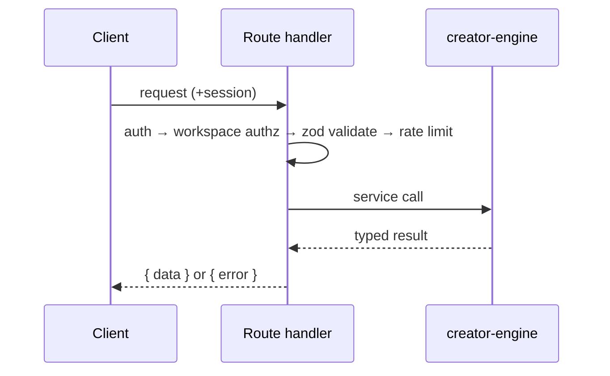

# 14 — API

> The authoritative API spec for Ideas OS / Creator Island: conventions (auth, validation, errors, pagination, rate limits) and every endpoint (method, route, permission, request, response, errors, related tables). Routes are NEW under `/api/creator-island/*`, separate from `/api/admin/*`.
> Locked decisions: `00_LOCKED_DECISIONS.md`. Schema: `13_DATABASE.md`. This file is the single source of truth for endpoints.

---

## Purpose

Define stable, server-authoritative endpoints so the UI and services agree on contracts. Every route enforces auth + workspace/role authorization + zod validation; AI is never called from the client. Concrete per-route rate limits are defined here (resolving the Codex notes on `01`/`07`).

## Overview

```mermaid
flowchart TD
  C[Client / Creator Island UI] --> RH[/api/creator-island/* (NEW)]
  RH --> AU[auth (Supabase)]
  AU --> AZ[workspace authz + RLS]
  AZ --> VAL[zod validate]
  VAL --> CE[creator-engine service]
  CE --> DB[(Supabase)]
  CE --> AIL[AI Layer (07)]
```

## Terminology

| Term | Meaning |
|---|---|
| Route handler | Next.js App Router `route.ts`. |
| Cursor | Opaque pagination token (created_at + id). |
| Cost-bearing | Endpoint that spends Z 幣/Dust (passes Cost Manager). |

## Design Goals

1. **Product operations, not raw CRUD** — endpoints map to user intent.
2. **Server-authoritative** — auth + role + RLS + validation on every write.
3. **Consistent envelope** — uniform error + pagination shapes.
4. **AI isolated** — provider calls only via the AI Layer.
5. **Rate-limited** — explicit limits on expensive/abusable routes.

## Core Concepts (conventions)

### Auth & authorization
- Auth via existing Supabase session. Unauthenticated → `401`.
- Workspace authorization: handler resolves active workspace + caller's role (`workspace_members`); insufficient role → `403`. RLS is the backstop.
- Platform-admin routes (`15`) use existing `is-owner`/`profiles.role`.

### Validation
- All bodies validated with zod; invalid → `422` with field errors. (Reuse existing platform zod patterns.)

### Error model
```json
{ "error": "code", "message": "繁中-safe message", "details": {} }
```
| Code | Meaning |
|---|---|
| 401 | not authenticated |
| 402 | insufficient wallet (Z 幣/Dust) |
| 403 | role/permission denied |
| 404 | not found / no access |
| 409 | conflict (state/idempotency) |
| 422 | validation failed |
| 429 | rate limited |
| 502 | AI/provider/validation failure (input preserved) |

### Pagination
- Cursor-based: `?cursor=&limit=` (default 20, max 100). Response `{ items[], nextCursor }`. All list endpoints paginate (PostgREST 1000-row limit). Never return unbounded lists.

### Rate limits (concrete)
| Route group | Limit (per user) | Notes |
|---|---|---|
| AI actions (`/ai/*`, `/workflows/*/run`) | 30 / min, 600 / day | cost-bearing; also budget-gated |
| Marketplace purchase | 20 / min | idempotent; atomic |
| Fragment/work writes | 120 / min | |
| Community (follow/comment/collect) | 60 / min | anti-spam |
| Reads (lists) | 300 / min | cached where possible |

(Implement via the existing `src/lib/rate-limit` helpers; `429` + `Retry-After` on exceed. Note: if the limiter is in-memory it is per-instance — on Zeabur multi-instance, back it with a shared store (e.g. DB/Redis) for accurate global limits on cost-bearing routes.)

## Business Rules

- Cost-bearing routes reserve budget via Cost Manager before provider calls; over-budget → `402` or downgrade.
- AI routes always write `agent_runs` + existing usage tables.
- Writes always set `workspace_id` (or `user_id` for personal-scoped); RLS enforced.
- Mutating marketplace/wallet operations are atomic (RPCs in `13`).

## User Flow



## Mermaid Diagram(s)

| Diagram | Section | Purpose |
|---|---|---|
| Request pipeline (flowchart) | Overview | client→handler→authz→validate→service→DB/AI. |
| Handler sequence (sequence) | User Flow | per-request checks order. |

## Endpoints (authoritative)

> All NEW, under `/api/creator-island/`. Permission = minimum workspace role unless noted. Related tables per `13`.

### Workspace (`04`)
| Method | Route | Perm | Request | Response | Errors |
|---|---|---|---|---|---|
| GET | `/workspaces` | authed | — | `{workspaces[]}` | 401 |
| GET | `/workspaces/active` | authed | — (lazy-creates personal) | `{workspace}` | 401 |
| POST | `/workspaces` | authed | `{name,type:'studio'}` | `{workspace}` | 401/422 |
| POST | `/workspaces/{id}/members` | Owner/Manager | `{userId,role}` | `{member}` | 401/403/409 |
| PATCH | `/workspaces/{id}/members/{uid}` | Owner/Manager | `{role}` | `{member}` | 401/403/409 |
| DELETE | `/workspaces/{id}/members/{uid}` | Owner/Manager | — | `{ok}` | 401/403/409(last owner) |
| POST | `/workspaces/{id}/invitations` | Owner/Manager | `{role,expiresAt,maxUses}` | `{code}` | 401/403 |
| POST | `/invitations/{code}/redeem` | authed | — | `{workspace}` | 401/404/409 |
| POST | `/workspaces/{id}/transfer` | Owner | `{toUserId}` | `{ok}` | 401/403/409 |
| DELETE | `/workspaces/{id}` | Owner(studio) | — | `{ok}` | 401/403/409 |

### Assets (`05`)
| Method | Route | Perm | Request | Response | Errors |
|---|---|---|---|---|---|
| POST | `/fragments` | Contributor+ | `{workspaceId,title,content,tags}` | `{fragment}` | 401/403/422 |
| GET | `/fragments` | member | `?workspaceId&cursor&q&tag` | `{items[],nextCursor}` | 401/403 |
| PATCH | `/fragments/{id}` | Contributor+ | `{...}` | `{fragment}` | 401/403/404 |
| DELETE | `/fragments/{id}` | Contributor+ | — | `{ok}` | 401/403/404 |
| POST | `/works` | Contributor+ | `{workspaceId,workType,title,fragmentIds}` | `{work}` | 401/403/422 |
| GET | `/works` | member | `?workspaceId&cursor` | `{items[],nextCursor}` | 401/403 |
| POST | `/works/{id}/archive` | Contributor+ | — | `{recycledFragments[]}` | 401/403/404 |
| POST | `/works/{id}/publish` | Contributor+ | `{target:'blog'}` | `{blogDraftId}` | 401/403/409 |
| GET | `/assets/{id}/lineage` | member | — | `{edges[]}` | 401/403/404 |
| POST | `/packages` | Owner/Manager | `{workspaceId,items[],visibility}` | `{package}` | 401/403/422 |

### Creation actions / AI (`06`/`07`)
| Method | Route | Perm | Request | Response | Errors |
|---|---|---|---|---|---|
| POST | `/ai/synthesize` | Contributor+ | `{workspaceId,fragmentIds[],options}` | `{result,agentRunId}` | 401/403/402/422/502/429 |
| POST | `/ai/evolve` | Contributor+ | `{workspaceId,fragmentId,count,direction}` | `{variants[],agentRunId}` | 401/403/402/422/502/429 |
| POST | `/ai/compose` | Contributor+ | `{workspaceId,fragmentIds[],workType}` | `{work,agentRunId}` | 401/403/402/422/502/429 |
| POST | `/eggs/open` | Contributor+ | `{workspaceId}` | `{fragments[]}` | 401/403/402(dust)/429 |
| GET | `/ai/runs` | member | `?workspaceId&cursor` | `{items[],nextCursor}` | 401/403 |
| GET | `/ai/resources` | Owner/Manager | `?workspaceId` | `{resources[]}` | 401/403 |
| PATCH | `/ai/settings` | Owner/Manager | `{workspaceId,budget,allowedAgents[],modelPreference}` | `{settings}` | 401/403/422 |

### Memory (`08`)
| Method | Route | Perm | Request | Response | Errors |
|---|---|---|---|---|---|
| GET | `/memory` | scope owner | `?scope&scopeRef&cursor` | `{items[],nextCursor}` | 401/403 |
| POST | `/memory` | scope owner | `{scope,scopeRef,kind,text}` | `{memory}` | 401/403/422 |
| PATCH | `/memory/{id}` | scope owner | `{text?,status?}` | `{memory}` | 401/403/404 |
| DELETE | `/memory/{id}` | scope owner | — | `{ok}` | 401/403/404 |

### Workflow (`09`)
| Method | Route | Perm | Request | Response | Errors |
|---|---|---|---|---|---|
| POST | `/workflows` | Contributor+ | `{workspaceId,title,nodes,edges}` | `{workflow}` | 401/403/422 |
| GET | `/workflows` | member | `?workspaceId&cursor` | `{items[],nextCursor}` | 401/403 |
| POST | `/workflows/{id}/run` | Contributor+ | `{workspaceId,input}` | `{runId}` | 401/403/402/422/429 |
| POST | `/workflows/runs/{id}/resume` | Contributor+ | `{nodeId,input}` | `{runId}` | 401/403/409 |
| POST | `/workflows/{id}/fork` | Contributor+ | `{workspaceId}` | `{workflow}` | 401/403 |

### Marketplace (`10`)
| Method | Route | Perm | Request | Response | Errors |
|---|---|---|---|---|---|
| GET | `/marketplace/listings` | public/member | `?cursor&q&type` | `{items[],nextCursor}` | — |
| POST | `/marketplace/listings` | Owner/Manager | `{workspaceId,packageId,priceZ,licenseId}` | `{listing}` | 401/403/422 |
| POST | `/marketplace/listings/{id}/purchase` | member | `{wallet}` | `{transaction,entitlement}` | 401/403/402/409/429 |
| POST | `/marketplace/listings/{id}/reviews` | buyer | `{rating,text}` | `{review}` | 401/403/409 |
| POST | `/marketplace/listings/{id}/report` | member | `{reason,detail}` | `{report}` | 401/403 |

### Community (`11`)
| Method | Route | Perm | Request | Response | Errors |
|---|---|---|---|---|---|
| POST | `/community/follow` | member | `{targetType,targetId}` | `{ok}` | 401/409/429 |
| POST | `/community/collect` | member | `{assetId, assetType}` | `{ok}` | 401/403 |
| POST | `/community/assets/{id}/fork` | Contributor+ | `{workspaceId}` | `{asset}` | 401/403/422 |
| POST | `/community/assets/{id}/comments` | member | `{body,parentId?,mentions[]}` | `{comment}` | 401/403/429 |
| GET | `/community/notifications` | member | `?cursor` | `{items[],nextCursor}` | 401 |
| GET | `/community/profiles/{handle}` | public | — | `{profile,publicAssets[]}` | 404 |

### Growth (`12`)
| Method | Route | Perm | Request | Response | Errors |
|---|---|---|---|---|---|
| GET | `/growth/overview` | owner | `?scope&scopeRef` | `{xp,skillMap,dnaSummary,milestones[]}` | 401/403 |
| GET | `/growth/reports` | owner | `?cursor` | `{items[],nextCursor}` | 401/403 |
| POST | `/growth/dna/correct` | owner | `{trait,correction}` | `{ok}` | 401/403/422 |

## Related tables (per route group → `13_DATABASE.md`)

| Route group | Reads/Writes |
|---|---|
| `/workspaces/*` | `workspaces`, `workspace_members`, `workspace_invitations` (+ `transfer_workspace_owner` RPC) |
| `/fragments`,`/works`,`/assets/*`,`/packages` | `fragments`, `works`, `work_fragments`, `asset_relations`, `asset_versions`, `packages`, `collections` |
| `/ai/*`,`/eggs/open` | `agent_runs`, `workspace_ai_settings`, `coin_transactions`/`workspace_wallet_tx` (via `debit_wallet`), `dust_ledger`; existing `ai_models`/`ai_api_keys`/`user_api_keys`/`ai_usage_daily`/`ai_model_usage` |
| `/memory/*` | `memories`, `memory_usage` |
| `/workflows/*` | `workflows`, `workflow_runs`, `workflow_run_steps` |
| `/marketplace/*` | `listings`, `licenses`, `marketplace_transactions`, `entitlements`, `marketplace_reviews`, `marketplace_reports` (+ `purchase_listing`/`refund_transaction` RPCs) |
| `/community/*` | `follows`, `collects`, `likes`, `comments`, existing `notifications` |
| `/growth/*` | `creator_stats`, `creator_dna`, `skill_scores`, `growth_milestones`, `growth_reports` |

## Route-specific validation (zod)

| Route(s) | Key constraints |
|---|---|
| `POST /fragments` | `title` 1..200; `tags` ≤30 strings; `content` ≤ MAX |
| `POST /works` | `workType` ∈ enum; `fragmentIds` all in workspace |
| `POST /ai/synthesize` | `fragmentIds.length ≥ 2`, all belong to `workspaceId` |
| `POST /ai/evolve` | `count` 1..20; `fragmentId` in workspace |
| `POST /ai/compose` | `fragmentIds.length ≥ 1`; `workType` ∈ enum |
| list endpoints | `limit` 1..100 (default 20); `cursor` opaque/validated |
| `POST /marketplace/listings` | requires `licenseId` + package has lineage; `priceZ ≥ 0` |
| `POST /marketplace/listings/{id}/purchase` | `wallet` ∈ {personal,workspace}; sufficient Z 幣 (else 402) |
| `POST /workspaces/{id}/transfer` | `toUserId` is an existing member; caller is Owner |
| `POST /community/*/comments` | `body` non-empty, sanitized; `mentions` are members |
| `POST /community/collect` | `assetId` exists + `assetType` ∈ enum (polymorphic asset ref, per `13`) |

## Examples (per route group)

**Create fragment**
```http
POST /api/creator-island/fragments
{ "workspaceId":"ws_1", "title":"我墊著腳尖走在妳的世界", "tags":["歌詞"] }
→ 201 { "fragment": { "id":"frag_A", "workspaceId":"ws_1", "sourceType":"human_original" } }
```
**Evolve (cost-bearing)**
```http
POST /api/creator-island/ai/evolve
{ "workspaceId":"ws_1", "fragmentId":"frag_A", "count":5 }
→ 200 { "variants":[{ "title":"…","content":"…" }], "agentRunId":"run_88" }
→ 402 { "error":"insufficient_funds", "message":"Z 幣不足", "details":{ "need":12,"have":4 } }
```
**Purchase listing**
```http
POST /api/creator-island/marketplace/listings/lst_9/purchase
{ "wallet":"workspace" }
→ 200 { "transaction":{ "id":1,"priceZ":200,"sellerNetZ":170 }, "entitlement":{ "packageId":"pk_3" } }
```
**List fragments (paginated)**
```http
GET /api/creator-island/fragments?workspaceId=ws_1&limit=20&cursor=...
→ 200 { "items":[…], "nextCursor":"…" }
```

## Permission Model

Each endpoint lists its minimum role. General: reads = member; asset/AI writes = Contributor+; member/billing/AI-policy/marketplace-listing = Owner/Manager; transfer/delete = Owner; moderation = platform role (`15`). Personal endpoints (memory/growth) = data owner only.

## UI Considerations

- Errors map to 繁中 messages (e.g. `402` → 「Z 幣不足」, `403` → role message). No raw codes shown.
- Long AI/workflow operations are async; UI polls run status or subscribes.

## Edge Cases

- Idempotent purchase/collect/follow → `409`/no-op returns existing resource.
- `402` returns the wallet + shortfall so UI can offer top-up.
- `502` from AI preserves the request so the user can retry.
- Cursor invalid/expired → `422`; restart pagination.
- Rate limit → `429` with `Retry-After`.

## Security

- Server-side auth + role + RLS on every route; no client-trusted amounts/roles.
- AI keys never exposed; provider calls server-only.
- Mutations audited where privileged; rate limits + validation prevent abuse.

## Performance

- Cache reads (workspace membership, active workspace, public profiles/listings).
- Async AI/workflow; stream where supported.
- Atomic RPCs for wallet/purchase/transfer.

## Testing

- AuthZ: each route rejects wrong role (403) and unauth (401).
- Validation: malformed body → 422 with field errors.
- Pagination: cursor stable; never returns >limit; large sets paginate.
- Cost paths: 402/downgrade; AI failure → 502, input preserved.
- Rate limits: 429 after threshold with Retry-After.
- Idempotency: duplicate purchase/follow/collect handled.

## Future Expansion

- Public read API / SDK; webhooks; GraphQL gateway (if needed).
- Real-money marketplace endpoints (phase 2).
- Bulk endpoints; subscription/streaming for runs.

## Implementation Notes

- Build handlers under `src/app/api/creator-island/*`; shared logic in `src/lib/creator-engine/`.
- Reuse existing auth/zod/rate-limit middleware; AI via the AI Layer (`07`).
- Keep `/api/admin/*` (incl. `/api/admin/idea-fragments/*`) untouched.

## MVP vs Future

- **MVP endpoints:** workspaces, fragments, works, ai/{synthesize,evolve,compose}, ai/runs, memory, (workflow run optional). Marketplace/community/growth = skeleton/read-only.
- **Future:** full marketplace/community/growth/workflow endpoints, public API/SDK, webhooks.

---

## Change log

- 2026-06-28 — Initial authoritative API spec; consolidates endpoints from `04`–`12`; adds concrete rate limits + error model.
