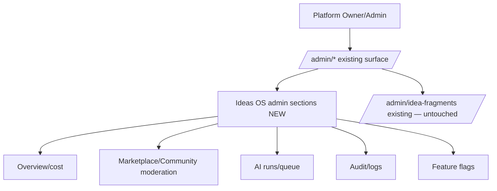
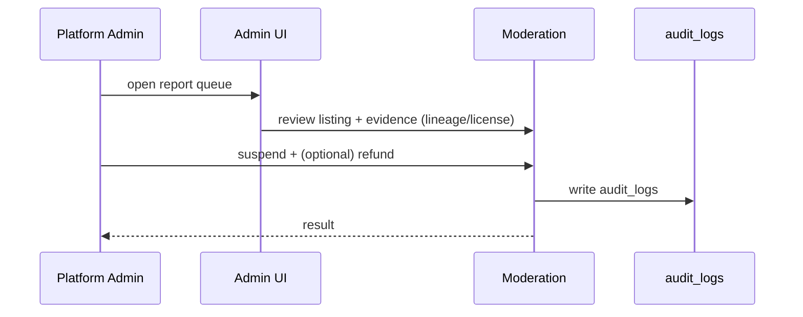

# 15 — Admin

> Internal platform administration for Ideas OS: overview dashboard, users, workspace management, AI queue/cost, marketplace moderation, reports/DMCA, audit, logs, analytics, and feature flags. Admin is platform-role-gated and **separate** from workspace management. The existing `/admin/idea-fragments` tool is preserved.
> Locked decisions: `00_LOCKED_DECISIONS.md` (D13). Schema: `13_DATABASE.md`. APIs: `14_API.md`.

---

## Purpose

Give the platform owner/admins the tools to operate Ideas OS — monitor AI cost, moderate marketplace/community, handle reports, audit privileged actions, and toggle features — without exposing internal tools to end users, and without disturbing existing admin pages.

## Overview

Admin lives under the existing `/admin/*` surface, gated by platform roles (existing `is-owner` / `profiles.role`), distinct from workspace roles. New Ideas OS admin sections are added alongside existing ones; `/admin/idea-fragments` stays as-is.

## Terminology

| Term | Meaning |
|---|---|
| Platform role | site-wide role: owner (via `is_owner`)/admin/(future moderator/support). |
| Moderation | platform-level review of public content/listings/reports. |
| Feature flag | `app_settings` `feature_*_enabled` key. |
| Cost dashboard | aggregate AI spend across workspaces. |

## Design Goals

1. **Platform-gated** — only platform roles; workspace roles never grant admin.
2. **Non-intrusive** — extend existing `/admin`; never break existing pages or `/admin/idea-fragments`.
3. **Observable** — AI cost, runs, marketplace health visible.
4. **Safe moderation** — evidence-based, audited, reversible where possible.
5. **Flag-driven rollout** — gate Creator Island + sub-features.

## Core Concepts (sections)

### Overview / Cost dashboard
Aggregate metrics: active workspaces, AI runs, AI cost (from `agent_runs` + existing `ai_usage_daily`/`ai_model_usage`), Z 幣 flow (marketplace), top spenders, budget alerts. Reuses existing admin dashboard patterns (`/admin`, `/admin/ai/usage`).

### Users & workspaces
- Users: existing `/admin/users` (owner-only detail) — unchanged; add a "creator activity" panel (workspaces, fragments/works counts) read-only.
- Workspaces: list/search workspaces, view members/roles, wallet balance, AI settings; intervene (suspend) only with audit. Platform admin can view but does not silently assume a workspace Owner role.

### AI runs / queue
Browse `agent_runs` across workspaces (filter by agent_type/status/cost); inspect failures; see queue/async workflow health. Read-only + retry where safe.

### Marketplace moderation
Review listings, reports/DMCA, suspend/reinstate listings, process disputes/refunds (Z 幣 reversal phase 1). Every action audited; license snapshot + lineage available as evidence.

### Community moderation
Review reported comments/assets; hide/remove; handle abuse. UGC already sanitized; moderation is the human layer.

### Audit & logs
All privileged actions (grants, transfers initiated by admin, suspensions, refunds, flag changes) write `audit_logs` (existing table). Searchable, exportable.

### Feature flags
Toggle `feature_creator_island_enabled` and sub-flags via existing `/admin/settings` (on/off pattern), read through `src/lib/app-settings.ts` (30s cache). Adding `creator_island` requires extending the `isFeatureEnabled` union (Codex note on `02`).

## Business Rules

- Admin actions require a platform role (`is_owner` or `profiles.role='admin'`); workspace role never grants admin.
- Admin can view but not silently act as a workspace member/owner; interventions (suspend/refund) are explicit + audited.
- Moderation decisions are evidence-based (reports + lineage + license snapshot).
- Feature flags gate user-facing exposure; flips are audited.
- `/admin/idea-fragments` behavior/permissions remain unchanged (D13).

## User Flow

## Mermaid Diagram(s)

| Diagram | Section | Purpose |
|---|---|---|
| Admin surface (flowchart) | Overview | platform admin → Ideas OS admin sections + preserved idea-fragments. |
| Moderation (sequence) | User Flow | report → review → action → audit. |

## Database Considerations

Mostly reads existing/NEW tables; few NEW admin-only tables. Authoritative in `13_DATABASE.md`.

| Table | Status | Use |
|---|---|---|
| `audit_logs` | existing | privileged action log (reuse) |
| `app_settings` | existing | feature flags (reuse) |
| `agent_runs` | NEW (`07`) | AI runs/cost (read) |
| `marketplace_reports` | NEW (`10`) | moderation queue |
| `comments`/`marketplace_*` | NEW | moderation targets |
| `admin_moderation_actions` (opt. NEW) | NEW | record suspend/reinstate/refund decisions | PK `id bigserial`; FK `target_type,target_id,actor_id`; idx `(created_at)`; RLS platform admin only |

## API Considerations

NEW admin endpoints under existing `/api/admin/*` (platform-gated), separate from `/api/creator-island/*`:

| Method | Route | Perm | Request | Response | Errors |
|---|---|---|---|---|---|
| GET | `/api/admin/ideas-os/overview` | platform admin | — | `{metrics}` | 401/403 |
| GET | `/api/admin/ideas-os/runs` | platform admin | `?cursor&status` | `{items[],nextCursor}` | 401/403 |
| GET | `/api/admin/ideas-os/reports` | platform admin | `?cursor` | `{items[],nextCursor}` | 401/403 |
| POST | `/api/admin/ideas-os/listings/{id}/suspend` | platform admin | `{reason}` | `{ok}` | 401/403/404 |
| POST | `/api/admin/ideas-os/transactions/{id}/refund` | platform admin | `{reason}` | `{ok}` | 401/403/409 |
| POST | `/api/admin/settings` (existing) | platform admin | `{key:'feature_creator_island_enabled',value}` | `{ok}` | 401/403 |

`/api/admin/idea-fragments/*` remain unchanged.

## Permission Model

| Action | Platform Owner | Platform Admin | (future) Moderator | Workspace roles |
|---|:--:|:--:|:--:|:--:|
| View Ideas OS admin/cost | ✅ | ✅ | ✅(scoped) | ❌ |
| Moderate listings/comments | ✅ | ✅ | ✅ | ❌ |
| Refund/suspend | ✅ | ✅ | ❌ | ❌ |
| Toggle feature flags | ✅ | ✅ | ❌ | ❌ |
| Use `/admin/idea-fragments` | ✅ | ✅ | ❌ | ❌ |

Workspace roles never grant any admin capability (D6/D13).

## UI Considerations

- New Ideas OS admin pages live beside existing `/admin/*`; reuse existing admin layout/components (`PageHero`, tables, `DeployVersionBadge`).
- Owner-only sensitive pages reuse the existing owner-gate pattern (`is-owner`).
- 繁中 admin copy; clear evidence panels for moderation.

## Edge Cases

- Admin viewing a workspace must not mutate as a member without explicit, audited action.
- Refund after seller spent the Z 幣 → handle negative/insufficient seller wallet per policy (clawback/owed).
- Flag flip while users active → 30s cache delay (acceptable; documented).
- Report on already-removed content → no-op with status.
- Existing `/admin/idea-fragments` must keep working after shared-service extraction.

## Security

- Platform-role gate + RLS (admin-only tables) + audit on every action.
- Sensitive data (keys, personal memory/DNA) not exposed in admin beyond necessity; personal growth/memory remain private even to admin unless legally required.
- Moderation/refund actions reversible where possible; all audited.

## Performance

- Reuse existing admin dashboard query/caching patterns; paginate run/report lists.
- Cost aggregation precomputed (daily) rather than per-view where possible.

## Testing

- Gate: workspace role cannot access any admin route (403); platform role required.
- Audit: every suspend/refund/flag-flip writes `audit_logs`.
- Idea-fragments untouched: existing admin tool behavior/permissions unchanged after extraction.
- Refund atomicity: Z 幣 reversal + entitlement revoke all-or-nothing.
- Flag: toggling `feature_creator_island_enabled` gates the homepage entry.

## Future Expansion

- Dedicated Moderator/Support platform roles + scoped consoles.
- Automated risk scoring for listings; bulk moderation.
- Real-money payout admin (phase 2); tax/finance reports.
- Cross-island admin once other islands exist.

## Implementation Notes

- Build Ideas OS admin pages under existing `/admin/*`; reuse `is-owner` gate, `audit_logs`, `app_settings`.
- Extend `isFeatureEnabled` to include `creator_island`; register toggle in `/admin/settings`.
- Do NOT modify `/admin/idea-fragments`; it consumes shared `creator-engine` services without behavior change.

## MVP vs Future

- **MVP:** feature flag toggle + overview/cost (read) + AI runs view; reuse existing admin.
- **Future:** full marketplace/community moderation, refund tooling, moderator role, automated risk scoring.

---

## Change log

- 2026-06-28 — Initial Admin spec (platform-gated; preserves `/admin/idea-fragments`; reuses audit_logs/app_settings/is-owner).
