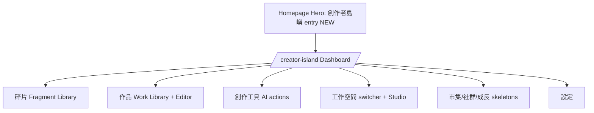
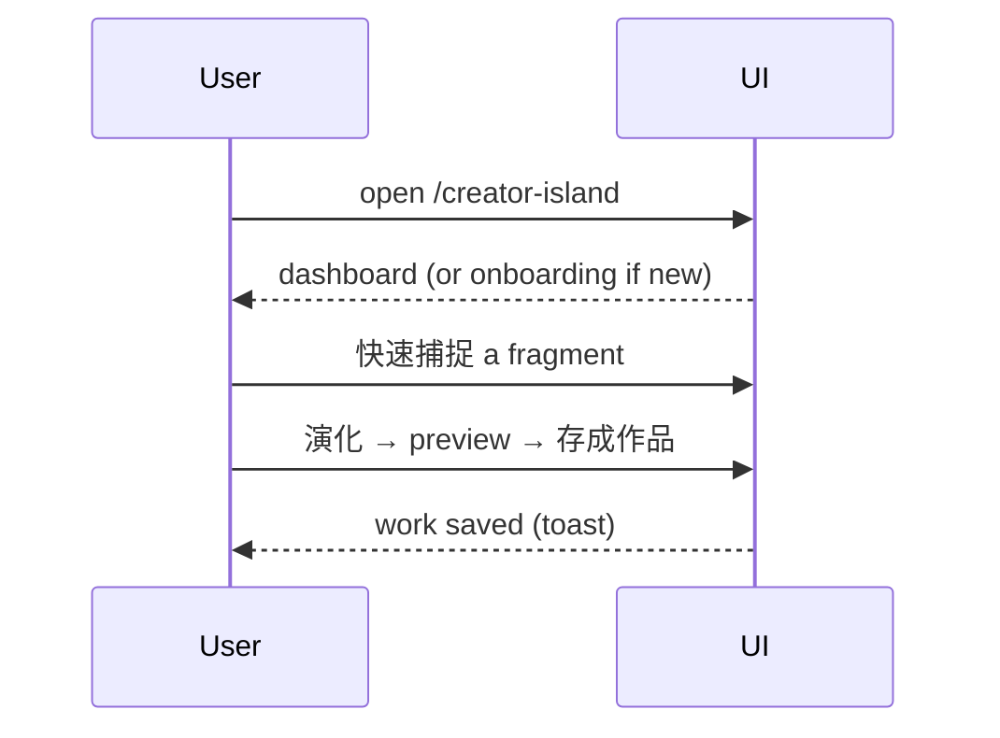

# 16 — UI / UX

> The UI/UX spec for Creator Island: per-page components, desktop/mobile/responsive behavior, accessibility, loading/empty/error states, and animation. Simple surface, serious backend. Traditional Chinese throughout; no raw English system terms leak into UI.
> Locked decisions: `00_LOCKED_DECISIONS.md`. PRD: `02_CREATOR_ISLAND_PRD.md`. APIs: `14_API.md`.

---

## Purpose

Give frontend a buildable, consistent spec for every Creator Island screen so the deep architecture (workspaces, assets, AI layer, lineage) is usable by beginners and powerful for advanced creators — and so error/empty/loading states never lose a user's creative input.

## Overview

Creator Island reuses the existing platform shell (header, theme tokens, auth, R2 upload) and adds NEW pages under `src/app/creator-island/`. The 3rd homepage entry lives in `src/components/home/Hero.tsx`. UI maps 1:1 to the 11 product modules (`02`).

## Terminology

| Term | UI (繁中) | Note |
|---|---|---|
| Dashboard | 首頁 | Creator Island home. |
| Fragment Library | 碎片 | capture/list/search. |
| Work Library / Editor | 作品 | compose/edit. |
| Creation Tools | 創作工具 | 凝聚/演化/編織. |
| Workspace switcher | 工作空間 | active context. |

(Use the `00_LOCKED_DECISIONS.md` glossary; never surface raw `fragment_type`/`source_type`/provider names as primary UI.)

## Design Goals

1. **One action to value** — first session reaches "saved first fragment".
2. **Always show active workspace** — persistent switcher.
3. **AI as verbs** — buttons say 凝聚/演化/編織, not "call model".
4. **Never lose input** — every failure preserves text + offers next step.
5. **Honest skeletons** — 市集/社群/成長 show 即將推出, not fake data.
6. **Accessible + responsive** — keyboard + screen-reader; mobile-first capture.

## Core Concepts (page specs)

Each page: **Purpose · Components · Desktop · Mobile · Responsive · Accessibility · Loading · Empty · Error · Animation.**

### Page: Homepage entry (Hero)
- **Purpose:** add 創作者島嶼 as the 3rd mode card.
- **Components:** mode card (icon, title, subtitle, "進入") in `Hero.tsx` grid.
- **Desktop:** grid 2→3 columns when `feature_creator_island_enabled`. **Mobile:** stacked cards.
- **Responsive:** card grid reflows. **A11y:** card is a labeled link; focus ring.
- **Loading:** n/a (static + ISR). **Empty:** if flag off, card hidden. **Error:** n/a. **Animation:** existing hover lift (`whileHover`).

### Page: Dashboard (`/creator-island`)
- **Purpose:** orient + one-tap create.
- **Components:** Active Workspace bar · 快速捕捉 input · 今日碎片蛋 · 繼續創作 · 最近碎片 · 最近作品 · AI 工具 · Studio 成員 · 市集/成長 預覽.
- **Desktop:** multi-column cards. **Mobile:** single column, capture + egg on top.
- **Responsive:** cards collapse to list. **A11y:** landmark regions, heading order.
- **Loading:** skeleton cards. **Empty:** new user → onboarding nudge "寫下第一個碎片". **Error:** per-card retry; never blank page. **Animation:** subtle CountUp on stats (reuse existing `CountUp`).

### Page: Fragment Library (碎片)
- **Purpose:** capture/list/search/select fragments.
- **Components:** quick-create box · search · tag filter · multi-select toolbar · fragment cards (title, snippet, tags, source chip, AI menu).
- **Desktop:** list + side detail; multi-select for compose. **Mobile:** single column, FAB to capture.
- **Responsive:** detail becomes modal on mobile. **A11y:** cards keyboard-selectable; aria-pressed for select.
- **Loading:** skeleton rows. **Empty:** "先寫下一句話、一個想法，或一段心情。" **Error:** inline banner + retry; capture text preserved. **Animation:** card insert fade.

### Page: Work Library + Editor (作品)
- **Purpose:** list works; compose/edit; publish.
- **Components:** work list (type/status/updated) · editor (title, body, linked-fragments panel, AI output panel) · 發布成文章 button.
- **Desktop:** side-by-side editor + AI panel. **Mobile:** stacked, AI panel as sheet.
- **Responsive:** panels collapse. **A11y:** editor labeled; autosave announced.
- **Loading:** editor skeleton. **Empty:** "從碎片組一篇作品". **Error:** autosave failure banner, content kept locally. **Animation:** save check pulse.

### Page: Creation Tools (創作工具 / inline)
- **Purpose:** run 凝聚/演化/編織.
- **Components:** action buttons with: required input hint · what AI will do · estimated cost (Z 幣) · result preview · save options (存成碎片/存成作品/重試/調整方向/捨棄).
- **Desktop/Mobile:** modal or panel. **Responsive:** full-screen sheet on mobile.
- **A11y:** loading announced (aria-live). **Loading:** copy 正在凝聚碎片… / 正在演化想法… / 正在編織作品…. **Empty:** disabled with hint if <2 fragments. **Error:** 402 → 「Z 幣不足」+ top-up; 502 → 重試, input kept. **Animation:** shimmer while generating.
- **Provider privacy:** result previews show the creative output only — **do not** surface raw provider/model names (e.g. `claude-…`, `gpt-…`) in normal UI; expose them only inside an optional advanced/debug detail view.

### Page: Workspace switcher + Studio (工作空間)
- **Purpose:** switch active workspace; manage studio.
- **Components:** switcher dropdown (always in header) · studio members table · invite link/code (copy) · role dropdowns · transfer/delete (Owner only).
- **Desktop:** full table. **Mobile:** stacked cards. **Responsive:** table → cards.
- **A11y:** dropdown ARIA; destructive actions confirmed. **Loading:** skeleton. **Empty:** "建立你的工作室". **Error:** clear 繁中 (last-owner, expired invite). **Animation:** switch transition.

### Page: Marketplace (skeleton, 市集)
- **Purpose:** honestly preview the future marketplace.
- **Components:** preview hero + 即將推出 badge + sample listing cards (non-interactive).
- **Desktop:** grid of placeholder cards. **Mobile:** single column. **Responsive:** grid→list.
- **A11y:** badge in an `aria-live`/labeled region; cards `aria-disabled`. **Loading:** static (no fetch). **Empty:** the whole page is the empty/preview state ("市集即將推出"). **Error:** n/a (no data calls). **Animation:** minimal; no hover affordances implying interactivity.

### Page: Community (skeleton, 社群)
- **Purpose:** preview asset-centric community.
- **Components:** preview of profiles/feed concept + 即將推出 badge.
- **Desktop:** two-column preview. **Mobile:** stacked. **Responsive:** columns collapse.
- **A11y:** announced badge; non-interactive controls `aria-disabled`. **Loading:** static. **Empty:** page = preview state. **Error:** n/a. **Animation:** minimal.

### Page: Growth (skeleton, 成長)
- **Purpose:** preview the growth dashboard.
- **Components:** placeholder XP/skill radar + 即將推出 badge.
- **Desktop:** dashboard layout placeholders. **Mobile:** stacked cards. **Responsive:** reflow.
- **A11y:** announced badge; placeholders not focusable. **Loading:** static. **Empty:** page = preview state. **Error:** n/a. **Animation:** minimal.

> All three skeletons: clearly **non-interactive**, no data fetches, no fake numbers presented as real; the 即將推出 state IS the page.

### Page: Settings (設定)
- **Purpose:** workspace AI settings (budget/allowed agents, BYOK link), personal memory management, profile/workspace prefs.
- **Components:** AI budget + allowed-agents form (Owner/Manager) reusing `/settings/ai-keys` patterns; memory list/edit entry (`08`); BYOK link; workspace info.
- **Desktop:** two-column (nav + form panels). **Mobile:** single column, sectioned accordion.
- **Responsive:** columns collapse to stacked sections. **A11y:** labeled form controls, fieldset/legend, focus management on save.
- **Loading:** form skeleton while settings load. **Empty:** sensible defaults shown for a fresh workspace (no blank). **Error:** save failure → inline error per field + non-destructive retry; entered values preserved. **Animation:** save-success check/toast.

## Business Rules

- Active workspace visible on every page; save-target confirmed when ambiguous.
- AI/error states preserve input and offer a next action.
- Skeleton modules never render fake production data.
- Permission failures show readable 繁中, never raw RLS/role internals.
- All copy 繁中; system terms mapped via glossary.

## User Flow

## Mermaid Diagram(s)

| Diagram | Section | Purpose |
|---|---|---|
| Page map (flowchart) | Overview | homepage → dashboard → modules. |
| First create (sequence) | User Flow | capture → AI → save. |

## Database Considerations

UI-only; reads via `14_API.md`. Ensure list screens use cursor pagination (no unbounded loads) and that indexes in `13_DATABASE.md` back the timelines/search the UI needs.

## API Considerations

Every screen maps to `14_API.md` endpoints; long AI/workflow ops are async (poll/subscribe for run status). Errors render per the `14` error model → 繁中 messages.

## Permission Model

UI hides/disables actions by workspace role (Owner/Manager/Contributor/Viewer) as UX, but the server is authoritative. Viewer sees read-only; cost-bearing buttons disabled when budget is 0 (with hint).

## UI Considerations (design system)

- Reuse existing theme tokens (actual repo names: `bg-bg`, `bg-bg-card`, `bg-bg-elevated`, `text-fg`, `text-fg-muted`, `border-border`, `accent`/`accent-2`/`accent-3`), components (`PageHero`, `CountUp`, `RingGauge`), and the platform header. Do **not** invent class names — match existing Tailwind tokens.
- Consistent chips for tags/source; consistent skeletons; toasts for success.
- Sanitize any rendered HTML/UGC via `rich-html-server.ts`.

## Edge Cases

- New user, no workspace → onboarding, not an error.
- Viewer opens an edit action → disabled with explanation.
- Network/AI failure mid-edit → local draft retained, banner + retry.
- Mobile small screens → panels become sheets/modals.
- RTL/long 繁中 strings → layout must not break.

## Security

- No secrets/keys in client; AI via server.
- Render UGC sanitized; respect visibility (private content never shown publicly).
- Confirm destructive actions (transfer/delete) with explicit dialogs.

## Performance

- Skeletons + optimistic UI for snappy feel; lazy-load heavy panels.
- Image/media via existing R2 + Next Image; paginate lists.
- Reuse 30s settings cache for flag-driven rendering.

## Testing

- First-session: capture → AI action → save works on desktop + mobile.
- State coverage: every page has loading/empty/error states; no blank screens.
- Input preservation: forced AI/network failure keeps user text.
- A11y: keyboard nav + screen-reader labels on core flows.
- Role UX: Viewer sees read-only; disabled actions explained.
- i18n: no raw English system terms surfaced.

## Future Expansion

- **Immersive island world (Phase 2 vision — owner-confirmed direction):** evolve the dashboard into a spatial, immersive Creator Island — homepage as "a sea with the island", click to 登島; inside, 碎片像森林 / 作品像建築 / Workflow 像道路 / Marketplace 像港口 / Community 像廣場 / Studio 像工作室 / Knowledge 像圖書館 / AI Agent 像島上的居民. v1 ships the conventional dashboard+libraries (this file); the immersive world is the next UX milestone, layered on the same data model.
- Lineage graph view; visual workflow editor; full marketplace/community/growth UIs.
- **Low-friction capture (E6, `ENHANCEMENTS.md`):** mobile voice-note → transcribe → fragment, and photo → fragment.
- Real-time collaboration cursors; mobile advanced editor; theming.

## Implementation Notes

- Add 3rd entry in `src/components/home/Hero.tsx` (grid 2→3) behind `feature_creator_island_enabled`; pass flag from `src/app/page.tsx`. Gating this flag requires **extending the `isFeatureEnabled` union** in `src/lib/app-settings.ts` (currently only `"blog" | "forum" | "pet" | "island"`) to add `"creator_island"`.
- Build pages under `src/app/creator-island/`; reuse existing components + R2 upload.
- Map all data calls to `14_API.md`; show async run progress; preserve input on errors.

## MVP vs Future

- **MVP UI:** homepage entry, dashboard, fragment library, work library+editor, creation tools, workspace switcher + studio, settings; honest skeletons for market/community/growth.
- **Future:** lineage graph, workflow editor, full market/community/growth UIs, realtime.

---

## Change log

- 2026-06-28 — Initial UI/UX spec; per-page states; reuses existing shell/components; 繁中 + glossary.
