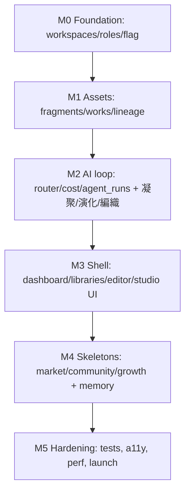
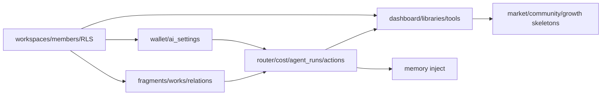
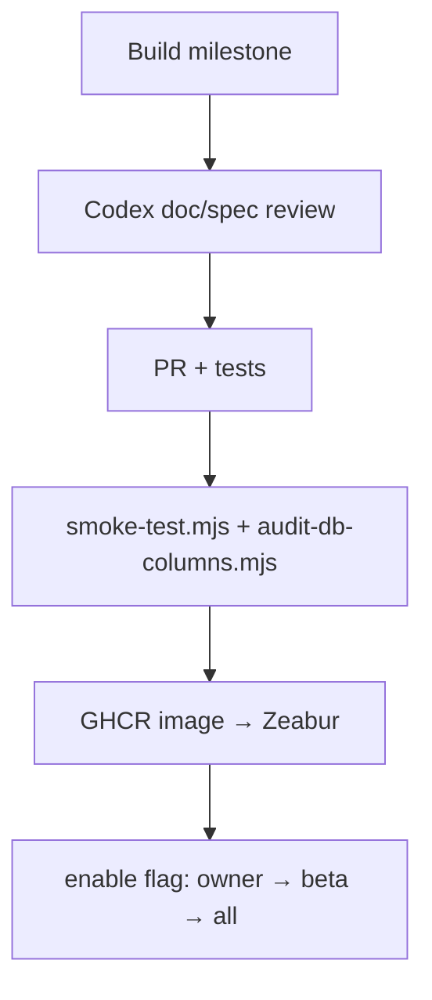

# 17 — Implementation Guide

> The build plan: milestones, sprint plan, dependency graph, build order, and testing/release/regression checklists for shipping Creator Island on ai-island-web. Turns the 18-doc spec into an executable sequence.
> Locked decisions: `00_LOCKED_DECISIONS.md`. All specs: `01`–`16`. This is the "how we ship it" doc.

---

## Purpose

Give engineers a deterministic order to implement Ideas OS / Creator Island without breaking the live platform, with clear gates (what must pass before each step) and checklists for testing and release. Optimized for incremental, flag-gated delivery.

## Overview

Build foundation → assets → AI loop → user-facing shell, then layer skeletons (marketplace/community/growth). Everything ships behind `feature_creator_island_enabled` and reuses existing infra (Supabase, R2, Z 幣, AI stack, Zeabur/GHCR).

## Terminology

| Term | Meaning |
|---|---|
| Milestone (M0–M5) | a shippable increment. |
| Gate | conditions that must pass before moving on. |
| Flag | `feature_creator_island_enabled`. |

## Design Goals

1. **Don't break the live site** — additive only; existing systems untouched.
2. **Foundation first** — ownership/economy/AI plumbing before features.
3. **Flag-gated** — nothing user-visible until enabled.
4. **Reviewable increments** — each milestone independently testable.
5. **Reuse** — existing Supabase/R2/Z 幣/AI/deploy pipeline.

## Core Concepts

### Milestones

- **M0 — Foundation:** `workspaces`, `workspace_members`, `workspace_invitations`, wallet + `workspace_ai_settings` tables + RLS; `transfer_workspace_owner`/`debit_wallet` RPCs; active-workspace resolution + lazy-create; `feature_creator_island_enabled` flag + `/admin/settings` toggle + `isFeatureEnabled('creator_island')`; `/creator-island` route shell (auth + lazy-create + empty dashboard).
- **M1 — Assets:** `fragments`, `works`, `work_fragments`, `asset_relations` (+ trigger for polymorphic ids), basic `asset_versions`; Creator Engine `fragments.ts`/`lineage.ts` extracted from `/admin/idea-fragments` (admin behavior unchanged); Fragment Library + Work Library read/write.
- **M2 — AI loop:** Model Router + Cost Manager wrapping `callAI`/`streamAI`; `agent_runs`; 凝聚/演化/編織 actions with Zod-validated output; Z 幣 debit via Cost Manager; usage parity with existing tables.
- **M3 — Shell:** Dashboard, Work Editor, Creation Tools UI, Workspace switcher + Studio management (invite/roles/transfer), homepage 3rd entry. **+ E1 first-run guided mini-loop** (一句話→種子→演化→編織→存成 mini Work, using existing MVP actions — onboarding sequencing, not new scope) + **E2 pre-seed** a new Personal Workspace with sample fragments/templates from existing `idea_fragments`/chapter/leetcode so the island isn't empty. See `ENHANCEMENTS.md`.
- **M4 — Skeletons + Memory:** personal+workspace memory (candidate/confirm/inject); marketplace/community/growth skeleton pages + reserved schema; Fragment Egg (Dust) basic.
- **M5 — Hardening:** tests (unit/integration/e2e smoke), a11y, perf, docs, launch checklist; enable flag for owner → beta → all.

### Sprint plan (indicative, 2-week sprints)

| Sprint | Focus | Exit |
|---|---|---|
| S1 | M0 foundation | can create studio, invite, switch, flag toggles |
| S2 | M1 assets | fragments/works/lineage CRUD + libraries |
| S3 | M2 AI loop | 3 actions produce validated, costed, traced assets |
| S4 | M3 shell | full dashboard/editor/studio UI |
| S5 | M4 skeletons + memory | memory works; skeletons honest |
| S6 | M5 hardening | tests/a11y/perf green; beta launch |

## Dependency graph

Hard rule: no feature ships before its dependencies (e.g. AI actions require wallet + agent_runs; UI requires assets + workspace context).

## Build order (concrete)

1. Migrations: `supabase/workspaces_migration.sql` → members → invitations → wallet/ai_settings (RLS + idempotent).
2. RPCs: `transfer_workspace_owner`, `debit_wallet`.
3. `src/lib/creator-engine/workspace.ts` (active workspace, lazy-create, roles).
4. Flag: extend `isFeatureEnabled` union + `app-settings`; `/admin/settings` toggle.
5. `/creator-island` route shell (gated) + homepage Hero 3rd entry.
6. Asset migrations + `creator-engine/fragments.ts`,`lineage.ts` (extract from admin, keep admin working).
7. Fragment/Work libraries + editor (UI per `16`, API per `14`).
8. AI: `creator-engine/ai/{router,cost,agents}.ts` + `agent_runs` migration + 3 action routes.
9. Studio management UI; workspace switcher.
10. Memory (personal+workspace) + injection into prompts.
11. Skeleton pages + reserved schema (market/community/growth) + Dust egg.
12. Tests, a11y, perf, docs; staged flag rollout.

## Business Rules

- Each migration is idempotent, RLS-on, one file per area; verified by `scripts/audit-db-columns.mjs` before wiring queries.
- `/admin/idea-fragments` must keep passing its existing behavior after the shared-service extraction (regression-gated).
- No step alters existing `user_id` tables.
- Ship behind the flag; enable owner-only first.

## User Flow (delivery)

## Mermaid Diagram(s)

| Diagram | Section | Purpose |
|---|---|---|
| Milestones (flowchart) | Overview | M0→M5 sequence. |
| Dependency graph (flowchart) | Dependency graph | what blocks what. |
| Delivery flow (flowchart) | User Flow | build→review→test→deploy→flag. |

## Database Considerations

Follow `13_DATABASE.md` exactly: per-area idempotent migrations, RLS on every NEW table, the RPCs (**MVP:** `transfer_workspace_owner`, `debit_wallet`; **later (marketplace phase 1):** `purchase_listing`, `refund_transaction`), and the `asset_relations` polymorphic validation trigger. Run the column audit before query wiring; never `select('*')` unpaginated.

## API Considerations

Implement endpoints per `14_API.md` in milestone order; enforce auth+role+zod+rate-limit on every route; AI only via the AI Layer. Keep `/api/admin/*` untouched.

## Permission Model

Implement workspace RLS (M0) before any asset write (M1). Platform-admin gating (existing `is-owner`) for admin pages (`15`). Verify role gates per endpoint in tests.

## UI Considerations

Build per `16_UI_UX.md`: states (loading/empty/error) for every screen; input preservation; 繁中 + glossary; reuse existing shell/components. Homepage entry first so the feature is discoverable once enabled.

## Edge Cases (delivery)

- Shared-service extraction breaks admin → regression suite blocks merge.
- Migration order wrong (FK before table) → enforce order in build list.
- Flag enabled before deps ready → keep flag off until M3 minimally complete.
- Zeabur misbuild (Caddy-only) → use GHCR prebuilt image (documented platform fallback).
- Embedding/provider absent in env → degrade gracefully (don't block core).

## Security

- RLS + server authz before exposing any write.
- Secrets stay server-side (existing `ai-crypto`, env on Zeabur).
- Audit privileged actions; rate-limit cost-bearing routes.
- `/security-review` the diff before launch (sensitive: wallets, transfers, marketplace later).

## Performance

- Paginate everything; cache membership/flag; async AI/workflow.
- Keep standalone Next build for fast Zeabur cold start.
- Backfill embeddings asynchronously.

## Testing checklist

- [ ] Unit: creator-engine services (workspace/asset/ai/cost) with mocked AI.
- [ ] Integration: RLS isolation per NEW table; role gates per endpoint; atomic wallet/purchase/transfer RPCs.
- [ ] Provenance: AI outputs set source_type + lineage; agent_runs + usage parity.
- [ ] Economy: Z 幣 debit paths (402/downgrade); Dust never touches coin_transactions.
- [ ] Admin: `/admin/idea-fragments` unchanged (regression).
- [ ] E2E smoke: extend `scripts/smoke-test.mjs` with `/creator-island` routes.
- [ ] DB: `scripts/audit-db-columns.mjs` passes.
- [ ] A11y: keyboard + screen-reader on core flows.

## Release checklist

> Repo commands: `npm run build` · `npm run lint` · `npm run test:smoke` · `npm run db:apply` (verified in `package.json`).

- [ ] `npm run lint` + `npm run build` clean.
- [ ] All milestone tests green (`npm run test:smoke`); Codex doc reviews PASS.
- [ ] Migrations applied (`npm run db:apply`) to Supabase (verified, RLS on); `scripts/audit-db-columns.mjs` passes.
- [ ] Env set on Zeabur; GHCR image built (`docker.yml`) + service restarted.
- [ ] `/api/version` shows the new commit; admin 🚀 badge correct.
- [ ] Flag enabled owner-only → smoke check → beta cohort → all.
- [ ] Rollback plan: flip flag off (instant hide) without redeploy.

## Regression checklist

- [ ] Homepage (經典/島嶼) unaffected when flag off.
- [ ] Existing `user_id` systems (profiles/xp/lesson_progress/blog/chapters) unchanged.
- [ ] `/admin/idea-fragments` + other admin pages work as before.
- [ ] Existing AI usage logging (`ai_usage_daily`/`ai_model_usage`) still accurate.
- [ ] Z 幣 (`coin_transactions`) behavior for existing features intact.

## Future Expansion

- Phase-1 marketplace economy; full community/growth; workflow editor; other islands.
- Real-money payout (KYC), realtime collaboration, public API/SDK.

## Implementation Notes

- Generate each PR small + flag-gated; keep `_archive/` until vision content fully absorbed (then delete).
- Treat `13_DATABASE.md` + `14_API.md` as the single sources of truth for schema/endpoints.
- Use `/code-review` and `/security-review` on diffs; `/run` to verify the island locally before enabling the flag.

## MVP vs Future

- **MVP (M0–M3 + minimal M4/M5):** the Capture→Compose→Archive loop in a real workspace, behind the flag, owner→beta.
- **Future:** skeleton modules → full marketplace/community/growth, workflow editor, additional islands.

---

## Change log

- 2026-06-28 — Initial Implementation Guide; milestones M0–M5, build order, checklists; reuses existing deploy/test tooling (`docker.yml`, `smoke-test.mjs`, `audit-db-columns.mjs`).
