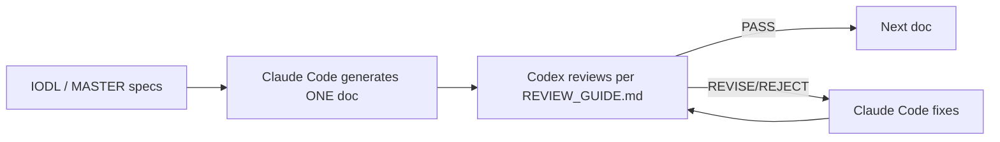

# Ideas OS Documentation

> **Ideas OS** is the core system behind SnowRealm — it turns thoughts → fragments → assets → works → growth into one connected system.
> **Creator Island** (`/creator-island`) is the first product built on it (homepage 3rd mode, after 經典 / 島嶼).
> This folder is the **implementation-ready engineering spec** for both.

Docs in English; user-facing UI in Traditional Chinese (see `00_LOCKED_DECISIONS.md`).

---

## Structure (flat 18-doc tree — authoritative)

```
docs/ideas_os/
├── 00_LOCKED_DECISIONS.md     ← immutable decision registry (read first)
├── 01_IDEAS_OS_SPEC.md        ← vision, philosophy, four engines, six domains
├── 02_CREATOR_ISLAND_PRD.md   ← product: personas, IA, nav, UX, MVP
├── 03_SYSTEM_ARCHITECTURE.md  ← layers, services, AI layer, storage, deploy
├── 04_WORKSPACE.md            ← workspaces, roles, invites, wallet, AI policy
├── 05_ASSET_SYSTEM.md         ← fragment, work, package, version, lineage
├── 06_CREATION_ENGINE.md      ← incubate→synthesize→evolve→compose→archive loop
├── 07_AI_SYSTEM.md            ← agents, prompt builder, model router, cost manager
├── 08_MEMORY_SYSTEM.md        ← personal/workspace/project/session memory
├── 09_WORKFLOW_ENGINE.md      ← nodes, runs, replay, templates
├── 10_MARKETPLACE.md          ← packages, licenses, revenue (Z Coin phase 1)
├── 11_COMMUNITY.md            ← follow, fork, remix, studios
├── 12_GROWTH_ENGINE.md        ← XP, creator DNA, coach, skill map
├── 13_DATABASE.md             ← every table: cols/PK/FK/index/RLS/migration + ER
├── 14_API.md                  ← every endpoint: method/route/perm/req/resp/errors
├── 15_ADMIN.md                ← internal admin, moderation, cost dashboard
├── 16_UI_UX.md                ← per-page components, states, responsive, a11y
└── 17_IMPLEMENTATION_GUIDE.md ← milestones, build order, testing/release checklists
```

### Supporting files (not part of the 18-doc tree)
```
├── ADR/                  ← decision history (one ADR per decision; immutable once Accepted)
├── REVIEW_GUIDE.md       ← how Codex reviews each generated doc
├── IODL_MASTER_SPEC.md   ← generation spec (DSL; defines the 18-doc tree)
├── MASTER_SPEC.md        ← generation spec (per-doc required content)
├── MASTER_OUTLINE.md     ← generation spec (per-doc required content)
└── _archive/             ← superseded folder-based drafts (01_vision…23_appendix, old meta docs)
```

> `_archive/` holds the earlier folder-structured drafts. `01_vision`'s content is being absorbed into `01_IDEAS_OS_SPEC.md`; the archive is kept until migration is complete, then it can be deleted.

---

## Reading order

1. `00_LOCKED_DECISIONS.md` — what's locked (read before anything).
2. `ADR/` — why each decision exists, with history.
3. `01_IDEAS_OS_SPEC.md` → then the numbered docs in order.

---

## Generation + review workflow



- Docs are generated **one at a time**, each grounded in the real ai-island-web codebase (true table/route/lib names, or clearly marked NEW).
- Each doc must satisfy `MASTER_SPEC.md` content + `IODL_MASTER_SPEC.md` quality gate, and must not contradict `00_LOCKED_DECISIONS.md`.
- **Codex** reviews each doc using `REVIEW_GUIDE.md` and returns PASS / REVISE / REJECT with precise, actionable findings.

## Decision-doc layering (don't let it drift)

- `00_LOCKED_DECISIONS.md` = currently-effective registry (the *How*) — Claude Code maintained.
- `ADR/ADR-NNN-*.md` = history — immutable once Accepted; a change = a new ADR, then update the registry.
- Rationale (the *Why*) is expanded inside `01_IDEAS_OS_SPEC.md`.

## Status

- ✅ `00_LOCKED_DECISIONS.md` — **Codex PASS**.
- ✅ `01_IDEAS_OS_SPEC.md` — **Codex PASS**.
- ✅ `02_CREATOR_ISLAND_PRD.md` — **Codex PASS**.
- ✅ `03_SYSTEM_ARCHITECTURE.md` — **Codex PASS**.
- ✅ `04_WORKSPACE.md` — **Codex PASS**.
- ✅ `05_ASSET_SYSTEM.md` — **Codex PASS**.
- ✅ `06_CREATION_ENGINE.md` — **Codex PASS**.
- ✅ `07_AI_SYSTEM.md` — **Codex PASS**.
- ✅ `08_MEMORY_SYSTEM.md` — **Codex PASS**.
- ✅ `09_WORKFLOW_ENGINE.md` — **Codex PASS**.
- ✅ `10_MARKETPLACE.md` — **Codex PASS**.
- ✅ `11_COMMUNITY.md` — **Codex PASS** (+ NotifKind union + notifications wrapper notes).
- ✅ `12_GROWTH_ENGINE.md` — **Codex PASS** (+ partial-unique-for-personal fix).
- ✅ `13_DATABASE.md` — **Codex PASS** (+ refund_transaction note, partial unique).
- ✅ `14_API.md` — **Codex PASS** (+ collect assetType validation).
- ✅ `15_ADMIN.md` — **Codex PASS**.
- ✅ `16_UI_UX.md` — **Codex PASS** (+ no raw provider/model in previews).
- ✅ `17_IMPLEMENTATION_GUIDE.md` — **Codex PASS**.
- ✅ `REVIEW_GUIDE.md` + `ADR/` (001–005, 015 + errata, 006–014 indexed) + `TODO.md` (build checklist) + `ENHANCEMENTS.md` (owner-approved enhancement backlog: E1 first-run + E2 pre-seed + E11 Suno/MV song mode = MVP; E10 no-token-trap = NOW rule; E3–E9 = Phase 2).

**🎉 All 18 docs (00–17) Codex-PASS.** + `REVIEW_GUIDE.md`, `ADR/`, `TODO.md`. Ready to commit + start M0.
